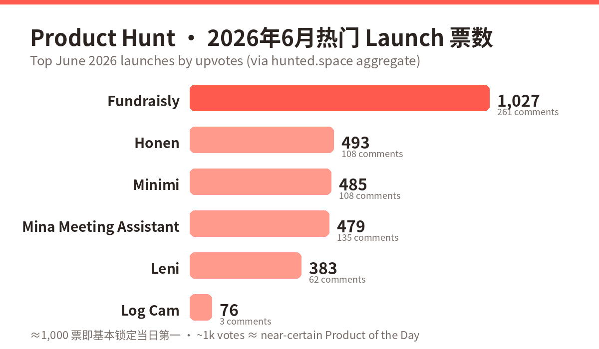
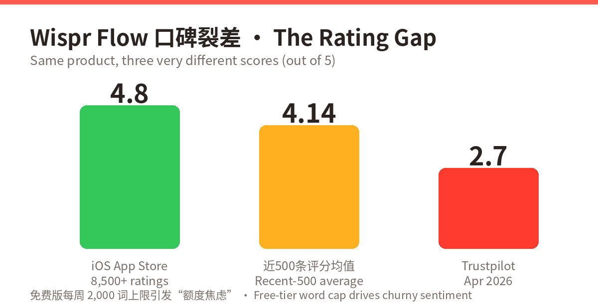
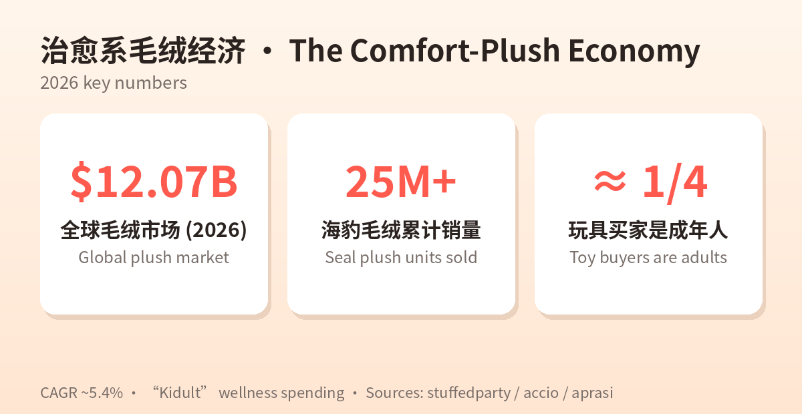

# 每日产品趋势报告 · Daily Product Trend Report
**日期 Date: 2026-06-13（周六 Saturday）**
数据来源 Sources: Product Hunt · Hacker News · Google Trends · a16z · Amazon/Etsy/TikTok Shop · X · LinkedIn · 小红书（均通过公开搜索摘要采集 via public search summaries）

> ⚠️ 方法说明 Methodology note：本次运行环境的网络白名单禁止直接抓取目标站点（news.ycombinator.com、producthunt.com、trends.google.com、a16z.com、amazon.com、etsy.com、x.com、linkedin.com、xiaohongshu.com 的 web_fetch 均被拦截），按任务规则未做绕过，全部改用 WebSearch 公开摘要采集；HN 当日首页与 Google Trends 当日榜单因此仅有月度级概览，已在文中注明。Direct fetches were blocked by the workspace network allowlist; per task rules no bypass was attempted — all data comes from WebSearch summaries. HN daily front page and Google Trends daily list are therefore month-level only.

---

## ① 当日概览 · Daily Overview

**中文**：本周全球产品圈的主线是 **"AI 从演示走向执行"**。Product Hunt 六月榜单被 AI 自动化与垂直 Agent 霸榜：AI 融资代理 Fundraisly 以约 1,027 票领跑当月，会议中实时干活的 Mina、地产投资垂直 AI Leni、机器人远程接管平台 Sentinel、语音输入独角兽候选 Wispr Flow 紧随其后。a16z 同步抛出 "Fat Startup" 论点——AI 时代赢家卖的是"结果"而非"功能"。消费端则是另一条主线：**情绪经济**——海豹毛绒等治愈系玩偶累计销量 2,500 万+，毛绒市场 2026 年达 120.7 亿美元，成年人贡献近 1/4 购买力。一边是 AI 替你干活，一边是毛绒替你疗愈。

**English**: This week's through-line is **"AI moving from demo to execution."** Product Hunt's June board is dominated by AI automation and vertical agents: AI fundraising agent Fundraisly leads the month (~1,027 votes), followed by in-meeting executor Mina, real-estate-finance AI Leni, robot teleoperation platform Sentinel, and voice-dictation breakout Wispr Flow. a16z's new thesis lands on cue: in the AI era, "fat startups" win by shipping outcomes, not features. On the consumer side, the **comfort economy** runs in parallel — seal plushies at 25M+ cumulative sales, a $12.07B plush market in 2026, adults ≈ ¼ of buyers. AI does your work; plush does your healing.

**当日关键信号 Key signals**

| # | 信号 Signal | 数据 Data |
|---|---|---|
| 1 | PH 六月最热launch PH top June launch | Fundraisly ~1,027 votes / 261 comments |
| 2 | 语音输入赛道估值 Voice input valuation | Wispr Flow $700M post-money, $81M raised |
| 3 | a16z 论点 a16z thesis | "Fat startups win — ship outcomes, not features" |
| 4 | 消费端 Consumer | 毛绒市场 Plush market $12.07B (2026, CAGR ~5.4%) |
| 5 | Google Trends 宏观 | NBA 季后赛登顶热搜 NBA playoffs top trending; 汉坦病毒进入全球Top25 hantavirus into global top 25 |
| 6 | HN 六月情绪 HN mood | AI 讨论"成熟化、商业化" — AI talk matured & commercial |
| 7 | X 平台风向 X platform | 病毒式launch: MaveHealth 2.58M / Composio 2.03M / Lica 1.44M views |

---

## ② 产品深度分析 · Product Deep-Dives

### 1. Fundraisly — AI 融资代理 AI Fundraising Agent
🔗 https://www.producthunt.com/products/fundraisly

| 维度 Dimension | 中文 | English |
|---|---|---|
| 商业模式 Business model | SaaS 订阅 + 高价值结果导向定价空间；瞄准创始人融资刚需（单次融资价值极高，付费意愿强） | SaaS subscription targeting founders mid-raise; outcome anchored to an extremely high-value event (a closed round), so strong willingness to pay |
| 成功因素 Key success factors | ① 创始人 Anna 有 $600M+ AUM VC 分析师背景（10 家独角兽组合），自带可信度；② "300K+ 投资人数据库 + 热引荐路径挖掘"解决冷启动；③ "$100M+ 已助融"社会证明；④ LinkedIn 自来水传播 | ① Founder credibility (ex-analyst at $600M+ AUM fund, 10 unicorns); ② 300K+ investor graph + warm-path mapping kills the cold-start problem; ③ "$100M+ raised" social proof; ④ organic LinkedIn word-of-mouth |
| 核心功能 Core features | 分析 30 万+投资人与数百万笔交易→筛出活跃匹配投资人→从创始人人脉图谱挖热引荐→自动冷外联+跟进→直接约会议 | Analyzes 300K+ investors & millions of deals → shortlists active fits → maps warm intros from your network → automated cold outreach & follow-up → books meetings |
| 细分市场 Niche | 早期创始人融资工具（FundraisingTech / "AI 投行化"） | Fundraising tech for early-stage founders ("AI-as-junior-banker") |
| 目标用户 Target audience | 种子–A 轮创始人、缺融资人脉的二线市场创业者 | Pre-seed–Series A founders, esp. outside hub networks |
| 设计与品牌 Design & brand | 命名直白（Fundraise+ly），定位一句话讲清："替你做完整个投资人研究和外联" | Plain-spoken naming; one-line positioning: "the AI agent that does investor research, outreach and follow-up for you" |
| 产品数据 Product data | PH ~1,027 票 / 261 评论（6月最热）；宣称用户 90 天内平均获 20–40 场合格投资人会议 | ~1,027 PH votes / 261 comments (June leader); claims avg 20–40 qualified investor meetings in first 90 days |
| 代表评价 Reviews | LinkedIn 用户自发安利"今天在 PH 上看到 Fundraisly…"；PH 评论区以创始人共鸣为主（融资外联太痛） | Organic LinkedIn shares; PH comments resonate on the pain of investor outreach |

**点评 Take**：把 a16z "卖结果不卖功能" 论点演绎得最直白的产品——它卖的不是 CRM，是"约上投资人"这个结果。**The cleanest live demo of the a16z thesis: it sells booked investor meetings, not software.**

---

### 2. Wispr Flow — AI 语音输入 Voice Dictation
🔗 https://wisprflow.ai · PH Week 24 featured

| 维度 Dimension | 中文 | English |
|---|---|---|
| 商业模式 Business model | Freemium：免费版 2,000 词/周封顶 → Pro $15/月（年付 $143.99）→ 企业版定制；免费额度刻意"不够用"以制造升级压力 | Freemium: free tier capped at 2,000 words/week → Pro $15/mo ($143.99/yr) → Enterprise; the cap deliberately under-serves to force upgrades |
| 成功因素 Key success factors | ① 全应用通用（任何输入框都能说）；② "写成你的风格"而非逐字转写；③ $81M 融资带来的品牌势能；④ 语音成为 AI 时代新输入范式的卡位 | ① Works in every app; ② writes in *your style* vs verbatim transcription; ③ $81M war chest & brand momentum; ④ positioned as the new input layer of the AI era |
| 核心功能 Core features | 自然口述→自动成文（去语气词、整理语法、贴合个人风格），跨 Mac/Windows/iOS 全局可用 | Natural speech → polished text (fillers removed, grammar fixed, personal style matched), system-wide on Mac/Windows/iOS |
| 细分市场 Niche | AI 听写/语音生产力（vs Superwhisper $9.99、Spokenly 等） | AI dictation / voice productivity (vs Superwhisper $9.99, Spokenly) |
| 目标用户 Target audience | 高频写作的知识工作者、开发者（提示词口述）、RSI 用户、多任务人群 | Heavy writers, devs dictating prompts, RSI sufferers, multitaskers |
| 设计与品牌 Design & brand | "Flow"=心流叙事；极简 onboarding；高级感定价站位（贵过对手 50%） | "Flow" narrative; minimal onboarding; premium price anchoring (~50% above rivals) |
| 产品数据 Product data | $81M 总融资（$30M A 轮 Menlo 2025-06；$25M Notable 2025-11），估值 $700M；iOS 4.8★(8,500+)；近 500 条评分均值 4.14；Trustpilot 仅 2.7★；品牌搜索 1,600+/月、~40% 月增 | $81M raised, $700M post-money; iOS 4.8★ (8,500+ ratings); recent-500 avg 4.14; Trustpilot 2.7★; 1,600+ monthly brand searches, ~40% MoM growth |
| 代表评价 Reviews | 好评："事实上的高端听写默认选项"；差评："2,000 词/周根本不够，每周中段就焦虑"、"为上下文截屏，隐私不适" | Praise: "the de facto premium dictation option." Complaints: "word-count anxiety — cap gone by midweek"; "screenshots for context feel intrusive" |

**点评 Take**：增长教科书 + 口碑警报并存：App Store 4.8 与 Trustpilot 2.7 的裂差，说明免费额度焦虑和隐私观感正在透支品牌。**Textbook growth with a reputation leak: the 4.8-vs-2.7 split shows cap-anxiety and privacy optics taxing the brand.**

---

### 3. Mina Meeting Assistant — 会中执行型 AI In-Meeting Executor
🔗 https://getmina.ai · https://www.producthunt.com/products/mina-meeting-assistant

| 维度 Dimension | 中文 | English |
|---|---|---|
| 商业模式 Business model | B2B SaaS（按席位，价格未公开）；以"会中干活"切入销售/工程/CS 三个预算池 | B2B SaaS (per-seat; pricing not public); lands three budget pools — sales, engineering, CS |
| 成功因素 Key success factors | ① 品类再定义：从"会后纪要"到"会中执行"，与 Otter/Fireflies 拉开身位；② 数月内测打磨后才上 PH；③ 直连 CRM/Jira 等系统产生即时可见价值 | ① Category redefinition: from post-call notes to in-call execution, leapfrogging Otter/Fireflies; ② months of private beta before PH; ③ instant visible value via CRM/Jira writes |
| 核心功能 Core features | 进入 Zoom/Meet/Teams；实时答问；会中生成纪要、提案、CRM 更新；自动建工单、发跟进、订下次会议 | Joins Zoom/Meet/Teams; answers live; generates summaries/proposals/CRM updates mid-call; files tickets, sends follow-ups, books next steps |
| 细分市场 Niche | AI 会议助手 2.0（执行型 Agent） | AI meeting assistant 2.0 (agentic execution) |
| 目标用户 Target audience | 销售（实时 discovery、MEDDPICC、CRM 即更）、工程（AI scrum master、Jira、阻塞预警）、客户成功（QBR、健康分、续约预测） | Sales (live discovery, MEDDPICC, CRM), Engineering (AI scrum master, Jira, blockers), CS (QBR prep, health scores, renewals) |
| 设计与品牌 Design & brand | "Your AI Teammate"拟人化定位——同事而非工具 | "Your AI Teammate" — a colleague, not a tool |
| 产品数据 Product data | PH ~479 票 / 135 评论（评论率超高，讨论度强） | ~479 PH votes / 135 comments (unusually high comment ratio = strong engagement) |
| 代表评价 Reviews | PH 讨论聚焦"会中即完成 CRM 更新"的演示冲击力 | PH discussion centers on the wow of CRM updates landing before the call ends |

**点评 Take**：会议 AI 的"第二幕"：纪要已是地板，执行才是天花板。**Act II of meeting AI: notes are table stakes; execution is the ceiling.**

---

### 4. Leni — 地产投资垂直 AI Vertical AI for Real-Estate Finance
🔗 https://leni.co · PH #3 (Jun 5), 383 votes / 62 comments

| 维度 Dimension | 中文 | English |
|---|---|---|
| 商业模式 Business model | B2B 订阅（多档付费，PH 用户首月一折 PHLENI）；按团队/工作流定价 | B2B subscription tiers (90%-off first month code PHLENI); priced by team/workflow |
| 成功因素 Key success factors | ① "准确率优先"反向定位（对手是通用大模型的幻觉）；② 决策溯源 Decision Traces 直击金融审计刚需；③ 深度集成 Yardi/Entrata/RealPage 等行业系统形成壁垒 | ① Accuracy-first counter-positioning vs hallucinating general LLMs; ② Decision Traces answer finance's audit需求; ③ moat via Yardi/Entrata/RealPage integrations |
| 核心功能 Core features | 承销、市场研究、组合报告、文档抽取、投资备忘录、投资人材料包；上下文图谱+统一数据模型；先检索抽取后生成 | Underwriting, market research, portfolio reporting, doc extraction, memos, investor packages; context graph + UDM; retrieval-before-generation |
| 细分市场 Niche | 房地产/投资金融 AI（PropTech × FinTech） | AI for real-estate & investment finance (PropTech × FinTech) |
| 目标用户 Target audience | 地产基金、资管/投资团队、REIT 分析部门 | RE funds, asset/investment teams, REIT analysts |
| 设计与品牌 Design & brand | "全球最准的投资人 AI"——用可验证性做品牌钩子 | "World's most accurate AI for investors" — verifiability as the hook |
| 产品数据 Product data | 383 票/62 评论；2.1 万+决策溯源训练；日处理 1 亿+行数据；自称独立基准上超 GPT/Claude/Manus | 383 votes/62 comments; 21,000+ decision traces; 100M+ rows/day; claims to beat GPT/Claude/Manus on accuracy benchmarks |
| 代表评价 Reviews | PH 评论看重"每个答案都能点开看依据" | PH comments value "every answer opens into its evidence" |

**点评 Take**：垂直 AI 的标准打法：用行业数据模型+审计能力换信任溢价。**The vertical-AI playbook: trade domain data models + auditability for a trust premium.**

---

### 5. Sentinel (Avea) — 机器人远程接管 Robot Teleoperation
🔗 https://www.producthunt.com/products/sentinel-10 · YC 系

| 维度 Dimension | 中文 | English |
|---|---|---|
| 商业模式 Business model | B2B 基础设施 SaaS（按机器人/坐席向机器人公司收费），吃"自治失败兜底"预算 | B2B infra SaaS sold to robotics companies (per robot/operator seat), monetizing the autonomy-failure budget |
| 成功因素 Key success factors | ① 踩中 2026 人形/移动机器人量产潮；② 卖"100% 在线率"这一结果指标；③ 低延迟为王的技术叙事（"市面最快"） | ① Rides the 2026 humanoid/AMR deployment wave; ② sells the outcome metric "100% uptime"; ③ latency-first tech story ("fastest on the market") |
| 核心功能 Core features | 全球任意地点远程操控机器人；自治异常时人工即时接管；面向机器人队列的运维监控 | Teleoperate robots from anywhere; instant human takeover when autonomy breaks; fleet ops monitoring |
| 细分市场 Niche | 机器人运维基础设施（Teleop-as-a-Service） | Robot ops infrastructure (Teleop-as-a-Service) |
| 目标用户 Target audience | 机器人公司、仓储/配送/巡检机器人运营方 | Robotics companies; warehouse/delivery/inspection fleet operators |
| 设计与品牌 Design & brand | "Sentinel 哨兵"军事级可靠性隐喻 | "Sentinel" — military-grade reliability metaphor |
| 产品数据 Product data | PH Week 24 精选；YC 背书；具体票数未公开检索到 | PH Week 24 featured; YC-backed; exact votes not surfaced in search |
| 代表评价 Reviews | 行业讨论："自治的最后一公里仍然是人" | Industry chatter: "the last mile of autonomy is still human" |

**点评 Take**：a16z 所谓"软件长在硬基础设施上"的样本——机器人越多，人类接管就越值钱。**Software attached to hard infrastructure: every robot shipped makes human takeover worth more.**

---

### 6. Log Cam — iPhone 专业摄影 App Pro Video App
🔗 https://apps.apple.com/us/app/log-cam-open-gate-by-raw-cam/id6766185881 · PH Jun 9, 76 votes (#28)

| 维度 Dimension | 中文 | English |
|---|---|---|
| 商业模式 Business model | **一次性买断、无订阅**——在订阅疲劳时代反向定价 | **One-time purchase, no subscription** — counter-pricing in a subscription-fatigued market |
| 成功因素 Key success factors | ① 把 iPhone 17 Pro 独占能力（Open Gate/Apple Log 2）带给 iPhone 13+ 全系包括非 Pro；② 对标专业机的监看工具链；③ 创作者社区口碑分发 | ① Brings iPhone-17-Pro-exclusive tricks (Open Gate/Apple Log 2) to all iPhone 13+ incl. non-Pro; ② pro-camera monitoring toolchain; ③ creator-community distribution |
| 核心功能 Core features | RAW 帧直录 HEVC(4:2:0/4:4:4, 300Mbps)/ProRes；Apple Log/Log 2、F-Log、LogC3、S-Log3、V-Log；假色/斑马/示波；LUT 预览或烧录；外接 USB-C 存储 | HEVC (4:2:0/4:4:4 up to 300Mbps)/ProRes from RAW frames; Apple Log/Log 2, F-Log, LogC3, S-Log3, V-Log; false color/zebras; LUT preview or bake-in; USB-C external recording |
| 细分市场 Niche | 移动端专业摄像（MobileFilmmaking） | Mobile pro videography |
| 目标用户 Target audience | 独立电影人、跟焦/调色工作流创作者、预算有限的制片组 | Indie filmmakers, color-pipeline creators, budget productions |
| 设计与品牌 Design & brand | 功能即品牌：名字直接写明 Log + Open Gate | Feature-as-brand naming: Log + Open Gate in the title |
| 产品数据 Product data | PH 76 票/3 评论（小众但精准）；App Store 付费工具类 | 76 votes / 3 comments (small but precise); paid App Store utility |
| 代表评价 Reviews | 创作者评价："非 Pro 机型也能拍 log，等于白送一台 B 机" | Creators: "log on a non-Pro iPhone = a free B-cam" |

**点评 Take**：小而美样本：吃透平台能力溢出（Apple 新特性→旧设备复刻）就是一门生意。**Small-but-mighty: arbitraging platform capability spillover (new Apple features → older devices) is a business.**

---

### 7. 治愈系毛绒经济 · The Comfort-Plush Economy（趋势 Trend）
🔗 https://stuffedparty.com/viral-plush-trends-to-watch-in-2026/

| 维度 Dimension | 中文 | English |
|---|---|---|
| 商业模式 Business model | 低单价高复购 + 盲盒/收藏溢价 + 挂件场景扩张（包挂、桌搭） | Low ticket, high repeat + blind-box/collectible premium + scene expansion (bag charms, desk décor) |
| 成功因素 Key success factors | ① 成人情绪消费崛起（"kidult"占玩具买家近 1/4 且客单更高）；② 拍摄友好=自带 UGC 分发；③ 低饱和配色融入成人居家美学 | ① Adult emotional spending ("kidults" ≈ ¼ of buyers, higher AOV); ② camera-friendly = built-in UGC distribution; ③ muted palettes blend into adult interiors |
| 核心功能 Core features | "情绪价值"本体：减压、陪伴、桌面治愈；可收集、可晒 | The product *is* emotional value: stress relief, companionship, desk healing; collectible & shareable |
| 细分市场 Niche | 治愈系玩偶/收藏毛绒（海豹、水豚、食物造型、感官捏捏） | Comfort plush/collectibles (seals, capybaras, kawaii food, sensory squishies) |
| 目标用户 Target audience | 18–35 岁都市女性为主，学生与职场解压人群 | Mostly 18–35 urban women; students & stressed professionals |
| 设计与品牌 Design & brand | 简单可识别剪影+强情绪暗示（呆、萌、丧）；奶油/灰蓝低饱和 | Simple silhouette + strong emotional cue (calm/cute/derpy); cream/gray-blue low-saturation |
| 产品数据 Product data | 海豹毛绒累计 2,500 万+销量；毛绒市场 2026 年 ~$12.07B，CAGR ~5.4%；Amazon 玩具 M&S 24h 飙升：饺子捏捏、LED 画板 | Seal plush 25M+ sales; plush market ~$12.07B in 2026 (CAGR ~5.4%); Amazon Toys M&S risers: dumpling squishies, LED boards |
| 代表评价 Reviews | 小红书式口碑："放工位上，老板骂我我就捏它"；TikTok："it does nothing and that's the point" | XHS-style: "sits on my desk; boss yells, I squeeze it." TikTok: "it does nothing and that's the point" |

**点评 Take**：与 AI 生产力同涨的是"反生产力"消费——效率越卷，情绪出口越贵。**Anti-productivity consumption rises with AI productivity — the harder we optimize, the dearer the emotional outlet.**

---

## ③ 横向对比 · Cross-Product Comparison

| 产品 Product | 类型 Type | 商业模式 Model | 目标用户 Audience | 关键数据 Key data | 一句话定位 One-liner |
|---|---|---|---|---|---|
| [Fundraisly](https://www.producthunt.com/products/fundraisly) | AI Agent | SaaS 订阅 | 早期创始人 Founders | ~1,027 PH votes；$100M+ raised via platform | 替你约投资人 Books your investor meetings |
| [Wispr Flow](https://wisprflow.ai) | 语音生产力 Voice | Freemium $15/mo | 知识工作者 Knowledge workers | $81M raised；$700M val；iOS 4.8★ vs Trustpilot 2.7★ | 说话即成文 Speak → polished text |
| [Mina](https://getmina.ai) | 会议 Agent Meeting AI | B2B 席位 Per-seat | 销售/工程/CS Sales/Eng/CS | ~479 votes / 135 comments | 会中替你干活 Executes during the call |
| [Leni](https://leni.co) | 垂直 AI Vertical AI | B2B 订阅 Subscription | 地产投资团队 RE finance teams | 383 votes；100M+ rows/day | 可审计的投资 AI Auditable investor AI |
| [Sentinel](https://www.producthunt.com/products/sentinel-10) | 机器人基建 Robot infra | B2B SaaS | 机器人公司 Robotics cos | YC 系；PH Week 24 featured | 自治失灵人来救 Human takeover when autonomy fails |
| [Log Cam](https://apps.apple.com/us/app/log-cam-open-gate-by-raw-cam/id6766185881) | 创作工具 Creator tool | 买断 One-time | 独立影人 Indie filmmakers | 76 votes；iPhone 13+ 全系 | 老 iPhone 变电影机 Cine-cam on any iPhone |
| 治愈毛绒 Comfort plush | 消费趋势 Consumer | 低价高复购 Low-ticket repeat | 18–35 城市女性 Urban 18–35 F | 海豹 25M+ 销量；$12.07B 市场 | 情绪价值实体化 Emotional value, physical form |

---

## ④ 关键洞察 · Key Insights & Common Patterns

**1. 卖结果，不卖功能 Sell outcomes, not features.** 本周每个赢家都把定位押在一个可度量结果上：Fundraisly=约到会议，Mina=会中完成 CRM，Sentinel=100% 在线率，Leni=审计级准确率。与 a16z "fat startup" 论点完全同频。Every winner anchors on a measurable outcome — exactly a16z's June thesis.

**2. 垂直信任是新护城河 Vertical trust is the new moat.** 通用模型够强之后，溢价来自行业系统集成（Leni×Yardi）、可溯源（decision traces）与失败兜底（Sentinel）。Once general models are good enough, the premium moves to integrations, auditability, and failure coverage.

**3. Freemium 的反噬 Freemium backlash is real.** Wispr Flow 的 4.8★/2.7★ 裂差提示：用"额度焦虑"逼升级，短期转化、长期口碑赤字。Cap-induced anxiety converts now, costs reputation later.

**4. 订阅疲劳的缝隙 Subscription fatigue leaves gaps.** Log Cam 用买断制在巨头与订阅制对手之间撕开小众市场。One-time pricing carves share among subscription-weary creators.

**5. 效率与疗愈双线并行 Productivity and healing run in parallel.** AI 工具与治愈系消费同周霸榜并非巧合——同一批焦虑用户在两端付费。小红书数据印证：61% 用户因"真实详尽的体验内容"被种草，情绪叙事>参数叙事。The same anxious users pay on both ends; on XHS, 61% convert on authentic experience content — emotional narrative beats spec sheets.

**6. 分发即产品 Distribution is product.** 毛绒"拍起来好看"=自带 UGC；Mina 的会中演示=自带传播瞬间；Fundraisly 的 LinkedIn 自来水=目标用户聚集地。Camera-friendliness, live-demo wow, and audience-native virality are designed in, not bolted on.

---

## ⑤ 来源与方法 · Sources & Method

- Product Hunt 榜单/票数：producthunt.com leaderboard (weekly/2026/24, monthly/2026/6) 经 hunted.space 聚合摘要；blog.mean.ceo 六月 PH 汇总
- 产品详情：getmina.ai、leni.co、wisprflow.ai、leadtheway.hr/rawcam、各评测站（eesel.ai、voicescriber.com、droidcrunch.com、spokenly.app、toolradar.com）
- a16z：a16z.com/category/ai/ 及 speedrun.substack.com（14 Big Ideas 2026）摘要
- HN：blog.mean.ceo/hacker-news-trends-june-2026/（当日首页未能直接抓取，已注明 skip）
- Google Trends：similarweb/backlinko/demandsage 月度汇总（当日榜单未能直接抓取，已注明 skip）
- 电商：amzprep.com、outfy.com（Etsy）、printify.com（TikTok）、accio.com、stuffedparty.com、aprasi.com
- 社媒：X/LinkedIn/小红书均登录墙，采用公开摘要（socialbee.com、woshipm.com、itopmarketing.com、traveldaily.cn）
- 原始数据 Raw data：`raw/2026-06-13/`

*报告由自动化任务生成 Generated by scheduled task · 2026-06-13*
