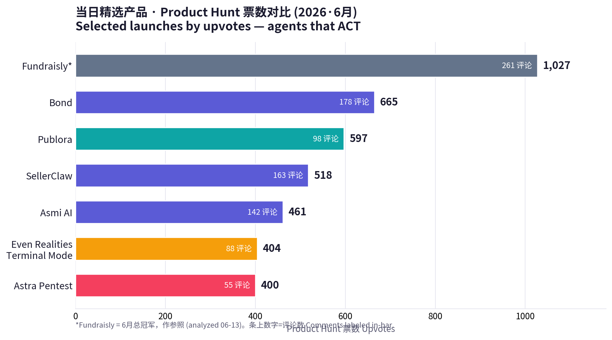
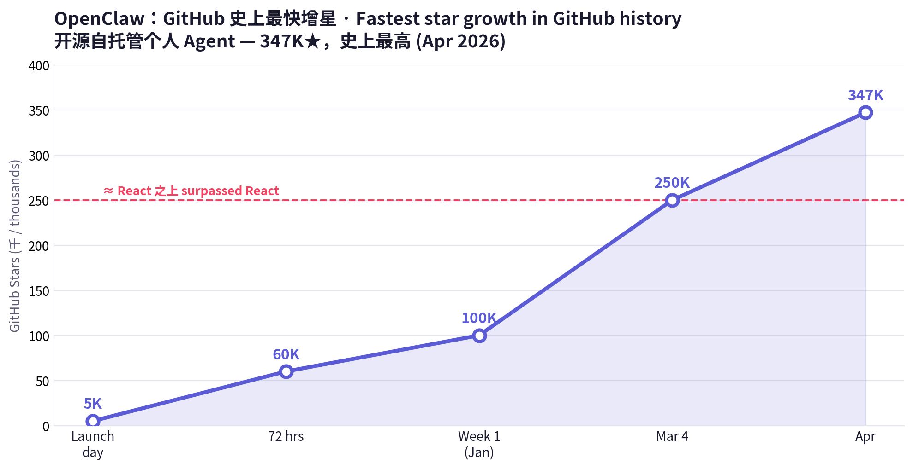
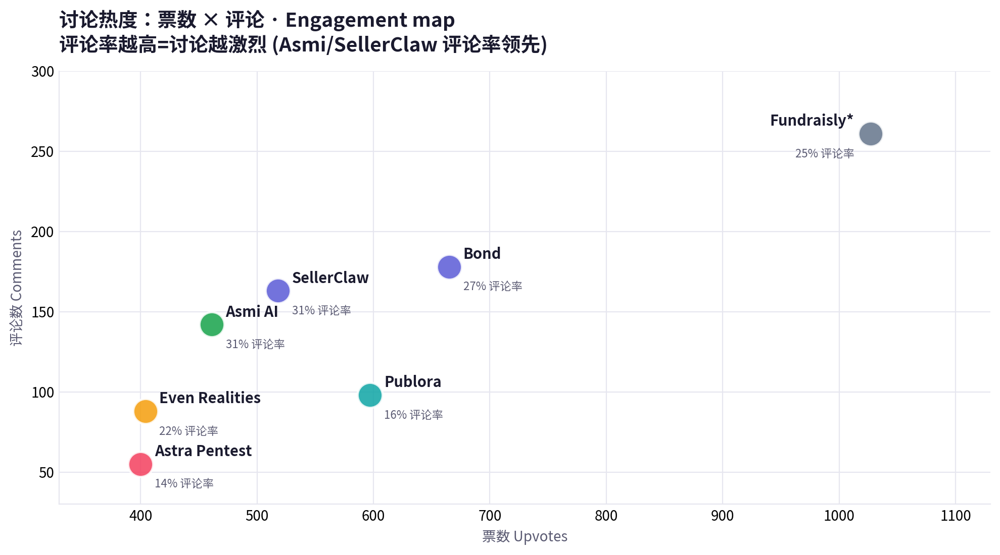

# 每日产品趋势报告 · Daily Product Trend Report
**日期 Date: 2026-06-14（周日 Sunday）**
数据来源 Sources: Product Hunt · Hacker News · Google Trends · a16z · Amazon Movers & Shakers · X · LinkedIn · 小红书（榜单经 hunted.space 直采 + 公开搜索摘要补充 via direct fetch + public search summaries）

> ⚠️ 方法说明 Methodology note：本次运行 Product Hunt 榜单与票数已通过 hunted.space 成功直采（含逐产品票数/评论数）；producthunt.com、x.com、linkedin.com、xiaohongshu.com 仍为登录墙/客户端渲染，按任务规则未做绕过，相关口碑改用 WebSearch 公开摘要。本期产品均与 06-13 报告不重复（聚焦本周新上榜的"执行型 Agent"）。PH leaderboard + vote counts were fetched directly via hunted.space this run; social platforms remain login-walled and were covered via public search summaries. All products here are distinct from the 06-13 report.

---

## ① 当日概览 · Daily Overview

**中文**：如果说上周的主线是"AI 从演示走向执行"，本周它更进一步——**Agent 开始亲自动手干现实世界的活**。Product Hunt 六月新榜被一批"会替你做事"的代理霸占：**Bond**（665 票）当你的 AI 幕僚长，把散落的待办变成"自己会完成的清单"；**Asmi AI**（461 票）直接拿起电话，替你打给牙医、银行、保险，过 IVR、等叫号、跟真人沟通；**SellerClaw**（518 票）派出一队 AI 代理替你运营整间电商店铺；连安全也自治化了——**Astra**（400 票）的 AI 红队 5 分钟内自动渗透你的系统。围绕这些代理，一条完整"代理栈"正在成形：**Publora**（597 票）给 Agent 装上社媒"双手"，**Even Realities** 的智能眼镜（404 票）让你随时盯着代理干活，而开源界的 **OpenClaw**（GitHub 史上最高 347K★）则掀起"自己拥有 Agent"的反订阅浪潮。a16z 同期的论点恰好对上：AI 时代赢家卖的是**结果**，把软件+数据+硬件+人力打包成"全栈胖创业"，并把网络安全自动化列为 2026 大命题。

**English**: If last week's through-line was "AI moving from demo to execution," this week goes one step further — **agents start doing real-world work with their own hands.** Product Hunt's fresh June board is dominated by代理 that *act for you*: **Bond** (665 votes) is your AI chief of staff, turning scattered tasks into "a to-do list that does itself"; **Asmi AI** (461) literally picks up the phone — calling your dentist, bank, insurer, navigating IVR, waiting on hold, talking to a human; **SellerClaw** (518) dispatches a team of AI agents to run your entire e-commerce store; even security goes autonomous — **Astra's** (400) AI red team pentests your systems in under 5 minutes. Around these agents, a full **agent stack** is forming: **Publora** (597) gives agents social-media *hands*; **Even Realities** smart glasses (404) let you supervise agents ambiently; and open-source **OpenClaw** (347K★, the most-starred repo in GitHub history) drives an "own your agent" anti-subscription wave. a16z's thesis lines up perfectly: in the AI era, winners ship **outcomes** — bundling software + data + hardware + human ops into "fat startups" — and they name automating cybersecurity a defining 2026 problem.

**当日关键信号 Key signals**

| # | 信号 Signal | 数据 Data |
|---|---|---|
| 1 | 最热新上榜（生产力）Top new launch (productivity) | Bond ~665 votes / 178 comments |
| 2 | 电商自治 E-commerce autonomy | SellerClaw ~518 votes（SaaS #1）/ 163 comments |
| 3 | Agent 基础设施 Agent infra | Publora ~597 votes（Dev Tools #1），MCP-native，10 平台 |
| 4 | 安全自治化 Autonomous security | Astra：findings < 5 min，训练于 10M+ 漏洞，~$9.8M 营收 |
| 5 | 开源反扑 Open-source revolt | OpenClaw 347K★（史上最高，超越 React）|
| 6 | a16z 论点 a16z thesis | "Fat startups ship outcomes"；democratize $200/hr 服务 |
| 7 | HN 风向 HN mood | 安全移到舞台中央 security to center；常驻个人 Agent |
| 8 | Google Trends 宏观 | NBA 季后赛登顶 ~193M；YouTube/Amazon 居 US 搜索前二 |

---

## ② 产品深度分析 · Product Deep-Dives

### 1. Bond — AI 幕僚长 AI Chief of Staff
🔗 https://www.bondapp.io/ · PH: https://www.producthunt.com/products/bond-12

| 维度 Dimension | 中文 | English |
|---|---|---|
| 商业模式 Business model | B2B SaaS（按席位），瞄准 CEO/高管的高价值时间；以"省下状态会"做价值锚 | B2B SaaS (per-seat) anchored to expensive executive time; value prop = "kill status meetings" |
| 成功因素 Key success factors | ① 拟人助理"Donna"叙事，把工具变同事；② YC 背书 + $3M 种子；③ 连接全公司工具/数据形成上下文壁垒；④ 定位极清晰："会自己完成的待办清单" | ① "Donna" persona turns a tool into a colleague; ② YC + $3M seed; ③ context moat from connecting all company tools/data; ④ razor-clear positioning: "the to-do list that does itself" |
| 核心功能 Core features | 会前简报、起草跟进与邮件、生成行动项、识别阻塞与风险、向团队派活；始终知道"下一步该做什么" | Meeting prep, drafts follow-ups & emails, creates action items, flags blockers/risks, delegates to teammates; always knows your next step |
| 细分市场 Niche | 高管生产力 / AI 幕僚长（Executive productivity） | Executive productivity / AI chief of staff |
| 目标用户 Target audience | 创始人、CEO、被会议与上下文淹没的高管 | Founders, CEOs, execs drowning in meetings & context |
| 设计与品牌 Design & brand | 命名"Bond"=与你紧密联结；助理人格"Donna"温度感；极简高管审美 | "Bond" = a tight tie to you; warm "Donna" persona; minimalist exec aesthetic |
| 产品数据 Product data | PH ~665 票 / 178 评论（6月生产力第一）；YC；$3M 种子（2025-12）；团队约 60 人 | ~665 votes / 178 comments (June productivity #1); YC; $3M seed (Dec 2025); ~60 staff |
| 代表评价 Reviews | PH 讨论："终于不用开状态会了"；对"拟人助理"接受度高 | PH: "finally no more status meetings"; strong reception of the persona framing |

**点评 Take**：把"高管时间"这一最贵的资源做成订阅——Bond 卖的不是任务管理，是"少开会、永远知道下一步"。**Bond monetizes the most expensive resource in a company — exec attention — and sells calm, not a task list.**

---

### 2. Asmi AI — 会打电话的私人 AI The AI That Makes Real Phone Calls
🔗 https://www.producthunt.com/products/asmi-ai

| 维度 Dimension | 中文 | English |
|---|---|---|
| 商业模式 Business model | 消费订阅（自带专属号码与人格）；按"替你完成的现实事务"定价空间大 | Consumer subscription (dedicated number + persona); priced against real-world tasks completed |
| 成功因素 Key success factors | ① 把"语音 Agent"从演示做成可交付结果（真的把事办成）；② 每天主动来电、零 App 摩擦；③ "只在你明确指示时行动"建立信任；④ 触达线下世界=对手稀少 | ① Turns voice-AI from demo into delivered outcomes (the task actually gets done); ② proactive morning call, zero-app friction; ③ "acts only on explicit instruction" builds trust; ④ reaches the offline world where few competitors operate |
| 核心功能 Core features | 替你致电牙医/银行/保险/水电工等；过 IVR、长时间等待、与真人复杂对话；完成后用 iMessage/WhatsApp 回执 | Calls dentist/bank/insurer/plumber for you; navigates IVR, waits on hold, handles complex human conversations; reports back via iMessage/WhatsApp |
| 细分市场 Niche | 消费级语音执行 Agent（real-world voice agent） | Consumer real-world voice agent |
| 目标用户 Target audience | 拖延打电话的忙碌人群、社恐、行政事务繁多者 | Busy people who dread phone tasks, phone-anxious users, admin-heavy lives |
| 设计与品牌 Design & brand | 拟人化到底：自有声音、人格、电话号——"你的助理"而非"你的克隆" | Fully personified: its own voice, personality, number — "your assistant," not "a clone of you" |
| 产品数据 Product data | PH ~461 票 / 142 评论（评论率 ~31%，讨论极热） | ~461 votes / 142 comments (~31% comment ratio — unusually high engagement) |
| 代表评价 Reviews | "帮我打了拖了三个月的专科医生电话"；用户称赞团队"在意事情有没有真办成，而不只是流程顺" | "It called a specialist doctor I'd been putting off for 3 months"; users praise the team for caring whether the task *actually got done* |

**点评 Take**：语音 Agent 的胜负手不在"说得像人"，而在"把事办成"。Asmi 把最反人性的杂务——打电话——变成了订阅制结果。**Voice agents win on completion, not on sounding human. Asmi turns the most-dreaded chore into a subscription outcome.**

---

### 3. SellerClaw — 替你运营电商的 AI 代理团队 An AI Agent Team That Runs Your Store
🔗 https://www.producthunt.com/products/sellerclaw

| 维度 Dimension | 中文 | English |
|---|---|---|
| 商业模式 Business model | B2B SaaS（面向电商卖家，按席位/用量）；以"省一整个运营团队"为价值锚 | B2B SaaS for e-commerce sellers (seat/usage); value anchor = "replace an ops team" |
| 成功因素 Key success factors | ① "Supervisor + 专员代理"编排模型，贴合真实电商分工；② 创始人 Artem 18 岁起卖亚马逊、Zonesmart 服务 1,000+ 卖家并退出，自带可信度；③ 跨渠道+多币种毛利逻辑解决真实痛点 | ① "Supervisor + specialist agents" orchestration mirrors real store ops; ② founder Artem's credibility (Amazon at 18; Zonesmart served 1,000+ sellers, exited 2022); ③ multi-channel + multi-currency margin logic solves real pain |
| 核心功能 Core features | 选品采购、店铺管理、广告投放、客服——多个专员代理由一个"主管代理"统一调度；跨 Shopify/eBay/Amazon；按各自币种核算成本与售价、统一换算保持毛利一致 | Sourcing, store management, ads, support — specialist agents coordinated by one Supervisor; across Shopify/eBay/Amazon; native-currency cost/price with conversion to keep margins consistent |
| 细分市场 Niche | 自治电商运营（agentic commerce ops） | Agentic e-commerce operations |
| 目标用户 Target audience | 中小电商卖家、跨境卖家、一人/小团队店主 | SMB & cross-border sellers, solo/small-team store owners |
| 设计与品牌 Design & brand | "Claw"=爪子，抓取与执行的力量感；"一队替你干活的代理"叙事 | "Claw" connotes grab-and-execute; "a team that runs it for you" narrative |
| 产品数据 Product data | PH ~518 票 / 163 评论（SaaS 类目第一） | ~518 votes / 163 comments (SaaS category #1) |
| 代表评价 Reviews | 讨论聚焦"主管代理"模型与多币种毛利处理的实用性 | Discussion centers on the Supervisor model and the practicality of multi-currency margin handling |

**点评 Take**：电商 SaaS 的下一形态不是仪表盘，而是"一队会自己干活的员工"。把人类从"看数据"挪到"下指令"。**The next e-commerce SaaS isn't a dashboard — it's a staff of agents. Humans move from reading dashboards to giving orders.**

---

### 4. Astra Autonomous Pentest — 自治攻防安全 Autonomous Offensive Security
🔗 https://www.getastra.com/autonomous-pentesting · PH: https://www.producthunt.com/products/astra-security

| 维度 Dimension | 中文 | English |
|---|---|---|
| 商业模式 Business model | PTaaS / 持续渗透订阅；卖"持续在线的红队"这一结果，而非一次性报告 | PTaaS / continuous-pentest subscription; sells "an always-on red team" as an outcome, not a one-off report |
| 成功因素 Key success factors | ① 踩中 2026"安全移到舞台中央"与 a16z"自动化网络安全"命题；② 双代理架构（结构化群 + 赏金猎人代理）兼顾覆盖与创造性；③ 8 年积累的数据壁垒（4,000+ 渗透、10M+ 漏洞）；④ 与人类渗透师互补而非取代，降低采购阻力 | ① Rides the 2026 "security to center" + a16z "automate cybersecurity" theses; ② dual-agent design (structured swarm + bounty-hunter agent) balances coverage & creativity; ③ 8-yr data moat (4,000+ pentests, 10M+ vulns); ④ complements human pentesters, lowering buying friction |
| 核心功能 Core features | AI 代理模拟真实攻击者：侦察、威胁建模、动态用例生成、漏洞链利用、验证；5 分钟出初步结果、每次部署持续运行 | AI agents emulate real attackers: recon, threat modeling, dynamic test-case generation, exploit chaining, validation; initial findings < 5 min, continuous on every deploy |
| 细分市场 Niche | 自治渗透测试 / 持续威胁暴露管理（CTEM） | Autonomous pentesting / continuous threat-exposure management |
| 目标用户 Target audience | 工程与安全团队、需持续合规的 SaaS 公司 | Engineering & security teams, compliance-driven SaaS companies |
| 设计与品牌 Design & brand | "Autonomous Pentest"功能即品牌；"80× 快于人工"做钩子；攻击者视角叙事 | Feature-as-brand naming; "80× faster than manual" hook; attacker's-eye narrative |
| 产品数据 Product data | PH ~400 票 / 55 评论；成立 2018；~$9.8M 营收；~$2.7M 融资（Emergent/Blume/Techstars 等），估值约 $29.4M；每月为客户发现 30,000+ 漏洞 | ~400 votes / 55 comments; founded 2018; ~$9.8M revenue; ~$2.7M raised (Emergent/Blume/Techstars), ~$29.4M valuation; 30,000+ vulns/month for customers |
| 代表评价 Reviews | 安全圈讨论："自治覆盖广度可观，但深度判断仍需人"；认可<5 分钟反馈速度 | Security community: "impressive autonomous coverage, but深度 judgment still needs humans"; praise for <5-min feedback |

**点评 Take**：当攻击者已在用 AI，防守自治就不是选项而是刚需。Astra 卖的是"持续在线的红队"。**When attackers already use AI, autonomous defense is table stakes. Astra sells an always-on red team, not a report.**

---

### 5. Publora — 给 Agent 装上社媒之手 Social-Media Hands for Agents
🔗 https://publora.com/ · PH: https://www.producthunt.com/products/publora

| 维度 Dimension | 中文 | English |
|---|---|---|
| 商业模式 Business model | Freemium + API/席位：免费 Starter → 付费 $2.99/账号/月（年付）；PH 码 PH20THANKU 首付 8 折 | Freemium + API/seat: free Starter → $2.99/account/mo (yearly); PH code PH20THANKU = 20% off first payment |
| 成功因素 Key success factors | ① 从"Google Docs 式排版器"升级为"代理时代发布 API"，卡位 agent-native 基建；② 原生 MCP（18 个工具）让 Claude/Cursor 直接发帖；③ 极低价 + 免费档快速获客；④ 一次接入十大平台 | ① Pivoted from "Google-Docs-style scheduler" to "publishing API for the agent era," claiming agent-native infra; ② native MCP (18 tools) lets Claude/Cursor post directly; ③ ultra-low price + free tier for fast adoption; ④ one integration → 10 platforms |
| 核心功能 Core features | 从代码或 AI 助手直接排期/发布到 LinkedIn、X、Instagram、Threads、TikTok、YouTube、Facebook、Bluesky、Mastodon、Telegram；MCP 提供完整互动闭环 | Schedule/publish from code or your AI assistant to LinkedIn, X, Instagram, Threads, TikTok, YouTube, Facebook, Bluesky, Mastodon, Telegram; MCP provides a full engagement loop |
| 细分市场 Niche | 社媒发布 API / Agent 原生基础设施 | Social publishing API / agent-native infrastructure |
| 目标用户 Target audience | 独立开发者、AI Agent 构建者、内容自动化团队、营销技术栈 | Indie devs, AI-agent builders, content-automation teams, martech stacks |
| 设计与品牌 Design & brand | 开发者友好叙事："The Publishing API for the Agent Era"；定价透明、亲民 | Dev-friendly positioning: "The Publishing API for the Agent Era"; transparent, low pricing |
| 产品数据 Product data | PH ~597 票 / 98 评论（开发者工具 & API 类目第一）；10 平台、18 个 MCP 工具 | ~597 votes / 98 comments (Dev Tools & API #1); 10 platforms, 18 MCP tools |
| 代表评价 Reviews | 开发者称赞"终于能让 Agent 自己发帖"；对低价与 MCP 原生支持反响积极 | Devs praise "finally my agent can post itself"; positive on low price & native MCP |

**点评 Take**：当人人都在造 Agent，卖"铲子"最稳——Publora 把"发帖"这个动作变成 Agent 可调用的能力。**In a gold rush, sell shovels. Publora turns "posting" into a callable agent capability.**

---

### 6. Terminal Mode（Even Realities）— 盯着 Agent 干活的智能眼镜 Smart Glasses to Watch Your Agents
🔗 https://www.evenrealities.com/terminal · PH: https://www.producthunt.com/products/terminal-mode-by-even-realities

| 维度 Dimension | 中文 | English |
|---|---|---|
| 商业模式 Business model | 硬件销售（Even G2 眼镜 + R1 指环）——软件+硬件捆绑的"胖创业"样本 | Hardware sales (Even G2 glasses + R1 ring) — a "fat startup" software+hardware bundle |
| 成功因素 Key success factors | ① 抓住"长时自治代理需要环境化监督"的新需求；② 无摄像头设计规避隐私顾虑；③ 视线内 HUD + 语音指令 + 指环点按，交互极轻；④ 把"等代理跑完"变成可离开工位的自由 | ① Captures the new need to *supervise* long-running agents ambiently; ② camera-free design sidesteps privacy worries; ③ in-view HUD + voice + ring-tap = ultra-light interaction; ④ turns "waiting on an agent" into freedom to walk away |
| 核心功能 Core features | 在视线内显示各编码代理的运行/阻塞/待输入状态；语音下短指令；点按指环批准关键步骤；跨多会话监看，无需切屏 | Shows which coding agent is running/blocked/waiting in your line of sight; short voice instructions; tap-to-approve key steps via the ring; multi-session supervision with no screen-switching |
| 细分市场 Niche | AI 代理的环境化监督层 / 可穿戴开发工具 | Ambient supervision layer for AI agents / wearable dev tool |
| 目标用户 Target audience | 同时跑多个编码代理的开发者、重度 AI 工作流用户 | Developers running multiple coding agents, heavy AI-workflow users |
| 设计与品牌 Design & brand | "Terminal Mode"开发者隐喻；极简无摄像头眼镜，主打"信息而非拍摄" | "Terminal Mode" dev metaphor; minimalist camera-free glasses — "information, not capture" |
| 产品数据 Product data | PH ~404 票 / 88 评论；2026 年 4 月底上线；配套 R1 指环 | ~404 votes / 88 comments; launched late April 2026; paired R1 companion ring |
| 代表评价 Reviews | 开发者："多代理并行时终于不用一直盯屏"；也有人质疑眼镜佩戴门槛 | Devs: "finally I don't have to babysit screens across parallel agents"; some question the wear barrier |

**点评 Take**：代理越自治、越长时运行，人类越需要一个"环境化"的监督界面。眼镜不是噱头，是 Agent 时代的新仪表盘。**The more autonomous and long-running agents get, the more humans need an *ambient* place to watch them. The glasses aren't a gimmick — they're the agent era's dashboard.**

---

### 7. OpenClaw — 自己拥有的开源 Agent The Open-Source Agent You Own（趋势 Trend）
🔗 https://openclaw-ai.net/en · 解析 explainer: https://www.digitalocean.com/resources/articles/what-is-openclaw

| 维度 Dimension | 中文 | English |
|---|---|---|
| 商业模式 Business model | 开源、无订阅；商业化在托管/部署层（如 OneClaw 等）形成生态 | Open-source, no subscription; monetization lives in the hosting/deployment layer (e.g. OneClaw-style services) |
| 成功因素 Key success factors | ① "自己拥有 Agent"对冲 SaaS 锁定与隐私焦虑；② 本地运行+长期记忆+自写技能，能力随用随长；③ 名人创始人（PSPDFKit 的 Peter Steinberger）带社区势能；④ 接 WhatsApp/Discord/本地文件，落到日常 | ① "Own your agent" hedges SaaS lock-in & privacy fears; ② local + long-term memory + self-authored skills that grow with use; ③ celebrity founder (Peter Steinberger of PSPDFKit) brings community momentum; ④ hooks into WhatsApp/Discord/local files for daily use |
| 核心功能 Core features | 本地网关连接模型与你的工具/文件；跨会话记忆偏好；可自主写代码生成新技能；7×24 主动执行任务 | Local gateway connects models to your tools/files; cross-session memory; autonomously writes code to create new skills; proactive 24/7 task execution |
| 细分市场 Niche | 开源自托管个人 Agent（own-your-agent） | Open-source self-hosted personal agent |
| 目标用户 Target audience | 开发者、隐私敏感者、想摆脱订阅与厂商锁定的高级用户 | Developers, privacy-conscious users, power users escaping subscriptions & vendor lock-in |
| 设计与品牌 Design & brand | "Open"=透明可控；社区驱动叙事；反"黑箱 SaaS"的旗帜 | "Open" = transparent & controllable; community-driven; a flag against black-box SaaS |
| 产品数据 Product data | GitHub 347,000+ ★（2026-04，史上最高，超越 React）；72 小时破 6 万、首周破 10 万、3 月初破 25 万 | 347,000+ GitHub stars (Apr 2026, most-starred repo in history, passed React); 60K in 72h, 100K in week 1, 250K by early March |
| 代表评价 Reviews | 社区："私有、可扩展、不被任何一家 UI 绑死"；亦有人提醒自托管的安全/维护成本 | Community: "private, extensible, not locked into one company's UI"; others flag self-hosting security/maintenance cost |

**点评 Take**：商业 Agent 越强，"自己拥有一个"的渴望就越大。OpenClaw 是 Agent 时代的"反订阅宣言"，也是分发即社区的最佳样本。**The stronger commercial agents get, the more people want to own one. OpenClaw is the agent era's anti-subscription manifesto — and a masterclass in community-as-distribution.**

---

## ③ 横向对比 · Cross-Product Comparison

| 产品 Product | 类型 Type | 商业模式 Model | 目标用户 Audience | 关键数据 Key data | 一句话定位 One-liner |
|---|---|---|---|---|---|
| [Bond](https://www.bondapp.io/) | AI 幕僚长 Chief of staff | B2B 席位 Per-seat | 创始人/高管 Founders/execs | ~665 votes；YC；$3M seed | 会自己完成的待办 A to-do list that does itself |
| [Asmi AI](https://www.producthunt.com/products/asmi-ai) | 语音执行 Voice agent | 消费订阅 Consumer sub | 忙碌/社恐人群 Busy & phone-shy | ~461 votes / 142 comments | 替你打电话办事 Makes your calls, gets it done |
| [SellerClaw](https://www.producthunt.com/products/sellerclaw) | 电商代理 Commerce agents | B2B SaaS | 电商卖家 Sellers | ~518 votes（SaaS #1）| 一队代理替你开店 A staff of agents runs your store |
| [Astra](https://www.getastra.com/autonomous-pentesting) | 安全自治 Security | PTaaS 订阅 | 工程/安全团队 Eng/Sec | ~400 votes；~$9.8M rev；<5 min findings | 持续在线的 AI 红队 An always-on AI red team |
| [Publora](https://publora.com/) | Agent 基建 Agent infra | Freemium $2.99/acct | 开发者/Agent 构建者 Devs | ~597 votes（Dev Tools #1）；10 平台/18 MCP | 给 Agent 装上社媒手 Social hands for agents |
| [Even Realities](https://www.evenrealities.com/terminal) | 硬件监督 HW supervision | 硬件 Hardware | 多代理开发者 Multi-agent devs | ~404 votes；G2 眼镜 + R1 指环 | 盯着代理干活的眼镜 Glasses to watch your agents |
| [OpenClaw](https://openclaw-ai.net/en) | 开源 Agent OSS agent | 开源 Open-source | 开发者/隐私党 Devs/privacy | 347K★（GitHub #1）| 自己拥有的 Agent The agent you own |

---

## ④ 关键洞察 · Key Insights & Common Patterns

**1. 从"回答"到"动手" From answering to acting.** 本周每个赢家都跨过了同一道门槛：不再是聊天给建议，而是真的去做事——Bond 替你处理待办、Asmi 替你打电话、SellerClaw 替你运营、Astra 替你渗透。卖的是**完成度**，不是对话。Every winner crossed the same line: from chatting to *doing* — completion is the product, not conversation.

**2. 卖结果=卖信任，信任靠"可控" Selling outcomes means selling trust — and trust comes from control.** 让 Agent 替你行动，最大障碍是信任。本周的解法高度一致：Asmi"只在你明确指示时行动"、Astra"与人类渗透师互补"、Even Realities"点按批准关键步骤"、OpenClaw"本地+开源可审计"。Agents that act must earn trust; the shared answer is *human-in-the-loop control* (explicit instruction, tap-to-approve, complement-not-replace, local & auditable).

**3. 代理栈正在分层 The agent stack is layering up.** 应用层（Bond/Asmi/SellerClaw）之下，基建层（Publora 给手）、硬件层（Even Realities 给眼睛）、所有权层（OpenClaw 给自主权）同时成形。卖镐铲（Publora/MCP）可能比淘金更稳。Beneath the app layer, an infra layer (Publora = hands), a hardware layer (Even Realities = eyes), and an ownership layer (OpenClaw = autonomy) are forming together. Selling shovels (MCP/infra) may beat mining.

**4. 安全是 Agent 时代的必修课 Security is the agent era's mandatory course.** HN 把安全推到中央、a16z 点名"自动化网络安全"、Astra 用自治红队接住需求——当 AI 既是矛也是盾，攻防都在自治化。HN moved security to center, a16z named "automate cybersecurity," and Astra's autonomous red team catches the demand — when AI is both sword and shield, offense and defense both go autonomous.

**5. 开源是最强分发 Open source is the strongest distribution.** OpenClaw 用 347K★（超越 React）证明：在 Agent 这种"越用越懂你"的产品上，社区信任与可扩展性能击穿商业壁垒。"拥有感"本身就是卖点。OpenClaw's 347K★ (past React) proves community trust + extensibility can punch through commercial moats; "ownership" is itself the value prop.

**6. 人格化降低采用门槛 Personas lower the adoption barrier.** Bond 的"Donna"、Asmi 的专属声音与号码——给 Agent 一个名字和性格，用户更愿意把现实事务交给它。Naming and personifying agents (Bond's "Donna," Asmi's own voice & number) makes users comfortable handing over real-world tasks.

**7. 与上周一脉相承 Continuity with last week.** 06-13 的主线是"AI 从演示走向执行（卖结果）"，本周是它的下一幕——**执行延伸到现实世界与完整代理栈**。同一条曲线，斜率更陡。Last week was "demo → execution (sell outcomes)"; this week is the next act — execution extends into the real world and a full agent stack. Same curve, steeper slope.

---

## ⑤ 来源与方法 · Sources & Method

- **Product Hunt 榜单/票数**：hunted.space/top-products/latest（本次直采成功，含逐产品票数/评论数）；producthunt.com 周/日榜 weekly/2026/24、daily/2026/6/13
- **产品详情 Product pages**：bondapp.io、producthunt.com/products/asmi-ai、producthunt.com/products/sellerclaw、getastra.com、publora.com、evenrealities.com/terminal、openclaw-ai.net
- **公司/融资 Company & funding**：Y Combinator（Bond、Asmi 生态）、Crunchbase/Tracxn/PitchBook（Astra、Bond）、inc42 / getlatka（Astra 营收）
- **a16z**：a16z.com/category/ai/；speedrun.substack.com（14 Big Ideas 2026）；blog.mean.ceo a16z 6月汇总
- **Hacker News**：blog.mean.ceo/hacker-news-trends-june-2026/；news.ycombinator.com/front（当日首页客户端渲染，采用摘要 summary used）
- **Google Trends**：backlinko.com/google-searches、demandsage（月度/当日汇总 summaries）
- **电商 E-commerce**：amazon.com/gp/movers-and-shakers、amzprep.com（夏季趋势 context：Stanley 保温杯、防晒、户外、防过敏类）
- **社媒 Social**：X / LinkedIn / 小红书均登录墙，采用公开摘要 public summaries
- **原始数据 Raw data**：`raw/2026-06-14/`（producthunt-leaderboard.txt、product-deepdives.txt、sources.json）

*报告由自动化任务生成 Generated by scheduled task · 2026-06-14*
