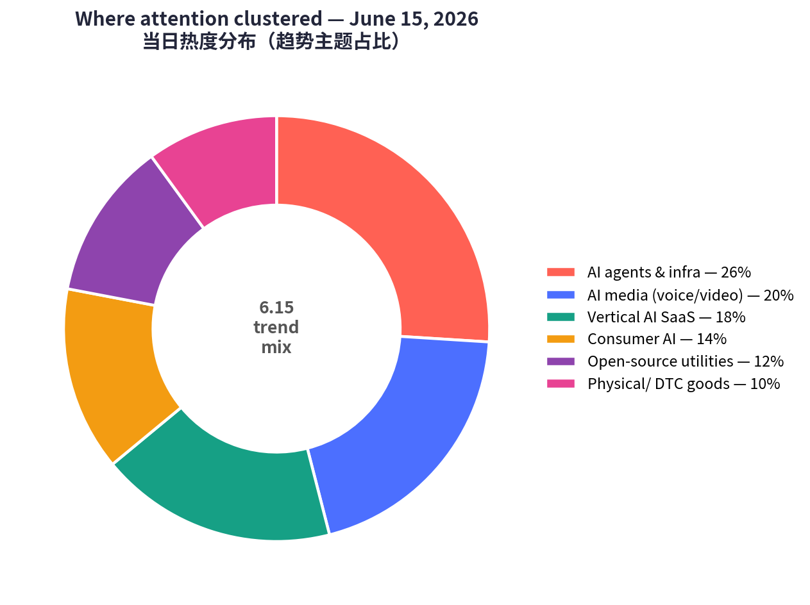
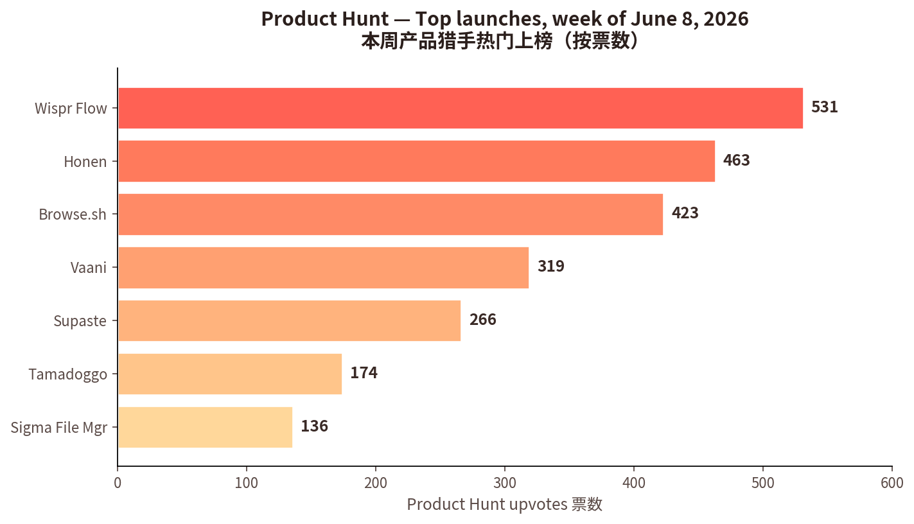
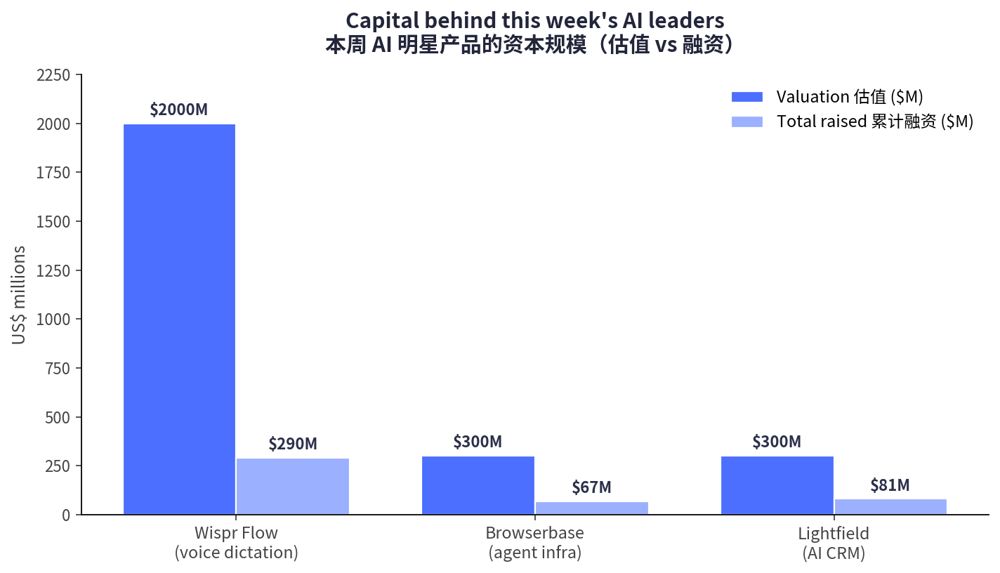

# 每日产品趋势报告 · Daily Product Trends Report
### 2026 年 6 月 15 日 · June 15, 2026

> 数据来源 / Sources: Product Hunt（周榜 W24）、Hacker News（6 月趋势）、a16z（Big Ideas 2026）、Google Trends（美国）、Amazon Movers & Shakers、小红书/RED 2026 趋势。
> 方法 / Method: WebSearch + web_fetch 公开数据抓取。X / LinkedIn / 小红书需登录或客户端渲染，采用公开检索摘要替代（见文末说明）。

---

## ① 当日概览 · Overview

**一句话 / In one line:** 今天的市场主线是 **「AI 从炫技走向纪律」**——资本和注意力正从「会演示的 AI」转向 **「能交付结果、可被信任、嵌进真实工作流的 AI 基础设施」**。a16z 称之为 *"Fat Startups"（全栈创业）* 与 *"按结果付费"*；Hacker News 则把 **安全、治理、可审计** 推到了讨论中心。

> Today's throughline is **"AI moving from spectacle to discipline."** Capital and attention are rotating from *demo-able* AI toward **AI infrastructure that delivers outcomes, earns trust, and embeds into real workflows.** a16z frames it as *"Fat Startups"* and *"pay-for-the-outcome"*; Hacker News pushes **security, governance, and auditability** to the center.

四条最强信号 / Four strongest signals:

1. **卖铲子的赢麻了 / Picks-and-shovels win.** AI agent 浪潮下，给 agent 提供「双手」的基础设施（如 Browserbase）正成为关键层。
2. **「会自己干活」的垂直 SaaS / Self-driving vertical SaaS.** Lightfield 这类「自我维护」的 AI-native CRM 用「零录入 + 一小时迁移」直接吃掉传统 CRM。
3. **语音/视频成为新输入法 / Voice & video as the new input.** Wispr Flow（语音听写，估值冲 ~$20 亿）、Vaani（对口型 AI 配音）显示多模态正从玩具变为生产力工具。
4. **实体消费靠「社交种草 + 季节性」/ Physical goods ride social proof + seasonality.** Amazon 飙升榜被低价实用/猎奇好物霸榜；小红书种草转向「真实粗糙感」。

本周 Product Hunt 票数概览 / This week's Product Hunt upvote snapshot：

资本规模对比（AI 明星产品）/ Capital behind featured AI leaders：

---

## ② 逐个产品深度分析 · Product Deep-Dives

> 共 7 个精选标的：6 个具体产品 + 1 个消费品横向趋势。每节含数据表与配图/链接。
> 7 picks: 6 products + 1 consumer-goods trend. Each has a data table and image/link.

---

### 1. Browserbase（Browse.sh）— 给 AI agent 一双「会用浏览器的手」

**Tagline:** *Give your agents muscle memory for automating the web.*
**链接 / Link:** [Product Hunt](https://www.producthunt.com/products/browserbase) · [browserbase.com](https://www.browserbase.com) · PH 周榜 #2（423 👍 / 55 💬）

 

| 维度 Dimension | 分析 Analysis |
|---|---|
| 商业模式 Business model | 用量计费的云基础设施 / Browser-as-a-Service API；开发者自助 + 企业销售。Usage-based cloud infra (BaaS). |
| 核心功能 Core features | 大规模运行/管理/监控无头浏览器；Search & Fetch API；让「网页像 API 一样可编程、可靠」。 |
| 成功关键 Key success | AI agent 时代的「卖铲人」。把最脏最难的环节——真实网页交互——标准化。Perplexity、Vercel 等 1000+ 客户背书。 |
| 细分市场 Niche | 自主 web agent 的无头浏览器基础设施。 |
| 目标受众 Target | AI agent 开发者、vibe coders、自动化/数据团队。 |
| 品牌设计 Brand | 极客实用风；「muscle memory（肌肉记忆）」隐喻精准，开发者一听就懂。 |
| 产品数据 Data | 累计融资 **$67.5M**；Series B 估值 **$300M**（约 8 个月内 ~4×）；首年 **50M+** 浏览器会话；成立约 16 个月。 |
| 口碑 Reviews | 被视为 agent 技术栈的「关键一层」，可靠性与规模获认可。 |

> **为什么值得看 / Why it matters:** 完美踩中 a16z「基础设施 > 应用包装」与 HN「agent 工作流」双重主线。当所有人都在做 agent，卖给他们「手脚」的人最先赚到钱。

---

### 2. Lightfield — 会自己更新的 AI-native CRM

**Tagline:** *AI-native CRM that builds itself and does work for you.*
**链接 / Link:** [Product Hunt](https://www.producthunt.com/products/lightfield) · [lightfield.app](https://lightfield.app) · 本周精选（109 💬）

 

| 维度 Dimension | 分析 Analysis |
|---|---|
| 商业模式 Business model | 席位 + 用量 SaaS 订阅；定位「替换 HubSpot/Salesforce」。 |
| 核心功能 Core features | 自动捕获每一次通话/邮件/会议/消息→沉淀为「永远最新、可查询」的记录系统；用一句 prompt 造出能拓客、跟进、复盘的 agent。 |
| 成功关键 Key success | **「按结果付费」的活教材**——CRM 自己维护，销售不必手动录入；**一小时迁移 agent** 直接拆掉切换成本；MCP-native（接 Notion/Linear/Granola）。 |
| 细分市场 Niche | 自我维护、agentic 的 CRM。 |
| 目标受众 Target | 高增长初创（尤其 YC 系），原本「既不用 Salesforce 也不用 HubSpot」的空白人群。 |
| 品牌设计 Brand | 「builds itself（自己造自己）」的反工具叙事，直击 CRM 最大痛点——录入。 |
| 产品数据 Data | 2025/11 出 stealth；**2500+** 工作区；累计融资 **$81M**，估值约 **$300M**；迁移 **<60 分钟**。 |
| 口碑 Reviews | SaaStr「本周 AI 应用」；号称「初创生态增长最快的 CRM」。 |

> **为什么值得看 / Why it matters:** a16z「AI 干活、你保结果、客户为结果付费」的标准范例。它卖的不是「更好的表格」，而是「不用填表格」。

---

### 3. Wispr Flow — 把说话变成跨应用的默认输入法

**Tagline:** *Stop typing. Start speaking. 4x faster.*
**链接 / Link:** [Product Hunt](https://www.producthunt.com/products/wisprflow) · [wisprflow.ai](https://wisprflow.ai) · 531 👍（trending）

 

| 维度 Dimension | 分析 Analysis |
|---|---|
| 商业模式 Business model | 免费增值订阅：Free（2000 词/周）→ **Pro $15/月**（$144/年）→ Enterprise 询价。 |
| 核心功能 Core features | 系统级 AI 听写，在「任何 App」里都能用，并按你的风格自动润色；命令模式、自动编辑、100+ 语言。 |
| 成功关键 Key success | 语音模型成熟，让「说」首次比「打」更快更顺；**靠转型（pivot）找到 PMF**；跨平台一致体验。 |
| 细分市场 Niche | 全系统 AI 语音输入。 |
| 目标受众 Target | 知识工作者、写作者、多语种从业者、无障碍人群。 |
| 品牌设计 Brand | 「Flow（心流）」+「4x faster」极简价值主张；强调「无处不在」。 |
| 产品数据 Data | 据报融资 **$30M**（Menlo 领投），另传正洽谈 **~$260M**、估值冲 **~$20 亿**（约为 6 个月前 $700M 的 ~3×）。 |
| 口碑 Reviews | 上下文格式化与命令模式广受好评；但 **Trustpilot 仅 2.7/5**（2024-04），存在计费/隐私（云端处理）投诉——增长与口碑的张力值得警惕。 |

> **为什么值得看 / Why it matters:** 多模态输入的旗舰案例；同时也是一面镜子——**估值狂飙 ≠ 用户满意**，信任与隐私正成为语音 AI 的下一道关卡。

---

### 4. Vaani — 对口型的 AI 配音，把内容一键「本地化」

**Tagline:** *Lip-synced AI dubbing for creators, brands and studios.*
**链接 / Link:** [Product Hunt](https://www.producthunt.com/products/vaani-2) · PH 周榜 #3（319 👍 / 24 💬）

 

| 维度 Dimension | 分析 Analysis |
|---|---|
| 商业模式 Business model | 创作者工具，多按「分钟/订阅」计费（行业基准 **$2–20/分钟**，对比传统配音 $5k–15k/小时/语种）。 |
| 核心功能 Core features | 翻译 + 配音 + 时间轴 + **对口型（lip-sync）** 一体化，让译制视频「嘴型对得上」。 |
| 成功关键 Key success | 乘上「创作者全球化」大势，以约 **90%+ 成本节省** 替代录音棚；口型真实度是差异点。 |
| 细分市场 Niche | 多语种对口型 AI 配音。 |
| 目标受众 Target | 创作者、出海品牌、影视/培训工作室。 |
| 品牌设计 Brand | 名字「Vaani」（梵语「声音/言语」）带文化质感，定位创作者+品牌+工作室三端。 |
| 产品数据 Data | PH 首秀即进周榜前三（319 👍）。竞品：HeyGen（免费→$24→$99/月）、Rask（$50→$120/月含口型）、ElevenLabs。 |
| 口碑 Reviews | 上线热度高；第三方独立评测尚少（新品）。 |

> **为什么值得看 / Why it matters:** AI 媒体本地化是「内容出海」的刚需基础设施；口型同步把「能听」升级为「可信」，决定品牌敢不敢用。

---

### 5. Honen — 会随公司文档自动更新的「企业教学基础设施」

**Tagline:** *Automated teaching + learning infrastructure for any company.*
**链接 / Link:** [Product Hunt](https://www.producthunt.com/products/honen) · **PH 周榜 #1**（463 👍 / 95 💬）

 

| 维度 Dimension | 分析 Analysis |
|---|---|
| 商业模式 Business model | B2B SaaS，按工作区/席位 + 行业项目（sector programs）。 |
| 核心功能 Core features | 把团队/公司知识变成 **AI 主导的互动课程**：自适应课时、模拟演练、学习者洞察；当公司文档/工具/流程变动时课程 **自动更新**。 |
| 成功关键 Key success | 直击痛点——「企业每年砸数十亿做通用培训，课程做完技能已过半失效」。用「活课程」消灭内容陈旧。 |
| 细分市场 Niche | 自更新的「员工赋能基础设施」。 |
| 目标受众 Target | 企业、SMB、政府机构、行业工会、高校的 L&D / 培训。 |
| 品牌设计 Brand | 把自己定位成「infrastructure（基础设施）」而非「课程工具」，格局更大。 |
| 产品数据 Data | **本周票数第一（463 👍）**，95 条评论，互动度高。 |
| 口碑 Reviews | 与「AI 替你干活」的赋能叙事高度共振，登顶当周。 |

> **为什么值得看 / Why it matters:** 又一个「基础设施」叙事的胜利——把「培训」从一次性内容变成随业务自演进的系统。

---

### 6. Tamadoggo — 给宠物的「AI 成长日记」

**Tagline:** *A living journal for your pet's life, with AI insights.*
**链接 / Link:** [Product Hunt](https://www.producthunt.com/products/tamadoggo) · PH 周榜 #6（174 👍 / 24 💬）

 

| 维度 Dimension | 分析 Analysis |
|---|---|
| 商业模式 Business model | 消费级 iOS App，预计免费增值订阅。 |
| 核心功能 Core features | 记录宠物日常生活的「活日记」，叠加 AI 洞察（健康/行为/里程碑）。 |
| 成功关键 Key success | 抓住「宠物当主角」的情感价值 + 记录习惯；Tamagotchi 风命名唤起怀旧。 |
| 细分市场 Niche | AI 宠物生活记录与洞察。 |
| 目标受众 Target | 千禧/Z 世代养宠人群。 |
| 品牌设计 Brand | 名字「Tamadoggo」= Tamagotchi + doggo，可爱、好记、社媒友好。 |
| 产品数据 Data | 174 👍 / 24 💬，消费类里参与度不俗。 |
| 口碑 Reviews | 品牌讨喜，情感共鸣强。 |

> **为什么值得看 / Why it matters:** 在 B2B 基础设施扎堆的一周里，证明 **情感化消费 AI** 仍有空间——关键是「情绪价值 + 习惯养成」，而非堆功能。

---

### 7.【趋势】实体好物飙升 + 小红书「真实种草」 — 社交驱动的消费

**链接 / Link:** [Amazon Movers & Shakers](https://www.amazon.com/gp/movers-and-shakers/) · Google Trends（US）· 小红书/RED 2026 趋势

| 维度 Dimension | 分析 Analysis |
|---|---|
| 商业模式 Business model | DTC/marketplace 冲动零售；创作者「种草」驱动需求。 |
| 核心功能 Core features | 低价实用/猎奇好物：Stanley 40oz 保温杯、迷你电锯、水槽防溅垫、碎鸡肉神器、防晒、过敏季健康品。 |
| 成功关键 Key success | **社交证明 + 季节性 + 低价**＝飙升榜「火箭燃料」；小红书种草从「追爆点」转向「理解人」，内容转向 **真实粗糙感（raw & real）**。 |
| 细分市场 Niche | 「TikTok/小红书让我买」的好物 + 健康养生。 |
| 目标受众 Target | 大众消费者；Z 世代/千禧生活方式买家（小红书 ~1.4 亿 MAU 搜健康养生）。 |
| 品牌设计 Brand | 去精致化、强信任感的 UGC；「主角感/自我关怀」叙事。 |
| 产品数据 Data | Movers & Shakers 看 24 小时销量排名飙升；Google Trends：NBA、F1 首进全球前 25、"hantavirus" 破 7200 万。 |
| 口碑 Reviews | 季节性（过敏/防晒/户外）+ 猎奇驱动飙升；评价强调「真实使用」。 |

> **为什么值得看 / Why it matters:** 提醒我们——并非所有趋势都姓「AI」。**注意力经济的另一半在实体消费**，且增长引擎是社交信任而非投放。

---

## ③ 横向对比表 · Cross-Comparison Matrix

| 产品 Product | 赛道 Category | 商业模式 Model | 目标受众 Audience | 关键数据 Key data | 成功核心 Why it wins | 链接 |
|---|---|---|---|---|---|---|
| **Browserbase** | Agent 基础设施 | 用量计费 BaaS | Agent 开发者 | $300M 估值 / 50M+ 会话 | 卖铲人，标准化网页交互 | [↗](https://www.producthunt.com/products/browserbase) |
| **Lightfield** | AI-native CRM | 席位+用量 SaaS | 高增长初创 | $81M 融资 / 2500+ 工作区 | 自维护 + 1 小时迁移 | [↗](https://www.producthunt.com/products/lightfield) |
| **Wispr Flow** | 语音输入 | 免费增值 $15/月 | 知识工作者 | ~$2B 估值 / 100+ 语言 | 说比打快；跨应用 | [↗](https://www.producthunt.com/products/wisprflow) |
| **Vaani** | AI 配音 | 分钟/订阅 | 创作者/品牌/工作室 | PH #3 / 319👍 | 对口型 + 90% 降本 | [↗](https://www.producthunt.com/products/vaani-2) |
| **Honen** | 企业赋能 | B2B SaaS | L&D / 培训 | **PH #1** / 463👍 | 课程随业务自更新 | [↗](https://www.producthunt.com/products/honen) |
| **Tamadoggo** | 消费 AI / 宠物 | 消费订阅 | 养宠人群 | PH #6 / 174👍 | 情绪价值 + 习惯 | [↗](https://www.producthunt.com/products/tamadoggo) |
| **实体好物 + RED** | 消费电商 | DTC/marketplace | 大众消费者 | RED ~1.4 亿健康 MAU | 社交种草 + 季节性 | [↗](https://www.amazon.com/gp/movers-and-shakers/) |

---

## ④ 关键洞察与共性总结 · Key Insights & Common Patterns

**共性成功模式 / Common success patterns:**

1. **基础设施 > 应用包装 / Infrastructure beats wrappers.** 当周最强标的（Browserbase、Honen、Lightfield）都把自己定位为「infrastructure / system of record」，而非又一个「AI 套壳」。a16z 与 HN 同时印证：**拥有一个痛苦的工作流，比再做一个公共模型的包装更耐打。**

2. **从「功能」到「结果」/ From features to outcomes.** Lightfield「自己更新」、Honen「自动更新课程」、Wispr「自动润色」——卖点都是 **「你不必做 X」**。这正是 a16z「AI 干活、你保结果、客户为结果付费」的落地。

3. **信任正在成为产品 / Trust is becoming the product.** HN 把安全/治理/可审计推到中心；Wispr 的 2.7 分 Trustpilot 与隐私争议说明：**只承诺「更快」的产品将进入更残酷的市场**，下一道护城河是信任。

4. **多模态从玩具变工具 / Multimodal goes from toy to tool.** 语音（Wispr）与视频（Vaani）证明：当延迟/质量越过阈值，**人机交互的默认形态正在迁移**。

5. **别忘了非 AI 的那一半 / Don't forget the non-AI half.** 实体好物靠「社交证明 + 季节性 + 低价」飙升，小红书种草转向「真实感」。**增长引擎是信任与社区，而非投放预算。**

**给创业者/投资者的可执行启示 / Actionable takeaways:**

- 做 agent？**先想清楚卖给 agent 的「铲子」**（数据/浏览器/评测/审计层）往往比 agent 本身更确定。
- 做垂直 SaaS？把「**降低录入/迁移/维护成本**」做成主卖点，迁移摩擦就是你的护城河。
- 做消费？**情绪价值 + 习惯养成 + 真实内容** 胜过堆功能与精致投放。
- 看估值？**把估值与口碑（Trustpilot/留存）并列看**——本周 Wispr 是最好的提醒。

> ⚠️ **声明 / Disclaimer:** 本报告为信息性趋势观察，非投资建议。所有融资/估值/评分为引用来源在 2026-06-15 的公开数据，部分为「洽谈中」或近似值，请以一手信源为准。报告作者非投资顾问。

---

## 数据来源与说明 · Sources & Notes

- **Product Hunt** 周榜 W24（成功抓取，含真实票数/评论数）：<https://www.producthunt.com/leaderboard/weekly/2026/24>
- **Hacker News** 6 月趋势（聚合 + 检索）：<https://news.ycombinator.com/front> · 招聘贴 <https://news.ycombinator.com/item?id=48357725> · 趋势综述 <https://blog.mean.ceo/hacker-news-trends-june-2026/>
- **a16z** Big Ideas / Speedrun 2026（检索综述）
- **Google Trends（US）** 6 月（DemandSage / Backlinko / Similarweb 综述）
- **Amazon Movers & Shakers**：<https://www.amazon.com/gp/movers-and-shakers/>
- **小红书 / RED 2026 趋势**（China Skinny / EC Innovations / MarketingToChina 综述）
- **公司数据**：Browserbase（PitchBook/Tracxn/StartupHub）、Wispr Flow（eesel/Voibe/Weesper）、Lightfield（SaaStr/GlobeNewswire/lightfield.app）。

**访问限制 / Access limits:** X/Twitter、LinkedIn、小红书因登录或客户端渲染未直接抓取，按任务要求改用 WebSearch 公开摘要。Vaani 第三方独立评测较少，已结合 AI 配音行业基准分析。原始抓取数据见 `raw/2026-06-15/`。

*报告生成 / Generated: 2026-06-15 · 自动化每日趋势任务 Automated daily trend task*
