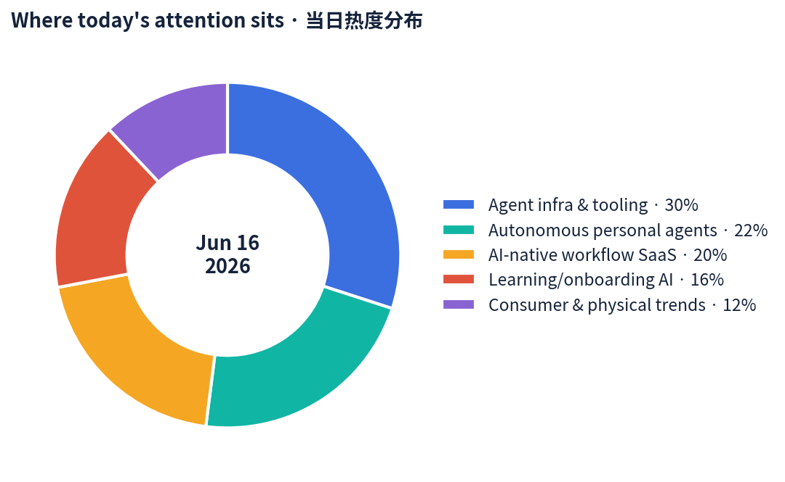
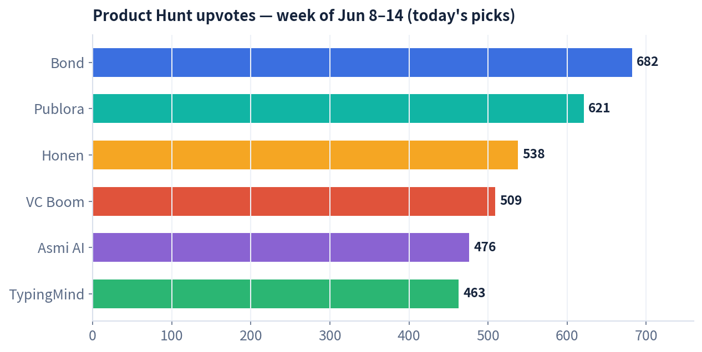
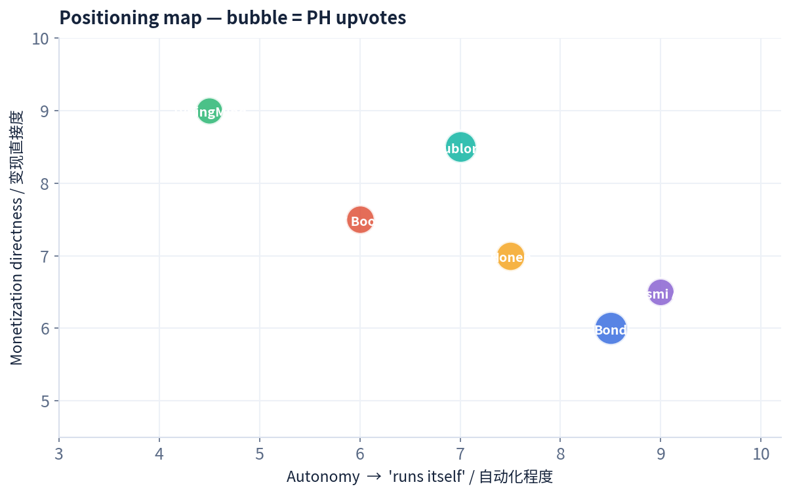

# 每日产品趋势报告 · Daily Product Trends Report
### 2026 年 6 月 16 日 · June 16, 2026

> 数据来源 / Sources: Product Hunt（周榜 W24，6/8–6/14）、Hacker News（6 月趋势）、a16z（Big Ideas 2026 · "Year of Me"）、Google Trends（美国）、Amazon Movers & Shakers、小红书/RED 2026 趋势。
> 方法 / Method: WebSearch + web_fetch 公开数据抓取。X / LinkedIn / 小红书需登录或客户端渲染，采用公开检索摘要替代（见文末说明）。当日 PH 日榜受抓取限制，改用本周周榜 + 逐个产品检索补全。

---

## ① 当日概览 · Overview

**一句话 / In one line:** 今天的主线是 **「AI 不再帮你想，而是替你做」**——注意力从「能回答的 AI」转向 **「能自己跑完一整条任务链的 AI」**：自动维护的待办、替你打电话办事的助理、给 agent 当发布通道的 API。a16z 把 2026 命名为 **"Year of Me（属于我的一年）"**：规模化生产让位于 **为你一个人定制**。

> Today's throughline: **"AI stops thinking *for* you and starts doing *instead of* you."** Attention is rotating from *AI that answers* to **AI that completes an entire task chain on its own** — a self-maintaining to-do list, an assistant that makes real phone calls, an API that becomes an agent's publishing channel. a16z calls 2026 the **"Year of Me"**: mass production gives way to **made-for-one personalization.**

四条最强信号 / Four strongest signals:

1. **「会自己干完」的 agent 产品登顶 / "Does-it-itself" agents take the top.** Product Hunt 本周前四里有三个核心卖点是「自动执行」：Bond（待办自己消化）、Asmi（替你打电话）、VC Boom（自动评分 + 自动写邮件）。
2. **给 agent 卖「水电管线」/ Selling plumbing to agents.** Publora 把「发社媒」做成一行 API + MCP，专为 agent 设计——人类不再是用户，agent 才是。
3. **按用量、不按订阅 / Usage over subscription.** TypingMind（自带 key、按 token 付费）、Asmi、VC Boom 都在用「不绑订阅、用多少付多少」抢被订阅疲劳的用户。
4. **兴趣驱动消费回潮 / Interest-driven consumption returns.** 小红书「为一场演出赴一座城」、#观鸟 90 天破 1.2 亿浏览；a16z 的「Year of Me」与之同频——实体世界 + 个性化重新值钱。

本周入选产品 Product Hunt 票数 / This week's Product Hunt upvotes for today's picks：

定位地图（自动化程度 × 变现直接度，气泡=票数）/ Positioning map (autonomy × monetization, bubble = upvotes)：

---

## ② 逐个产品深度分析 · Product Deep-Dives

> 共 7 个精选标的：6 个具体产品 + 1 个消费趋势。每节含数据表与链接。
> 7 picks: 6 products + 1 consumer trend. Each has a data table and link.

---

### 1. Bond — 「会自己消化的待办清单」/ The to-do list that does itself

**Tagline:** *The AI to-do list that does itself.* · **PH 周榜 #1（682 👍 / 184 💬）**
**链接 / Link:** [Product Hunt](https://www.producthunt.com/products/bond-12) · [bondapp.io](https://www.bondapp.io/)

| 维度 Dimension | 分析 Analysis |
|---|---|
| 商业模式 Business model | 面向高管/团队的 AI「参谋长（Chief of Staff）」订阅 SaaS；接入企业工具栈后按席位付费，PLG 自助 + 高管口碑扩散。Seat-based SaaS. |
| 核心功能 Core features | 接入你的工具→学习公司如何运转→把零散任务变成「自我管理」的待办；自动准备会议、起草跟进、发邮件、识别阻塞与风险、委派任务；追踪每个「我回头给你」并自动催办；每早生成专属主清单。 |
| 成功关键 Key success | 把「AI 助理」从「会聊天」升级为「会兜底」——它替你记住所有没收尾的事。精准命中高管「认知过载」痛点；「自己消化」的叙事极具传播力。 |
| 细分市场 Niche | 高管/创始人个人运营层（personal ops / chief-of-staff automation）。 |
| 目标受众 Target | 创始人、高管、忙碌的团队负责人。 |
| 品牌设计 Brand | 命名「Bond」（契约/纽带 + 007 联想）；「does itself」一句话定义品类，反订阅疲劳。 |
| 产品数据 Data | PH 本周 **#1**，**682** 票 / 184 评论；联合创始人兼 CEO Chloe。 |
| 口碑 Reviews | 讨论集中在「终于有人把 follow-up 自动化了」；质疑点在工具接入的隐私与可信度。 |

---

### 2. Publora — 给 AI agent 的「社媒发布 API」/ The publishing API for the agent era

**Tagline:** *A publishing API for agents to post on 10 social platforms. MCP-native.* · **PH 周榜 #2（621 👍 / 112 💬）**
**链接 / Link:** [Product Hunt](https://www.producthunt.com/products/publora) · [publora.com](https://publora.com/)

| 维度 Dimension | 分析 Analysis |
|---|---|
| 商业模式 Business model | 按账号订阅的开发者 API：Free（15 帖/月，仅 LinkedIn & Bluesky、无 API）→ Pro **$2.99/账号**（100 帖/月 + API）→ Premium **$5.99/账号**（500 帖/月 + API）。Per-account API SaaS. |
| 核心功能 Core features | 一次 HTTPS 调用即可发到 10 个平台（Instagram、LinkedIn、X、TikTok、Bluesky…）；统一 API + MCP server，让 agent 把「发内容」当成一个函数调用。 |
| 成功关键 Key success | 抓住「agent 是新用户」的范式转移——为 agent 设计而非为人设计；MCP-native 直接吃到 Claude/Codex 生态红利。极低定价快速获客。 |
| 细分市场 Niche | agent 时代的社媒分发基础设施（agent-native publishing）。 |
| 目标受众 Target | 做内容/增长 agent 的开发者、自动化团队、AI SaaS。 |
| 品牌设计 Brand | 极简开发者风；"Publishing API for the Agent Era" 定位清晰；GitHub 文档 + Context7 友好。 |
| 产品数据 Data | PH 本周 **#2**，**621** 票；Agent-Ready SaaS Index 评分 **64/100**（部分就绪）。 |
| 口碑 Reviews | 被赞「Hootsuite 的 API-first 替代」；短板：用户仍需手动建号 + 配 key，agent 无法全自动开户。 |

---

### 3. Honen — 把公司知识一秒变 AI 课程 / Teaching & learning infrastructure for any company

**Tagline:** *Automated teaching + learning infrastructure for any company.* · **PH 周榜 #3（538 👍 / 118 💬）**
**链接 / Link:** [Product Hunt](https://www.producthunt.com/products/honen) · [honen.com](https://honen.com/)

| 维度 Dimension | 分析 Analysis |
|---|---|
| 商业模式 Business model | 面向企业的培训基础设施 SaaS（按席位/企业合同）；从 toC 的 StudyFetch 复用引擎切入 toB 高客单。Enterprise L&D SaaS. |
| 核心功能 Core features | 拖入培训文档/接内部知识/输入一个主题→秒级生成完整课程（自适应课时 + 模拟 + 学习者洞察）；AI 老师边教边观察并调整；文档/工具/流程一变，课程自动更新。 |
| 成功关键 Key success | 把「员工培训/上手」这个高摩擦、永远过时的环节自动化；自带 StudyFetch 8M 学生的教学引擎与口碑；与 **NVIDIA** 合作覆盖 25 万高中生，背书强。 |
| 细分市场 Niche | 企业 L&D / 员工 onboarding 与内部工具上手。 |
| 目标受众 Target | HR/L&D 团队、运营、快速扩张或重培训行业（连锁、制造、技术团队）。 |
| 品牌设计 Brand | 简洁、企业级；"infrastructure" 定位拔高想象空间（不止做课，做「教学层」）。 |
| 产品数据 Data | PH 本周 **#3**，**538** 票；团队即 StudyFetch（8M 学生）；NVIDIA 合作 250,000 学生。 |
| 口碑 Reviews | 看好「会随流程自动更新的课程」；疑虑在于 AI 生成内容的准确性与合规审核。 |

---

### 4. VC Boom — 90 秒给你的 BP 打分并配投资人 / Score your deck, meet investors, raise more

**Tagline:** *Score your deck, meet investors who fit, and raise more.* · **PH 周榜 #4（509 👍 / 69 💬）**
**链接 / Link:** [Product Hunt](https://www.producthunt.com/products/vcboom) · [vcboom.com](https://www.vcboom.com/)

| 维度 Dimension | 分析 Analysis |
|---|---|
| 商业模式 Business model | 一次性付费、不绑订阅——「为你这一轮融资付一次费」；变现锚定「一场成功的会就回本」。One-time, pay-per-raise. |
| 核心功能 Core features | <90 秒按 7 个维度（牵引力、团队、市场、ask 是否清晰…）给 BP 打分并给出「最该改的那一处」；从 **47,000+** 投资人里匹配（每个附一句契合理由）；自动起草个性化冷邮件，从你自己的邮箱发出。 |
| 成功关键 Key success | 把「融资」这件信息极不对称的事产品化；创始人是 8 年 VC、投过 47 家公司，天然信任背书；「用户已累计融到 $95M」是强社会证明。 |
| 细分市场 Niche | 早期创始人融资工具（fundraising copilot）。 |
| 目标受众 Target | Pre-seed / seed 创始人、加速器学员、首次融资者。 |
| 品牌设计 Brand | 名字直白带情绪（Boom）；流程「打分→匹配→发信」三步可视，降低融资焦虑。 |
| 产品数据 Data | PH 本周 **#4**，**509** 票；投资人库 **47,000+**；用户累计融资 **$95M**；创始人投过 47 家。 |
| 口碑 Reviews | 创始人群体反馈「比盲发 BP 高效」；批评点在匹配质量与冷邮件的「群发感」风险。 |

---

### 5. Asmi AI — 替你打电话办事的 AI / AI that handles your real-world chores

**Tagline:** *AI that handles your personal chores in the real world.* · **PH 周榜 #6（476 👍 / 145 💬）**
**链接 / Link:** [Product Hunt](https://www.producthunt.com/products/asmi-ai) · [asmiai.com](https://www.asmiai.com/)

| 维度 Dimension | 分析 Analysis |
|---|---|
| 商业模式 Business model | 消费级订阅/按次（bootstrapped，~$330K ARR、零外部融资、~3 人、旧金山）。Lean consumer SaaS. |
| 核心功能 Core features | 替你真打电话：约牙医/美发/水管工、联系银行/保险，或打给朋友同事去协调、预约、解决；能过 IVR 语音菜单、排队等待、处理复杂对话；办完用 iMessage/WhatsApp 通知你。 |
| 成功关键 Key success | 切「打电话」这个所有人都讨厌的高摩擦动作，价值点极其直观；语音 agent 成熟度刚好够用；小团队、低成本、口碑驱动增长。 |
| 细分市场 Niche | 真实世界事务代办（real-world task agent / voice concierge）。 |
| 目标受众 Target | 忙碌的城市白领、社恐人群、要处理大量琐事的家庭。 |
| 品牌设计 Brand | 名字柔和拟人（Asmi）；"in the real world" 与纯数字助理拉开差异。 |
| 产品数据 Data | PH 本周 **#6**，**476** 票；**$330K ARR**、bootstrapped、~3 人、成立 2025。 |
| 口碑 Reviews | 评论里大量「终于不用自己打电话了」；担忧点在 AI 代打的告知合规与出错责任。 |

---

### 6. TypingMind — 自带 key、按用量付费的多模型工作台 / Pay-per-use multi-model chat

**Tagline:** *Pay for API key per use, no subscription, 18 model providers.* · **PH 周榜 #7（463 👍 / 46 💬）**
**链接 / Link:** [Product Hunt](https://www.producthunt.com/products/typing-mind) · [typingmind.com](https://www.typingmind.com/)

| 维度 Dimension | 分析 Analysis |
|---|---|
| 商业模式 Business model | 一次性买断的前端客户端 + 自带 API key 按 token 付费（不抽订阅）。One-time license, BYO-key. |
| 核心功能 Core features | 一个界面统一 ChatGPT/Gemini/Claude/Grok 等 **18 家** 模型；含 agent 构建、插件、项目、canvas 编辑、网页搜索；本地存储、隐私优先、数据不用于训练。 |
| 成功关键 Key success | 精准吃「订阅疲劳」——重度用户比同时订阅三家省 **70–90%**；隐私 + 一处统管多模型，正中开发者/Power user 痛点。 |
| 细分市场 Niche | 多模型聚合的 LLM 前端（power-user AI workspace）。 |
| 目标受众 Target | 重度 AI 用户、开发者、注重隐私与成本的小团队。 |
| 品牌设计 Brand | 工具理性、去花哨；定价叙事本身就是营销（"no subscription"）。 |
| 产品数据 Data | PH 本周 **#7**，**463** 票；支持 **18** 个模型提供商；宣称重度用户省 70–90%。 |
| 口碑 Reviews | 老用户口碑稳定，常进 PH「热门产品」侧栏；短板在自建 key 的上手门槛对小白偏高。 |

---

### 7. 消费趋势 · 兴趣驱动消费 + "Year of Me" / Interest-driven consumption + a16z's "Year of Me"

**链接 / Links:** [a16z Big Ideas 2026 (Part 3)](https://a16z.com/newsletter/big-ideas-2026-part-3/) · [小红书文旅种草](https://m.traveldaily.cn/article/189197)

| 维度 Dimension | 分析 Analysis |
|---|---|
| 趋势内核 Core | 实体世界 + 个性化回潮。a16z 称 2026 为 **"Year of Me"**：两百年规模化生产→「为你一个人定制」；AI 从实验走向「一切的底座」。 |
| 中国侧信号 China signal | 小红书：兴趣成出游核心动机（「为一场演出赴一座城/为一门手艺去一个村」）；**#观鸟** 90 天破 **1.2 亿** 浏览、笔记 +70%，"鸟门" 成新潮户外；平台电商 GMV **同比 ~1.7×**，月销破千万店铺数 **+5×**。 |
| 美国侧信号 US signal | Google Trends：Costco（+4,600%）、YouTube（Breakout）领涨；Amazon Movers & Shakers 长期由低价实用/猎奇好物（吸水垫、灭蜂剂、爆米花机、记忆棉坐垫）霸榜——口碑驱动的「微爆款」。 |
| 商业含义 Implication | 增长不再来自「投流买量」，而来自 **真实兴趣社区 + 个性化推荐 + 实体体验**；品牌要做「具体的人」的生意。 |
| 目标受众 Target | Z 世代/年轻消费者、兴趣社群、体验型/收藏型买家。 |
| 数据 Data | #观鸟 1.2 亿浏览 / 笔记 +70%；RED GMV +1.7×；破千万店铺 +5×；语音问一问话题 5.7 亿浏览。 |

---

## ③ 横向对比表 · Cross-Product Comparison

| 产品 Product | 品类 Category | 商业模式 Model | 目标受众 Audience | 关键数据 Key data | 核心卖点 Core hook |
|---|---|---|---|---|---|
| **Bond** | 高管个人运营 | 席位订阅 | 创始人/高管 | PH #1 · 682 票 | 待办自己消化 |
| **Publora** | agent 社媒分发 | 按账号 API ($2.99–5.99) | agent 开发者 | PH #2 · 621 票 · 64/100 agent-ready | 一行 API 发 10 平台 |
| **Honen** | 企业 L&D | 企业 SaaS | HR/L&D | PH #3 · 538 票 · NVIDIA 25万学生 | 知识秒变 AI 课程 |
| **VC Boom** | 融资 copilot | 一次性付费 | 早期创始人 | PH #4 · 509 票 · 用户融 $95M | 90 秒评 BP + 配投资人 |
| **Asmi AI** | 真实事务代办 | 消费订阅(bootstrapped) | 忙碌白领/社恐 | PH #6 · 476 票 · $330K ARR | 替你打电话办事 |
| **TypingMind** | 多模型前端 | 买断 + 自带 key | Power user/开发者 | PH #7 · 463 票 · 18 模型 | 不订阅省 70–90% |
| **兴趣消费趋势** | 消费/平台 | 社区电商 | Z 世代/兴趣群 | #观鸟 1.2 亿 · GMV +1.7× | 为兴趣买单 |

---

## ④ 关键洞察与共性 · Key Insights & Common Patterns

**1. 「执行权」成为新护城河 / Owning execution is the new moat.**
今天的赢家都不是「更聪明的回答」，而是「替你把事做完」：Bond 兜底 follow-up、Asmi 替你打电话、VC Boom 自动发信。
*The winners aren't smarter answers — they own the last mile of getting things done.*

**2. agent 是新用户，API/MCP 是新 UI / Agents are the new user; APIs/MCP are the new UI.**
Publora 把「为人做的 UI」改成「为 agent 做的 API」。当 agent 成为买家，分发、发布、支付都要被重做一遍。
*When the buyer is an agent, distribution and publishing get rebuilt API-first.*

**3. 反订阅、按用量 / Anti-subscription, pay-per-use is selling.**
TypingMind（自带 key）、VC Boom（付一次）、Asmi（按次）——「订阅疲劳」正被「用多少付多少」收割。
*"Subscription fatigue" is being monetized by usage-based and one-time pricing.*

**4. 信任与背书比 demo 更重要 / Trust beats demos.**
Honen 抬出 NVIDIA + StudyFetch 8M 学生，VC Boom 抬出「8 年 VC / 用户融 $95M」。与 HN「从炫技走向纪律」的情绪一致。
*Echoing HN's mood: credibility and proof now outrank flashy demos.*

**5. 个性化 + 实体世界回潮 / Personalization & the physical world return.**
a16z 的 "Year of Me" 与小红书兴趣消费同频：增长来自真实兴趣社群与个性化，而非买量。
*a16z's "Year of Me" and RED's interest-driven boom point the same way: growth from real communities, not paid reach.*

> **一句话落点 / Bottom line:** 当 AI 能「自己跑完任务」，竞争从「谁的模型更强」转向 **「谁更值得被托付」**——可靠、可信、按结果付费的产品正在赢。
> *As AI can finish tasks autonomously, competition shifts from "whose model is smarter" to "who is more trustworthy to delegate to."*

---

### 附注 · Notes & Limitations
- X / LinkedIn / 小红书为登录/客户端渲染平台，采用 **WebSearch 公开摘要** 替代直接抓取；口碑为公开讨论综合，非逐条原文。
- Product Hunt 当日日榜受抓取 provenance 限制，改用 **本周周榜 W24（6/8–6/14）** + 逐产品检索；票数为抓取时点快照，可能变动。
- 数据为 2026-06-16 抓取快照，估值/ARR/票数等会随时间变化；投资有风险，本报告仅供研究参考，不构成任何投资建议。
- 原始数据见 `raw/2026-06-16/sources.md`。

*Generated 2026-06-16 · 数据快照 / data snapshot.*
