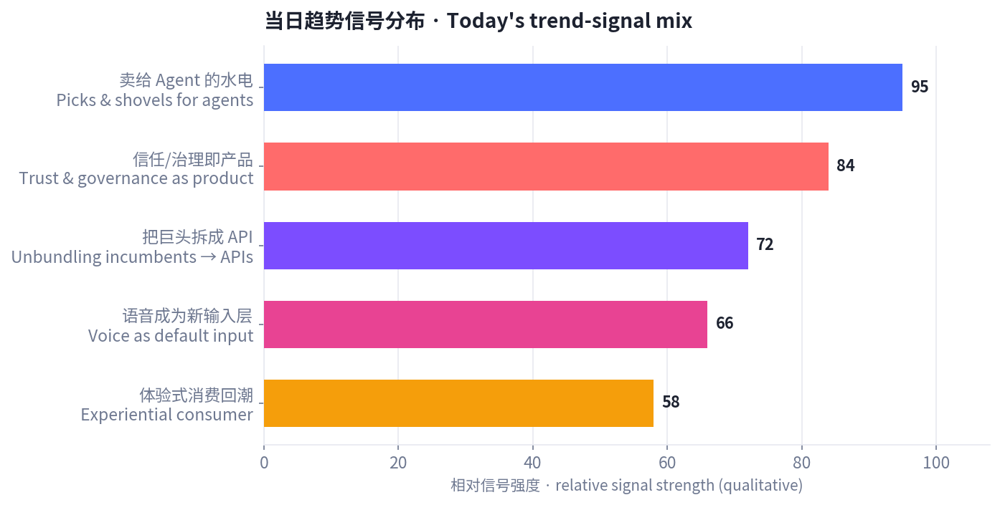
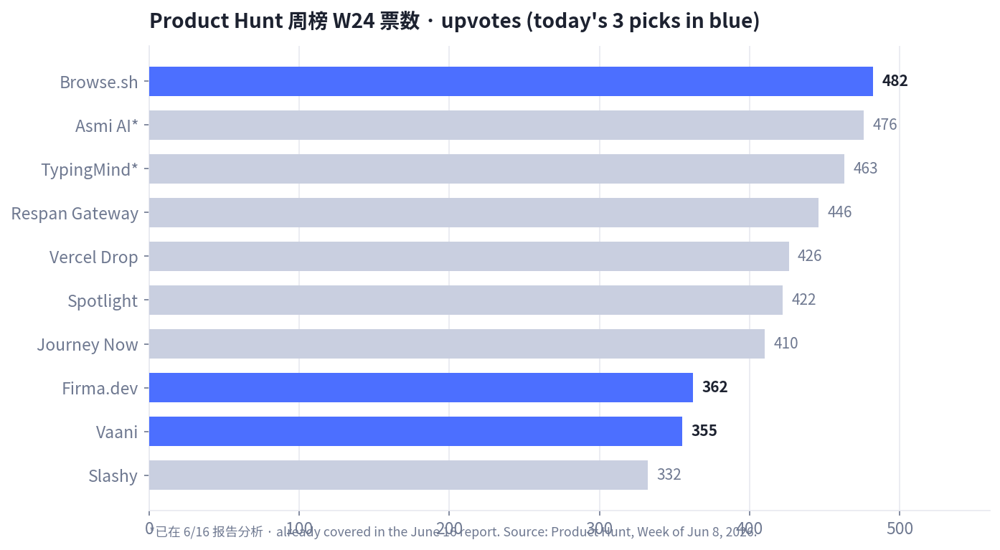
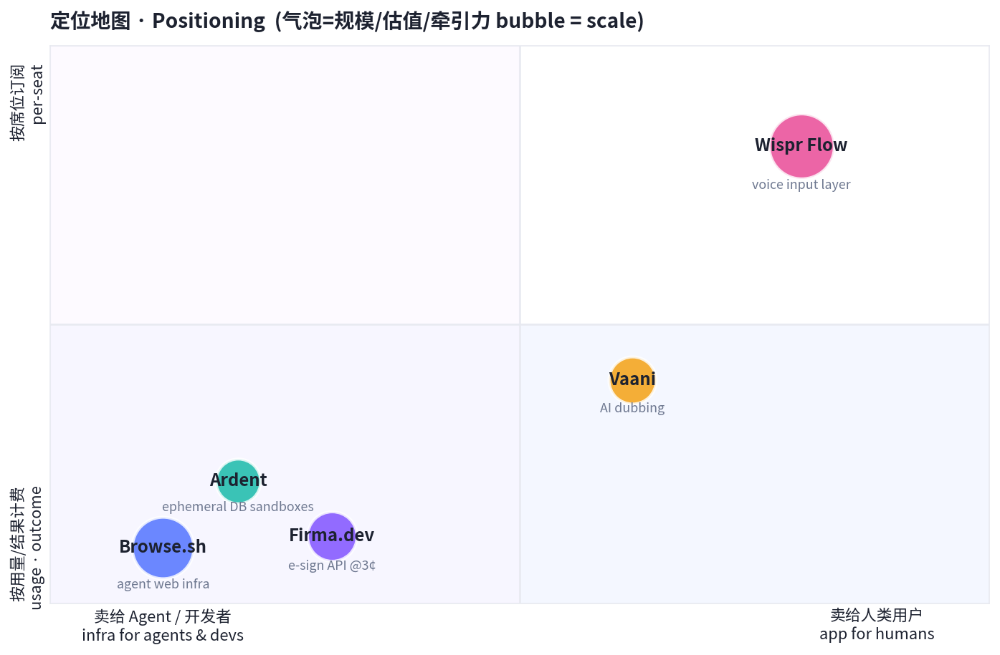
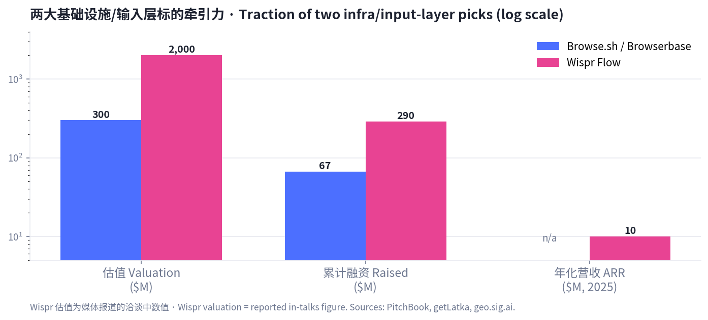

# 每日产品趋势报告 · Daily Product Trends Report
### 2026 年 6 月 17 日 · June 17, 2026

> 数据来源 / Sources: Product Hunt（周榜 W24，6/8–6/14，当前最新已收录榜单）、Hacker News（6 月趋势 + front 快照）、a16z（《Notes on AI Apps in 2026》）、Google Trends（美国）、TikTok/Amazon 热销、小红书/RED 2026 消费趋势、PitchBook / getLatka 等公开数据。
> 方法 / Method: WebSearch + web_fetch 公开数据抓取。Product Hunt 当日（6/15+）日榜与本周 W25 周榜尚未生成，最新已收录为 W24；为避免与 6/16 报告重复（Bond / Publora / Honen / VC Boom / Asmi / TypingMind），今日改选 **W24 未分析过的产品 + HN 发布 + a16z/HN 论点 + 电商/小红书消费信号**。X / LinkedIn / 小红书需登录或客户端渲染，采用公开检索摘要替代（见文末说明）。

---

## ① 当日概览 · Overview

**一句话 / In one line:** 如果说昨天的主线是「AI 替你把事干完」，今天的主线是 **「卖铲子给 AI，而当热度退潮、信任本身成了产品」**——钱正从「会做的 AI」流向 **两端**：一端是给 agent 用的水电管线（浏览器、数据库沙盒、电子签 API、语音输入层），另一端是让 AI 在真实业务里「可被信任、可被审计、可被治理」的能力。

> Today's throughline: if yesterday was *"AI does the work for you,"* today is **"sell shovels to the AI — and as the hype cools, trust itself becomes the product."** Money is rotating to **both ends**: the plumbing agents run on (browsers, DB sandboxes, an e-sign API, a voice input layer), and the layer that makes AI **trustworthy, auditable, and governable** inside real workflows.

五条最强信号 / Five strongest signals:

1. **给 agent 卖水电 / Picks-and-shovels for agents.** 本周最值得看的不是又一个聊天助理，而是 agent 跑起来要用的底座：Browse.sh 给 agent 一双「会用浏览器的手」，Ardent 给它「几秒一个的 Postgres 沙盒」，Firma.dev 把电子签做成 3 美分一封的 API。
2. **从「惊叹」转向「审视」/ From wonder to inspection.** Hacker News 6 月的情绪明显成熟：人们开始追问 AI 生成代码的「隐藏成本」、供应链投毒、工具说关就关。**信任、审计、治理正在变成可售卖的产品**，而不是事后补丁。
3. **把巨头拆成 API / Unbundling incumbents into APIs.** Firma.dev 用 ~99% 的降价把 DocuSign 拆成开发者 API——「巨头的一个功能 = 创业公司的整个产品」正成为 agent 时代的标准打法。
4. **语音成为新的默认输入 / Voice becomes the default input.** Wispr Flow 据报道正以约 20 亿美元估值融资、已进入 270 家世界 500 强——语音听写从「小众工具」变成「人机交互的底层入口」。
5. **体验式消费回潮 / Experiential & feel-first consumption.** TikTok/Amazon 的「居家 SPA 化」与小红书「肤感>成分、穿戴式彩妆、抗老心智空白」同频——实体世界的「体验」与「即时上身感」重新值钱。

今日精选中 Product Hunt 标的票数（蓝色为今日新选）/ Product Hunt upvotes for today's picks (blue = today's new picks)：

定位地图（客户是谁 × 怎么收费，气泡=规模）/ Positioning (who's the customer × how it's monetized, bubble = scale)：

---

## ② 逐个产品深度分析 · Product Deep-Dives

> 共 7 个精选标的：5 个具体产品 + 1 个消费趋势 + 1 个宏观趋势。每节含数据表与链接。
> 7 picks: 5 products + 1 consumer trend + 1 macro trend. Each section has a data table and links.

---

### 1. Browse.sh（Browserbase）— 给 agent 一双会用浏览器的手 / Muscle memory for the web

**Tagline:** *Give your agents muscle memory for automating the web.* · **PH 周榜 W24 #5（482 👍 / 51 💬）**
**链接 / Link:** [Product Hunt](https://www.producthunt.com/products/browserbase) · [browserbase.com](https://www.browserbase.com/)

| 维度 Dimension | 分析 Analysis |
|---|---|
| 商业模式 Business model | 按用量（浏览器分钟数 / 会话）计费的云基础设施：Free → Developer **$20/月** → Startup **$99/月** → 企业 Scale 定制。开发者自助 PLG，用量越大付费越多。Usage-based infra. |
| 核心功能 Core features | 在云端大规模托管 / 运行 / 监控无头浏览器，让 AI agent 像人一样「打开网页、点击、填表、抓数据」；为自动化工作流与网页抓取提供稳定底座。 |
| 成功关键 Key success | 卡位「agent 时代的浏览器层」——agent 要操作真实网页就绕不开它；客户含 **Perplexity、Vercel**，2025 年跑了 **5,000 万次会话**、**1,000+ 客户**，网络效应与可靠性飞轮已起。 |
| 细分市场 Niche | Agent 网页自动化基础设施（browser infrastructure for agents）。 |
| 目标受众 Target | 做 agent / 自动化 / 抓取的开发者与 AI 公司。 |
| 品牌设计 Brand | 「Browse.sh」开发者气质（.sh 命令行联想）；"muscle memory for the web" 一句把抽象基础设施讲成人人能懂的画面。 |
| 产品数据 Data | Series B **$4,000 万 @ $3 亿估值**（2025/06），累计 ~**$6,700 万**；5,000 万会话 / 1,000+ 客户；2024 创立，旧金山。 |
| 口碑 Reviews | 被视为「agent 的 AWS-for-browsers」；隐忧在 Chrome WebMCP 等原生标准（号称省 89% token）可能从底层挤压第三方浏览器基础设施。 |

> **English:** The "browser layer" for the agent era. Usage-based cloud infra (Free/$20/$99/custom) to host and run headless browsers so agents can click, type, and scrape like a human. ~$67M raised (Series B $40M at a $300M valuation, Jun 2025); **50M sessions** across **1,000+ customers** including Perplexity and Vercel. Bull case: picks-and-shovels with a reliability + network flywheel. Bear case: native standards like Chrome's WebMCP could compress third-party browser infra.

---

### 2. Wispr Flow — 把语音变成全平台的默认输入 / Voice as the default input layer

**Tagline:** *Speak naturally, write in your style in every app.* · **PH 趋势产品（"靠转型找到 PMF"）**
**链接 / Link:** [Product Hunt](https://www.producthunt.com/products/wisprflow) · [wisprflow.ai](https://wisprflow.ai/)

| 维度 Dimension | 分析 Analysis |
|---|---|
| 商业模式 Business model | 消费 + 企业订阅：Pro **$15/月**（年付 $12），Free 每周 2,000 词（~每天不到 300 词）做转化钩子。Freemium SaaS，由个人渗透进企业。 |
| 核心功能 Core features | 在任意应用里「说话即成文」，并自动套用你的语气/风格；支持 **100+ 语言**、语音编辑；把听写从「输入法」升级为「跨应用写作层」。 |
| 成功关键 Key success | 押注「语音将成为默认输入」的范式迁移；体验顺滑 + 多语言形成口碑；据报道 **270 家世界 500 强**（含 Nvidia、Amazon）已在用，自下而上渗透。 |
| 细分市场 Niche | 跨应用语音输入 / 听写写作层（voice-first input）。 |
| 目标受众 Target | 重度写作者、开发者、知识工作者、多语言用户。 |
| 品牌设计 Brand | 极简、"flow" 意象（心流 + 流畅）；强调「写出你的风格」而非单纯转写，定位高于普通听写工具。 |
| 产品数据 Data | 2025 年 ~**$1,000 万 ARR**；据报道正以 ~**$20 亿估值**融 ~**$2.6 亿**（Menlo 领投），约为半年前 $7 亿估值的 3 倍；前期累计融资 ~$3,000 万。 |
| 口碑 Reviews | 顺滑度与语音编辑获好评；但 **Trustpilot 仅 2.7/5**，核心争议是**隐私**——为驱动 AI 会**截屏**当前屏幕。强增长与信任赤字并存。 |

> **English:** A bet that **voice becomes the default input**. "Speak, and it writes in your style" across every app; 100+ languages. ~$10M ARR (2025); reportedly raising ~$260M at a **~$2B valuation** (Menlo), ~3× its $700M mark six months prior; **270 Fortune 500** incl. Nvidia & Amazon. The tension: explosive growth vs. a **2.7/5 Trustpilot** and privacy pushback (it screenshots your screen). A textbook "wonder vs. inspection" stock.

---

### 3. Firma.dev — 把 DocuSign 拆成 3 美分一封的 API / E-signature as a primitive

**Tagline:** *Electronic signature API at just ~3¢ per envelope, built for developers.* · **PH 周榜 W24 #14（362 👍 / 43 💬）**
**链接 / Link:** [Product Hunt](https://www.producthunt.com/products/firma-dev) · [firma.dev](https://firma.dev/)

| 维度 Dimension | 分析 Analysis |
|---|---|
| 商业模式 Business model | 按封计费的开发者 API：**€/$0.029（~3 美分）/ 封**，号称比 DocuSign 便宜约 **99%**；免费沙盒（真实文档、无限用量）先用后付。Pure usage API. |
| 核心功能 Core features | 干净的 REST API + 可嵌入的模板/签署编辑器，几小时内把「电子签」嵌进自家产品；托管签署流程；合规覆盖 ESIGN / UETA / GDPR，银行级加密。 |
| 成功关键 Key success | 经典「把巨头的一个功能做成创业公司的整个产品」——用极致降价 + 开发者体验，吃 DocuSign 价格与集成痛点；天然适配「agent 要自动发起签署」的新场景。 |
| 细分市场 Niche | 开发者电子签基础设施（API-first e-signature）。 |
| 目标受众 Target | SaaS / 初创开发者、需要在产品内嵌签署的团队、自动化/agent 工作流。 |
| 品牌设计 Brand | `.dev` 域名 + "$0.029" 直接打在脸上的定价叙事；文档优先、沙盒优先，降低试用门槛。 |
| 产品数据 Data | PH W24 **#14**，**362** 票 / 43 评论；联合创始人 Derick；定价 €0.029/封。 |
| 口碑 Reviews | 被赞「开发者版 DocuSign、几乎免费」；疑虑在企业级法务背书、长期可靠性与「低价能否养活合规成本」。 |

> **English:** Unbundling DocuSign into a **3¢-per-envelope API**, ~99% cheaper, developer-first (clean REST, embeddable editors, free sandbox, ESIGN/UETA/GDPR). The "one feature of an incumbent = a startup's whole product" playbook — and a natural fit for agents that need to *initiate* signatures programmatically. Open questions: enterprise legal trust and whether rock-bottom pricing covers compliance cost.

---

### 4. Ardent（YC P26）— 几秒一个、零迁移的 Postgres 沙盒 / Postgres sandboxes in seconds

**Tagline:** *Postgres sandboxes in seconds, with zero migration.* · **Launch HN（87 👍 / 35 💬，捕获时）**
**链接 / Link:** [Hacker News](https://news.ycombinator.com/item?id=48124436) · [tryardent.com](https://www.tryardent.com/)

| 维度 Dimension | 分析 Analysis |
|---|---|
| 商业模式 Business model | 开发者基础设施，预计按用量 / 沙盒数计费（YC P26 早期）。Dev-infra, usage-based. |
| 核心功能 Core features | 几秒拉起一个隔离的 Postgres 沙盒、**零迁移**接入现有库；适合测试、预览环境、以及给「会自己改数据库」的编码 agent 一个安全可丢弃的实验场。 |
| 成功关键 Key success | 精准踩中 HN 6 月最强信号之一——**「安全/隔离的开发环境正从配角变成一个独立品类」**；coding agent 越自动，越需要可隔离、可回滚、可审计的环境。 |
| 细分市场 Niche | 临时 / 隔离开发环境（ephemeral dev environments for agents）。 |
| 目标受众 Target | 工程团队、做编码 agent 的公司、需要预览/测试库的 SaaS。 |
| 品牌设计 Brand | "Ardent" + tryardent.com，YC P26 背书；"zero migration" 直击采用门槛。 |
| 产品数据 Data | Launch HN **87 票 / 35 评论**（捕获时），YC P26 批次。 |
| 口碑 Reviews | HN 讨论聚焦「秒级 + 零迁移」是否真成立、与 Neon/Supabase 分支功能的差异；正面在于「给 agent 一个安全沙盒」的时机正好。 |

> **English:** Spin up an isolated Postgres sandbox in seconds with **zero migration** — for tests, preview envs, and giving autonomous coding agents a safe, disposable place to touch a database. It lands squarely on HN's strongest June signal: **secure/isolated dev environments are becoming their own category** as coding agents get more autonomous. Debate centers on how it differs from Neon/Supabase branching.

---

### 5. Vaani — 给创作者和品牌的对口型 AI 配音 / Lip-synced AI dubbing

**Tagline:** *Lip-synced AI dubbing for creators, brands and studios.* · **PH 周榜 W24 #15（355 👍 / 28 💬）**
**链接 / Link:** [Product Hunt](https://www.producthunt.com/products/vaani-2)

| 维度 Dimension | 分析 Analysis |
|---|---|
| 商业模式 Business model | 推测为按分钟 / 订阅的创作者 SaaS（公开财务数据有限）。Creator SaaS（limited public data）. |
| 核心功能 Core features | AI 把视频配音翻译成多语言并**对口型**（lip-sync），让一条内容低成本本地化到多市场；面向创作者、品牌、工作室。 |
| 成功关键 Key success | 吃「内容全球化 + 短视频本地化」红利；对口型解决了传统配音「声画不同步」的体验硬伤，契合品牌出海与创作者多语言分发刚需。 |
| 细分市场 Niche | AI 生成媒体 / 视频本地化（AI dubbing & localization）。 |
| 目标受众 Target | 出海品牌、跨语言创作者、MCN / 工作室。 |
| 品牌设计 Brand | "Vaani"（梵语「声音/言语」）名字有文化质感；定位「creators + brands + studios」覆盖 C 到 B。 |
| 产品数据 Data | PH W24 **#15**，**355** 票 / 28 评论。（其余量化数据公开有限，本节以品类与 PH 信号为主。） |
| 口碑 Reviews | 关注点在口型自然度、音色保真与多语言质量；与 HeyGen / ElevenLabs dubbing 等正面竞争。 |

> **English:** AI dubbing with **lip-sync** so one video localizes cheaply into many languages — for creators, brands, and studios. Rides content-globalization + short-video localization; lip-sync fixes the classic "audio doesn't match the mouth" experience gap. Public financials are limited, so this section leans on category + PH signal. Competes with HeyGen / ElevenLabs dubbing.

---

### 6. 消费趋势：体验式 + 「上身感优先」/ Consumer trend: experiential & feel-first

**信号来源 / Signals:** TikTok「TikTok made me buy it 2026」、Amazon 热销、小红书 / RED 2026 消费趋势、Google Trends（美国）。

| 维度 Dimension | 分析 Analysis |
|---|---|
| 商业模式 Business model | DTC / 电商 + 内容种草飞轮：短内容拉新即时种草，深内容建立信任完成「心智占领」。Content-commerce flywheel. |
| 核心功能 Core features | **居家 SPA 化** 硬件（带灯 + 蓝牙音箱的智能镜、香薰机、「会按摩的花洒」、真空封口机）+ **傻瓜式/穿戴式美妆**（极致降低使用门槛）。 |
| 成功关键 Key success | ① 视觉冲击：「一张上脸前后对比图 > 一千句文案」；② 降低使用门槛即可引爆；③ **IP 联名 / 游戏化** 是社交传播核武器；④ 兴趣驱动（「为一场演出赴一座城」）。 |
| 细分市场 Niche | 居家体验升级 + 低门槛美妆 + **抗老心智空白**（讨论热度极高、深耕品牌少）。 |
| 目标受众 Target | Z 世代 / 都市女性 / 远程工作者；追求「即时体验」与「确定性结果」的消费者。 |
| 品牌设计 Brand | 小红书审美：信息卡片化、清新/高级感、强对比；命名与视觉主打「肤感 / 质地 / 仪式感」。 |
| 产品数据 Data | 小红书：护肤「肤感/质地」讨论度已**压过「成分」**；抗老需求热但供给少；Google Trends 美国上升词含 Costco(+4,600%)、"2026"(+1,500%)、Stranger Things(+400%)。 |
| 口碑 Reviews | 「上身/上脸即买单」；用户对「成分党」疲劳，转向「体感、质地、即时效果」与「省时间的傻瓜式」。 |

> **English:** Against the AI-infra current runs a consumer one: **experiential + feel-first** consumption. TikTok/Amazon push at-home "spa-ification" (smart mirrors with light+speaker, diffusers, "massaging" shower heads, vacuum sealers); Xiaohongshu shows **"feel/texture" now outranks "ingredients"** in skincare, **foolproof/wearable** makeup ignites fastest, and **anti-aging is a mindshare whitespace** (high heat, few committed brands). Visual before/after + IP co-brands / gamification are the spread engines.

---

### 7. 宏观趋势：从惊叹到审视——信任与判断成为产品 / Wonder → inspection

**信号来源 / Signals:** a16z《Notes on AI Apps in 2026》(Anish Acharya)、Hacker News 6 月趋势、agent 基础设施融资。

| 维度 Dimension | 分析 Analysis |
|---|---|
| 商业模式 Business model | 「按结果/工作量计费」取代「按席位」；agent 越自动，越愿为**确定性结果**付费（outcome pricing）。 |
| 核心功能 Core features | a16z：工具正从「做（making）」转向「想（thinking）」——难题从「怎么做」变成「**做什么**」；每个职能（法务/财务/HR）都要变成「软件团队」。HN：**安全开发环境、审计链、人审、可治理**正成为独立品类。 |
| 成功关键 Key success | 「让 AI 在真实业务里**可被信任、可生存**」比「再做一个 wrapper」更值钱；供应链投毒（恶意 npm/PyPI 包）与「工具说关就关」推动买家从「惊叹」转向「证明给我看」。 |
| 细分市场 Niche | 信任层 / 治理层 / 评测与可观测性（trust & governance for AI）。 |
| 目标受众 Target | 企业买家、平台团队、被「shutdown 疲劳」教育过的技术决策者。 |
| 品牌设计 Brand | 叙事从「魔法 / wow」转向「可靠 / 可审计 / 不会突然停服」；"every team is a software team"。 |
| 产品数据 Data | agent 市场 ~$78 亿(2025)→~$526 亿(2030) 区间估计；基础设施融资：Mem0 $24M、Arize $70M、Braintrust $80M；Anthropic 收购 Vercept；超大厂 2026 资本开支指引 >$3,200 亿。 |
| 口碑 Reviews | HN 共识：「2026 最大机会不是再做一个 AI app，而是让 AI 在真实工作流里**可生存**」——安全、溯源、审查、权限、给非技术人的白话界面。 |

> **English:** The meta-story tying it together. a16z: tools shift from **making** to **thinking** ("what to build" is the hard part); "every team should be a software team." HN June: the mood moved from **wonder to inspection** — secure dev environments, audit trails, human review, and governance are becoming product categories, driven by AI-assisted supply-chain attacks and "shutdown fatigue." The biggest 2026 opportunity isn't another app — it's making AI **survivable** inside real workflows. Pricing shifts from per-seat to **outcome-based**.

---

## ③ 横向对比表 · Cross-Comparison

| 产品 Product | 类别 Category | 商业模式 Model | 关键数据 Key data | 目标受众 Target | 链接 Link |
|---|---|---|---|---|---|
| **Browse.sh** | Agent 浏览器基础设施 | 用量计费 $20–$99+ | ~$67M 融资 / $300M 估值；50M 会话；1,000+ 客户 | Agent / 自动化开发者 | [link](https://www.browserbase.com/) |
| **Wispr Flow** | 语音输入层 | Freemium $15/月 | ~$10M ARR；据报 ~$2B 估值融资；270 家 F500 | 写作者 / 知识工作者 | [link](https://wisprflow.ai/) |
| **Firma.dev** | 电子签 API | 按封 ~3¢ | 比 DocuSign 便宜 ~99%；PH #14（362） | SaaS / 初创开发者 | [link](https://firma.dev/) |
| **Ardent** | 开发环境基础设施 | 用量计费（早期） | Launch HN 87 票；YC P26；零迁移 | 工程 / 编码 agent 团队 | [link](https://www.tryardent.com/) |
| **Vaani** | AI 配音 / 本地化 | 创作者 SaaS（推测） | PH #15（355） | 出海品牌 / 创作者 | [link](https://www.producthunt.com/products/vaani-2) |
| **体验式消费** | DTC / 电商趋势 | 内容种草飞轮 | 肤感>成分；抗老空白；Costco +4,600% | Z 世代 / 都市女性 | [RED](https://www.xiaohongshu.com/) |
| **信任即产品** | 宏观 / 投资主题 | 按结果计费 | agent 市场 ~$7.8B→$52.6B (2025→2030)；infra 融资活跃 | 企业 / 平台买家 | [a16z](https://a16z.com/notes-on-ai-apps-in-2026/) |

两大基础设施/输入层标的牵引力对比 / Traction of the two infra/input-layer picks：

---

## ④ 关键洞察与共性总结 · Key Insights & Common Patterns

**1. 卖铲子比淘金更稳：钱在 agent 的「水电层」。/ Sell shovels, not gold.**
今天 5 个产品里有 4 个不直接服务终端消费者，而是服务「跑 agent 的人 / agent 本身」——浏览器（Browse.sh）、数据库沙盒（Ardent）、电子签 API（Firma.dev）、语音输入（Wispr）。超大厂 2026 资本开支指引超 $3,200 亿、Mem0/Arize/Braintrust 等基础设施轮持续，印证「picks-and-shovels」是当下确定性最高的位置。
> 4 of today's 5 products serve *the people (or agents) running agents*, not end consumers. Infra is where the durable money is.

**2. 「巨头的一个功能 = 创业公司的整个产品」。/ One incumbent feature = a whole startup.**
Firma.dev 把 DocuSign 拆成 3 美分 API，Browse.sh 把「浏览器」拆成 agent 可调用的服务。极致单点 + 开发者体验 + 用量计费，是 agent 时代的标准拆解打法。
> Unbundle one painful feature, price it per-use, win developers.

**3. 增长与信任在背离——这正是机会。/ Growth and trust are diverging — that's the opening.**
Wispr 一边冲 $2B 估值，一边 Trustpilot 只有 2.7/5（截屏隐私）。HN 6 月情绪从「惊叹」转向「审视」。谁能在高增长的同时补上**信任、隐私、可审计**，谁就能穿越这轮「证明给我看」的周期。
> Wispr races to a $2B valuation while sitting at 2.7/5 on trust. Whoever closes the trust gap wins the "prove it" cycle.

**4. 收费从「按席位」转向「按结果」。/ From per-seat to per-outcome.**
Browse.sh 按浏览器分钟、Firma.dev 按封、Ardent 按用量——当干活的是 agent 而非「登录的人」，席位订阅失去意义，用量/结果计费成为默认。
> When the worker is an agent, seats stop making sense; usage/outcome billing becomes default.

**5. 别忘了离屏幕最远的钱：体验式消费。/ Don't forget the money farthest from the screen.**
当科技圈卷 agent 基础设施时，消费端在为「上身感、仪式感、确定性结果」付费（居家 SPA、傻瓜式美妆、抗老空白）。a16z 的「thinking vs making」与小红书的「肤感>成分」是同一枚硬币：**人要的是判断与体验，把执行交给工具。**
> While tech piles into agent infra, consumers pay for *feel, ritual, and certain outcomes*. "Thinking vs making" and "feel over ingredients" are the same coin.

---

### 方法与局限 · Methodology & Limitations
- Product Hunt 当日（6/15 起）日榜与 W25 周榜在抓取时尚未生成，**最新已收录榜单为 W24（6/8–6/14）**；为避免与 6/16 报告重复，今日刻意选取 W24 中**未被分析过**的产品（Browse.sh / Firma.dev / Vaani）并补充 HN 发布（Ardent）、PH 趋势产品（Wispr Flow）与 a16z/HN 论点。
- **X / LinkedIn / 小红书**为登录或客户端渲染，无法直接抓取，依据任务要求改用 **WebSearch 公开摘要**；相关口碑/趋势为公开检索综合，非平台内实时抓取。
- 融资 / 估值数据（尤其 Wispr ~$2B）为**媒体报道的洽谈中数值**，以来源为准，非确定性事实。
- 图片为本地生成的数据图表；产品 logo 见 HTML 版。
- 本报告为信息汇总与趋势分析，非投资建议。Not investment advice.

### 来源 · Sources
- Product Hunt — Week of Jun 8, 2026 (W24): https://www.producthunt.com/leaderboard/weekly/2026/24
- a16z — Notes on AI Apps in 2026: https://a16z.com/notes-on-ai-apps-in-2026/
- Hacker News Trends, June 2026: https://blog.mean.ceo/hacker-news-trends-june-2026/
- Browserbase (PitchBook / pricing / revenue): https://www.browserbase.com/pricing
- Wispr Flow (getLatka / reviews): https://getlatka.com/companies/wisprflow.ai
- Firma.dev: https://www.producthunt.com/products/firma-dev · https://firma.dev/
- Vaani: https://www.producthunt.com/products/vaani-2
- Ardent (Launch HN, YC P26): https://news.ycombinator.com/item?id=48124436
- Picks-and-shovels / agent economy: https://primitivesai.substack.com/p/the-ai-agent-infrastructure-stack
- 小红书 2026 经营趋势: https://www.woshipm.com/share/6360769.html
- TikTok/Amazon trending 2026: https://www.accio.com/business/tiktok-hot-selling-2026
- Google Trends (US): https://trends.google.com/trends
