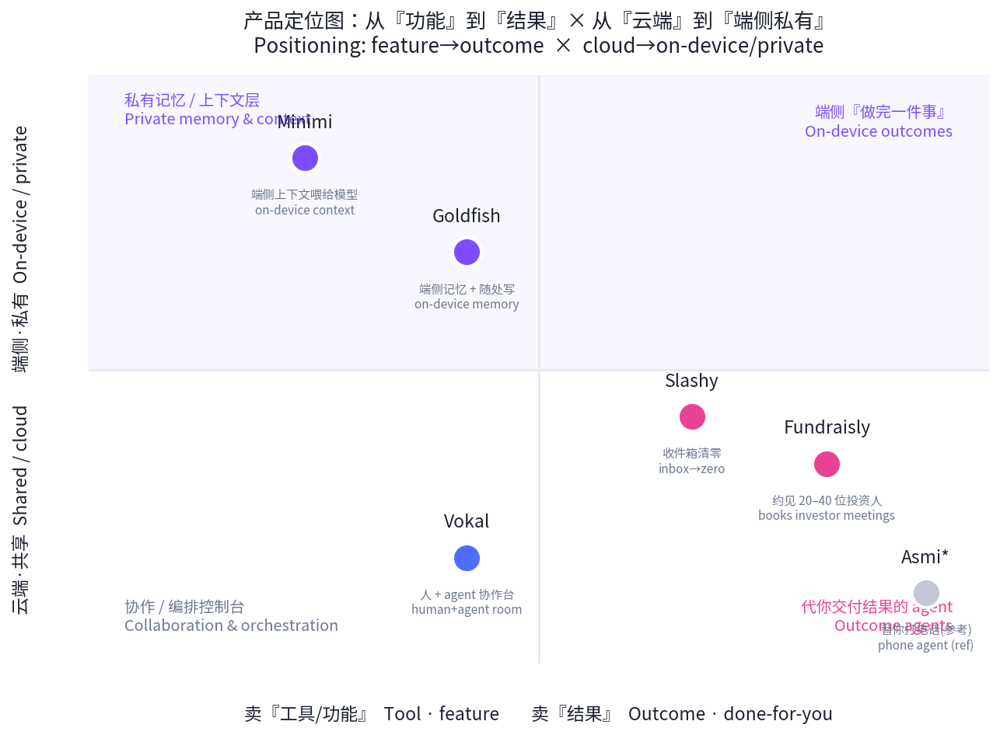
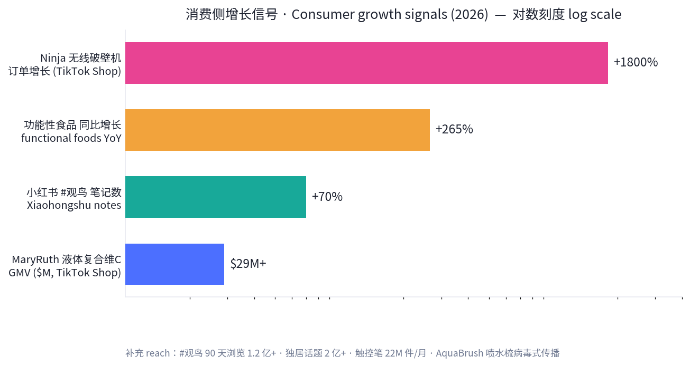
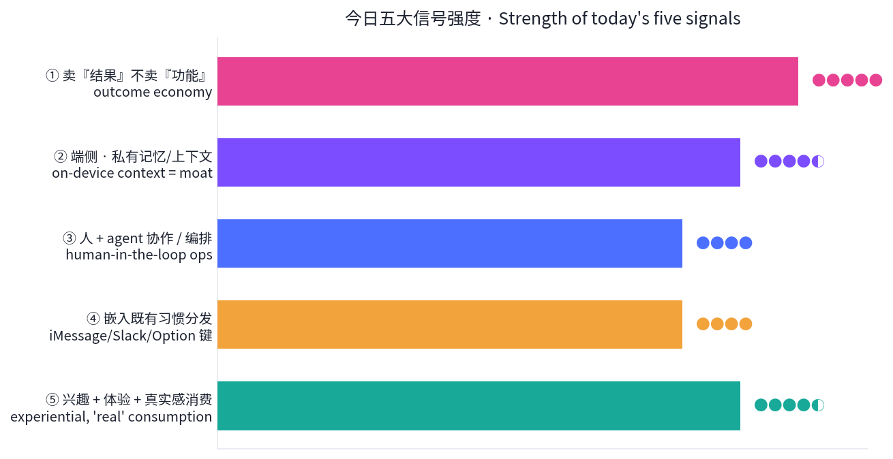

# 每日产品趋势报告 · Daily Product Trends Report
### 2026 年 6 月 18 日 · June 18, 2026

> **数据来源 / Sources:** Product Hunt（W24 周榜 6/8–6/14、6/14 日榜）、Hacker News（6 月趋势 + front 快照）、a16z（Big Ideas 2026 / a16z Speedrun「Fat Startups」）、TikTok Shop / Amazon 热销、小红书 2026 兴趣消费趋势、公开检索摘要。
> **方法 / Method:** WebSearch + web_fetch 抓取公开数据。X / LinkedIn / 小红书需登录或客户端渲染，采用公开检索摘要替代。为保证每日新意，已**排除 6/14–6/17 已深度分析过的产品**（Asmi、Honen、Bond、Publora、VC Boom、Browse.sh、Wispr Flow、Vaani、Firma.dev、Ardent 等），今日只选**近 7 天未分析过的新产品**。Product Hunt 月度聚合「票数」（如 40 万+）为第三方聚合器累计值，**非单次上线 upvotes**，本报告不予采信，只引用可核实的单次上线数据。

---

## ① 当日概览 · Overview

**一句话 / In one line：** 如果说本周早些时候的主线是「给 agent 卖水电」，今天的主线是 **「教 AI 记住你」——当 agent 开始交付『结果』而非『功能』，私有的记忆与上下文成了新护城河。**

> Today's throughline: earlier this week was *"sell shovels to the agents."* Today it's **"teach AI to remember you" — as agents start shipping _outcomes_ instead of _features_, private memory & context become the moat.**

钱正沿着两条相反却互补的路在走：

1. **一端是「代你把事做完」的结果型 agent**——Fundraisly 把「融资」做成可交付的结果（替你约见 20–40 位投资人）；Slashy 把「收件箱清零」做成结果；这正是 a16z 本月反复强调的 **「Fat Startup 交付结果，而不是功能」**。
2. **另一端是「让 AI 真正懂你」的端侧、私有上下文层**——Goldfish、Minimi 把你的工作记忆留在本机、私有不上云，再喂给模型。把 **隐私本身做成卖点**，呼应 Hacker News 6 月「从惊叹转向审视」的主线（信任、治理、端侧）。
3. **中间是「人 + agent」的协作 / 编排控制台**——Vokal 让人和各家 agent（Codex / Claude Code / Hermes）在同一空间里对齐目标、分派、围观、复核。
4. **消费端则是兴趣 + 体验 + 真实感**——TikTok Shop 的「内容即货架」与小红书的「鸟门」「真实失控」式种草，把情绪价值与场景共鸣变成转化。

> The money is moving down two opposite-but-complementary paths: **(1) outcome agents that do the job for you** (Fundraisly books your investor meetings; Slashy takes your inbox to zero) — exactly a16z's *"fat startups ship outcomes, not features"*; **(2) a private, on-device context layer that makes AI actually understand you** (Goldfish, Minimi keep your working memory local and feed it to the model — privacy as the feature), echoing HN's *"wonder → inspection"* turn toward trust and governance. In between sits the **human + agent control room** (Vokal). On the consumer side: interest-, experience- and authenticity-driven demand (TikTok "shoppertainment", Xiaohongshu's birdwatching boom).

**五条最强信号 / Five strongest signals**

1. **卖「结果」不卖「功能」/ Outcomes, not features.** Fundraisly 不卖「投资人数据库」，卖「20–40 场已约好的投资人会议」；Slashy 不卖「邮件插件」，卖「收件箱清零」。a16z：*AI 干活、你担保结果、客户为结果付费*。
2. **端侧 + 私有记忆成护城河 / On-device memory is the moat.** Goldfish、Minimi 把「记住你」做成产品，且强调 **on-device / private**——隐私从合规项变成差异化卖点。
3. **人在环上、不在环外 / Human on the loop.** Vokal 把多 agent 协作做成「可围观、可复核」的工作台，正中 HN「要可审计、可治理」的情绪。
4. **嵌入既有习惯分发 / Distribution via existing habits.** Slashy 从 iMessage/Slack 发邮件、Goldfish 用 Option 键随处唤起——不教用户用新 app，而是寄生在旧习惯里。
5. **消费回到兴趣与真实 / Consumption returns to interest & authenticity.** 「鸟门」90 天浏览 1.2 亿+、笔记 +70%；TikTok Shop 靠「shoppertainment」把演示与故事变成高转化。

---

## ② 逐个产品深度分析 · Product Deep-Dives

### 1. Fundraisly — 替你约见投资人的「融资 agent」/ The fundraising agent that books your meetings

把创始人最痛、最不愿做的环节——找对投资人、要到会面——做成一个**可交付结果**的 agent。它分析 30 万+ 投资人与数百万笔交易，筛出正在你赛道出手的人，再从你自己的人脉里**画出温暖引荐路径**，剩下的用精准冷启动补齐，目标产出 **20–40 场合格投资人会议**。创始人 Anna 曾在管理规模 6 亿美元+ 的基金做 2.5 年投资分析师（所投组合含 10 家独角兽），团队「由累计募资超 10 亿美元的创始人打造」。本周 Product Hunt **launch week 第一名**。

> Fundraisly turns the part founders hate most — finding the right investors and getting the meeting — into a *delivered outcome*. It analyzes 300K+ investors and millions of deals, surfaces who's actively investing in your space, maps warm intro paths from your own network, then fills the gap with targeted cold outreach. Target output: **20–40 qualified investor meetings.** #1 product of its launch week.

| 维度 Dimension | 分析 Analysis |
|---|---|
| 商业模式 Business model | 自定义定价（疑似按结果/席位）；卖「约好的会议」这一结果，而非数据订阅。Custom pricing; sells *booked meetings*, an outcome — not a data subscription. |
| 核心功能 Core value | 投资人匹配 + 人脉温暖路径图 + 冷启动外联 + 自动约会面。Investor matching + warm-path graph + cold outreach + meeting booking. |
| 细分市场 Niche | 早期创业公司融资（Pre-seed→A）。Early-stage startup fundraising. |
| 目标受众 Audience | 没有强投资人网络的一线创始人。Founders without a strong investor network. |
| 品牌设计 Brand | 命名直白（Fund-raise-ly）；信任锚点 = 创始人 VC 出身 + 「募资 10 亿美元」背书。Trust = ex-VC founder + "$1B raised" credibility. |
| 产品数据 Data | 30 万+ 投资人；20–40 场会议；PH 上线周 #1；1,700+ 关注；5.0★(3)。300K+ investors; 20–40 meetings; #1 of week; 1.7k followers; 5.0★(3). |
| 链接 Link | [producthunt.com/products/fundraisly](https://www.producthunt.com/products/fundraisly) |

### 2. Slashy — 替你处理邮件的 AI 邮箱 / The AI assistant that does email for you

AI 原生邮件客户端：用**你的语气**起草回复、自动分流、不让任何跟进掉链子。它接入邮箱、日历、CRM、会议纪要，学习你的工作方式，于是你可以让它「帮我备会、写跟进、把收件箱清零、列出谁还欠我回复」，甚至**从 iMessage 或 Slack 直接发邮件**。6 月 14 日上线即拿下 **当日 Product Hunt 第一**，416 upvotes、113 评论。

> Slashy drafts replies *in your voice*, triages what matters, and makes sure no follow-up slips. It connects email, calendar, CRM and meeting notes, then lets you prep for a meeting, draft a follow-up, hit inbox-zero, or fire off mail from iMessage/Slack. **#1 Product of the Day (June 14): 416 upvotes, 113 comments.**

| 维度 Dimension | 分析 Analysis |
|---|---|
| 商业模式 Business model | 预计个人/团队订阅制（SaaS）。Likely prosumer/team subscription. |
| 核心功能 Core value | 以「你的语气」起草 + 智能分流 + 跟进追踪 + 跨端（iMessage/Slack）触发。Voice-matched drafting + triage + follow-up tracking + cross-app triggers. |
| 细分市场 Niche | 邮件重度的创始人/销售/BD。Email-heavy founders, sales, BD. |
| 目标受众 Audience | 收件箱即工作面的知识工作者。Knowledge workers who live in the inbox. |
| 品牌设计 Brand | 「/」斜杠命名暗示命令式、轻量；定位「does email *for* you」（替你做，非辅助你做）。Name implies command-driven; "does it *for* you". |
| 产品数据 Data | 416 upvotes / 113 评论 / 当日 #1；竞争话题（Email+AI+助手）共 52.4 万关注。416 up / 113 comments / #1; category 523.8k followers. |
| 链接 Link | [producthunt.com/products/slashy-3](https://www.producthunt.com/products/slashy-3) |

### 3. Vokal — 人和 AI agent 的协作空间 / A workspace for 10x teammates and their agents

当每个人都带着自己的 agent（本地 Codex、Claude Code、Hermes，或云端）来上班，混乱就开始了。Vokal 把人和这些 agent 放进**同一个实时空间**：对齐目标 → 分派给合适的 agent → 围观它干活 → 在上下文里复核 → 把有用的产出存下来给下次用。这是典型的 **「人在环上」编排层**，正面回应 Hacker News 6 月对「可审计、可治理、有人复核」的强烈诉求。

> Vokal brings teammates and their agents (local Codex, Claude Code, Hermes, or cloud) into one live workspace: align the goal, assign the right agent, watch the work, review in context, and save useful outputs for next time. A textbook **human-on-the-loop orchestration layer** — directly answering HN's June demand for auditable, governed, human-reviewed AI.

| 维度 Dimension | 分析 Analysis |
|---|---|
| 商业模式 Business model | 预计团队席位订阅。Likely per-seat team subscription. |
| 核心功能 Core value | 多 agent 统一工作台 + 任务分派 + 实时围观 + 上下文复核 + 产出复用。Multi-agent workspace + assignment + live watch + in-context review + reusable outputs. |
| 细分市场 Niche | 用编码/研究 agent 的工程与产品团队。Eng/product teams running coding & research agents. |
| 目标受众 Audience | 已被「一堆各跑各的 agent」搞乱的团队。Teams drowning in scattered agents. |
| 品牌设计 Brand | 「Vokal」（vocal）暗示对齐、发声、协同；定位 collaboration space。Implies alignment & shared voice. |
| 产品数据 Data | 兼容 Codex/Claude Code/Hermes；单次 upvotes 未披露，列入 PH 6 月趋势榜。Runs Codex/Claude Code/Hermes; per-launch upvotes n/d. |
| 链接 Link | [producthunt.com/products/vokal-2](https://www.producthunt.com/products/vokal-2) |

### 4. Goldfish — 端侧记住你、随处帮你写 / It privately remembers your work, then writes with you anywhere

名字是个反讽——金鱼七秒记忆，这个产品却**私有地记住你在 Mac 上做过的一切**。在任意输入框按 **Option 键**，它就能起草回复、总结会话、改写句子、回忆你近期工作里的关键细节——**无需复制粘贴、无需重述前因后果**。卖点是把「记忆」和「随处可用」绑在一起，且强调 **private / on-device**。

> An ironic name (a goldfish forgets in seconds): Goldfish *privately remembers what you've been working on across your Mac*. Press **Option** in any text field to draft, summarize, rewrite, or recall key details from recent work — no copy-paste, no re-explaining. Memory + write-anywhere, kept **private/on-device**.

| 维度 Dimension | 分析 Analysis |
|---|---|
| 商业模式 Business model | 预计个人订阅（Mac 应用）。Likely consumer subscription (Mac app). |
| 核心功能 Core value | 私有跨应用记忆 + Option 键随处唤起 + 起草/总结/改写/回忆。Private cross-app memory + Option-key everywhere + draft/summarize/rewrite/recall. |
| 细分市场 Niche | Mac 重度写作/沟通者。Mac-based heavy writers/communicators. |
| 目标受众 Audience | 厌倦反复「喂背景」给 AI 的人。People tired of re-feeding context to AI. |
| 品牌设计 Brand | 反差命名（金鱼=健忘 vs 永不忘）；隐私优先叙事。Contrarian name + privacy-first story. |
| 产品数据 Data | 端侧/私有；PH 6 月热门；第三方月度聚合票数不可比，从略。On-device; trending June; aggregator tallies excluded. |
| 链接 Link | [producthunt.com/products/goldfish](https://www.producthunt.com/) |

### 5. Minimi — 把端侧上下文喂给模型的「私有记忆」/ On-device context that gives your model the full picture

和 Goldfish 同源、却更偏「底座」：Minimi **在你的 Mac 上聆听**文档、通话、消息、标签页，把这些上下文**全在本机、私有地**整理好，再「把完整画面交给 Claude」。它本质是 **AI 的私有上下文/记忆层**——模型还是别人的，但「懂你」的那部分留在你手里。两款一起，构成今天最清晰的反向潮流：**算力上云，记忆下沉到端。**

> Minimi *listens across your Mac* — docs, calls, messages, tabs — and gives Claude the full picture, all **on-device and private.** It's the **private context/memory layer for AI**: the model stays someone else's, but the part that *knows you* stays yours. Together with Goldfish it forms today's clearest counter-current: **compute goes to the cloud, memory comes down to the device.**

| 维度 Dimension | 分析 Analysis |
|---|---|
| 商业模式 Business model | 预计个人订阅 + 「自带模型」（接 Claude）。Likely subscription + BYO-model (Claude). |
| 核心功能 Core value | 端侧聆听/聚合上下文 + 隐私保护 + 喂给前沿模型。On-device context capture + privacy + feed to frontier model. |
| 细分市场 Niche | 重视隐私的 AI 重度用户。Privacy-conscious AI power users. |
| 目标受众 Audience | 想要「懂我」又不想上传一切的人。Want "it knows me" without uploading everything. |
| 品牌设计 Brand | 「Minimi」= mini + me，「小小的我」；极简、隐私叙事。"mini-me"; minimal, privacy framing. |
| 产品数据 Data | on-device、private；接 Claude；PH 6 月热门。On-device; pairs with Claude; trending June. |
| 链接 Link | [producthunt.com/products](https://www.producthunt.com/products) |

### 6. 消费趋势 · TikTok Shop「内容即货架」/ Consumer trend: shoppertainment

实体好物这边，增长由 **「shoppertainment（内容即货架）」** 驱动——靠视觉演示 + 情绪故事把「看到」直接变成「下单」。代表信号：**Ninja 无线破壁机订单 +1,800%**；MaryRuth 液体复合维生素 **GMV $29M+**、功能性食品 **同比 +265%**；Homeika 无线吸尘器 + Wyze 摄像头合计 **$25M+ GMV**；触控笔 **22M 件/月**；以及病毒式的 **AquaBrush 喷水梳**（梳子 + 喷雾二合一）。共性：**单一痛点 + 可演示 + 即时「上手感」。**

> On physical goods, growth is driven by **shoppertainment** — visual demos + emotional story turning "saw it" into "bought it." Signals: Ninja Cordless Blender orders **+1,800%**; MaryRuth's Liquid Multivitamin **$29M+ GMV**, functional foods **+265% YoY**; Homeika vacuum + Wyze Cam **$25M+ GMV**; stylus pens **22M units/mo**; viral **AquaBrush** 2-in-1 spray hairbrush. Pattern: **one sharp pain + demoable + instant payoff.**

| 维度 Dimension | 分析 Analysis |
|---|---|
| 商业模式 Business model | TikTok Shop 达人带货 + 短视频/直播即货架。Creator-led TikTok Shop + video/live as storefront. |
| 核心功能 Core value | 可演示的单点价值（破壁/喷水/吸尘/补剂）。Demoable single-point value. |
| 细分市场 Niche | 家居小电、个护、功能性食品。Home gadgets, personal care, functional foods. |
| 目标受众 Audience | 被短视频驱动的冲动 + 自我关怀型买家。Impulse + self-care buyers driven by short video. |
| 产品数据 Data | Ninja +1,800%；MaryRuth $29M+ GMV；功能食品 +265%；触控笔 22M/月。 |
| 链接 Link | [TikTok 趋势商品 2026](https://www.tiktok.com/discover/trending-products-2026) · [cjdropshipping 榜单](https://cjdropshipping.com/blogs/winning-products/TikTok-Viral-products-2026) |

### 7. 小红书趋势 · 「鸟门」与自然探索 / Xiaohongshu: the birdwatching boom & "real" lifestyle

中国消费内容这边，最强的不是某件商品，而是 **兴趣圈层 + 自然探索 + 真实感**。**#观鸟 近 90 天浏览 1.2 亿+、笔记 +70%**，「鸟门」成为年轻人的新潮户外；它和「拼豆（手作疗愈）」「轻运动」一起，构成 **轻身体 / 手作疗愈 / 自然探索** 三大兴趣赛道。与此同时，**独居话题浏览 2 亿+，内容从「精致 vlog」转向「真实失控」**——越真诚、越沉浸，反而越好带货（>60% 创作者觉得商业内容「难」，但真诚共鸣时用户会主动求购）。叠加平台红利：**0 粉开店、前 100 万 GMV 免佣**。

> In China, the strongest signal isn't one product but **interest-tribes + nature-exploration + authenticity.** **#Birdwatching: 1.2B+ views / 90 days, notes +70%** — "bird-mania" is the new young-people's outdoors, alongside perler-bead crafting and "light exercise" (the *light-body / craft-therapy / nature-exploration* trio). Meanwhile **#LivingAlone: 200M+ views**, shifting from "polished vlog" to **"real & unfiltered"** — the more sincere and immersive, the better it sells. Plus platform tailwinds: **0-follower stores, no commission on first ¥1M GMV.**

| 维度 Dimension | 分析 Analysis |
|---|---|
| 商业模式 Business model | 兴趣种草 → 闭环电商；平台补贴 + 低门槛开店。Interest seeding → closed-loop commerce; subsidies + low barrier. |
| 核心功能 Core value | 真实、沉浸、有共鸣的场景化内容。Real, immersive, resonant scene content. |
| 细分市场 Niche | 观鸟/手作/轻运动等细分兴趣 + 望远镜等装备。Birding/craft/light-exercise niches + gear (binoculars). |
| 目标受众 Audience | 寻求逃离都市、自我探索的年轻人。Young people seeking escape & self-exploration. |
| 产品数据 Data | #观鸟 1.2 亿+/90 天、笔记 +70%；独居 2 亿+；品牌 PANDA/FEIRSH/Swarovski。 |
| 链接 Link | [小红书 2026 趋势(知乎)](https://zhuanlan.zhihu.com/p/1991105890716247188) · [Q1 兴趣观察](https://caifuhao.eastmoney.com/news/20260408171252842152030) |

---

## ③ 横向对比表 · Cross-Comparison

| 产品 Product | 卖的是什么 What it sells | 商业模式 Model | 细分 Niche | 目标受众 Audience | 关键数据 Key data |
|---|---|---|---|---|---|
| **Fundraisly** | 约好的投资人会议 Booked meetings | 结果定价(自定义) Outcome/custom | 早期融资 Fundraising | 缺人脉的创始人 Founders | 30 万投资人→20–40 会面;周榜#1;5.0★ |
| **Slashy** | 收件箱清零 Inbox-zero | 订阅 Subscription | 邮件助理 Email AI | 邮件重度者 Inbox-heavy | 416 up/113 评论;当日#1 |
| **Vokal** | 多 agent 协作秩序 Agent order | 席位订阅 Per-seat | Agent 编排 Orchestration | 工程/产品团队 Eng teams | 兼容 Codex/Claude Code/Hermes |
| **Goldfish** | 私有记忆 + 随处写 Memory | 个人订阅 Consumer sub | Mac 写作 Mac writing | 写作/沟通者 Writers | 端侧;Option 键;PH 热门 |
| **Minimi** | 端侧上下文层 Context layer | 订阅 + 自带模型 BYO-model | 私有记忆 Private memory | 隐私敏感 AI 用户 | 端侧;接 Claude |
| **消费 TikTok Shop** | 可演示的好物 Demoable goods | 达人带货 Creator commerce | 家居/个护/补剂 | 冲动/自我关怀买家 | Ninja+1800%;MaryRuth $29M |
| **小红书「鸟门」** | 兴趣 + 真实体验 Interest/authenticity | 种草→闭环 Seeding→commerce | 观鸟/手作/轻运动 | 自我探索年轻人 | #观鸟 1.2亿/90天;笔记+70% |

---

## ④ 关键洞察与共性总结 · Key Insights & Common Patterns

**共性一：卖「结果」，不卖「功能」。** 今天最强的两个 B2B 产品都不在描述「能力」，而在承诺「结果」——Fundraisly = 约好的会面，Slashy = 清空的收件箱。这正是 a16z 本月的核心论点：*Fat Startup 交付结果而非功能；AI 干活、你担保结果、客户为结果付费*。对建设者的含义：**把 demo 语言换成结果语言**（不是「AI 邮件助手」，而是「我帮你把收件箱清零」）。

> **Pattern 1 — Sell outcomes, not features.** The two strongest B2B products promise *results* (booked meetings, an empty inbox), not capabilities — a16z's exact thesis. Builders should swap demo-language for outcome-language.

**共性二：端侧 + 私有「记忆/上下文」正在成为护城河。** Goldfish、Minimi 把「记住你」做成产品，并把 **on-device / private** 当差异化卖点。模型同质化、价格战白热化之际，**「懂你」的那层私有上下文留在端、留在用户手里**，是少数难被大厂一键复制的资产。这与 Hacker News 6 月「从惊叹到审视」（信任、治理、端侧）完全同频。

> **Pattern 2 — On-device, private memory is the moat.** As models commoditize and price wars rage, the *private context that knows you*, kept on-device, is one of the few assets incumbents can't copy with one switch. Squarely aligned with HN's "wonder → inspection" turn.

**共性三：人在「环上」，不在「环外」。** Vokal 不替代人，而是给「人 + 一堆 agent」一个可围观、可复核的控制台。可信赖的编排（assignment / watch / review / reuse）正在成为独立品类。

> **Pattern 3 — Human *on* the loop.** Vokal doesn't replace people; it gives "humans + many agents" an auditable control room. Trustworthy orchestration is becoming its own category.

**共性四：寄生在旧习惯里分发。** Slashy 从 iMessage/Slack 发邮件、Goldfish 用 Option 键随处唤起、消费侧「内容即货架」——赢家都不教用户用新入口，而是**嵌入既有动作**，把摩擦降到零。

> **Pattern 4 — Distribute via existing habits.** Winners embed into actions users already do (iMessage/Slack, the Option key, the scroll feed) instead of asking for a new destination.

**共性五：消费回到兴趣、体验与真实。** 「鸟门」「真实失控」式种草、TikTok「shoppertainment」——情绪价值与场景共鸣，而非参数堆砌，决定转化。**可演示 + 单一痛点 + 即时上手感** 是实体爆品的统一公式。

> **Pattern 5 — Consumption returns to interest, experience, authenticity.** Emotional resonance and demoability — not spec sheets — drive conversion, online and on-shelf.

### 投资与操盘视角 · Investor & operator angle

以下为基于公开信息的观察，非投资建议（Claude 不是投资顾问）。

- **建设者 Builders：** 把产品叙事从「功能清单」改写为「我替你交付 X 结果」；若做 AI 应用，认真考虑 **端侧私有记忆层** 作为护城河与隐私卖点。
- **投资视角 Investors（仅为信息，非建议）：** a16z 的「Fat Startup」论点意味着资本更青睐 **软件 + 数据 + 人工 + 结果担保** 的全栈打法，而非纯薄应用；可观察 **结果定价（outcome-based pricing）** 能否跑通单位经济（人力成本 − AI 完成成本 = 可捕获的价差）。风险点：结果型 agent 的**质量兜底成本**与失败赔付，可能侵蚀毛利。
- **消费/品牌 Consumer：** 在小红书/TikTok，**「真实 + 可演示 + 兴趣圈层」** 的内容资产，比一次性投流更具复利；中国侧可关注「0 粉开店 + 前 100 万免佣」的入局窗口。

> *Not financial advice; Claude is not a financial advisor. The above are observations from public information for context only.*

---

### 方法与局限 · Methodology & Limitations

- **来源与时效：** Product Hunt 当日（6/15+）日榜与 W25 周榜在抓取时尚未完整生成，最新完整为 W24 + 6/14 日榜；HN 为 6 月趋势页 + front 快照；a16z 为 Big Ideas 2026 / Speedrun 公开论点。
- **数据真实性把关：** 第三方聚合器给出的 Product Hunt 月度「票数」（40–55 万级）为累计聚合，**与单次上线 upvotes 不可比**，本报告一律不予采信，仅引用可核实的单次数据（如 Slashy 416 upvotes）。部分产品（Vokal/Goldfish/Minimi）未披露单次 upvotes，已据实标注。
- **平台限制：** X / LinkedIn / 小红书需登录或为客户端渲染，按任务规则改用公开检索摘要，未直接抓取。
- **新意保证：** 已排除近 7 天（6/14–6/17）已深度分析的产品，确保今日 5 个产品均为新增。

### 来源 · Sources

- **Product Hunt:** [Fundraisly](https://www.producthunt.com/products/fundraisly) · [Slashy](https://www.producthunt.com/products/slashy-3) · [Vokal](https://www.producthunt.com/products/vokal-2) · [W24 周榜](https://www.producthunt.com/leaderboard/weekly/2026/24)
- **Hacker News:** [front 2026-06-16](https://news.ycombinator.com/front) · [HN Trends June 2026](https://blog.mean.ceo/hacker-news-trends-june-2026/) · [Who is hiring (June)](https://news.ycombinator.com/item?id=48357725)
- **a16z:** [Big Ideas 2026 Part 1](https://a16z.com/newsletter/big-ideas-2026-part-1/) · [a16z Speedrun 14 Big Ideas](https://speedrun.substack.com/p/14-big-ideas-for-2026) · [Surviving AI Price Wars](https://a16z.com/surviving-ai-price-wars-without-destroying-your-business/)
- **电商 E-commerce:** [TikTok trending 2026](https://www.tiktok.com/discover/trending-products-2026) · [CJ viral products](https://cjdropshipping.com/blogs/winning-products/TikTok-Viral-products-2026) · [TikTok Shop guide](https://www.accio.com/business/top-selling-products-on-tiktok-shop)
- **小红书 Xiaohongshu:** [2026 八大趋势](https://zhuanlan.zhihu.com/p/1991105890716247188) · [Q1 热点观察](https://caifuhao.eastmoney.com/news/20260408171252842152030) · [兴趣趋势分析](https://www.sohu.com/a/986948513_121988268)

*报告由每日产品趋势挖掘任务自动生成 · Auto-generated by the Daily Product Trend Mining task · 2026-06-18*
