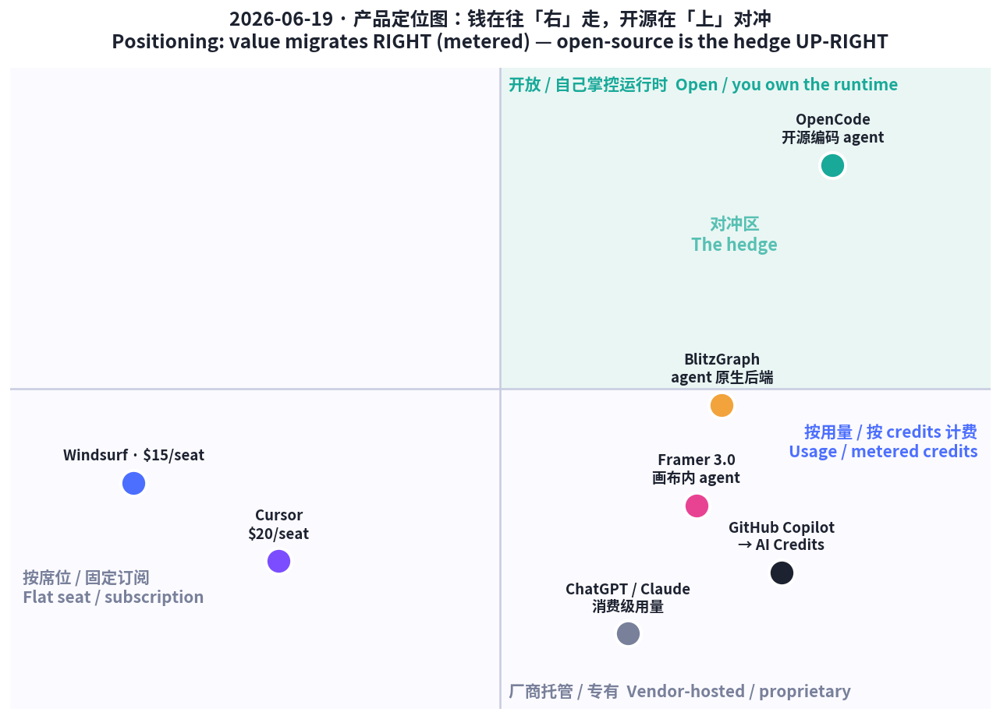
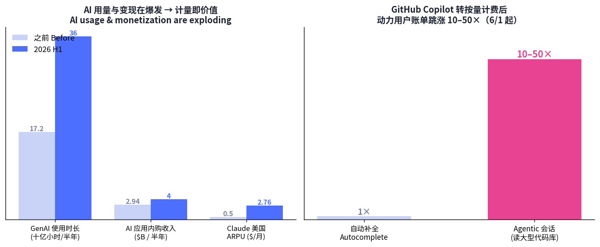

# 每日产品趋势报告 · Daily Product Trends Report
### 2026 年 6 月 19 日 · June 19, 2026

> **数据来源 / Sources:** Product Hunt（Framer 3.0 6/16 日榜 #1）、Hacker News（6 月趋势 + Show HN）、Sensor Tower《State of AI 2026》（约 6/16 发布）、GitHub Blog（Copilot 计费变更 6/1 生效）、a16z（"Fat Startup" 论）、TikTok Shop / Amazon Movers & Shakers、小红书 WILL 商业大会 / 公开检索摘要。
> **方法 / Method:** WebSearch + web_fetch 抓取公开数据。X / LinkedIn / 小红书 / Sensor Tower 需登录或为客户端渲染，采用公开检索摘要替代；`blog.mean.ceo`、`blitzgraph.com` 对 web_fetch 返回不可解析内容，改用检索摘要。Product Hunt 月度聚合「票数」（如 Fundraisly 102 万）为第三方累计值，**非单次上线 upvotes**，本报告不予采信。为保证每日新意，已**排除 6/13–6/18 已深度分析过的产品**（Fundraisly、Slashy、Vokal、Goldfish、Minimi、Bond、Asmi、Honen、Publora、Wispr Flow、Browse.sh、Vaani、VC Boom、Firma.dev、Ardent 等），今日只选近 7 天未分析过的新产品/趋势。

---

## ① 当日概览 · Overview

**一句话 / In one line：** 昨天的主线是「教 AI 记住你」；**今天的主线是「按用量收费的时代到了」——AI 从按人头（席位）收费转向按 token / credits 计量，agent 从聊天框走进画布，而开源 agent 成了对冲账单的「安全垫」。**

> Yesterday's throughline was *"teach AI to remember you."* Today's is **"the metered-AI era has arrived"** — pricing shifts from per-seat to per-token/credits, agents move *out of the chat box and into the canvas*, and open-source agents become the **hedge** against runaway bills.

三股力量在同一天交汇：

1. **变现侧——计量即价值。** GitHub Copilot 6/1 起全线转「AI Credits」按量计费（1 credit = $0.01），动力用户的 agentic 账单跳涨 **10–50×**，引发 470 万付费用户的反弹；Framer 3.0 也把 AI 功能改成 credits 计费。为什么敢这么收？因为 **Sensor Tower 数据显示用量在爆炸**：GenAI 应用使用时长半年从 172 亿小时 → **360 亿小时**，AI 应用内购收入半年 **超 $40 亿**。用得越多、计量越值钱。
2. **产品侧——agent 从「侧边聊天」搬进「工作画布」。** Framer 3.0 把 AI agent 直接放进设计画布（生成页面、改组件、写代码、审站点），还能接 Claude Code / Cursor / Codex；BlitzGraph 把后端做成「agent 原生」——用图建模、用 MCP 直连，让 agent 不用 SQL 也能正确查询。
3. **对冲侧——开源 agent 成「安全垫」。** 当专有工具按量收费、账单不可控，**OpenCode**（SST/Anomaly 出品，16 万+ GitHub star、月活 750 万开发者、接 75+ 模型、不存你的代码）成了「自带 key、自己掌控」的开源对冲——这也正中 Hacker News 6 月「从惊叹转向审视：要信任、要可控、要算清账」的情绪。

> Three forces converge today: **(1) Monetization — metering is the value.** GitHub Copilot moved all plans to usage-based *AI Credits* on June 1 (1 credit = $0.01); power users' agentic bills jumped **10–50×**, sparking backlash among 4.7M paid subs. Framer 3.0 also switched AI to credits. Why dare to? Because **Sensor Tower shows usage is exploding** — GenAI app time went 17.2B → **36B hours** in a half-year, AI in-app-purchase revenue topped **$4B**. **(2) Product — agents move from a side-chat into the work canvas** (Framer 3.0 puts agents *inside* the design canvas; BlitzGraph makes the backend *agent-native* via graphs + MCP). **(3) The hedge — open-source agents.** As proprietary tools meter usage, **OpenCode** (160K+ stars, 7.5M monthly devs, 75+ models, stores none of your code) becomes the *bring-your-own-key* hedge — answering HN's June turn toward trust, control and *doing the math*.

消费侧延续「看得见、马上有效」的逻辑：TikTok Shop 靠可演示的好物（自晒美黑、氛围灯）把「看到」变「下单」，Amazon 热榜偏「省空间、解决具体麻烦」；小红书则进入 **「种草效果化时代」**——内容前置、快速验证，靠「活人笔记」的真实感赢信任。

**五条最强信号 / Five strongest signals**

1. **按席位 → 按用量 / Seats → usage.** Copilot 全线转 AI Credits，Framer 改 credits；席位订阅的「无限用」红利结束，**「用多少付多少」成为新常态**。
2. **用量在爆炸，所以计量才敢这么收 / Metering rides exploding usage.** GenAI 时长翻倍（360 亿小时/半年）、AI 应用内购 >$40 亿；Claude 美国 ARPU 半年从 $0.50 → **$2.76**（5×+）。
3. **Agent 进画布 / Agents enter the canvas.** Framer 3.0 让 agent 在设计画布里直接干活并可分支评审；价值从「功能」上移到「交付一个可发布的结果」。
4. **开源是账单的对冲 / Open-source is the bill hedge.** OpenCode 月活 750 万、16 万+ star，自带 key、不锁定——专有按量计费越狠，开源对冲越香。
5. **消费回到「可演示 + 真实感」/ Demo-able & authentic wins.** TikTok Shop 用可演示好物高转化；小红书「种草效果化」+「活人笔记」用真实感建立信任。

---

## ② 逐个产品深度分析 · Product Deep-Dives

### 1. Framer 3.0 — 把 AI agent 搬进设计画布 / Agents that live inside the design canvas

6 月 16 日上线即拿下 **Product Hunt 当日 #1**。它最大的变化不是「又一个 AI 抠图」，而是把 **agent 直接放进设计画布**：在真实项目里生成页面、改组件与样式、写代码、管理 CMS、审查站点（找断链）。配套三件套——**Branching**（agent 的改动落在隔离分支，评审合并后才发布，让 agent 改生产站点更安全）、**External Agents**（接入 Claude Code / Cursor / Codex / Gemini CLI 来操作 Framer 项目）、重建的 Community。商业上同步换挡：AI 功能改 **AI Credits** 计费（免费版 500 credits/天 ≈ 2 个落地页，当日清零不滚存），编辑席位从 **$40 砍到 $20**、砍掉 Scale 套餐。

> Framer 3.0 (June 16, **#1 Product of the Day**) puts **agents *inside* the design canvas**: generate pages, edit components/styles, write code, manage CMS, audit a site for broken links — in a live project. Plus **Branching** (agent edits land in an isolated branch you review + merge before publishing), **External Agents** (drive Framer from Claude Code / Cursor / Codex / Gemini CLI), and a rebuilt Community. Business model shifted too: AI now runs on **AI Credits** (free tier 500/day ≈ 2 landing pages, no rollover), editor seat cut **$40 → $20**, Scale plan retired.

| 维度 Dimension | 分析 Analysis |
|---|---|
| 商业模式 Business model | 订阅（Free–$30/mo）+ **AI Credits 按量计费**；席位降价换更高 AI 用量变现。Subscription + usage-based AI Credits; lower seat price, monetize AI usage. |
| 核心功能 Core value | 画布内 agent（生成/改样式/写码/审站）+ 分支评审 + 外接编码 agent。In-canvas agent + branch review + external coding agents. |
| 成功因素 Success factors | 把 agent 嵌进既有工作流（不另开 app）；一次性全量上线、无 waitlist；价格下探拉新。Agent embedded in existing workflow; full launch, no waitlist; price cut. |
| 细分市场 Niche | 无代码/低代码营销站、设计师与中小团队官网。No-code marketing sites for designers & SMB teams. |
| 目标受众 Audience | 设计师、独立创作者、需要快速上线官网的团队。Designers, solo creators, teams shipping sites fast. |
| 品牌设计 Brand | 「3.0」叙事=平台级跃迁；定位「会自己干活的设计工具」。"3.0" = platform leap; "a design tool that does the work". |
| 产品数据 Data | PH 当日 #1；免费 500 credits/天；席位 $40→$20。#1 PoD; 500 free credits/day; seat $40→$20. |
| 链接 Link | [producthunt.com/products/framer](https://www.producthunt.com/products/framer) · [framer.com/events](https://www.framer.com/events/) |
| 评论摘要 Reviews | 营销站效果惊艳（Wireframer/Workshop），但**仅 Framer 托管、无代码导出**，复杂需求 AI 不稳，席位/地区计费有「惊吓」招致 1★。Stunning for marketing sites, but Framer-hosted only, no code export; billing surprises drive 1★. |

### 2. OpenCode — 月活 750 万的开源编码 agent / The open-source coding agent, 7.5M devs

当专有工具开始按 token 收费、账单失控，开发者用脚投票投向了开源。**OpenCode**（由 SST / 现 Anomaly 团队打造）是一个**终端原生**的开源 AI 编码 agent：跑在你本机，接 **75+ 模型供应商**，**不存储你的任何代码**。能力上一点不弱——专精子 agent（Explorer / Oracle / Librarian / Designer）、后台任务、深度 **LSP/AST**（让 AI 有编译器级的代码理解）、tmux 实时围观、并行 agent、**会话分享**（生成 URL 让同事实时看你的 AI 编码会话）。**16 万+ GitHub star、900 贡献者、1.3 万+ commits**，被称为「史上采用最广的开源编码 agent」，6 月登上 AI 开发工具榜 **#1**。

> As proprietary tools start metering tokens, devs vote with their feet toward open source. **OpenCode** (by SST / now Anomaly) is a **terminal-native open-source** coding agent: runs locally, connects to **75+ model providers**, **stores none of your code**. Heavyweight features — specialized sub-agents (Explorer/Oracle/Librarian/Designer), background tasks, deep **LSP/AST** (compiler-level understanding), tmux live visibility, parallel agents, and **session sharing** (a URL so colleagues watch your session live). **160K+ stars, 900 contributors, 13K+ commits** — the most-adopted OSS coding agent ever, **#1** on June dev-tool rankings.

| 维度 Dimension | 分析 Analysis |
|---|---|
| 商业模式 Business model | 开源免费（自带模型 key，按各家用量付费）；变现走云/企业服务。OSS free, BYO-model keys; monetize via cloud/enterprise. |
| 核心功能 Core value | 终端原生编码 agent + 75+ 模型 + 子 agent + LSP/AST + 会话分享。Terminal-native agent + 75+ models + sub-agents + LSP/AST + session share. |
| 成功因素 Success factors | **不锁定 + 不存代码 + 自带 key** 对冲账单与隐私焦虑；社区飞轮（star/贡献者）。No lock-in + no code stored + BYO-key hedge; community flywheel. |
| 细分市场 Niche | 终端重度、注重隐私与成本可控的工程团队。Terminal-heavy, privacy/cost-conscious eng teams. |
| 目标受众 Audience | 被专有工具按量计费吓到的开发者；OSS 拥趸。Devs spooked by metered pricing; OSS believers. |
| 品牌设计 Brand | 「OpenCode」=开放、可拥有；终端美学 + 极客信任。"Open" + ownable; terminal aesthetic, geek trust. |
| 产品数据 Data | 16 万+ star；900 贡献者；月活 750 万开发者；接 75+ 模型；6 月榜 #1。160K+ stars; 7.5M monthly devs; 75+ models; #1. |
| 链接 Link | [opencode.ai](https://opencode.ai/) |
| 评论摘要 Reviews | 被赞「自带 key、不锁定、可并行、可围观」；终端原生体验受核心开发者推崇。Praised for BYO-key, no lock-in, parallel agents, live sharing. |

### 3. BlitzGraph — 给 agent 时代的「原生后端」/ The AI-native backend for the agent era

Show HN 上的一句话定位很抓人：**「Supabase for graphs, built for LLM agents」**。它的赌注是：**agent 推理的是「关系」，而后端却逼它用列、文档、集合去表达关系**。BlitzGraph 把现实**建模成图**——实体可有多种类型、关系**双向**、内置搜索、为 agent 交互**自动鉴权**；agent 用**类型化 JSON 查询**就能正确取数，**无需 SQL、join、ORM**。它可作为**远程 MCP server** 直接挂到 agent 上，对接活的后端。定位上明确划线：Supabase 想的是「列」、Convex 想的是「文档」、MongoDB 想的是「集合」，而 BlitzGraph 想的是「图/关系」——也就是 agent 天然推理的形状。

> Its Show HN line nails it: **"Supabase for graphs, built for LLM agents."** The bet: **agents reason in *relationships*, yet backends force columns/documents/collections.** BlitzGraph **models reality as a graph** — entities with multiple kinds, **bidirectional** relationships, built-in search, **automatic auth** for agent calls; agents fetch data with **typed JSON queries** — **no SQL, joins, or ORMs**. It plugs in as a **remote MCP server** against live backends. Positioning: Supabase thinks in columns, Convex in documents, MongoDB in collections — BlitzGraph thinks in **graphs/relationships**, the shape agents already reason in.

| 维度 Dimension | 分析 Analysis |
|---|---|
| 商业模式 Business model | 预计用量/席位制 BaaS（后端即服务）。Likely usage/seat BaaS. |
| 核心功能 Core value | 图建模后端 + 类型化 JSON 查询 + 远程 MCP + 内置搜索/鉴权。Graph backend + typed JSON queries + remote MCP + built-in search/auth. |
| 成功因素 Success factors | 把数据层做成「agent 能一次写对」的形状；MCP 即插即用降低接入摩擦。Data shaped so agents query correctly; MCP plug-and-play. |
| 细分市场 Niche | 构建 agent 应用的开发者 / AI-native 创业团队。Devs building agent apps; AI-native startups. |
| 目标受众 Audience | 厌倦为 agent 写脆弱 SQL/ORM 胶水的工程师。Engineers tired of brittle SQL/ORM glue for agents. |
| 品牌设计 Brand | 「Blitz」=快；类比 Supabase 降低理解成本。"Blitz" = fast; Supabase analogy lowers learning curve. |
| 产品数据 Data | Show HN 6 月；具体 star/用量未公开披露。Show HN June; stars/usage not disclosed. |
| 链接 Link | [blitzgraph.com](https://blitzgraph.com/) |
| 评论摘要 Reviews | HN 讨论聚焦「agent 友好查询」卖点，亦有人质疑图 DB 的通用性与迁移成本。HN debates agent-friendly querying vs. graph-DB generality/migration. |

### 4.【趋势】计量计费时代：Copilot 转按量，账单跳涨 10–50× / The metered-AI era

最具风向标意义的一件事：**GitHub Copilot 6 月 1 日起全线转「使用量计费」**。每个套餐含一份月度 **AI Credits**（1 credit = $0.01，按各模型 token 单价计），代码补全与 Next Edit Suggestions 仍**无限**，其余（尤其 **agentic 会话**）全部计量。问题在于：读大型代码库、串联多次模型调用的 agentic 会话，成本是自动补全的 **50–100×**——于是动力用户账单**跳涨 10–50×**，470 万付费用户里怨声四起。直接受益的是固定价竞品：**Cursor（$20/mo，估值约 $20 亿）**、**Windsurf（$15/mo）**。这不是 GitHub 一家的事——**Framer 也改 AI Credits**，行业正集体从「按人头无限用」走向「按 token 算钱」。

> The bellwether: **GitHub Copilot moved all plans to usage-based billing on June 1.** Each plan includes a monthly **AI Credits** allotment (1 credit = $0.01, priced by model tokens); completions & Next Edit Suggestions stay **unlimited**, everything else (esp. **agentic** sessions) is metered. The catch: agentic sessions that read large codebases and chain model calls cost **50–100×** autocomplete — so power-user bills **jump 10–50×**, angering many of 4.7M paid subs. Flat-price rivals benefit: **Cursor ($20/mo, ~$2B valuation)**, **Windsurf ($15/mo)**. Not just GitHub — **Framer switched to AI Credits** too. The industry is moving from *unlimited-per-seat* to *priced-per-token*.

| 维度 Dimension | 分析 Analysis |
|---|---|
| 商业模式 Business model | 按用量 AI Credits（1=$0.01）；Pro $10($15 额度)/Pro+ $39($70)/Max $100($200)。Usage credits; tiered allotments. |
| 核心功能 Core value | 补全无限 + agentic 计量；额度可加购。Unlimited completions + metered agentic; top-ups. |
| 成功因素 Success factors（争议）| 抓住「用量爆炸」变现窗口，但定价透明度与突涨引发反弹。Captures usage boom; transparency/spikes spark backlash. |
| 细分市场 Niche | AI 编码工具（IDE/CLI agent）。AI coding (IDE/CLI agents). |
| 目标受众 Audience | 企业与重度 agentic 编码者。Enterprises & heavy agentic coders. |
| 产品数据 Data | 470 万付费；账单跳涨 10–50×；agentic 成本 50–100× 补全。4.7M paid; 10–50× bills; agentic 50–100× autocomplete. |
| 链接 Link | [github.blog Copilot billing](https://github.blog/news-insights/company-news/github-copilot-is-moving-to-usage-based-billing/) |
| 用户口碑 Reviews | 「同样工作，月底账单翻几十倍」「被迫重新评估工具」；部分转向 Cursor/Windsurf/开源。"Same work, bill up tens of ×"; some switch to Cursor/Windsurf/OSS. |

### 5.【趋势/数据】Sensor Tower《State of AI 2026》：用量翻倍、Claude 单用户收入反超 / Usage doubles, Claude leads on revenue-per-user

为什么大家敢按量收费？因为**用量与变现都在爆炸**。Sensor Tower《State of AI 2026》（约 6/16 发布）：GenAI 应用**使用时长半年从 172 亿 → 360 亿小时**（YoY >2×）；带「AI」标签的应用上半年下载有望达 **100 亿**；AI 应用内购收入上半年 **超 $40 亿**（较 25 下半年 +36%）。竞争格局：**ChatGPT 5 月达 10 亿 MAU**（史上最快，仅 3 年），但 True Audience 份额 3 月**首次跌破 50%**；Gemini 27.7%/6.62 亿 MAU，**Claude 10.3%/2.45 亿 MAU**。最劲的是 **Claude 的「单位经济」**：美国 ARPU 半年 **$0.50 → $2.76**（5×+），人均使用 **40 → 120 分钟/月**，且**单用户收入反超 ChatGPT**。

> Why dare to meter? Because usage *and* monetization are exploding. Sensor Tower's **State of AI 2026** (~June 16): GenAI app time went **17.2B → 36B hours** in a half-year (>2× YoY); AI-tagged apps on track for **10B** H1 downloads; AI in-app-purchase revenue topped **$4B** in H1 (+36% vs H2'25). Landscape: **ChatGPT hit 1B MAU in May** (fastest ever, 3 yrs) but its True Audience share **fell below 50%** for the first time (March); Gemini 27.7%/662M, **Claude 10.3%/245M**. The standout is **Claude's unit economics**: US ARPU **$0.50 → $2.76** (5×+) in a half-year, usage **40 → 120 min/user/mo**, and Claude **beats ChatGPT on revenue-per-user**.

| 维度 Dimension | 分析 Analysis |
|---|---|
| 商业模式 Business model | 订阅 + 应用内购 + API 用量；变现随时长/强度上行。Subscription + IAP + API usage. |
| 核心信号 Core signal | 用量翻倍、收入 +36%、Claude ARPU 5×——计量成主旋律。Usage 2×, revenue +36%, Claude ARPU 5×. |
| 成功因素 Success factors | 把「使用强度」做成增长引擎（时长↑→ARPU↑）。Turn usage intensity into the growth engine. |
| 细分市场 Niche | 移动 + Web 的通用 AI 助手。General AI assistants (mobile + web). |
| 目标受众 Audience | 全球消费者与开发者。Global consumers & developers. |
| 产品数据 Data | 时长 360 亿 h/半年；IAP >$40 亿；ChatGPT 11 亿+ MAU；Claude 2.45 亿、ARPU $2.76。36B h; >$4B IAP; ChatGPT 1.1B; Claude 245M, ARPU $2.76. |
| 链接 Link | [sensortower.com/blog/state-of-ai-2026](https://sensortower.com/blog/state-of-ai-2026) |
| 解读 Reviews | 「ChatGPT 仍最大，但对手在逼近；Claude 用更少用户赚更多钱」。"ChatGPT biggest, rivals closing; Claude earns more per user." |

### 6.【消费趋势】TikTok Shop「可演示电商」+ Amazon「省空间/解决具体麻烦」/ Demo-able commerce

实体好物这边，赢家逻辑是 **「看得见、几秒见效」**。TikTok Shop 6 月初榜首是 **Beauty by Earth 自晒美黑乳**（兼顾防晒与小麦色），首周登顶；**$30 以下氛围灯**长期病毒式传播（出镜好看、卧室「氛围感」内容王）；护肤、补剂、清洁工具、美妆因「高频使用 + 效果秒见」持续走量。Amazon Movers & Shakers / 热销榜偏 **「省空间、解决具体麻烦」**：真空压缩袋、紧凑多用途好物（公寓/宿舍/小户型友好）、健身（氯丁橡胶哑铃）、厨房小工具（硅胶铲、喷油壶、研磨器）。TikTok Shop 预计 **2027 年占美国社交电商 24.1%**。

> Physical goods reward **"see it, works in seconds."** TikTok Shop's early-June #1 was **Beauty by Earth self-tanning lotion** (sun-safe + tan look); **mood lights under $30** stay viral (camera-stunning, bedroom-glow content); skincare, supplements, cleaning tools and beauty keep selling on *frequent use + instantly visible results*. Amazon Movers & Shakers / Best Sellers skew to **space-saving / solve-a-specific-pain**: vacuum storage bags, compact multi-use items (apartment/dorm-friendly), fitness (neoprene dumbbells), kitchen gadgets (silicone utensils, oil sprayers, grinders). TikTok Shop is projected to be **24.1% of US social commerce by 2027**.

| 维度 Dimension | 分析 Analysis |
|---|---|
| 商业模式 Business model | 内容即货架 + 达人佣金 + 冲动转化。Content-as-shelf + creator commissions + impulse. |
| 核心因素 Success factors | 单一痛点 + 可演示 + 秒级「上手感」+ 出镜好看。One pain + demo-able + instant payoff + camera-ready. |
| 细分市场 Niche | 美妆个护、家居收纳、氛围好物、厨房小工具。Beauty, home-organization, ambience, kitchen gadgets. |
| 目标受众 Audience | 刷短视频冲动消费的年轻人 / 小户型人群。Short-video impulse buyers; small-space dwellers. |
| 品牌设计 Brand | 视觉先行、效果可视；价格友好（多 <$30）。Visual-first, visible result, sub-$30 friendly. |
| 产品数据 Data | 自晒乳首周 #1；氛围灯 <$30 病毒款；TikTok Shop 2027 占美社交电商 24.1%。Self-tan #1 wk1; sub-$30 mood lights; 24.1% by 2027. |
| 链接 Link | [tiktok.com/discover/best-sellers](https://www.tiktok.com/discover/best-sellers) · [amazon.com Movers & Shakers](https://www.amazon.com/gp/movers-and-shakers/) |
| 评论摘要 Reviews | 「演示视频一看就懂、马上下单」；退货风险集中在「实物不及演示」。"Demo makes it instant-buy"; returns cluster on "less than the demo." |

### 7.【消费趋势 · 中国】小红书「种草效果化时代」+「活人笔记」/ Xiaohongshu: from buzz to measurable outcomes

小红书 2026 WILL 商业大会定调 **「种草进入效果化时代」**：靠**内容前置、快速验证、新品测试**，更早发现真实使用场景，从而提升上新效率与「爆款命中率」——种草不再只看声量，而要看**可衡量的转化效果**。运营层面，从「爆款破圈」转向**人群/场景/兴趣需求的极致精细化**。内容风向也在变：从「精致仪式感」转向**「真实放松」**，品牌靠**「活人笔记」**（真实、口语、不端着）传递可信度。**兴趣驱动消费**继续升温——追星、非遗、博物馆夜游、文旅兴趣出游成为核心动机。一句话：**真实感 + 可衡量效果**，正在取代「精致摆拍 + 泛流量」。

> Xiaohongshu's 2026 WILL conference set the tone: **"seeding enters the outcomes era."** Via **content-first, rapid validation, new-product testing**, brands find real use-cases earlier and lift hit-rates — *seeding measured by conversion, not just buzz*. Operationally, the shift is from *chasing virality* to **hyper-granular targeting** (audience / scenario / interest). Content tone moves from *polished ritual* to **"real & relaxed,"** with brands using **"living-person notes"** (authentic, colloquial) to earn trust. **Interest-driven consumption** keeps rising — fandom, intangible heritage, museum night-tours, interest-led travel. In one line: **authenticity + measurable outcomes** are replacing *staged aesthetics + broad reach*.

| 维度 Dimension | 分析 Analysis |
|---|---|
| 商业模式 Business model | 种草内容 → 效果化投放 → 新品测试/转化闭环。Seeding → outcome ads → product testing/conversion loop. |
| 核心因素 Success factors | 内容前置 + 真实「活人感」+ 精细化人群/场景。Content-first + authenticity + granular targeting. |
| 细分市场 Niche | 美妆/个护/文旅/兴趣消费品牌。Beauty, travel, interest-led consumer brands. |
| 目标受众 Audience | 重兴趣、重真实、反「过度精致」的年轻用户。Young users valuing interest & authenticity. |
| 品牌设计 Brand | 「活人笔记」=去广告化、口语化、真实场景。"Living-person notes": de-ad-ified, colloquial, real. |
| 产品数据 Data | WILL 大会主题「效果化」；兴趣出游（追星/非遗/夜游）升温。WILL theme "outcomes"; interest-travel rising. |
| 链接 Link | [小红书 WILL 商业大会报道](https://www.bbtnews.com.cn/2025/1223/579681.shtml) |
| 评论摘要 Reviews | 商家：「投放更看 ROI / 验证更快」；用户：「更信真实分享、反感硬广」。Merchants value ROI & faster validation; users trust authentic shares. |

---

## ③ 横向对比表 · Comparison Matrix

| 产品 Product | 类别 Category | 商业模式 Model | 核心卖点 Core value | 目标受众 Audience | 关键数据 Key data | 链接 Link |
|---|---|---|---|---|---|---|
| **Framer 3.0** | 设计/Agent Design | 订阅 + AI Credits | 画布内 agent + 分支评审 | 设计师/中小团队 | PH #1；席位 $40→$20 | [link](https://www.producthunt.com/products/framer) |
| **OpenCode** | 编码 Agent Coding | 开源 + 自带 key | 终端原生、不锁定、接 75+ 模型 | 注重成本/隐私的开发者 | 16 万★；月活 750 万 | [link](https://opencode.ai/) |
| **BlitzGraph** | 后端 Infra/Backend | 用量 BaaS（推测） | agent 原生图后端 + MCP | 建 agent 应用的开发者 | Show HN 6 月 | [link](https://blitzgraph.com/) |
| **GitHub Copilot（趋势）** | 编码计费 Pricing | 按量 AI Credits | 补全无限 + agentic 计量 | 企业/重度编码者 | 470 万付费；账单 10–50× | [link](https://github.blog/news-insights/company-news/github-copilot-is-moving-to-usage-based-billing/) |
| **Sensor Tower 数据** | 市场/数据 Market | — | 用量翻倍、Claude 单用户收入反超 | 投资人/产品 | 360 亿 h；IAP >$40 亿；Claude ARPU $2.76 | [link](https://sensortower.com/blog/state-of-ai-2026) |
| **TikTok Shop / Amazon** | 消费 Commerce | 内容即货架/佣金 | 可演示 + 秒级见效 | 短视频冲动买家 | 自晒乳首周 #1；2027 占 24.1% | [link](https://www.tiktok.com/discover/best-sellers) |
| **小红书（中国）** | 消费 Commerce-CN | 效果化种草 | 真实「活人笔记」+ 精细化 | 兴趣/真实导向年轻人 | WILL 主题「效果化」 | [link](https://www.bbtnews.com.cn/2025/1223/579681.shtml) |

---

## ④ 关键洞察与共性总结 · Key Insights & Common Patterns

**1. 计量即护城河：从「卖席位」到「卖 token」。**
当 AI 用量爆炸（GenAI 时长翻倍、IAP >$40 亿），「无限用」的席位订阅在亏钱，厂商必然转向按量。Copilot 是最响的发令枪，Framer 紧随。**启示：做 AI 工具，定价要么绑「可计量的价值」，要么用「可预期的固定价」抢被吓到的用户（Cursor/Windsurf 正是受益方）。**

> **Metering is the moat: from selling seats to selling tokens.** As usage explodes, unlimited-seat plans bleed money; vendors meter. Copilot fired the loudest shot; Framer followed. *Either price to metered value, or win the spooked with predictable flat pricing (Cursor/Windsurf's opening).*

**2. Agent 的价值在「上移」：从功能 → 嵌入工作流 → 交付结果。**
Framer 把 agent 放进画布（不另开 app）、可分支评审；BlitzGraph 把后端做成 agent 能一次查对的形状。**赢家不是「又一个 AI 功能」，而是「把 agent 嵌进你已有的工作面，并对结果负责」。** 这与 a16z「Fat Startup 交付结果、不卖功能」一脉相承。

> **Agent value moves up: feature → embedded-in-workflow → delivered outcome.** Framer embeds agents in the canvas with branch review; BlitzGraph shapes the backend so agents query right. Winners embed into your existing surface and own the result — a16z's *"fat startups ship outcomes."*

**3. 开源是「按量计费」的天然对冲。**
当账单不可控、信任成稀缺品，OpenCode（自带 key、不存代码、不锁定）月活冲到 750 万——这正中 Hacker News「从惊叹转向审视：要可控、要算清账」的情绪。**专有按量越狠，开源对冲越值钱；二者会长期并存、互相定价。**

> **Open-source is the natural hedge to metered pricing.** As bills get unpredictable and trust scarce, OpenCode (BYO-key, no code stored, no lock-in) hit 7.5M monthly devs — HN's *control & do-the-math* turn. The harder proprietary meters, the more the open hedge is worth.

**4. 消费侧的共性：可演示 + 真实感 + 可衡量。**
TikTok Shop 靠「几秒见效的可演示好物」高转化；小红书进入「种草效果化 + 活人笔记」。中外殊途同归：**用真实可信的内容，承诺一个看得见的结果。**

> **Consumer throughline: demo-able + authentic + measurable.** TikTok Shop converts via *see-it-work-in-seconds* goods; Xiaohongshu shifts to *measurable seeding + living-person notes*. East and west converge: authentic content promising a visible outcome.

**5. 一句话投资视角 / The one-line investor view：**
**钱正在从「按人头的软件」迁往「按用量的 AI」——谁能把『用量』绑定到『可衡量、可信任的结果』，谁就拿走利润；而开源会持续给这套计量体系『定价上限』。**

> Money is migrating from *per-seat software* to *per-usage AI* — whoever binds **usage** to a **measurable, trusted outcome** takes the margin, while **open source keeps a price ceiling** on the whole metered stack.

---

> ⚠️ **免责声明 / Disclaimer:** 本报告基于公开检索的二手信息，部分数据为第三方估算（Sensor Tower 等），产品票数/估值可能随时间变化；不构成任何投资建议。Figures are public secondary data, partly third-party estimates; product metrics/valuations change over time. **Not investment advice.**

*报告生成 / Generated: 2026-06-19 · 自动化每日产品趋势任务 Automated daily product-trends task*
