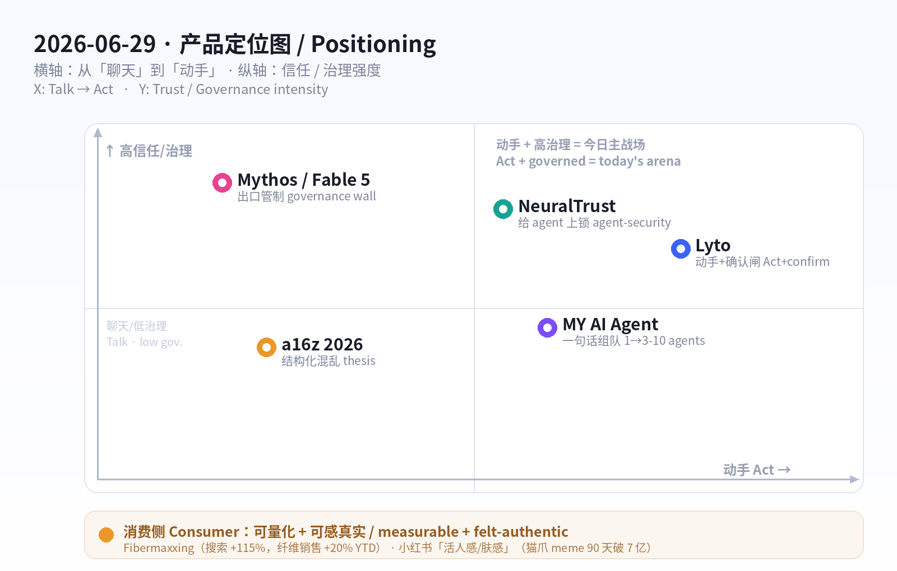
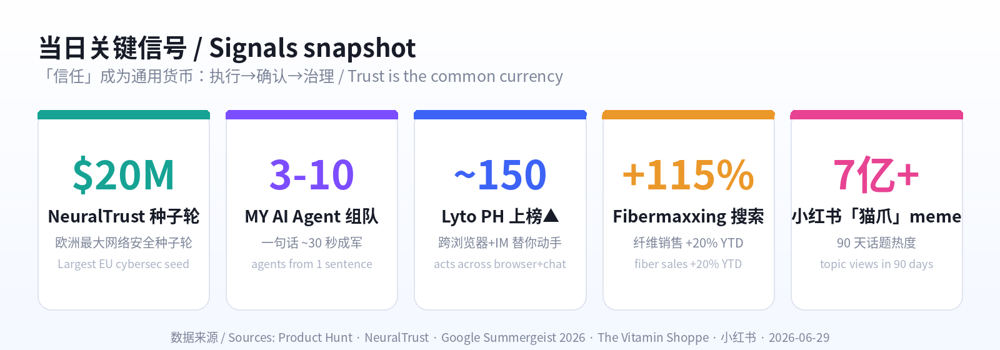

# 每日产品趋势报告 · Daily Product Trends Report
### 2026 年 6 月 29 日 · June 29, 2026

> **数据来源 / Sources:** Product Hunt（Lyto 6/28 日榜、MY AI Agent）、Hacker News（6 月趋势：从「炫技」转向「信任/安全/可控」）、a16z《Big Ideas 2026 / Notes on AI Apps in 2026》、Anthropic Mythos / Fable 5（CNBC 6/9、CNN 6/26）、NeuralTrust $20M 种子轮（PR 6/17）、Google Summergeist 2026 与 The Vitamin Shoppe（fibermaxxing）、小红书 2026 趋势（知乎/TopMarketing/人人都是产品经理）。
> **方法 / Method:** WebSearch + web_fetch 抓取公开数据。X / LinkedIn / 小红书 / Sensor Tower / Product Hunt 需登录或为客户端渲染，采用公开检索摘要替代；HN `/front` 抓取返回过期缓存日，改用检索摘要。为保证每日新意，已**排除 6/12–6/20 已深度分析过的产品**（Fundraisly、Slashy、Vokal、Goldfish、Minimi、Framer 3.0、OpenCode、BlitzGraph、Wispr Flow、Ardent 等）。
> **免责声明 / Disclaimer:** 本报告为趋势研究，非投资建议。涉及融资/估值/排名为第三方公开披露，可能随时变化。

---

## ① 当日概览 · Overview

**一句话 / In one line：** 6 月 19 日的主线是「按用量收费的时代到了」；**今天的主线是「AI agent 不再只是聊天，它开始替你动手——于是『信任』成了新的产品界面」。** Agent 跨浏览器与即时通讯替你干活、一句话组建 3–10 人的 agent 团队；但价值与风险同时上移到「执行层」，于是出现了「执行前确认」、拿下欧洲最大网络安全种子轮的「agent 安全」、以及连最强模型都要先过出口管制的「治理墙」。

> Where June 19 was *"the metered-AI era has arrived,"* **today's throughline is "agents stop talking and start *doing* — so *trust* becomes the new product surface."** Agents now execute across your browser and messaging apps, and you can spin up a 3–10-agent team from one sentence. But value *and* risk move to the execution layer — hence built-in **confirmation steps**, a record **agent-security** seed round, and a **governance wall** in front of even the most capable models.

三股力量在同一天交汇：

1. **产品侧——从「说」到「做」。** **Lyto**（Product Hunt 6/28 上榜）把 agent 装进浏览器：读页面、填表单、建表格做报告，还能让你从 WhatsApp / Telegram 发一句话、它把带图报告做好直接发给联系人——「不用开电脑」。**MY AI Agent** 更进一步：一句目标，30 秒内组建 3–10 人的专家 agent 团队。**编排（orchestration）正在压过单模型。**
2. **信任侧——执行越强，护栏越值钱。** 当 agent 能真的「发邮件、改表格」，犯错的代价是真实的。Lyto 因此把「变更类动作」做成**执行前预览+确认**；企业侧，**NeuralTrust** 拿下 **$20M 种子轮（6/17，欧洲史上最大网络安全种子轮）**专门「给企业里成群的 agent 上锁」。这正中 Hacker News 六月的情绪：**从惊叹转向「要信任、要安全、要可控」。**
3. **治理侧——能力被治理「限速」。** Anthropic 的 **Fable 5 / Mythos** 代表更强一档的模型：Fable 5 面向企业/付费用户普发，而 **Mythos 5 只开放给受信任的合作方**；美国政府先因安全顾虑下「出口禁令」，6/26 才放行给「部分受信任的公司与政府机构」。**最强的能力，最先被关进治理的笼子。**

消费侧延续「真实、可感、可量化」逻辑：欧美的 **fibermaxxing（纤维最大化）** 成为 2026 最大健康运动——可测量的健康优化（The Vitamin Shoppe 纤维品类销售 **YTD +20%**，连卡乐 SunChips 都要出高纤版）；中国的**小红书**进入「**活人感 + 肤感优先**」时代——真实笔记赢过精致摆拍，「上身体验」压过「成分表」。

**五条最强信号 / Five strongest signals**

1. **从「说」到「做」/ From talk to action.** Lyto 跨浏览器+IM 替你交付成品，MY AI Agent 一句话组队——agent 的价值从「答得好」变成「干得成」。
2. **信任是新的护城河 / Trust is the new moat.** Lyto「执行前确认」、NeuralTrust $20M「给 agent 上锁」——能动手了，安全与可控就值钱了。
3. **编排 > 单模型 / Orchestration beats single model.** 多 agent 协作（MY AI Agent）、跨界面 agent（Lyto）成为产品形态。
4. **能力被治理限速 / Capability is gated by governance.** 最强的 Mythos 只给受信任方、要过出口管制——「治理」开始定义「谁能用最强模型」。
5. **消费=可量化 + 真实感 / Measurable + authentic wins.** Fibermaxxing 用「数字健康」种草；小红书用「活人感/肤感」建立信任。

---

## ② 逐个产品深度分析 · Product Deep-Dives

### 1. Lyto — 跨浏览器与即时通讯、「真的替你动手」的 agent / The agent that actually does the work

Product Hunt 6/28 上榜（约 150 upvotes）。Lyto 的定位一句话戳中痛点：**「一个 agent，贯穿你的浏览器、工具和消息」**——它不是再给你一个聊天框，而是装进 Chrome 后**真的动手**：开关标签页、滚动、点击、填表单、操作页面里的每一个 DOM 元素；读你的页面、填你的表单、建表格做报告，并接通 Gmail / Slack / Google Sheets / GitHub。最抓眼球的是「**离开电脑也能用**」：从 WhatsApp / Telegram 发一句话（如「做一份带图的周报发给老板」），它把成品文件直接发到任意联系人。为了让「会动手的 agent」可被信任，Lyto 做了两道闸：**变更类动作（发邮件、改表格）执行前先给预览并要你确认**；当数据/流程有矛盾时，它**主动标注并发问**，而不是猜——口号是「绝不悄悄做错事」。

> Lyto (PH June 28, ~150 upvotes) nails it: **"one AI agent across your browser, tools, and messages."** Instead of another chat box, it installs in Chrome and *acts* — opens/closes tabs, scrolls, clicks, fills forms, manipulates any DOM element; reads pages, builds spreadsheets/reports, and connects Gmail / Slack / Sheets / GitHub. The standout: **no-laptop operation** — text it from WhatsApp/Telegram ("build a report with graphs and send it to my boss") and it delivers the finished file to any contact. To make a *doing* agent trustworthy, Lyto adds two gates: **mutative actions (send email, edit a sheet) get a preview + confirmation before commit**, and when data/workflow is messy it **flags the inconsistency and asks** rather than guessing — "never silently do the wrong thing."

| 维度 Dimension | 分析 Analysis |
|---|---|
| 商业模式 Business model | 预计 freemium 订阅 + 用量（agent 执行/连接器）。浏览器扩展低摩擦获客。Likely freemium subscription + usage; low-friction via Chrome extension. |
| 核心功能 Core value | 浏览器内执行（点/填/抓 DOM）+ 跨工具连接 + IM 远程下单 + 执行前确认。In-browser execution + cross-tool connectors + chat-app remote control + confirm-before-commit. |
| 成功因素 Success factors | 把 agent 嵌进既有界面（浏览器/IM），「交付成品」而非聊天；信任设计降低代价。Embedded in existing surfaces; ships outcomes; trust-by-design. |
| 细分市场 Niche | 知识工作者的「网页操作自动化」（研究、填报、出报告）。Web-task automation for knowledge workers. |
| 目标受众 Audience | 重度用浏览器+SaaS、想「动嘴不动手」的运营/销售/创始人。Ops/sales/founders living in browser + SaaS. |
| 品牌设计 Brand | 名字短促好记；定位「会动手的 agent」对冲「只会聊天」的同类。Short name; "agent that acts" vs chat-only rivals. |
| 产品数据 Data | PH 6/28，约 150 upvotes；连接 Gmail/Slack/Sheets/GitHub；支持 WhatsApp/Telegram。~150 upvotes; 4+ integrations; WhatsApp/Telegram. |
| 链接 Link | [producthunt.com/products/lyto](https://www.producthunt.com/products/lyto) · trylyto.com |
| 评论摘要 Reviews | 被赞「真的会干活、能从手机远程下单」；隐忧在浏览器级权限与可靠性——「执行前确认」正是回应。Praised for *actually doing* tasks & phone control; concern = browser-level permissions/reliability — the confirm step answers it. |

### 2. MY AI Agent — 一句话组建一支 3–10 人的 AI 团队 / A 3–10-agent team from one sentence

如果说 Lyto 是「一个会动手的 agent」，**MY AI Agent** 押注的是「**一支会分工的 agent 团队**」。你给一个目标（一句话），它在约 **30 秒**内要么给你**雇一个 AI 队友**、要么**组建一支 3–10 人的专家 agent 团队**，各司其职协作完成。它把「多 agent 编排」这件原本需要写框架/连工具的事，压缩成「说一句目标」的消费级体验——这正是 2026 年「编排 > 单模型」的缩影：用户买的不是某个大模型，而是「一组分好工、能交付的角色」。

> If Lyto is *one agent that acts*, **MY AI Agent** bets on *a team that divides labor*. Give it one goal in a sentence and in ~**30 seconds** it either hires you a single AI teammate or **assembles a 3–10-agent specialist team** that collaborates to finish the job. It compresses *multi-agent orchestration* — normally a framework-and-glue project — into a consumer-grade "just say the goal." It's the epitome of 2026's *"orchestration beats single model"*: users buy a *cast of roles that ships*, not a model.

| 维度 Dimension | 分析 Analysis |
|---|---|
| 商业模式 Business model | 预计订阅 + 用量（按 agent 数/任务量）。Likely subscription + usage (per agent/task). |
| 核心功能 Core value | 自然语言一句话 → 自动组队（角色/分工）+ 协作执行。One sentence → auto-assembled role team + collaborative execution. |
| 成功因素 Success factors | 把「多 agent 编排」降到消费级门槛；30 秒见效的即时满足。Consumer-grade orchestration; 30-second time-to-value. |
| 细分市场 Niche | 个人/小团队的「即开即用 agent 工作组」。Instant agent workgroups for solos/small teams. |
| 目标受众 Audience | 想要「一队人帮我干」但不懂搭框架的创业者/自由职业者。Founders/freelancers who want a team, not a framework. |
| 品牌设计 Brand | 「MY AI Agent」直白；卖点是「团队感」而非「模型感」。Plain name; sells *team*, not *model*. |
| 产品数据 Data | PH 上榜；核心指标「3–10 个 agent / ~30 秒组队」。On PH; key spec: 3–10 agents in ~30s. |
| 链接 Link | [producthunt.com/products/my-ai-agent](https://www.producthunt.com/products/my-ai-agent) |
| 评论摘要 Reviews | 同赛道竞品众多（AgentX、AgentCrew、Kodey.ai）；差异化看「组队质量+协作可靠性」。Crowded space; differentiation = team quality + collaboration reliability. |

### 3. NeuralTrust — 给企业里「成群的 agent」上锁 / Securing the enterprise agent swarm

当 agent 真的开始在企业里动手，**「谁来管住它们」**就成了刚需。西班牙的 **NeuralTrust** 在 6/17 宣布完成 **$20M 种子轮**——**欧洲史上最大的网络安全种子轮**，由 **Alstin Capital 领投**（VentureFriends、Seaya、Kibo、Banc Sabadell 等跟投）。它做的是一个**识别、保护并扩展企业内运行的 AI agent** 的平台：在 agent 进入生产环境时做发现、防护与治理。客户已包括 **Air Europa、Abanca、Iberia、Banc Sabadell** 等银行/航空/能源/政府机构，并被 Gartner（代表厂商）、KuppingerCole（GenAI 防御领导者）、MarketsandMarkets（2026 Agentic AI 安全象限领导者）点名。**Lyto 的「执行前确认」是产品级的信任，NeuralTrust 则是企业级的信任基础设施——同一枚硬币的两面。**

> When agents start *acting* inside the enterprise, **"who keeps them in line?"** becomes a must-have. Spain's **NeuralTrust** closed a **$20M seed on June 17 — the largest cybersecurity seed by an EU company to date** — led by **Alstin Capital** (with VentureFriends, Seaya, Kibo, Banc Sabadell). Its platform **identifies, secures, and scales the AI agents running across an enterprise** as they move into production. Customers already include **Air Europa, Abanca, Iberia, Banc Sabadell** plus global banks/airlines/energy/government, with analyst nods from Gartner, KuppingerCole, and MarketsandMarkets. **Lyto's confirm-step is product-level trust; NeuralTrust is enterprise-level trust infrastructure — two sides of one coin.**

| 维度 Dimension | 分析 Analysis |
|---|---|
| 商业模式 Business model | 企业 SaaS（平台/席位+用量），主打受监管行业。Enterprise SaaS (platform/seat + usage), regulated industries. |
| 核心功能 Core value | AI agent 的发现、运行时防护、合规治理与扩展。Discovery, runtime protection, governance & scaling of AI agents. |
| 成功因素 Success factors | 站在「agent 进生产」的刚需口；先拿下银行/航空标杆客户与分析师背书。Rides "agents in production"; flagship logos + analyst recognition. |
| 细分市场 Niche | 企业 Agentic-AI 安全（agent 版的「身份+护栏」）。Enterprise agentic-AI security. |
| 目标受众 Audience | 把自治 agent 推进生产的银行/航空/能源/政府 CISO。CISOs in banks/airlines/energy/gov deploying autonomous agents. |
| 品牌设计 Brand | 「NeuralTrust」=神经网络 + 信任，命名即定位。Name = neural + trust; positioning baked in. |
| 产品数据 Data | $20M 种子轮（6/17，欧洲最大）；客户含 Iberia/Abanca 等；多份分析师领导者认定。$20M seed; marquee logos; multiple analyst "Leader" placements. |
| 链接 Link | [neuraltrust.ai/news/neuraltrust-raises-20m](https://neuraltrust.ai/news/neuraltrust-raises-20m) |
| 评论摘要 Reviews | 行业视角：agent 安全是 2026 最被看好的「卖铲子」赛道之一（融资与分析师热度印证）。Industry view: agent security is a top 2026 "picks-and-shovels" bet. |

### 4.【趋势】Anthropic Mythos / Fable 5：最强能力，最先撞上「治理墙」/ Frontier capability hits the governance wall

如果说前三个产品讲「agent 动手 + 信任」，那么模型层正在发生同构的事：**能力越强，越先被治理「限速」。** Anthropic 6 月推出更强一档的 **Mythos 级模型**——其中 **Fable 5** 面向企业客户与付费用户**普发**，而真正的 **Mythos 5** 只对**已有 Preview 权限的受信任合作方**开放，并已扩展到 15+ 国、150+ 机构（6/2）。更关键的是**政府层面的治理**：因对其网络安全能力的国家安全顾虑，美国一度下达**出口禁令**，直到 **6/26** 才修订许可、放行给「**部分受信任的公司与政府机构**」。这意味着 2026 的一条新规则：**前沿模型的「可得性」不再只由价格/算力决定，而是由「治理与信任」决定**——和 Lyto 的「确认闸」、NeuralTrust 的「agent 上锁」是同一种逻辑在不同层级的展开。

> While the products above are about *agents acting + trust*, the model layer shows the same shape: **the more capable the model, the sooner governance throttles it.** Anthropic's June **Mythos-class** models split: **Fable 5** ships broadly to enterprise + paid users, while **Mythos 5** stays gated to **vetted partners** with existing Preview access (expanded to 150+ orgs in 15+ countries on June 2). The bigger story is *government* governance: over national-security concerns about its cyber capabilities, the US first imposed an **export block**, then on **June 26** revised licensing to allow release to **select trusted companies and government agencies**. The new 2026 rule: **a frontier model's *availability* is set by governance & trust, not just price/compute** — the same logic as Lyto's confirm-gate and NeuralTrust's agent lock, one level up.

| 维度 Dimension | 分析 Analysis |
|---|---|
| 商业模式 Business model | 分层可得性：Fable 5 普发变现，Mythos 5 受信任方限定。Tiered access: Fable 5 broad; Mythos 5 gated. |
| 核心要点 Core point | 能力跃迁 + 主动治理（出口管制/受信任名单）。Capability leap + active governance (export controls / trusted list). |
| 为何重要 Why it matters | 「谁能用最强模型」开始由治理而非算力决定。Access to frontier capability now set by governance. |
| 受影响方 Who's affected | 前沿模型用户、监管者、做安全/合规的创业者。Frontier users, regulators, safety/compliance startups. |
| 链接 Link | [cnbc.com/2026/06/09 (Fable 5)](https://www.cnbc.com/2026/06/09/anthropic-mythos-claude-fable-5.html) · [cnn.com/2026/06/26 (export)](https://www.cnn.com/2026/06/26/tech/anthropic-mythos-release) |
| 数据 Data | Mythos 扩展至 15+ 国 150+ 机构（6/2）；6/26 政府放行受信任方。150+ orgs / 15+ countries; June 26 limited release. |

### 5.【趋势】a16z《Big Ideas 2026》：把混乱「结构化」+ 在「公司诞生时」抢分发 / Structure the chaos & win at formation

a16z 的 2026 主张为上面的产品热潮提供了「投资人视角」的解释：2026 由**agentic 系统、从混乱中提炼结构化智能、深度个性化**定义。三条对创业者最实用的判断：①**结构化混乱**——企业里非结构化、多模态数据（PDF、视频、日志）正是 RAG/agent 失效的根因，谁能结构化并治理它，谁就解锁企业价值（这与「信任/安全」赛道同源）；②**前沿在硅谷之外**——大量 AI 机会藏在传统垂直行业，靠「前沿部署（forward-deployed）」去发掘；③**在公司诞生时抢分发**——服务「绿地（greenfield）新公司」，随客户一起长大。a16z 还指出：即便在被大厂主导的编码领域，创业生态**仅 2025 一年就创造了 >$10 亿新收入**。

> a16z's 2026 thesis is the investor-side read on today's product wave: 2026 is defined by **agentic systems, structured intelligence from chaos, and deep personalization.** Three founder-useful calls: (1) **Structure the chaos** — unstructured, multimodal enterprise data (PDFs, video, logs) is exactly what breaks RAG/agents; structuring + governing it unlocks value (same root as the trust/security lane); (2) **the frontier is outside Silicon Valley** — opportunity hides in legacy verticals, reachable via **forward-deployed** motions; (3) **win distribution at formation** — serve **greenfield** companies and grow with them. a16z also notes that even in lab-dominated coding, startups generated **>$1B of new revenue in 2025 alone.**

| 维度 Dimension | 分析 Analysis |
|---|---|
| 核心论点 Core thesis | Agentic + 结构化混乱 + 深度个性化；结构化/治理数据=价值。Agentic + structure-the-chaos + personalization. |
| 分发打法 Distribution | 前沿部署进垂直行业；在公司「诞生时」抢占。Forward-deployed into verticals; win at formation. |
| 为何重要 Why it matters | 给「信任/数据治理/agent 工具」赛道提供资本叙事。Capital narrative for the trust/data/agent lanes. |
| 受影响方 Who's affected | AI 应用层创业者、企业数据/平台团队。AI app founders; enterprise data/platform teams. |
| 链接 Link | [a16z.com/notes-on-ai-apps-in-2026](https://a16z.com/notes-on-ai-apps-in-2026/) · [Big Ideas 2026](https://a16z.com/newsletter/big-ideas-2026-part-1/) |
| 数据 Data | 编码创业生态 2025 年 >$10 亿新收入；AI 占 2026 VC ~33%。Coding startups >$1B new rev (2025); AI ≈33% of 2026 VC. |

### 6.【消费趋势 · 欧美】Fibermaxxing：2026 最大的健康运动 / The biggest health movement of 2026

消费侧今天最强的信号是「**可量化的健康优化**」。Google《Summergeist 2026》显示「fibermaxxing（纤维最大化）」90 天内搜索 **+115%**；它被多家媒体称为**2026 最大健康运动**——由 Gen Z 在 TikTok 带起，核心是「主动把膳食纤维拉满」以改善肠道/代谢健康，并与 **GLP-1（减重药）营养**强绑定。落到生意上：**The Vitamin Shoppe 纤维品类销售 YTD +20%**，站内「fiber」搜索 +59%、「psyllium husk（洋车前子壳）」+150%；约 **95% 美国人纤维摄入不足**、**70%** 正主动补纤维。大厂跟进——**PepsiCo 要出 SunChips Fiber 与 Smartfood Fiber Pop**；**Momentous** 推「三重作用」可发酵纤维（洋车前子+米糠+土豆淀粉+肉桂，6g/份）。这是「looksmaxxing → healthmaxxing」优化文化的延伸：**把健康做成可打卡、可量化、可晒的数字目标。**

> Today's strongest consumer signal is **measurable health optimization.** Google's *Summergeist 2026* shows "fibermaxxing" search **+115%** in 90 days; outlets call it the **biggest health movement of 2026** — a Gen-Z TikTok trend of *maxxing* dietary fiber for gut/metabolic health, tightly tied to **GLP-1 nutrition.** The business proof: **The Vitamin Shoppe's fiber category sales are +20% YTD**, with on-site "fiber" searches +59% and "psyllium husk" +150%; ~**95% of Americans** under-consume fiber and **70%** are actively adding it. Incumbents are piling in — **PepsiCo** is launching **SunChips Fiber** and **Smartfood Fiber Pop**; **Momentous** shipped a triple-action fermentable fiber (psyllium + rice bran + potato starch + cinnamon, 6g/serving). It extends the *looksmaxxing → healthmaxxing* culture: **turn health into a trackable, measurable, postable number.**

| 维度 Dimension | 分析 Analysis |
|---|---|
| 商业机会 Opportunity | 高纤食品/零食、纤维补剂、GLP-1 配套营养、肠道健康检测。High-fiber snacks, fiber supplements, GLP-1 companion nutrition, gut tests. |
| 增长信号 Growth signal | 搜索 +115%；Vitamin Shoppe 纤维销售 +20% YTD；psyllium +150%。Search +115%; fiber sales +20% YTD; psyllium +150%. |
| 成功因素 Success factors | 可量化（克数/打卡）+ GLP-1 顺风 + 大厂背书放大。Measurable + GLP-1 tailwind + incumbent amplification. |
| 目标受众 Audience | Gen Z/健康优化者、GLP-1 用户、肠道健康人群。Gen Z optimizers, GLP-1 users, gut-health seekers. |
| 链接 Link | [Google Summergeist 2026](https://blog.google/products-and-platforms/products/search/summergeist-google-trends/) · [Vitamin Shoppe (fiber)](http://www.prnewswire.com/news-releases/from-fiber-to-flavor-the-vitamin-shoppe-unveils-five-defining-trends-shaping-the-next-era-of-health-and-wellness-302812770.html) |
| 风险 Risk | 健康趋势波动；过量纤维有不适风险，需「循序渐进」沟通。Trend volatility; over-fiber discomfort — "ramp up slowly" messaging. |

### 7.【消费趋势 · 中国】小红书：「活人感」+「肤感优先」/ Xiaohongshu: authenticity & felt-experience win

中国消费侧的主线与欧美互为镜像——欧美讲「可量化」，小红书讲「**可感知 + 真实**」。2026 的几条趋势：① **「活人感 / 活人笔记」**——自带生活烟火气的真实分享，比标准话术更能赢得信任、实现转化；② **肤感 / 质地 > 成分**——用户对「上身体验」的讨论度压过「成分表」，说明决策第一关是**真实体验**、成分只是信任背书；③ **精细化 + 小众圈层**——品牌不再追「爆款破圈」，而是用足够多、足够细的内容打透微观场景与精准人群（与 a16z「在公司诞生时抢分发」异曲同工：**赢在窄而准**）；④ 社交 meme 仍是流量发动机：黄色「猫爪打招呼」贴纸魔性出圈，90 天相关话题热度破 **7 亿**；平台同时用 AI 识别虚假/抄袭账号，**为「真实」兜底**。

> China's consumer throughline mirrors the West — where the US says *measurable*, Xiaohongshu (RED) says **felt + authentic.** 2026 trends: (1) **"living-person notes"** — real, slice-of-life posts beat scripted copy on trust and conversion; (2) **texture/feel > ingredients** — chatter about *how it feels on you* now outweighs ingredient lists, so the *first gate is real experience*, with ingredients as a trust backstop; (3) **precision over going viral** — brands win by saturating *micro-scenarios and precise audiences* with many fine-grained posts (echoing a16z's "win at formation": **win narrow and specific**); (4) memes still drive reach — a yellow "cat-paw greeting" sticker hit **700M+** topic views in 90 days, while the platform uses AI to detect fake/plagiarized accounts to **backstop authenticity.**

| 维度 Dimension | 分析 Analysis |
|---|---|
| 商业机会 Opportunity | 「活人感」KOC 内容、肤感/质地展示、微观场景精准种草、闭环电商。KOC authenticity, texture demos, micro-scenario seeding, closed-loop commerce. |
| 增长信号 Growth signal | 「猫爪打招呼」meme 90 天破 7 亿；闭环电商持续加码。Cat-paw meme 700M+ in 90d; closed-loop commerce momentum. |
| 成功因素 Success factors | 真实>精致；体验>成分；窄而准>泛而爆。Authentic>polished; feel>ingredients; narrow>broad. |
| 目标受众 Audience | Z 世代/品质生活人群；细分兴趣圈层。Gen Z lifestyle buyers; niche interest circles. |
| 链接 Link | [小红书 2026 八大趋势(知乎)](https://zhuanlan.zhihu.com/p/1991105890716247188) · [小红书热点解读(TopMarketing)](https://www.itopmarketing.com/info22232) |
| 风险 Risk | 「活人感」难规模化、易被模板化反噬；需持续真实。"Authenticity" hard to scale; templated fakes backfire. |

---

## ③ 横向对比表 · Cross-Comparison

| 产品/趋势 Item | 类型 Type | 商业模式 Model | 细分市场 Niche | 目标受众 Audience | 关键数据 Key data | 链接 Link |
|---|---|---|---|---|---|---|
| **Lyto** | 产品 Product | Freemium + 用量 | 浏览器任务自动化 | 运营/销售/创始人 | PH 6/28 ~150▲；接 Gmail/Slack/Sheets/GitHub | [↗](https://www.producthunt.com/products/lyto) |
| **MY AI Agent** | 产品 Product | 订阅 + 用量 | 即开即用 agent 工作组 | 个人/小团队 | 一句话→3–10 agent / ~30s | [↗](https://www.producthunt.com/products/my-ai-agent) |
| **NeuralTrust** | 产品/融资 | 企业 SaaS | 企业 Agentic-AI 安全 | 受监管行业 CISO | $20M 种子（欧洲最大）；客户 Iberia/Abanca | [↗](https://neuraltrust.ai/news/neuraltrust-raises-20m) |
| **Anthropic Mythos/Fable 5** | 趋势 Trend | 分层可得性 | 前沿模型 | 前沿用户/监管 | 150+ 机构/15+ 国；6/26 政府放行受信任方 | [↗](https://www.cnn.com/2026/06/26/tech/anthropic-mythos-release) |
| **a16z Big Ideas 2026** | 趋势 Trend | — (论点) | AI 应用/数据治理 | 创业者/投资人 | 编码创业 2025 >$10 亿新收入 | [↗](https://a16z.com/notes-on-ai-apps-in-2026/) |
| **Fibermaxxing** | 消费 Consumer | 食品/补剂/检测 | 肠道+代谢健康 | Gen Z/GLP-1 人群 | 搜索 +115%；纤维销售 +20% YTD | [↗](https://blog.google/products-and-platforms/products/search/summergeist-google-trends/) |
| **小红书 活人感/肤感** | 消费 Consumer | 内容→闭环电商 | 精细化种草 | Z 世代品质人群 | 猫爪 meme 90 天破 7 亿 | [↗](https://zhuanlan.zhihu.com/p/1991105890716247188) |

---

## ④ 关键洞察与共性总结 · Key Insights & Common Patterns

**1. AI 的价值从「答得好」移到「干得成」——「信任」成了新的产品界面。**
Lyto 跨界面替你交付成品、MY AI Agent 一句话组队，agent 正式从「聊天」走向「执行」。但能动手 = 能闯祸，于是**信任**被显式产品化：Lyto 把「变更前确认」做进交互、NeuralTrust 拿欧洲最大网络安全种子轮「给 agent 上锁」、连最强的 Mythos 都要先过出口管制。**结论：2026 下半年，能跑通「执行 + 可控」闭环的，才是真 agent；只会 demo 的会被 HN 那股「要信任、要安全」的情绪淘汰。**

> **AI's value shifts from *answering well* to *getting it done* — and *trust* becomes the product surface.** Agents now execute (Lyto, MY AI Agent), but *doing* means *risking*, so trust gets productized: Lyto's confirm-step, NeuralTrust's record agent-security seed, and export controls on Mythos. **Takeaway: in H2 2026, the real agents are the ones that close the "execute + control" loop; demo-only tools lose to HN's "trust & security" mood.**

**2. 编排 > 单模型；分层可得性 > 一刀切开放。**
用户买的不再是「某个大模型」，而是「**会分工、能交付的一组角色**」（MY AI Agent）或「**跨界面动手的一个 agent**」（Lyto）。模型侧则用「Fable 5 普发 / Mythos 5 限定」的**分层可得性**取代「一把全开」。两件事指向同一原则：**价值与风险都在『编排与可得性』层重新分配。**

> **Orchestration beats single model; tiered access beats blanket release.** Buyers want *a cast of roles that ships* or *one agent that acts across surfaces*, while models move to *tiered availability* (Fable 5 broad / Mythos 5 gated). Same principle: **value and risk are re-allocated at the orchestration & access layer.**

**3. 消费回到「真实 / 可感 / 可量化」——欧美量化、中国可感，殊途同归。**
Fibermaxxing 把健康做成**可量化的数字目标**（克数、打卡、品类 +20%），小红书把种草押在**可感知的真实**（活人感、肤感>成分）。两边都在抛弃「浮夸的承诺」，奖励「能被验证的体验」——这与 AI 侧「要可控、要可信」的情绪同频。

> **Consumer returns to *authentic / felt / measurable* — the US quantifies, China makes it felt.** Fibermaxxing turns health into a *measurable number*; Xiaohongshu bets on *felt authenticity*. Both ditch hype for *verifiable experience* — the consumer echo of AI's "controllable & trustworthy" mood.

**4. 赢的姿势是「窄而准」——在『诞生时/微观场景』抢占。**
a16z 主张「在公司诞生时（greenfield）抢分发」「前沿部署进垂直行业」；小红书强调「微观场景 + 精准人群」的极致精细化。**无论 to B 还是 to C，2026 的分发红利属于『先把一个窄场景打透、再随它长大』的人。**

> **The winning posture is *narrow and specific* — capture at formation / in the micro-scenario.** a16z: win greenfield, go forward-deployed into verticals. Xiaohongshu: saturate micro-scenarios and precise audiences. **B2B or B2C, 2026's distribution edge belongs to those who win one narrow scene first, then grow with it.**

---

> **一句话收尾 / Bottom line:** 昨天比的是「谁更聪明、谁更便宜」；**今天比的是「谁能动手、又让人放心」**——产品端的「确认闸」、企业端的「agent 安全」、模型端的「治理墙」，是同一道命题的三个答案。消费端则用「可量化」与「活人感」给出了它的版本：**信任，正在成为所有赛道的通用货币。**
>
> *Yesterday's contest was "smarter & cheaper." **Today's is "can it act — and can I trust it."** The product-level confirm-gate, the enterprise-level agent-security, and the model-level governance wall are three answers to one question — and consumers give their version via *measurable* and *authentic*. **Trust is becoming the common currency across every lane.***

---
*报告生成 / Generated: 2026-06-29 · 自动化趋势挖掘任务 / Automated trend-mining task. 本报告仅供研究参考，非投资建议 / Research only, not investment advice.*
