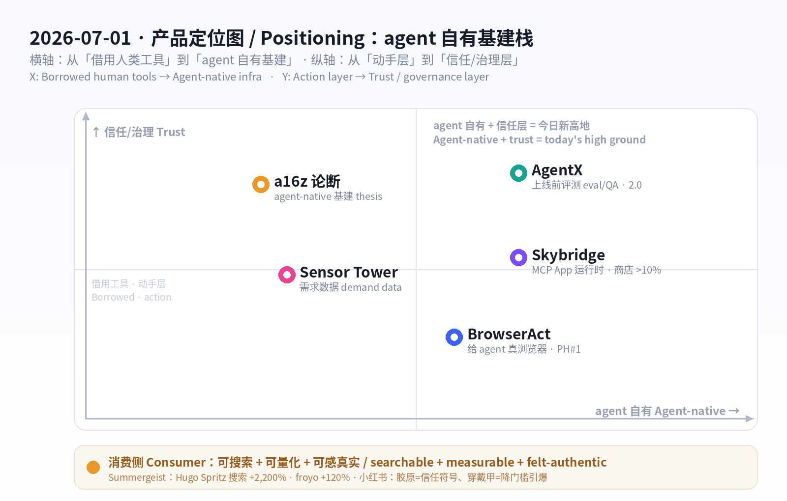
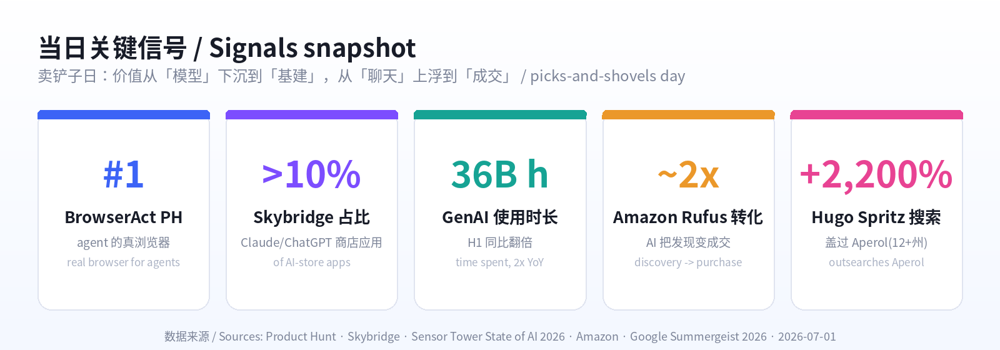

# 每日产品趋势报告 · Daily Product Trends Report
### 2026 年 7 月 1 日 · July 1, 2026

> **数据来源 / Sources:** Product Hunt（BrowserAct 6/25 当日第一、Skybridge、AgentX 2.0、Propane、Upstream）、Hacker News（6 月：从「炫技」转向信任/安全/可控）、a16z《Big Ideas 2026》（agent-native infrastructure）、Sensor Tower《State of AI 2026》（用量翻倍、AI 成为购物新入口）、Google《Summergeist 2026》（Hugo Spritz、jelly slides、froyo）、Amazon 夏季爆款、小红书（胶原 / 穿戴甲 / 效果化时代，NielsenIQ×小红书健康白皮书）。
> **方法 / Method:** WebSearch + web_fetch 抓取公开数据。X / LinkedIn / 小红书 / Sensor Tower / Product Hunt 多为登录或客户端渲染，采用公开检索摘要与新闻/新闻稿替代；BrowserAct 的 GlobeNewswire 新闻稿页返回空壳（客户端渲染），改用检索摘要。为保证每日新意，已**排除 6/12–6/29 已深度分析过的产品**（Fundraisly、Slashy、Vokal、Goldfish、Minimi、Framer 3.0、OpenCode、BlitzGraph、Wispr Flow、Lyto、MY AI Agent、NeuralTrust、fibermaxxing、观鸟/鸟门 等）。
> **免责声明 / Disclaimer:** 本报告为趋势研究，非投资建议。涉及融资/估值/排名/下载与收入为第三方公开披露或估算，可能随时变化。

---

## ① 当日概览 · Overview

**一句话 / In one line：** 6 月 29 日的主线是「agent 从『说』到『做』，于是信任成了产品界面」；**今天的主线是「agent 不再借用人类的工具——它开始拥有自己的基建」。** 今天是 agent 时代的「卖铲子日」：给 agent 一个**真正的浏览器**（BrowserAct 拿下 Product Hunt 当日第一）、给 agent 应用一个**原生运行时**（Skybridge 把 MCP App 写进 ChatGPT/Claude）、给 agent 一套**质检与评测层**（AgentX）。这正中 a16z《Big Ideas 2026》的判断：流量正从「人速」转向「agent 速」——递归、突发、海量；而 Sensor Tower 用数据证明需求是真的：GenAI 使用时长同比翻倍，AI 正成为「购物的新入口」。

> Where June 29 was *"agents go from talking to doing, so trust becomes the product surface,"* **today's throughline is "agents stop borrowing human tools and start owning their own infrastructure."** It's the picks-and-shovels day for the agentic web: give agents a *real browser* (**BrowserAct** hit #1 Product of the Day), give agent-apps a *native runtime* (**Skybridge** ships MCP Apps inside ChatGPT/Claude), and give agents a *QA + eval layer* (**AgentX**). It maps cleanly onto a16z's *Big Ideas 2026* call — traffic is shifting from human-speed to *agent-speed* (recursive, bursty, massive) — and Sensor Tower proves the demand is real: GenAI time spent more than doubled YoY, and AI is becoming *"the new front door to shopping."*

三股力量在同一天交汇 / Three forces converge today:

1. **基建侧——从「借用」到「自有」。** 过去 agent 在人类的浏览器、人类的 App、人类的后端里「打工」。今天它们开始有了自己的栈：**BrowserAct** 给 agent 一个能过验证码、过反爬、管理多身份的真浏览器；**Skybridge** 让开发者「写一次、发到 ChatGPT 和 Claude 的应用商店」；**AgentX** 在上线前把 agent 拉去「考试」，抓出幻觉与坏掉的工具调用。**栈在成型：能动手的浏览器 + 能渲染的运行时 + 能信任的评测。**
2. **理论侧——a16z 给基建侧背书。** a16z 直言：企业后端是为「人:系统 = 1:1」设计的，而一个 agent 的「一个目标」会炸成约 5,000 个子任务——在限流器眼里「像一次 DDoS」。于是会诞生一类「**agent-native 基建**」：用乐观并发取代锁的数据库、懂 agent 意图的 API 网关、显示「完成的任务」而非「每秒请求」的监控。**谁能扛住工具执行的洪水，谁就赢。**
3. **需求侧——Sensor Tower 用数字落地。** GenAI 使用时长 **17.2B→36B 小时**（H1 同比翻倍）；H1 下载约 **100 亿**、内购收入 **>$40 亿**（+36%）；Claude 成最快挑战者（美国份额 4.4%→~14%）。更关键：**AI 成为购物入口**——亚马逊 Rufus 用户转化率约为非用户的 **2 倍**，沃尔玛 Sparky 日活半年涨约 **50%**，ChatGPT 上「购物+软件」类广告已占近一半。

消费侧延续「可搜索、可量化、可感真实」逻辑：欧美由 **Google Summergeist 2026** 把「搜索」变成趋势预言机——**Hugo Spritz**（「在家怎么做」搜索 **+2,200%**、在 12+ 个州盖过 Aperol）、**jelly slides** 果冻凉鞋、**froyo** 酸奶冰回潮；中国的**小红书**进入「效果化时代」——**胶原**从成分名升级为「可信赖的抗老符号」，**穿戴甲**证明「降门槛/省时间」的产品创新能瞬间引爆。

**五条最强信号 / Five strongest signals**

1. **agent 自有基建 / Agents get their own stack.** BrowserAct（浏览器）+ Skybridge（运行时）+ AgentX（评测）= 卖铲子日。
2. **#1 是「真浏览器」/ The #1 product is a *real* browser.** BrowserAct 登顶，说明市场最缺的不是更聪明的 agent，而是让 agent「真的能上网办事」的底座。
3. **MCP App 成新分发面 / MCP Apps are the new distribution surface.** Skybridge 已驱动 Claude/ChatGPT 商店 **>10%** 的应用——聊天框正在变成应用商店。
4. **「评测/可观测」成刚需 / Eval & observability go mainstream.** AgentX 把「上线前考试」做成产品；a16z 说监控要从「请求/秒」变成「完成的任务」。
5. **搜索=趋势预言机，AI=购物入口 / Search predicts, AI converts.** Summergeist 用搜索预测爆款；Sensor Tower 显示 AI 助手把「发现」直接变「成交」。

---

## ② 逐个产品深度分析 · Product Deep-Dives

### 1. BrowserAct — 给 AI agent 一个「真正的浏览器」/ A real browser layer for AI agents

**Product Hunt 当日第一（约 6/25，Product of the Day）**，并在 7/1 由 GlobeNewswire 发稿背书：「BrowserAct 登顶 Product Hunt，凸显市场对『给 agent 的真浏览器层』的需求」。它的定位一针见血：**今天的 agent 很聪明，却常常卡在『打不开网页』这一步**——被验证码、反爬、地域限制挡住。BrowserAct 把自己做成「Browser-as-a-Service」：给 agent 一个**真实的 Chrome**，能开页、读屏、点击、输入、抽取、管理会话、跑多步流程；提供多种浏览模式（普通 Chrome、接管你当前会话、隐身浏览器过受保护页面、为账号类任务建独立身份），内置验证码求解器（reCAPTCHA v2/v3、Cloudflare Turnstile、DataDome、HUMAN），并用「类人交互 + 全球 IP」绕过高级反爬。对非技术用户，它支持**自然语言无代码**搭流程，产出干净的结构化数据，并接 Make / n8n / Zapier。

> BrowserAct hit **#1 Product of the Day (~June 25)**, with a July 1 GlobeNewswire push: *"BrowserAct Reaches No. 1, Highlighting Demand for a Real Browser Layer for AI Agents."* The insight is sharp: **today's agents are smart but keep stalling at "can't open the page"** — blocked by CAPTCHAs, anti-bot walls, geo-fences. BrowserAct is Browser-as-a-Service: a *real Chrome* an agent can drive — open, read, click, type, extract, manage sessions, run multi-step tasks. It offers multiple modes (normal Chrome, take over your live session, stealth browsers for protected pages, separate identities for account work), a built-in CAPTCHA solver (reCAPTCHA v2/v3, Cloudflare Turnstile, DataDome, HUMAN), and human-like interaction + global IPs to pass advanced anti-bot. For non-coders it's **no-code, natural-language** automation that returns clean structured data and wires into Make / n8n / Zapier.

| 维度 Dimension | 分析 Analysis |
|---|---|
| 商业模式 Business model | 信用点制订阅 + 用量；7 天免费试用。步骤 ~5 credits/步（低至 ~$0.0032/步），代理 ~5,000 credits/GB（~$3.20/GB）。Credit-based subscription + usage; 7-day trial. |
| 核心功能 Core value | 给 agent 一个能过验证码/反爬/地域限制的真 Chrome + 无代码抽数 + 自动化集成。A real, un-blockable Chrome for agents + no-code scraping + automation. |
| 成功因素 Success factors | 直击 agent 落地的最大堵点（「打不开网页」）；卖铲子定位；类人交互+全球 IP 提升成功率。Solves the #1 execution blocker; picks-and-shovels; high success rate. |
| 细分市场 Niche | agent / RPA / 数据抽取的「浏览器运行时」层。Browser-runtime layer for agents, RPA, scraping. |
| 目标受众 Audience | 做 agent 的开发者、自动化/增长团队、数据团队。Agent builders, automation/growth, data teams. |
| 品牌设计 Brand | 名字直白（Browser+Act）；定位「给 agent 的浏览器」对冲「通用 agent」噪音。Literal name; clear "browser *for agents*" wedge. |
| 产品数据 Data | PH 当日第一（~6/25）；GlobeNewswire 7/1 发稿；支持 4 类反爬挑战 + Make/n8n/Zapier。#1 PotD; 7/1 newswire; 4 anti-bot classes. |
| 链接 Link | [producthunt.com/products/browseract](https://www.producthunt.com/products/browseract) · [browseract.com](https://www.browseract.com/pricing) |
| 评论摘要 Reviews | 被赞「终于能让 agent 真控我的浏览器、过 anti-bot」；隐忧在合规与目标站点 ToS——「绕反爬」是双刃剑。Praised for *finally* letting agents control a real browser past anti-bot; concern = compliance / target-site ToS. |

### 2. Skybridge — MCP App 的「全栈框架」，写一次发到 ChatGPT 和 Claude / The framework for MCP Apps

如果 BrowserAct 让 agent「能上网」，**Skybridge**（开源，alpic-ai）解决的是「**agent 应用怎么写、怎么分发**」。它是一套全栈 TypeScript/React 框架，用来构建 **MCP App**——那些**直接渲染在 ChatGPT、Claude、VSCode 等聊天框里的交互式 React 组件**。开发者最头疼的「每个客户端实现都不一样」，被它一把抹平：帮你搞定 MCP server、视图渲染、客户端兼容、测试隧道，让你「**写一次、发到各家官方应用商店**」。数据已经很硬：MIT 协议、GitHub **1k+ star**、**月下载约 10 万**、**驱动 Claude 与 ChatGPT 商店里 >10% 的应用**——从 Fortune 500 到早期团队都在用。它的意义在于：当 ChatGPT/Claude 把聊天框变成「应用商店」，谁能把「写 MCP App」做成像写网页一样顺手，谁就卡住了新分发面的入口。

> If BrowserAct lets agents *reach* the web, **Skybridge** (open-source, by alpic-ai) answers *how you build and ship agent-apps*. It's a full-stack TypeScript/React framework for **MCP Apps** — interactive React widgets that render *directly inside* ChatGPT, Claude, VSCode and other MCP clients. The dev's biggest pain ("every client is different") is abstracted away: it handles the MCP server, view rendering, client compatibility, and a testing tunnel so you **"code once, ship everywhere"** to the official app stores. The traction is real: MIT-licensed, **1k+ GitHub stars**, **~100k monthly downloads**, and it **powers >10% of apps on the Claude and ChatGPT stores** — from Fortune 500s to startups. The point: as chatboxes become app stores, whoever makes building MCP Apps feel like building webpages owns the on-ramp to the new distribution surface.

| 维度 Dimension | 分析 Analysis |
|---|---|
| 商业模式 Business model | 开源（MIT）做心智与默认，预计走托管/云/企业版变现（Vercel 式）。OSS for mindshare; likely managed/cloud/enterprise upsell. |
| 核心功能 Core value | 一套框架写 MCP App，跨 ChatGPT/Claude/VSCode 兼容；server+渲染+测试隧道全包。One framework for MCP Apps across all clients. |
| 成功因素 Success factors | 卡位「聊天框=应用商店」的新分发面；React 生态熟悉；开源飞轮。Wedge on the new distribution surface; React familiarity; OSS flywheel. |
| 细分市场 Niche | MCP App / chatbot-内嵌应用的开发框架。Dev framework for in-chatbot apps. |
| 目标受众 Audience | 想在 ChatGPT/Claude 商店发应用的前端/全栈团队。Frontend/full-stack teams shipping to AI app stores. |
| 品牌设计 Brand | 名字「天桥」=连接两端；定位「MCP App 的 Next.js」。"Skybridge" = connector; "the Next.js of MCP Apps." |
| 产品数据 Data | MIT · 1k+ stars · ~100k 月下载 · 驱动 Claude/ChatGPT 商店 >10% 应用。MIT · 1k+ stars · ~100k DLs/mo · >10% of store apps. |
| 链接 Link | [producthunt.com/products/skybridge](https://www.producthunt.com/products/skybridge) · [skybridge.tech](https://www.skybridge.tech/) · [github.com/alpic-ai/skybridge](https://github.com/alpic-ai/skybridge) |
| 评论摘要 Reviews | 被赞「终于不用为每个客户端各写一遍」「像写网页一样写 MCP App」；隐忧在依赖各家商店政策。Praised for killing per-client rework; risk = platform/store policy dependence. |

### 3. AgentX — 上线前先「考试」：评测 + 部署 agent 的质检层 / The QA & eval layer for agents

BrowserAct 让 agent「能动手」、Skybridge 让 agent 应用「能分发」，**AgentX**（agentx.so，**2.0 已上线**）补上最后一环：「**怎么知道这个 agent 靠不靠谱**」。它是一套覆盖**搭建 + 评测 + 部署**的平台——拖拽式多 agent 工作流（工具、记忆、分支逻辑、人工接管），更关键的是**在上线前把 agent 拉去『考试』**：拿测试集跑回归、追踪指标退化、在用户遇到之前抓出**幻觉**和**坏掉的工具调用**。这正是 2026 的硬需求：当企业把 agent 推进生产，「能跑」不等于「能信」。行业把这层叫 AI agent observability/eval（同赛道有 AgentOps、Langfuse、W&B Weave、Braintrust 等），定价多在 **$500–$5,000/月**，但 a16z 的话更直接——监控的单位要从「请求/秒」变成「**完成的任务**」。

> BrowserAct lets agents *act*, Skybridge lets agent-apps *ship*, and **AgentX** (agentx.so, **2.0 live**) closes the loop: *how do you know the agent is any good?* It spans **build + evaluate + deploy** — drag-and-drop multi-agent workflows (tools, memory, branching, human handoff) — but the crux is **putting agents through an exam before launch**: run test sets, track regressions, and catch **hallucinations** and **broken tool calls** before users do. That's the 2026 hard requirement: as enterprises push agents to production, *"it runs"* ≠ *"I trust it."* The category (AI agent observability/eval — alongside AgentOps, Langfuse, W&B Weave, Braintrust) typically prices at **$500–$5,000/mo**, and a16z puts it bluntly: monitoring's unit must move from *requests-per-second* to *completed tasks.*

| 维度 Dimension | 分析 Analysis |
|---|---|
| 商业模式 Business model | SaaS 订阅（按席位/用量/评测量），对标可观测平台 $500–$5,000/月。SaaS by seat/usage/eval volume. |
| 核心功能 Core value | 搭建+评测+部署一体：测试集回归、抓幻觉/坏工具调用、多 agent 追踪、人工接管。Build+eval+deploy: regression, hallucination/tool-call catching, traces. |
| 成功因素 Success factors | 把「上线前考试」产品化；多 agent 协作正成主流，质检需求随之爆发。Productizes pre-launch QA as multi-agent goes mainstream. |
| 细分市场 Niche | AI agent 评测 / 可观测 / 编排。Agent eval / observability / orchestration. |
| 目标受众 Audience | 把 agent 推上生产的产品/工程/平台团队。Product/eng/platform teams shipping agents to prod. |
| 品牌设计 Brand | 名字「X=任意/未知」，强调通用编排；定位「agent 的 CI/CD+测试」。"X" = any agent; "CI/CD + tests for agents." |
| 产品数据 Data | AgentX 2.0 上线；赛道定价 $500–$5,000/月；同类含 AgentOps/Langfuse/Weave/Braintrust。2.0 live; $500–$5k/mo category. |
| 链接 Link | [agentx.so](https://www.agentx.so/) · [producthunt.com/products/agentx](https://www.producthunt.com/products/agentx) |
| 评论摘要 Reviews | 被赞「拖拽就能组多 agent + 自带评测」；隐忧在评测指标是否贴合真实业务。Praised for drag-and-drop multi-agent + built-in eval; concern = whether metrics match real tasks. |

> **同一栈里的配角 / Same stack, supporting cast：** **Propane**（为产品团队与 agent 自动补齐「客户上下文」——上下文层）与 **Upstream**（本周 PH 热榜）共同说明：agent 栈正在补齐「浏览器（动手）→ 运行时（分发）→ 评测（信任）→ 上下文（落地）」的每一环。*Propane auto-supplies customer context to teams and agents; with Upstream, they round out the agent stack: browser → runtime → eval → context.*

### 4.【趋势/数据】a16z「agent-native 基建」+ Sensor Tower《State of AI 2026》/ The agent-speed web, by the numbers

把上面三款产品放进一张更大的图：**a16z《Big Ideas 2026》**给出「为什么是现在」。核心论断：今天的企业后端是为「人:系统 = 1:1」设计的——可预测、低并发；而 agent 流量是**递归、突发、海量**的。一个 agent 接到「一个目标」，可能炸成约 **5,000 个子任务**、数据库查询和内部 API 调用——在传统限流器/数据库眼里，「**像一次 DDoS 攻击**」。结论：会出现一类 **agent-native 基建**——用乐观并发取代锁的数据库、懂 agent 意图与目标的 API 网关、把单位从「请求/秒」换成「**完成的任务**」的监控。**冷启动要更短、延迟方差要压平、并发上限要抬高几个数量级**；能扛住「工具执行洪水」的平台才能赢。

> Zoom out: **a16z's *Big Ideas 2026*** supplies the *why now*. Today's enterprise backend assumes a **1:1 human-to-system** ratio — predictable, low-concurrency. Agent traffic is **recursive, bursty, massive**: one "target" can fan out to ~**5,000 subtasks**, DB queries and internal API calls — to a rate limiter it **"resembles a DDoS."** The conclusion: a class of **agent-native infrastructure** — databases with optimistic concurrency instead of locks, API gateways that grok agent context and goals, monitoring that counts **completed tasks**, not requests-per-second. Cold starts shrink, latency variance collapses, concurrency limits jump orders of magnitude — and the platforms that survive the *deluge of tool execution* win.

而 **Sensor Tower《State of AI 2026》**把「需求是真的」量化了，并点出新战场——**AI 正成为购物的新入口**：

> And **Sensor Tower's *State of AI 2026*** quantifies that the demand is real — and names the new battleground: **AI is becoming the front door to shopping.**

| 指标 Metric | 数字 Figure | 含义 So what |
|---|---|---|
| GenAI 使用时长 Time spent | 17.2B → **36B** 小时（H1 YoY，翻倍+） | 需求侧真实爆发，基建被倒逼 / real demand forces the infra |
| AI App 下载 Downloads | H1 ≈ **100 亿** | 分发面海量 / massive distribution surface |
| 内购收入 IAP revenue | H1 **>$40 亿**（+36% vs H2'25） | 开始真正变现 / monetization kicks in |
| Claude 增长 | 美国份额 4.4% → **~14%**；ARPU $0.50→**$2.76** | 最快挑战者、单用户价值高 / fastest challenger, high ARPU |
| 亚马逊 Rufus 转化 | **~2×**（>40% vs ~20%） | AI 把「发现」变「成交」/ AI turns discovery into purchase |
| 沃尔玛 Sparky 日活 | 半年 **+~50%** | 零售自建购物 agent 提速 / retailers race to ship agents |
| AI 广告 AI ads | Q1 **$1.3B** 花费 / **167B** 曝光；健康类 +165% | ChatGPT 成研究期广告渠道 / ChatGPT as a research-stage ad channel |

**洞察 / Insight：** 产品（BrowserAct/Skybridge/AgentX）、理论（a16z）、数据（Sensor Tower）今天指向同一件事——**价值正从「模型」下沉到「让 agent 真能办事的基建」，并从「聊天」上浮到「成交」。** Product, thesis, and data all point the same way: value is sinking from *the model* down to *the infrastructure that lets agents actually do things*, and rising from *chat* up to *commerce.*

### 5.【消费趋势 · 欧美】Google Summergeist 2026：把「搜索」变成趋势预言机 / Search as the trend oracle

Google 推出 **Summergeist 2026**——一份**完全由真实搜索驱动**的夏季趋势报告（不靠时尚专家、靠几百万次搜索）。今年的爆点高度「可执行」：**Hugo Spritz**——「**在家怎么做 Hugo Spritz**」搜索量 **+2,200%**，并在 **12 个以上的州**搜索量盖过经典的 Aperol Spritz（配方：Prosecco + 接骨木花利口酒 + 苏打水 + 薄荷/青柠）；**jelly slides** 果冻凉鞋成为本月最热凉鞋类型（凉鞋搜索自 2017 年起每年 6 月必涨）；**froyo** 酸奶冰回潮（「frozen yogurt nyc」90 天 +120%）。对产品人，Summergeist 的真正价值是方法论：**搜索是最诚实的需求信号**——「在家怎么做 X」「X 在哪买」式的长尾搜索，往往比榜单更早、更准地预告下一个爆款。

> Google launched **Summergeist 2026** — a summer-trends report **powered entirely by real searches** (millions of queries, not fashion panels). This year's spikes are highly *actionable*: **Hugo Spritz** — *"how to make a hugo spritz at home"* up **+2,200%**, outsearching the classic Aperol spritz in **12+ states** (Prosecco + elderflower liqueur + soda + mint/lime); **jelly slides** became the month's top slide type (slide searches spike every June since 2017); and **froyo** is back (*"frozen yogurt nyc"* +120% in 90 days). For product people the real takeaway is method: **search is the most honest demand signal** — long-tail *"how to make X at home"* / *"where to buy X"* queries call the next hit earlier and more reliably than any leaderboard.

| 维度 Dimension | 分析 Analysis |
|---|---|
| 商业模式 Business model | 趋势套利：把搜索飙升的品类做成产品/内容/电商选品。Trend arbitrage: turn search spikes into products/content/SKUs. |
| 核心信号 Core signal | 「在家怎么做 X」「X 在哪买」= 高购买意图长尾。"How to make/where to buy X" = high-intent long tail. |
| 成功因素 Success factors | 搜索=诚实需求、领先指标；季节性可预测（凉鞋每年 6 月涨）。Honest, leading, seasonal demand. |
| 细分市场 Niche | 餐饮饮品（Hugo Spritz/froyo）、夏季时尚（jelly slides）。F&B + summer fashion. |
| 目标受众 Audience | DTC/电商选品、内容创作者、餐饮品牌、零售买手。DTC/e-com, creators, F&B, retail buyers. |
| 产品数据 Data | Hugo Spritz 搜索 +2,200%、盖过 Aperol（12+ 州）；froyo +120%（90 天）。+2,200% / +120%. |
| 链接 Link | [blog.google · Summergeist](https://blog.google/products-and-platforms/products/search/summergeist-google-trends/) · [trends.withgoogle.com](https://trends.withgoogle.com/trends/summergeist/) · [axios.com · Hugo Spritz](https://www.axios.com/2026/06/29/hugo-spritz-popular-what-is-it) |
| 评论摘要 Reviews | 媒体共识：Hugo「比 Aperol 更清爽、更上镜」是出圈关键；jelly 鞋靠「复古+好清洗+便宜」。Hugo = lighter & more photogenic than Aperol; jelly = retro, washable, cheap. |

### 6.【消费趋势 · 欧美】可量化的健康 + 可负担的「美学平替」/ Measurable wellness + affordable aesthetic dupes

延续「fibermaxxing」的逻辑，欧美消费继续往「**能测量、能晒、能负担**」走。**健康可量化**：膳食纤维搜索创历史新高、**镁（magnesium）**与补剂热度持续——人们要的是「有数字的健康优化」。**爆款可负担**：亚马逊夏季清单里，**Owala FreeSip**（「2026 最潮水瓶」）、**Stanley Quencher** 把水杯变成身份配饰；**$13 的 Glotion 高光**（甘油+乳木果，「由内而外的光」）、**Mighty Patch**、**$7 去角质足膜**、**不到 $40 的蘑菇灯**（单月卖出 1,000+）——共同点是「**小钱买到大效果/大情绪**」：用平价单品复制贵价审美与「自我犒赏」。对品牌的启示：**把功效做成可测量的数字，把审美做成可负担的平替**，就能同时吃到「健康焦虑」与「悦己消费」两股流量。

> Extending the *fibermaxxing* logic, Western consumption keeps drifting toward **measurable, postable, affordable**. **Quantified health**: dietary-fiber searches at all-time highs, **magnesium** and supplements sustained — people want *health optimization with a number on it.* **Affordable hits**: on Amazon's summer lists, **Owala FreeSip** ("trendiest bottle of 2026") and **Stanley Quencher** turn hydration into an identity accessory; a **$13 Glotion highlighter** (glycerin + shea, "lit-from-within"), **Mighty Patch**, a **$7 foot-peel**, a **sub-$40 mushroom lamp** (1,000+ sold in a month) — all share one move: **small spend, big effect/emotion.** The brand lesson: **make efficacy a measurable number, make aesthetics an affordable dupe**, and you ride both *health anxiety* and *self-reward* at once.

| 维度 Dimension | 分析 Analysis |
|---|---|
| 商业模式 Business model | 平价高频复购（补剂/个护）+ 社媒病毒裂变（TikTok/Amazon review）。Cheap, repeat-buy + social virality. |
| 核心因素 Core factors | 可量化功效（纤维/镁）+ 可负担审美平替（水杯/高光/蘑菇灯）。Quantified efficacy + affordable aesthetic dupes. |
| 细分市场 Niche | 功能性补剂、个护美妆、生活方式小家居。Supplements, personal care, lifestyle home. |
| 目标受众 Audience | Z 世代/千禧、健康优化者、「悦己」轻奢消费者。Gen Z/millennial wellness optimizers + self-reward buyers. |
| 产品数据 Data | 纤维搜索历史新高；Owala/Stanley 长居榜单；蘑菇灯单月 1,000+。Fiber ATH; bottles top-rank; lamp 1,000+/mo. |
| 链接 Link | [today.com · Amazon trending](https://www.today.com/shop/amazon-trending-products-may-2026-rcna344561) · [amazon.com/gp/new-releases](https://www.amazon.com/gp/new-releases) |
| 评论摘要 Reviews | 评论高频词：「便宜大碗」「拍照好看」「有数据感」；隐忧在补剂功效证据与同质化。Reviews: cheap/photogenic/data-y; risk = thin efficacy evidence + sameness. |

### 7.【消费趋势 · 中国】小红书：胶原成「信任符号」+ 穿戴甲做「降门槛引爆」/ Collagen as a trust-symbol & press-ons as a friction-killer

中国侧，**小红书**进入「**种草效果化时代**」——用户打开 App 是带着「要解决的问题」来的，核心认知是「**看见具体的人**」，真诚沉浸的内容比硬广更能促单。两个最具代表性的产品信号：①**胶原（重组胶原蛋白）**——「胶原」已**从一个成分名升级为用户听得懂、愿意相信的『抗老符号』**，自带流量与信任（重组胶原蛋白 2022 年市场约 ¥3.34 亿、同比 **+54.6%**，医用敷料/功效护肤各占约一半；小红书健康类笔记同比 **+100%**，18–25 岁中 **47%+** 的健康购买认知来自社媒）。②**穿戴甲**——它的高热度证明一条朴素铁律：**任何能极大降低使用门槛、节省时间的产品创新，都有机会瞬间引爆市场**（把「去美甲店 2 小时」压成「在家 5 分钟」）。

> In China, **Xiaohongshu (RED)** has entered its **"buzz-to-measurable-outcomes" era** — users open the app *with a problem to solve*, the core mindset is **"see the specific person,"** and sincere, immersive content converts better than hard ads. Two signal products: ① **Collagen (recombinant collagen)** — *"胶原"* has graduated **from an ingredient name into a trusted anti-aging *symbol*** that self-generates traffic and trust (recombinant-collagen market ~¥334M in 2022, **+54.6% YoY**, split ~evenly between medical dressings and functional skincare; RED health-notes **+100% YoY**; **47%+** of 18–25-year-olds' health-purchase awareness comes from social). ② **Press-on (wearable) nails** — their heat proves a plain law: **any innovation that radically lowers the barrier / saves time can ignite a market overnight** (compressing "2 hours at the salon" into "5 minutes at home").

| 维度 Dimension | 分析 Analysis |
|---|---|
| 商业模式 Business model | 内容种草→闭环电商；成分品牌化（胶原）+ 高频快消（穿戴甲）。Content→commerce; ingredient-as-brand + fast-moving repeat. |
| 核心因素 Core factors | 把成分做成「信任符号」（胶原）；把流程「降门槛」（穿戴甲）。Turn an ingredient into trust; strip friction from a ritual. |
| 细分市场 Niche | 功效护肤/抗老（胶原）、美甲/美护（穿戴甲）。Anti-aging skincare; nail/beauty. |
| 目标受众 Audience | 18–35 女性为主，抗老意识 + 「省时悦己」需求。Women 18–35: anti-aging + time-saving self-care. |
| 品牌设计 Brand | 「成分即信任」叙事 + 「活人感」真实笔记；视觉清新/高级感。"Ingredient = trust" + authentic notes; clean/premium visuals. |
| 产品数据 Data | 重组胶原 +54.6% YoY（2022）；RED 健康笔记 +100% YoY；47%+ 认知来自社媒。+54.6% / +100% / 47%+. |
| 链接 Link | [知乎 · 小红书八大趋势](https://zhuanlan.zhihu.com/p/1991105890716247188) · [NielsenIQ×小红书健康白皮书](https://nielseniq.cn/global/zh/insights/report/2025/xiaohongshu-healthcare-whitepaper/) |
| 评论摘要 Reviews | 笔记高频词：「成分看得懂」「肤感先行」「在家几分钟」；隐忧在胶原功效宣称合规与同质化。Notes: understandable ingredients, felt-first, DIY-fast; risk = efficacy-claim compliance + sameness. |

---

## ③ 横向对比表 · Cross-Comparison

| 产品/趋势 Item | 类型 Type | 商业模式 Model | 细分市场 Niche | 目标受众 Audience | 关键数据 Key data | 成功要点 Why it wins |
|---|---|---|---|---|---|---|
| **BrowserAct** | AI 基建 Browser | 信用点订阅+用量 Credits | agent 浏览器运行时 | agent 开发者/自动化 | PH 当日#1（~6/25）；过 4 类反爬 | 解决 agent「打不开网页」最大堵点 |
| **Skybridge** | AI 基建 Runtime | 开源 MIT + 预期托管 | MCP App 框架 | 前端/全栈团队 | 1k+ star；~10 万/月下载；商店 >10% 应用 | 卡位「聊天框=应用商店」分发面 |
| **AgentX** | AI 基建 Eval | SaaS 订阅 $500–5k/mo | agent 评测/编排 | 产品/工程/平台 | AgentX 2.0；抓幻觉/坏工具调用 | 把「上线前考试」产品化 |
| **a16z 论断** | 趋势 Thesis | （研究/投资）| agent-native 基建 | 创始人/投资人 | 1 目标→~5,000 子任务=「像 DDoS」 | 给基建侧「为什么是现在」背书 |
| **Sensor Tower** | 数据 Data | （市场情报）| AI App 市场 | 增长/投资/产品 | 时长翻倍 36B h；Rufus 转化~2× | 证明需求真、AI 成购物入口 |
| **Summergeist** | 消费·欧美 | 趋势套利 | 餐饮+夏季时尚 | DTC/创作者/买手 | Hugo +2,200%；froyo +120% | 搜索=最诚实的领先需求信号 |
| **可量化健康/平替** | 消费·欧美 | 平价高频+社媒裂变 | 补剂/个护/小家居 | Z 世代/千禧 | 纤维搜索历史新高；蘑菇灯 1,000+/月 | 可测量功效 + 可负担审美 |
| **小红书 胶原/穿戴甲** | 消费·中国 | 内容种草→闭环电商 | 抗老护肤/美甲 | 18–35 女性 | 重组胶原 +54.6%；健康笔记 +100% | 成分=信任符号；降门槛即引爆 |

---

## ④ 关键洞察与共性总结 · Key Insights & Common Patterns

**1）卖铲子日：价值从「模型」下沉到「基建」。/ Picks-and-shovels: value sinks from model to infrastructure.**
今天登顶与上榜的，不是「更聪明的 agent」，而是**让 agent 真能办事的底座**——浏览器（BrowserAct）、运行时（Skybridge）、评测（AgentX）、上下文（Propane）。a16z 用「agent-speed = 像 DDoS」给出理论，Sensor Tower 用「时长翻倍」给出需求。**当一类能力变成共识，钱就流向支撑它的管道。**

**2）新分发面正在出现：聊天框 = 应用商店。/ A new distribution surface: the chatbox is the app store.**
Skybridge 已驱动 Claude/ChatGPT 商店 >10% 的应用；Sensor Tower 显示 ChatGPT 成「购物入口」与「研究期广告渠道」。**谁能把『在聊天框里发应用/做生意』变简单，谁就握住下一个流量入口。**

**3）「信任」从产品功能升级为基础设施。/ Trust graduates from feature to infrastructure.**
6/29 是 agent「执行前确认」「给 agent 上锁」；今天是把「**上线前考试（AgentX）**」「**显示完成的任务而非请求/秒（a16z）**」做进基建。**能动手之后，『可评测、可观测、可信任』成了硬通货。**

**4）需求要可量化、可成交、可感真实。/ Demand must be measurable, transactional, and authentic.**
欧美：Summergeist 用搜索把需求量化（Hugo +2,200%），Sensor Tower 把 AI 变成「成交入口」（Rufus 转化~2×），消费者要「有数字的健康 + 可负担审美」。中国：小红书把成分做成「信任符号」（胶原）、把流程「降门槛」（穿戴甲）。**底层是同一句话：把模糊的渴望，翻译成一个可测量、可购买、可信任的具体东西。**

**5）给不同角色的可执行启示 / Action items：**
- **建 agent 的人 / Agent builders：** 别只卷模型——卷「让 agent 真能上网、能分发、能被信任」的那一层（浏览器/运行时/评测/上下文）。
- **做消费品的人 / Consumer builders：** 把 Summergeist 式搜索飙升当选品雷达；把功效做成数字、把审美做成平价平替；在小红书把「成分」做成可信赖符号、把「流程」降到几分钟。
- **投资/研究 / Investors：** 关注 agent-native 基建（并发/网关/评测/可观测）与「AI 购物入口」（零售 agent、ChatGPT 广告）两条主线。

---

> **方法与局限 / Method & limits：** 本报告基于公开检索与新闻/新闻稿，部分平台（X/LinkedIn/小红书/Sensor Tower/Product Hunt）登录或客户端渲染，数字为第三方披露/估算，含一定误差；融资、排名、下载与收入随时可能更新。**非投资建议。** Based on public search + press; some platforms are gated/JS-rendered; figures are third-party estimates and may change. **Not investment advice.**

*生成于 2026-07-01 · Generated 2026-07-01 · 自动化每日产品趋势任务 / Automated daily product-trend task*
