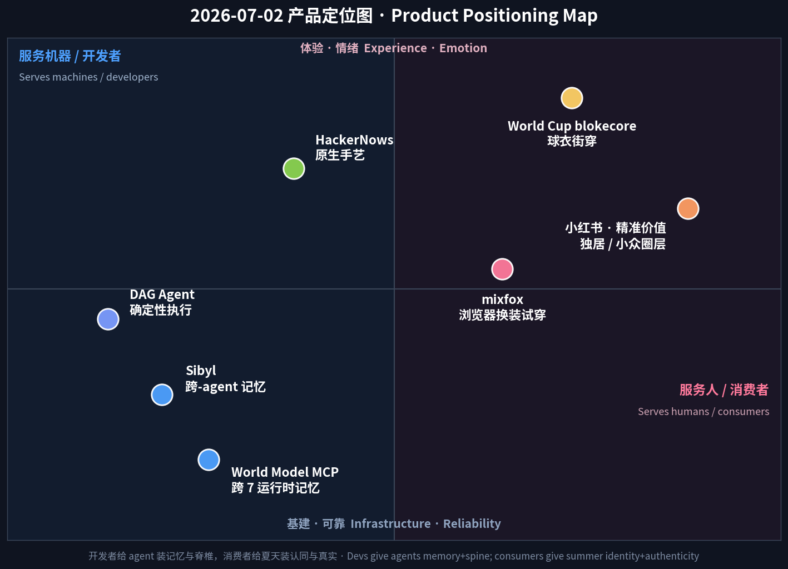

# 每日产品趋势报告 · Daily Product Trends Report
### 2026 年 7 月 2 日 · July 2, 2026

> **数据来源 / Sources:** Hacker News（Show HN 7/1 榜：Sibyl、World Model MCP、Google OKF agent memory、Agentic OS、petabyte agent-sandbox 存储、DAG coding agent、mixfox 浏览器换装、HackerNows）、a16z《Big Ideas 2026》（death of the prompt / 多智能体「数字团队」）、Sensor Tower《State of AI 2026》、agent-memory 市场报告（mem0 / vectorize / atlan）、Trendalytics + WWD + TheStreet（World Cup 2026 blokecore 零售）、Forbes/Glance（虚拟试穿）、小红书 2026 八大趋势（知乎 / TopMarketing）、Amazon Movers & Shakers。
> **方法 / Method:** WebSearch + web_fetch 抓取公开数据。Sensor Tower / X / LinkedIn / 小红书 / Product Hunt 多为登录或客户端渲染，采用公开检索摘要与新闻/新闻稿替代。为保证每日新意，已**排除 6/12–7/01 已深度分析过的产品**（BrowserAct、Skybridge、AgentX、Propane、Upstream、Framer 3.0、Wispr Flow、Fundraisly、Slashy、Vokal、Goldfish、Minimi、观鸟/鸟门 等）。
> **免责声明 / Disclaimer:** 本报告为趋势研究，非投资建议。融资/估值/排名/下载与收入为第三方公开披露或估算，可能随时变化。

---

## ① 当日概览 · Overview

**一句话 / In one line：** 7 月 1 日的主线是「agent 不再借用人类工具，开始拥有自己的基建（浏览器 + 运行时 + 评测）」；**今天的主线是「agent 长出了记忆——和一根脊椎」。** 同一天，Hacker News 上冒出**一整簇彼此独立的「agent 记忆 / agent 运行时」发布**（Sibyl 跨 agent 记忆、World Model MCP 跨 7 个编码 agent 的记忆、Google OKF 的记忆校验框架、Agentic OS、给 agent 沙箱的 PB 级存储、Multi-User Agent Workspace），再加上一个「把意图编译成**可验证 DAG** 再执行」的确定性 agent。昨天缺的两块——**持久性**与**可靠性**——今天一次到齐。

> Where July 1 was *"agents stop borrowing human tools and start owning their stack — browser, runtime, eval,"* **today's throughline is "agents grow a memory — and a spine."** In a single day, Hacker News surfaced a whole *cluster* of independent **agent-memory / agent-runtime** launches — Sibyl (cross-agent memory), World Model MCP (memory across 7 coding agents), Google's OKF memory-verification framework, Agentic OS, petabyte storage for agent sandboxes, a Multi-User Agent Workspace — plus a **determinism** play that compiles intent into a *verifiable DAG* before running. The two pieces missing from yesterday's "own your stack" story — **persistence** and **reliability** — all showed up at once.

这不是巧合，而是需求到了临界点。**每个编码 agent 都有同一个病：会话一结束，什么都忘了。** 官方解法是一个平铺文件（CLAUDE.md / .cursorrules / AGENTS.md），约 200 行封顶、一个 sprint 就过时，而且**在 Claude Code、Cursor、Codex 之间互不共享**——每个 agent 每次都从零重建上下文。真正的成本不是「缺信息」，而是**跨 10、20、50 次会话反复重学**。于是市场给出定价：agent 记忆赛道 **2026 年约 $62.7 亿 → 2030 年约 $284.5 亿（≈35% CAGR）**；mem0 已拿 $24M A 轮、Letta $10M 种子。

> It isn't a coincidence — it's demand hitting a threshold. **Every coding agent has the same disease: it forgets everything when the session ends.** The official fix is a flat file (CLAUDE.md / .cursorrules / AGENTS.md) that caps ~200 lines, goes stale within a sprint, and **isn't shared across Claude Code, Cursor, or Codex** — each agent rebuilds context from scratch. The real cost isn't missing information; it's *compounding re-learning across 10, 20, 50 sessions.* The market has put a price on it: the agent-memory space is **~$6.27B in 2026 → ~$28.45B by 2030 (≈35% CAGR)**, with Mem0 ($24M Series A) and Letta ($10M seed) already funded.

a16z 给这簇发布做了理论背书。《Big Ideas 2026》的判断是：**2026 是「输入框之死」**——下一代 AI 应用**零提示**，观察你在做什么、主动替你行动；企业从「孤立工具」转向像「协调的数字团队」一样运作的**多智能体系统**。而一支「数字团队」若没有**共享、持久的记忆底座**，就只是一群互相失忆的临时工。**记忆，是让 agent 从『会话』升级为『同事』的前提。**

> a16z underwrites the cluster. *Big Ideas 2026* calls 2026 **"the death of the prompt box"** — next-wave apps do *zero* visible prompting, observing what you do and acting proactively — and says enterprises are shifting from isolated tools to **multi-agent systems that behave like coordinated digital teams.** A "digital team" without a *shared, durable memory substrate* is just a crew of amnesiac temps. **Memory is what upgrades an agent from a "session" into a "colleague."**

与此同时，**消费世界正在经历自己的一种「记忆」——四年一遇的超级周期**。**2026 世界杯**正在美/加/墨本土进行（约 6/11–7/19），把 **blokecore（球衣街穿）** 变成十亿美元级零售引擎：blokecore 球衣搜索 **同比 +1,839%**，世界杯相关商品预计带动约 **$41 亿** 收入，球衣市场 **$83 亿**。而**浏览器原生虚拟试穿**（HN 上的 mixfox「换脸 + 换装」+ Google/Zara 宏观）正悄悄重写「怎么买衣服」——**试穿用户转化率约 10×、退货率降 25–48%、且无需下载 App**。中国这边，**小红书进入「精准价值」时代**：把流量倾斜给素人、押注**小众兴趣圈层**与**独居真实生活**，用「精致 vlog」换「放飞真实」。

> Meanwhile, the consumer world is living its own kind of "memory" — a **once-every-four-years supercycle.** The **2026 World Cup** is being played on US/CA/MX soil right now (~Jun 11–Jul 19), turning **blokecore** (jersey-as-streetwear) into a billion-dollar retail engine: blokecore jersey searches **+1,839% YoY**, ~**$4.1B** in related merch revenue, an **$8.3B** jersey market. And **browser-native virtual try-on** (mixfox's "face-swap + outfit try-on" on HN, plus the Google/Zara macro) is quietly rewiring how people buy clothes — **~10× conversion, 25–48% fewer returns, no app to install.** In China, **Xiaohongshu leaned into "precise value"** — tilting reach to nano-creators and betting on **niche interest circles** and **unfiltered solo-living** over polished vlogs.

**五条最强信号 / Five strongest signals**

1. **agent 记忆是当日第一开发者主题 / Agent memory is the day's #1 dev theme.** 一天之内 6+ 个彼此独立的记忆/运行时/OS 发布同时上 HN——需求到了临界点。Six-plus independent memory/runtime/OS launches in one day.
2. **「确定性」与「记忆」并肩登场 / Determinism joins memory.** agent 从「凭感觉」走向「先编译成可验证 DAG 再跑」——可靠性成了新卖点。From vibes to a verifiable DAG before execution.
3. **战场是「跨 agent / 跨运行时」/ The battle is cross-agent, cross-runtime.** 能横跨 Claude Code + Cursor + Codex 的共享记忆才有价值（World Model MCP 跨 7 个 agent）。Shared memory that spans your whole agent fleet.
4. **消费超级周期正在直播 / A consumer supercycle is live.** 世界杯 blokecore + 浏览器试穿，把「发现」直接变「成交」。World Cup blokecore + browser try-on convert discovery into purchase.
5. **中国的「精准价值」转向 / China's "precise value" turn.** 小众 + 真实，胜过 覆盖 + 精致。Niche + real beats reach + gloss.

---

## ② 逐个产品深度分析 · Product Deep-Dives

### 1. Sibyl — 给编码 agent 的「自托管跨 agent 记忆」/ Self-hosted cross-agent memory for coding agents

**Sibyl**（Show HN，作者 hyperb1iss）直击当日最痛的点：**你的 agent 舰队各自失忆。** 你用 Claude Code 重构、用 Cursor 补全、用 Codex CLI 跑 shell——三个 agent 学到的东西互不相通，每次都从零开始。Sibyl 的方案是**一个自托管的记忆服务**：所有 agent 通过 MCP（或 hooks / REST）读写同一份持久记忆；检索不是「grep 一个 markdown」，而是**真正的检索管线（向量 + 关键词 + 知识图谱融合）**。关键词是 **self-hosted**——把「你的代码库知识」这类最敏感的资产**留在你自己的机器/VPC 里**，而不是交给第三方云。它踩中的正是 a16z 说的「多智能体数字团队」的地基：**没有共享记忆，团队就不存在。**

> **Sibyl** (Show HN, by hyperb1iss) hits the day's sharpest pain: **your agent fleet is collectively amnesiac.** You refactor in Claude Code, autocomplete in Cursor, run shell tasks in Codex CLI — and none of them share what they learned; every session starts at zero. Sibyl's answer is a **self-hosted memory service**: every agent reads/writes one persistent store via MCP (or hooks/REST), and retrieval is a *real pipeline* (vectors + keyword + knowledge graph) rather than grepping a markdown file. The keyword is **self-hosted** — keep your most sensitive asset (codebase knowledge) *on your own machine/VPC* instead of a third-party cloud. It sits exactly on a16z's foundation for "multi-agent digital teams": **without shared memory, there is no team.**

| 维度 Dimension | 分析 Analysis |
|---|---|
| 商业模式 Business model | 开源 / 自托管为主，未来大概率「开源核心 + 托管云 / 企业版（治理、审计、SSO）」变现。Open-source/self-hosted core; likely OSS-core + managed/enterprise later. |
| 核心功能 Core value | 跨 agent 的**共享持久记忆**：一处写入，Claude Code / Cursor / Codex 都能召回；向量+关键词+知识图谱检索。One shared memory across your whole agent fleet. |
| 成功因素 Success factors | 直击「跨会话反复重学」；self-hosted 打消数据外流顾虑；踩在 $62.7B 赛道上。Kills re-learning; data stays home; rides a $6.27B market. |
| 细分市场 Niche | 编码 agent 的记忆/上下文层（个人开发者 + 小团队起步）。Memory layer for coding agents. |
| 目标受众 Audience | 多 agent 并用的开发者、注重代码隐私的团队。Devs juggling multiple agents; privacy-conscious teams. |
| 品牌设计 Brand | 名字取自「女先知 Sibyl」——预言/记忆意象，气质与「记忆」定位契合。Oracle name = memory/foresight. |
| 产品数据 Data | HN Show HN（7/1）；赛道 $6.27B(2026)→$28.45B(2030)，35% CAGR。HN launch 7/1; market 35% CAGR. |
| 链接 Link | [news.ycombinator.com/item?id=48741558](https://news.ycombinator.com/item?id=48741558) |
| 评论摘要 Reviews | 认同「flat-file 记忆撑不过一个 sprint」；讨论焦点：与 mem0/Letta/Zep 的差异、知识图谱是否过重、self-host 的运维成本。Debate: vs mem0/Letta; is the KG overkill; self-host ops cost. |

### 2. World Model MCP v0.10.0 — 跨 7 个编码 agent 的记忆 / Cross-runtime memory across 7 coding agents

如果说 Sibyl 是「自托管派」，**World Model MCP**（Show HN，作者 saravanan2294）把同一场战争打向**「跨运行时」维度**：它宣称**一份记忆横跨 7 个编码 agent 运行时**。这正是 2026 记忆赛道的真正护城河所在——**不是「哪个 agent 记性好」，而是「记忆能不能跟着你换 agent」**。开发者不会只用一个 agent；当记忆变成可移植的公共层，agent 本身就被商品化，价值上移到「记忆 + 编排」。v0.10.0 的版本号也说明这仍是早期、快速迭代的开源项目——但**方向感极强**：把「世界模型 / 项目知识」做成一个所有 agent 都能挂载的 MCP 端点。

> If Sibyl is the *self-hosted* camp, **World Model MCP** (Show HN, saravanan2294) fights the same war on the **cross-runtime** axis: it claims **one memory spanning 7 coding-agent runtimes.** That's where 2026's real moat lives — *not "which agent remembers best," but "does memory follow you when you switch agents."* Developers won't standardize on one agent; once memory becomes a portable, shared layer, the agent itself gets commoditized and value moves up to *memory + orchestration.* The v0.10.0 tag says it's early and iterating fast — but the *direction* is sharp: expose "world model / project knowledge" as an MCP endpoint any agent can mount.

| 维度 Dimension | 分析 Analysis |
|---|---|
| 商业模式 Business model | 开源 MCP server；变现路径类似（托管、团队同步、企业治理）。Open-source MCP server; hosted/team/enterprise upside. |
| 核心功能 Core value | **可移植记忆**：横跨 7 个 agent 运行时的「世界模型」，换 agent 不丢上下文。Portable memory across 7 agent runtimes. |
| 成功因素 Success factors | 卡住「跨运行时」这个真护城河；MCP 标准化红利；开源快速迭代。Owns the portability moat; rides MCP standard. |
| 细分市场 Niche | 多 agent 团队的「记忆互操作」层。Memory-interop layer for multi-agent setups. |
| 目标受众 Audience | 同时用 Claude Code/Cursor/Codex 等多家 agent 的开发者与团队。Devs running several agents at once. |
| 品牌设计 Brand | 「World Model」直接借用 AI 前沿术语，暗示「不止记事实，还建模项目」。"World Model" borrows a frontier term = models the project, not just facts. |
| 产品数据 Data | HN Show HN（7/1）；v0.10.0；宣称跨 7 个 agent 运行时。HN 7/1; spans 7 runtimes. |
| 链接 Link | [news.ycombinator.com/item?id=48743544](https://news.ycombinator.com/item?id=48743544) |
| 评论摘要 Reviews | 兴趣点在「跨运行时」；质疑在于 7 个 agent 的记忆 schema 如何统一、冲突如何解决。Interest in portability; questions on schema unification & conflict resolution. |

### 3. 确定性 DAG 编码 agent — 先编译成可验证图，再执行 / The deterministic-DAG coding agent

当天 HN Show HN **第 3 名**（作者 arman-w-jalili）代表着「agent 长脊椎」的另一半：**可靠性**。它的做法反直觉但切中要害——**不让 LLM 一边想一边动手，而是先把「意图」编译成一张确定性的 DAG（有向无环图），把整个执行计划摊开、可检查、可复现，再去跑。** 这解决的是 agent 最大的信任赤字：**同一个提示，两次跑出两种结果**。把「计划」与「执行」解耦后，你能在动手前审计每一步、缓存中间结果、失败时精确重放。这与 a16z「设计给 agent、不是给人」的判断同频：**当 agent 要在生产里干活，『可复现』比『更聪明』更值钱。**

> The day's **#3 Show HN** (by arman-w-jalili) is the other half of "agents grow a spine": **reliability.** Its move is counterintuitive but on-point — **instead of letting the LLM think and act at the same time, it compiles "intent" into a deterministic DAG first**, laying the whole execution plan out to be inspected and reproduced *before* anything runs. That attacks the agent's biggest trust deficit: *same prompt, two different outcomes.* Decoupling *plan* from *execution* lets you audit each step up front, cache intermediate results, and replay failures precisely. It rhymes with a16z's "design for agents, not humans": **when an agent does real work in production, *reproducible* beats *smarter.***

| 维度 Dimension | 分析 Analysis |
|---|---|
| 商业模式 Business model | 早期；预计开发者工具方向（开源 + 云执行/团队协作变现）。Early; likely dev-tool (OSS + cloud execution). |
| 核心功能 Core value | 把意图**编译成可验证 DAG** 再执行：计划可审计、结果可复现、失败可重放。Compile intent → verifiable DAG → reproducible runs. |
| 成功因素 Success factors | 直击「非确定性」信任赤字；plan/exec 解耦；契合生产级 agent 需求。Kills nondeterminism; production-grade. |
| 细分市场 Niche | 可靠 agent 编排 / 生产级 agent 执行层。Reliable agent orchestration. |
| 目标受众 Audience | 要把 agent 放进 CI/生产流水线的工程团队。Teams putting agents into CI/production. |
| 品牌设计 Brand | 以「确定性 / DAG」为记忆点，气质偏工程严谨。Positioned on determinism — engineering-serious. |
| 产品数据 Data | HN Show HN 当日 **#3**，11 pts。#3 Show HN of the day, 11 pts. |
| 链接 Link | [news.ycombinator.com/item?id=48741332](https://news.ycombinator.com/item?id=48741332) |
| 评论摘要 Reviews | 认可「先规划后执行」；讨论：LLM 生成的 DAG 本身是否确定、动态分支怎么处理。Praise for plan-then-run; debate on whether the LLM-built DAG is itself deterministic. |

### 4. mixfox — 浏览器里的实时换脸 + 换装试穿 / Live face-swap & outfit try-on in the browser

**mixfox**（Show HN #8）把当日最强的**消费级 AI**信号具象化：**打开浏览器就能实时换脸、换装试穿——无需下载 App、无需 3D 建模。** 它单点切入的，是一场正在成为「必备」的宏观趋势：2026 年虚拟试穿（VTO）从「实验」变「刚需」。技术拐点是**用生成式 AI 直接处理 2D 图片**（不再需要 3D 资产）+ **WebXR/浏览器 AR**（去掉 App 下载门槛），把可触达人群一次放大。商业价值是硬的：**试穿用户对同一商品页的转化率约为不试穿的 10×，退货率下降 25–48%**（服饰/鞋类最受益，因为「尺码不确定」正是退货头号原因）。Google（联手 DressX）、Zara（1 月上线交互式试穿）已在把它主流化——mixfox 这类「浏览器原生、零门槛」的实现，正是这条曲线的平民化入口。

> **mixfox** (Show HN #8) makes the day's strongest **consumer-AI** signal concrete: **real-time face-swap and outfit try-on right in the browser — no app, no 3D modeling.** Its wedge rides a macro trend that's becoming *table stakes*: in 2026, virtual try-on (VTO) went from experiment to essential. The inflection is **generative AI on plain 2D images** (no 3D assets) plus **WebXR/browser AR** (no app download), expanding the addressable audience at once. The business case is hard: **try-on users convert ~10× vs non-try-on on the same PDP, and returns drop 25–48%** (apparel/footwear benefit most, since sizing uncertainty is the #1 return driver). Google (with DressX) and Zara (interactive try-on shipped in January) are mainstreaming it — and browser-native, zero-friction builds like mixfox are the mass-market on-ramp.

| 维度 Dimension | 分析 Analysis |
|---|---|
| 商业模式 Business model | 预计 freemium / 按次 + 面向电商的 SDK/嵌入（PDP 试穿）。Freemium/usage + embeddable SDK for storefronts. |
| 核心功能 Core value | 浏览器内**实时换脸 + 换装**，无 App、无 3D 建模。In-browser real-time face-swap + outfit try-on. |
| 成功因素 Success factors | 踩中 VTO「必备化」曲线；WebXR 去 App 门槛；转化 10×、退货降 25–48% 的硬 ROI。Rides VTO wave; hard conversion/returns ROI. |
| 细分市场 Niche | 浏览器原生虚拟试穿 / 时尚电商增效。Browser-native VTO for fashion e-com. |
| 目标受众 Audience | DTC/时尚品牌、Shopify 卖家、爱试装的消费者。DTC & fashion brands, Shopify sellers, shoppers. |
| 品牌设计 Brand | 名字轻快（mix+fox），弱化「工具感」、强调「好玩即用」。Playful name = fun-first, low-friction. |
| 产品数据 Data | HN Show HN #8；宏观：试穿转化 ~10×、退货 −25~48%、Zara 1 月上线。HN #8; VTO ~10× conv, −25–48% returns. |
| 链接 Link | [news.ycombinator.com/item?id=48740942](https://news.ycombinator.com/item?id=48740942) |
| 评论摘要 Reviews | 赞「浏览器里就能跑、很惊艳」；隐忧在换脸的**同意/深伪滥用**与真实布料物理的还原度。Wow at browser speed; concerns on deepfake consent & cloth realism. |

### 5. HackerNows — 当日 Show HN 第一：一个「手艺感」的原生 HN 客户端 / The #1 Show HN, a craft-first native HN client

在满屏 agent 与 AI 之间，当日 Show HN **第一名**却是一个**极其「反 AI 叙事」**的东西：**HackerNows——一个原生 iOS 的 Hacker News 客户端**（22 分、49 评论，作者 maguszin）。它不解决什么万亿美元问题，它解决的是**「一个我每天用、但没人好好做过的东西」**。这恰恰是 HN 社区的口味试纸：当所有人都在造 agent 时，**「手艺、克制、原生体验」本身成了差异化**。它提醒产品人一件容易忘的事——**分发面在变（聊天框、agent），但『把一件小事做到极致』的老派价值从未过时**；而且 49 条评论 > 22 分，说明它更激发了「讨论/共鸣」，是典型的「社区最爱」型产品。

> Amid a feed full of agents and AI, the day's **#1 Show HN** is something deliberately *anti-AI-narrative*: **HackerNows — a native iOS Hacker News client** (22 points, 49 comments, by maguszin). It solves no trillion-dollar problem; it solves *"a thing I use every day that nobody built well."* That's a litmus test for HN taste: when everyone is shipping agents, **craft, restraint, and a native feel become the differentiation.** It's a useful reminder for product people — *the distribution surface is shifting (chatboxes, agents), but the old-school value of doing one small thing exceptionally well never expired.* And with **more comments than points (49 > 22)**, it's a classic "community-beloved" launch that sparks discussion more than upvotes.

| 维度 Dimension | 分析 Analysis |
|---|---|
| 商业模式 Business model | 典型独立 App：免费 + 一次性解锁/订阅去广告/高级特性。Indie app: free + one-time/sub unlock. |
| 核心功能 Core value | **原生、快、克制**的 HN 阅读体验（手势、离线、排版）。Native, fast, restrained HN reading. |
| 成功因素 Success factors | 「手艺感」在 AI 洪流中反成差异化；命中 HN 核心人群自用刚需。Craft as counter-signal; self-serving core audience. |
| 细分市场 Niche | 高信息密度社区的原生客户端。Native client for a high-signal community. |
| 目标受众 Audience | 重度 HN 用户、开发者、极客。Heavy HN users, devs, geeks. |
| 品牌设计 Brand | 名字直白俏皮（HackerNews→HackerNows），暗示「此刻/更快」。Playful "News→Nows" = now/faster. |
| 产品数据 Data | 当日 Show HN **#1**：22 分 / 49 评论（评论>分数=高共鸣）。#1 Show HN: 22 pts / 49 comments. |
| 链接 Link | [news.ycombinator.com/item?id=48744778](https://news.ycombinator.com/item?id=48744778) |
| 评论摘要 Reviews | 关注原生手感、与既有 HN 客户端之别、是否上安卓/开源。Native feel, vs existing clients, Android/OSS asks. |

### 6. 世界杯 2026「blokecore」零售超级周期 / The World Cup 2026 "blokecore" retail supercycle

不是一个 App，而是**当日最大的实体消费信号**：**2026 世界杯**正在美/加/墨本土进行（约 6/11–7/19），把足球从「赛事」变成「文化时刻」，并点燃一场十亿美元级零售引擎。核心审美是 **blokecore**——把**复古/球队球衣当日常街穿**，向下延伸到**运动墨镜、过膝袜、机车夹克、丹宁百慕大短裤、低帮球鞋**。数据很猛：blokecore 球衣搜索 **同比 +1,839%**（Trendalytics），开赛 5 周内足球球衣搜索 **+652%**；全球球衣市场 **$83 亿**、世界杯相关商品预计带动约 **$41 亿** 收入；Depop 球衣销量开赛周 **周环比 +26%**、复古球衣转售在大赛期间 **+294%**。零售端全面接招：Amazon「Summer of Soccer」、Macy's「World Soccer HQ」（500+ SKU）、JCPenney×Fanatics；联名有 Jacquemus×Nike（法国）、Nike×Palace、Levi's FA、adidas 复刻队服。对卖家的意义：**这是一个有确定档期、确定情绪、可提前铺货的『可预测爆款』窗口。**

> Not an app — the day's **biggest physical-consumer signal.** The **2026 World Cup** is being played on US/CA/MX soil right now (~Jun 11–Jul 19), turning football from an event into a *cultural moment* and igniting a billion-dollar retail engine. The core aesthetic is **blokecore** — *retro/team jerseys worn as everyday streetwear* — extending into **sporty sunglasses, knee-high socks, track jackets, denim Bermudas, low-profile sneakers.** The data is loud: blokecore jersey searches **+1,839% YoY** (Trendalytics), football-jersey searches **+652%** in five weeks around the opener; a **$8.3B** global jersey market and ~**$4.1B** in related merch revenue; Depop jersey sales **+26% WoW** in opening weeks and vintage resale **+294%** during major tournaments. Retail leaned in hard: Amazon "Summer of Soccer," Macy's "World Soccer HQ" (500+ SKUs), JCPenney × Fanatics; collabs from Jacquemus × Nike (France), Nike × Palace, Levi's FA, adidas. For sellers: **a rare *predictable* blockbuster window — fixed dates, fixed emotion, stock it in advance.**

| 维度 Dimension | 分析 Analysis |
|---|---|
| 商业模式 Business model | 官方商品 + 品牌联名 + 二手转售（Depop）+ 平台专题店。Official merch + collabs + resale + retailer hubs. |
| 核心功能 Core value | 把「球队认同」变成**可日常穿的文化符号**（blokecore）。Team identity → wearable cultural symbol. |
| 成功因素 Success factors | 四年一遇、确定档期、情绪极强、可提前铺货；街穿化打破「只在看球时穿」。Fixed-date, high-emotion, pre-stockable. |
| 细分市场 Niche | 运动×街头×复古的交叉带（含配件长尾）。Sport × streetwear × retro, plus accessories. |
| 目标受众 Audience | 球迷、Z 世代街头潮流、二手/复古玩家。Fans, Gen-Z streetwear, resale/vintage buyers. |
| 品牌设计 Brand | 「blokecore / soccercore」美学：复古配色、做旧、拼接。Retro palettes, distressing, remixing. |
| 产品数据 Data | 球衣搜索 +1,839% / +652%；$83亿市场；$41亿商品收入；Depop +26% WoW。+1,839%/+652%; $8.3B; $4.1B. |
| 链接 Link | [blog.trendalytics.co/world-cup-2026-fashion-trends-retail-data](https://blog.trendalytics.co/world-cup-2026-fashion-trends-retail-data) · [store.fifa.com/collections/world-cup-2026](https://store.fifa.com/collections/world-cup-2026) |
| 评论摘要 Reviews | 消费者称「球衣现在天天能穿」；行业担心盗版泛滥与赛后需求回落。"Jerseys are now everyday"; worry on counterfeits & post-event drop-off. |

### 7. 小红书「精准价值」时代 — 小众圈层 × 独居真实 / Xiaohongshu's "precise value" era

中国消费侧当日主线：**小红书 2026 的风向从「泛流量、精致 vlog」转向「精准价值、真实生活」。** 平台把 **50%+ 流量倾斜给千粉以下素人**，扶持 **3000+ 兴趣圈层**——越细分越吃香。两条最热赛道：**独居**（近 90 天浏览 **>2 亿**，内容从「精致」转向「放飞真实」）与**减脂/养生美食**、**文玩**等专业化垂类。平台方法论也被明确写出：**最好的『种草』是真实体验，用「问题→解决方案→产品」的叙事，而不是产品堆砌。** 对品牌与创作者的含义很直接——**别再追大词大流量；找到一个足够细、你能提供真实价值的圈层，把「有用 + 真实」做到位，转化自然来。**（注：观鸟/鸟门虽仍热，因前期报告已深度覆盖，此处不重复。）

> The day's China thread: **Xiaohongshu's 2026 wind shifted from "broad traffic + polished vlogs" to "precise value + real life."** The platform tilts **50%+ of reach to sub-1k-follower creators**, backing **3,000+ interest circles** — the more niche, the better. Two hottest lanes: **solo living** (90-day views **>200M**, tone moving from "curated" to "unfiltered") and specialized verticals like **fat-loss/wellness food** and **collectibles (文玩).** The platform's own playbook is explicit: **the best "种草" (product seeding) is a real experience told as problem → solution → product, not a stack of products.** The takeaway for brands/creators is direct — *stop chasing big keywords and broad reach; find a niche narrow enough that you can deliver real value, nail "useful + authentic," and conversion follows.* (Note: birding/观鸟 is still hot but was deeply covered earlier — not repeated here.)

| 维度 Dimension | 分析 Analysis |
|---|---|
| 商业模式 Business model | 内容种草 → 电商/私域转化；素人扶持降低投放门槛。Content seeding → commerce; nano-creator leverage. |
| 核心功能 Core value | **精准细分 + 真实体验**的高转化种草生态。High-converting niche + authentic seeding. |
| 成功因素 Success factors | 流量倾斜素人、细分圈层红利、真实叙事更可信。Nano-creator reach, niche dividend, trust. |
| 细分市场 Niche | 独居经济、减脂养生、文玩等专业垂类。Solo-living, wellness food, collectibles. |
| 目标受众 Audience | Z 世代/都市独居者、垂类兴趣人群、中小品牌。Gen-Z/urban solos, niche hobbyists, SMB brands. |
| 品牌设计 Brand | 审美从「精致 vlog」转向「真实、去滤镜、生活感」。From polished vlog to real, de-filtered. |
| 产品数据 Data | 独居 90 天浏览 >2 亿；3000+ 兴趣圈；>50% 流量给素人。Solo >200M views; 3,000+ circles; >50% reach to nano. |
| 链接 Link | [zhuanlan.zhihu.com/p/1991105890716247188](https://zhuanlan.zhihu.com/p/1991105890716247188) · [xiaohongshu.com/explore](https://www.xiaohongshu.com/explore) |
| 评论摘要 Reviews | 创作者称素人更容易起量；争议：精准 vs 规模、变现天花板。Nano-creators find it easier to break out; debate on scale vs precision. |

---

## ③ 横向对比表 · Cross-Comparison

| 产品/趋势 Product | 类别 Category | 商业模式 Model | 目标用户 Audience | 关键数据 Key data | 细分市场 Niche |
|---|---|---|---|---|---|
| **Sibyl** | Agent 记忆 Agent memory | OSS/self-host → 企业版 | 多 agent 开发者/隐私团队 | 赛道 35% CAGR，$6.27B→$28.45B | 编码 agent 记忆层 |
| **World Model MCP** | Agent 记忆 Agent memory | OSS MCP → 托管 | 跨 agent 团队 | 跨 **7** 个 agent 运行时；v0.10.0 | 记忆互操作层 |
| **DAG coding agent** | Agent 可靠性 Reliability | OSS + 云执行 | CI/生产工程团队 | HN Show HN **#3**（11 pts） | 确定性 agent 编排 |
| **mixfox** | 消费 AI / 试穿 VTO | Freemium + SDK | DTC/时尚品牌、消费者 | 试穿转化 ~**10×**，退货 −25~48% | 浏览器原生虚拟试穿 |
| **HackerNows** | 独立 App Indie | 免费 + 解锁 | 重度 HN 用户/极客 | Show HN **#1**：22 pts/49 评论 | 高信号社区客户端 |
| **World Cup blokecore** | 实体消费 Retail | 官方+联名+转售 | 球迷/Z 世代/复古玩家 | 球衣搜索 **+1,839%**；merch $4.1B | 运动×街头×复古 |
| **小红书精准价值** | 中国消费 China | 种草→电商/私域 | 都市独居/垂类人群 | 独居 >**2亿** 浏览；3000+ 圈层 | 独居/养生/文玩 |

---

## ④ 关键洞察与共性总结 · Key Insights & Common Patterns

**1. 「记忆」是 2026 agent 的下一个战场，而护城河在『跨』字上。/ Memory is 2026's next agent battleground — and the moat is the word "cross."**
昨天 agent 得到了浏览器/运行时/评测，今天得到了**持久记忆**。但真正决定胜负的不是「哪个 agent 记性好」，而是**记忆能否跨会话、跨 agent、跨运行时**（Sibyl 主打跨 agent、World Model MCP 主打跨 7 个运行时）。当记忆变成可移植公共层，**agent 被商品化，价值上移到「记忆 + 编排」**。
> Yesterday agents got a browser/runtime/eval; today they got *persistent memory.* The winner won't be "the agent that remembers best" but memory that is *cross-session, cross-agent, cross-runtime.* As memory becomes a portable shared layer, the agent commoditizes and value moves up to *memory + orchestration.*

**2. 可靠性正与智能并列成为卖点。/ Reliability is becoming a feature on par with intelligence.**
DAG agent 把「先编译成可验证图再执行」做成产品，回应的是 agent 最大的信任赤字——**非确定性**。当 agent 要进生产，**「可复现」比「更聪明」更能成交**。这是「agent 长脊椎」的一年。
> The DAG agent productizes *plan-then-run* to attack nondeterminism. For production agents, *reproducible* closes deals better than *smarter.* This is the year agents grow a spine.

**3. 「无摩擦分发」是消费 AI 的隐形冠军。/ Zero-friction distribution is consumer AI's hidden champion.**
mixfox 的杀手锏不是「能换装」，而是**「在浏览器里、不用下载 App」**。WebXR 去掉安装门槛→可触达人群暴涨→10× 转化。**把强能力塞进用户已经打开的那个页面，永远赢过让他们再装一个 App。**
> mixfox's edge isn't "try-on" — it's *"in the browser, no app."* WebXR removes the install wall → audience explodes → 10× conversion. Putting power inside the page users already have open beats making them install another app.

**4. 可预测的『情绪档期』是实体电商最稳的爆款。/ Predictable "emotional calendars" are physical retail's safest blockbusters.**
世界杯把「四年一遇 + 确定档期 + 极强情绪」三者叠加，blokecore 让球衣从「看球才穿」变「天天能穿」，把峰值需求拉成一条更长的曲线。**卖家的功课不是猜爆款，而是围绕确定的情绪日历提前铺货。**
> The World Cup stacks *once-in-4-years + fixed dates + high emotion*; blokecore stretches peak demand into a longer curve by making jerseys everyday-wearable. The seller's job isn't guessing hits — it's pre-stocking around a known emotional calendar.

**5. 东西方消费在朝相反方向找「真实」。/ East and West are chasing "authenticity" from opposite ends.**
西方靠**一场全民赛事**制造集体身份（blokecore、球衣街穿）；中国的小红书靠**去中心化的小众圈层与去滤镜的独居生活**制造个体真实。共同点是：**「精致完美」正在贬值，「真实可感」正在升值**——无论是穿旧球衣，还是晒真实独居。
> The West manufactures collective identity through a *mass event* (blokecore); China's Xiaohongshu manufactures individual authenticity through *decentralized niche circles and de-filtered solo living.* The shared truth: *polished perfection is depreciating; felt authenticity is appreciating* — whether that's a worn jersey or an unfiltered studio apartment.

**一句话收尾 / The one-liner:** 今天，**开发者在给 agent 装记忆和脊椎，消费者在给夏天装认同与真实**——两条线索都指向同一个词：**持续（persistence）**。给 agent 的是跨会话的记忆，给人的是四年一遇却能天天穿的球衣，和一个「越真实越长久」的内容生态。
> Today, *developers are giving agents memory and a spine; consumers are giving summer identity and authenticity* — and both point at one word: **persistence.** For agents, memory that survives the session; for people, a once-in-four-years jersey you can wear every day, and a content ecosystem where *the more real it is, the longer it lasts.*

---

*报告生成 / Generated: 2026-07-02 · 自动化每日趋势任务 Automated daily trend task · 非投资建议 Not investment advice.*
