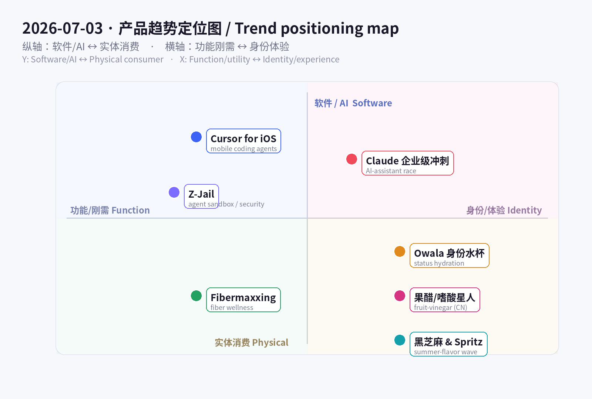
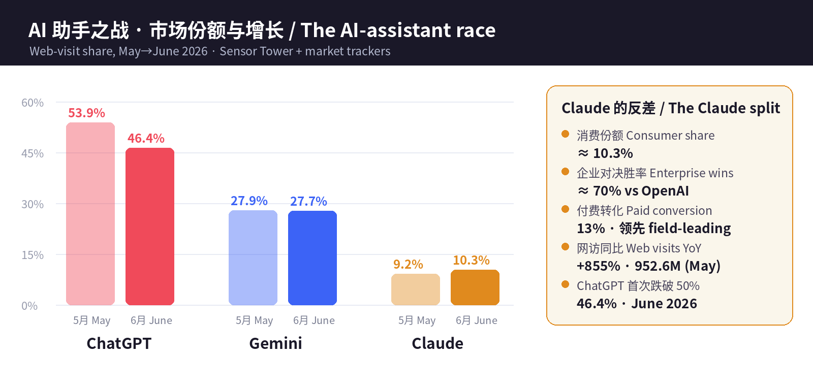

# 每日产品趋势报告 · Daily Product Trends Report
### 2026 年 7 月 3 日 · July 3, 2026

> **数据来源 / Sources:** Hacker News（Show HN 7/2：Z-Jail 130KB 沙箱、PMB 记忆可观测、GolemUI、worker-owned co-ops 目录）、Product Hunt（Cursor for iOS、Acti 智能键盘）、Cursor 官方博客 + TechCrunch/TNW、Sensor Tower《State of AI 2026》+ 市场份额追踪（First Page Sage / Momentic / TechCrunch）、Google《Summergeist 2026》夏日趋势、The Vitamin Shoppe 2026 补剂趋势 + 纤维补剂市场报告、Amazon Movers & Shakers（Owala/Stanley）、小红书（#嗜酸星人、泰式奶茶、文旅兴趣出游）、a16z《Big Ideas 2026》。
> **方法 / Method:** WebSearch + web_fetch 抓取公开数据。Sensor Tower / X / LinkedIn / 小红书 / Product Hunt 多为登录或客户端渲染，采用公开检索摘要、新闻与新闻稿替代。为保证每日新意，已**排除 6/12–7/02 已深度分析过的产品**（BrowserAct、Skybridge、AgentX、Propane、Upstream、Framer 3.0、Wispr Flow、Fundraisly、Slashy、Vokal、Goldfish、Minimi、观鸟/鸟门、Sibyl、World Model MCP、DAG 确定性 agent、mixfox、HackerNows、世界杯 blokecore、小红书「精准价值」等）。
> **免责声明 / Disclaimer:** 本报告为趋势研究，非投资建议。融资/估值/份额/下载与收入为第三方公开披露或估算，可能随时变化。

---

## ① 当日概览 · Overview

**一句话 / In one line：** 7 月 2 日昨天 agent 长出了「记忆和脊椎」；**今天 agent 长出了「手」和「笼子」——你能从口袋里指挥它写代码（Cursor for iOS），也能把它关进 130KB 的沙箱里安全地跑它写出来的代码（Z-Jail）；与此同时，AI 助手市场正式碎成「各占一格的专才」——ChatGPT 首次跌破 50%，而 Claude 用企业级精准度杀出一条增长曲线。** 消费端则在上演另一场「身份战争」：fibermaxxing 把「补纤维」变成健身房级的自律符号，Owala 把水杯变成可收集的身份配饰，而从美国的 Hugo spritz、黑芝麻甜品到中国的果醋/嗜酸星人，夏日味觉集体转向「低度、有质感、会讲故事」。

> **In one line:** Where July 2 was *"agents grow a memory and a spine,"* **today agents grow hands and a cage** — you can now drive a coding agent from your pocket (**Cursor for iOS**) and safely run the code it writes inside a 130KB sandbox (**Z-Jail**) — while the AI-assistant market officially *fractures into specialists*: ChatGPT slips below 50% for the first time and **Claude** carves out a growth curve on enterprise precision. On the consumer side a second "identity war" is playing out: **fibermaxxing** turns "eat more fiber" into a gym-grade discipline signal, **Owala** turns a water bottle into a collectible identity accessory, and from US Hugo spritz + black-sesame desserts to China's fruit-vinegar / "sour-craving" wave, the summer palate shifts toward **low-ABV, texture-forward, story-rich**.

这两条线其实是**同一件事的两面：当能力变得便宜且泛滥，价值就从「能不能做」上移到「在哪、由谁、以什么身份来做」。** 开发侧，模型能力已接近商品化（a16z：AI 单位成本「比摩尔定律掉得还快」），于是竞争前移到**载体（手机上的 agent）**、**安全边界（沙箱）**与**场景定位（企业 vs 消费）**——Cursor 把「写代码」从「坐在桌前的岗位」变成「随时随地监督的任务」，Z-Jail 及一整簇沙箱（agentjail、Nono、Fence）在解决「agent 会自己写代码、那谁来兜底运行安全」，Claude 则用「70% 企业对决胜率 + 13% 付费转化」证明：**在助手都会聊天之后，能赢的是「懂你工作」的那一个。**

> These two lines are two faces of one thing: **when capability gets cheap and abundant, value moves from "can it be done" to "where, by whom, and under what identity it's done."** On the dev side, model capability is near-commoditized (a16z: AI unit cost "falls faster than Moore's Law"), so competition moves to the **surface (agents on your phone)**, the **safety boundary (sandboxes)**, and **positioning (enterprise vs consumer)**. Cursor turns coding from "a desk you sit at" into "a task you supervise from anywhere"; Z-Jail and a whole cluster of sandboxes (agentjail, Nono, Fence) answer "if the agent writes its own code, who guarantees it runs safely"; and Claude proves — with ~70% enterprise head-to-head wins and a field-leading 13% paid conversion — that **once every assistant can chat, the winner is the one that understands your work.**

消费侧同理：**基础需求（喝水、吃饭）早已满足，于是溢价流向「身份与叙事」。** 一支 Owala 卖的不是容量，是配色收藏与「我很自律」的人设；fibermaxxing 卖的不是麦麸，是「肠道健康 / 代谢 / 抗 GLP-1 副作用」的科学感自律；而 Hugo spritz、黑芝麻、果醋卖的不是解渴，是「懂行、克制、会拍照」的生活方式。**功能是入场券，身份才是价格。**

> Same on the consumer side: **basic needs (drink, eat) are long met, so the premium flows to identity and narrative.** An Owala sells not capacity but collectible colorways and an "I'm disciplined" persona; fibermaxxing sells not bran but a science-flavored discipline ("gut health / metabolic / GLP-1 companion"); Hugo spritz, black sesame and fruit vinegar sell not thirst-quenching but a "in-the-know, restrained, photogenic" lifestyle. **Function is the ticket; identity is the price.**

**五条最强信号 / Five strongest signals**

1. **coding agent 装进口袋 / Coding agents go pocket-native.** Cursor for iOS（6/29 公测、全付费档可用）让你用语音+斜杠命令在手机上起云端 agent、远程操控桌面 agent、直接合并 PR——「编程」从岗位变任务。Voice + slash commands, cloud agents, merge PRs from your phone.
2. **「谁来兜底 agent 跑的代码」成新赛道 / Agent sandboxing becomes a category.** Z-Jail（130KB、C99、7 层防护、零依赖）与 agentjail / Nono / Fence 同期涌现——agent 会写代码，安全执行成刚需。The agent writes code; safe execution is now table stakes.
3. **AI 助手市场正式碎片化 / The assistant market fractures.** ChatGPT 首次跌破 50%（46.4%），Gemini ~27.7%，Claude ~10.3% 消费份额却拿下 ~70% 企业对决——「通用聊天」输给「垂直精准」。Generalist chat loses to vertical precision.
4. **补纤维成新自律符号 / Fiber is the new discipline flex.** fibermaxxing 搜索 +115%，psyllium husk +150%，纤维补剂 $47.6 亿(2026)→$75.5 亿(2033)——健康叙事从「减脂」转向「肠道 + 代谢 + GLP-1」。Gut + metabolic + GLP-1 narrative.
5. **夏日味觉集体「高级化」/ The summer palate levels up.** Owala 身份水杯、Hugo spritz(+2,200%)、黑芝麻、中国果醋（#嗜酸星人 6,040 万浏览）——低度、有质感、会讲故事。Low-ABV, texture-forward, story-rich.

---

## ② 逐个产品深度分析 · Product Deep-Dives

### 1. Cursor for iOS — 把 coding agent 装进口袋 / Coding agents in your pocket

**Cursor for iOS**（6/29 加入更新日志，原生 iOS App 公测）把当日最锋利的一刀切在「开发者的物理位置」上：过去你必须**坐在电脑前**才能用 agent 写代码；现在你在地铁上、在咖啡馆、在遛狗时，都能**开一个云端 always-on agent**，或**远程操控**正跑在你电脑上的 agent。它支持**语音输入 + 斜杠命令**，能读 UI 截图、错误日志、代码 diff，能在截图上直接批注，还能**从手机上开/合并 PR**。媒体的总结很到位：**「编程正在变成一份你监督的工作，而不是一张你坐着的桌子。」** 全付费档现已可用，即日起到 7/5 Composer 2.5 运行 75 折。

> **Cursor for iOS** (added to the June 29 changelog; native iOS app in public beta) makes its sharpest cut on the developer's *physical location*. Before, you had to be *at your desk* to run an agent; now — on the subway, in a café, walking the dog — you can spin up an **always-on cloud agent** or **remote-control** an agent already running on your machine. It supports **voice input + slash commands**, can read UI screenshots, error logs and code diffs, annotate screenshots, and **open/merge PRs from your phone.** The press summary nails it: **"coding is becoming a job you supervise, not a desk you sit at."** Available on all paid plans; 75% off Composer 2.5 runs through July 5.

| 维度 Dimension | 分析 Analysis |
|---|---|
| 商业模式 Business model | 订阅（Cursor 付费档）+ 用量（Composer 2.5 runs）。移动端不是新收费点，而是**提升在线时长与粘性**的分发面。Subscription + usage; mobile deepens engagement, not a new SKU. |
| 核心功能 Core value | 手机上起云端/远程 agent、语音+斜杠、读截图/日志/diff、开合 PR。Cloud + remote agents, voice, review & merge from phone. |
| 成功因素 Success factors | 抓住「agent 长时间自主跑」催生的**监督缺口**——你不必守着电脑，但仍想随时插手。Fills the "supervise-from-anywhere" gap that autonomous agents create. |
| 细分市场 Niche | 移动端 AI 编程 / agent 监督（mobile agent control）。 |
| 目标受众 Audience | 已用 Cursor 的开发者、技术创始人、边通勤边推进的独立开发。Existing Cursor devs, technical founders, indie hackers. |
| 品牌设计 Brand | 延续 Cursor 极简黑白 + 「编辑器即 agent」定位；「build from anywhere」清晰有力。Minimal, "build from anywhere." |
| 产品数据 Data | 6/29 公测；全付费档可用；7/5 前 Composer 2.5 75 折；TechCrunch/TNW/Product Hunt 报道。Public beta 6/29. |
| 链接 Link | [cursor.com/blog/ios-mobile-app](https://cursor.com/blog/ios-mobile-app) · [Product Hunt](https://www.producthunt.com/products/cursor-for-ios) |
| 评论摘要 Reviews | 好评：「起个 agent 去睡觉，早上手机上 review」；质疑：付费档才可用、云端 agent 的额度/审阅上限、手机上审代码是否可靠。Praise for "kick off, sleep, review on phone"; concerns on paid-only + review limits. |

### 2. Z-Jail — 给 agent 代码的「130KB 笼子」/ A 130KB cage for agent-written code

**Z-Jail**（Show HN，作者 Division-36）踩中了昨天「agent 长出脊椎」之后必然出现的问题：**agent 现在会自己写代码、自己跑 shell，那谁来保证这些代码不把你的机器掀了？** Z-Jail 是一个**约 130KB、纯 C99、零依赖**的多层 Linux 沙箱：把 **namespaces + pivot_root + seccomp-bpf + 能力剥离（capability dropping）** 叠成 7 层防护，再配一个**基于证据的「裁决引擎」（verdict engine）**做可审计执行。它明确防御 chroot/mount/ptrace/socket/process_vm_writev 逃逸，以及 fork 炸弹与 CPU/内存耗尽。它不是孤例——**同期一整簇 agent 沙箱**（agentjail、内核级的 Nono、限制网络/文件系统的 Fence，加上 gVisor / microVM 路线）在 2026 年集中涌现，说明「安全执行」正从「大厂内部工具」变成**人人要装的基础层**。（注意其 Axiom Public License：预算 ≤ $1M 的独立研究者/小实验室免费，商用/政府/逆向需授权——这条许可本身会成为讨论焦点。）

> **Z-Jail** (Show HN, by Division-36) lands on the problem that inevitably follows "agents grow a spine": **agents now write their own code and run their own shells — so who guarantees that code won't wreck your machine?** Z-Jail is a **~130KB, pure-C99, zero-dependency** multi-layer Linux sandbox: it stacks **namespaces + pivot_root + seccomp-bpf + capability dropping** into 7 defense layers, plus an **evidence-based "verdict engine"** for auditable execution. It explicitly blocks escape via chroot/mount/ptrace/socket/process_vm_writev, plus fork bombs and CPU/memory exhaustion. It isn't a one-off — a whole *cluster* of agent sandboxes (agentjail, kernel-enforced **Nono**, network/FS-restricting **Fence**, plus the gVisor / microVM routes) surfaced in 2026, signaling that "safe execution" is moving from a big-company internal tool to a **base layer everyone installs.** (Note its Axiom Public License: free for independent researchers / small labs with budget ≤ $1M; commercial/government/reverse-engineering restricted — the license itself will be a talking point.)

| 维度 Dimension | 分析 Analysis |
|---|---|
| 商业模式 Business model | 开源/受限许可（Axiom）为主；变现路径大概率是商用/政府授权 + 企业支持。Restricted-license OSS; monetize via commercial/gov licensing + support. |
| 核心功能 Core value | 极小体积、零依赖的多层沙箱 + 可审计裁决引擎，安全跑不可信/agent 代码。Tiny, dependency-free multi-layer sandbox with auditable verdicts. |
| 成功因素 Success factors | 时机——「agent 写代码」把安全执行推成刚需；130KB/零依赖极易嵌入。Timing + trivially embeddable. |
| 细分市场 Niche | AI agent / CI / 不可信代码执行的安全沙箱。Sandboxing for agents, CI, untrusted code. |
| 目标受众 Audience | 做 agent 平台的团队、安全工程、跑不可信代码的基建方。Agent-platform builders, security eng, infra. |
| 品牌设计 Brand | 「Z-Jail = 监狱」意象直白；技术叙事（层数、逃逸向量）建立可信度。Blunt "jail" metaphor + technical credibility. |
| 产品数据 Data | Show HN（7/2）；130KB、C99、7 层、Linux 5.4+；同赛道 agentjail/Nono/Fence。130KB, 7 layers, Linux 5.4+. |
| 链接 Link | [github.com/Division-36/Z-Jail](https://github.com/Division-36/Z-Jail/) · [Nono (HN)](https://news.ycombinator.com/item?id=46849615) |
| 评论摘要 Reviews | 关注点：seccomp-bpf/namespaces 是否够、与 gVisor/microVM 的取舍、许可证限制商用；赞其「小到能塞进任何 runtime」。Debate: enough vs gVisor/microVM; license friction; love the tiny footprint. |

### 3. Claude 与 AI 助手之战 — 通用聊天碎成「专才」/ Claude & the assistant war: generalist chat splits into specialists

这不是单一产品，而是**当日最大的市场结构信号**。据 Sensor Tower《State of AI 2026》与多家份额追踪：**生成式 AI 应用使用时长同比翻倍**（H1 2025 的 172 亿小时 → H1 2026 的 360 亿小时）；带「AI」的应用 H1 下载破 **100 亿**；AI 应用内购收入 H1 有望破 **$40 亿（环比 +36%）**。而竞争格局第一次**去中心化**：**ChatGPT 网访份额 5 月 53.9% → 6 月 46.4%，首次跌破 50%**；Gemini ~27.7%；Claude 消费份额 ~10.3%，看似小，却是**增长最快的挑战者**——网访 5 月 9.526 亿次、同比约 **+855%**、单季 +228%，且**拿下约 70% 的企业对决胜率、13% 付费转化（全场第一）**。结论很清晰：**当每个助手都会聊天，胜负手变成「定位」**——消费规模（ChatGPT）、生态分发（Gemini）、企业精准（Claude）、社交智能（Grok）、研究检索（Perplexity）各占一格。

> Not a single product, but **the day's biggest market-structure signal.** Per Sensor Tower's *State of AI 2026* and multiple share trackers: **time spent on GenAI apps doubled YoY** (17.2B hrs H1'25 → 36B hrs H1'26); "AI" apps cross **10B** downloads in H1; AI in-app-purchase revenue on track to top **$4B** in H1 (+36% HoH). And the field *decentralized for the first time*: **ChatGPT's web-visit share fell from 53.9% (May) to 46.4% (June) — below 50% for the first time;** Gemini ~27.7%; Claude ~10.3% consumer share — small, yet the **fastest-growing challenger** (952.6M web visits in May, ~**+855% YoY**, +228% QoQ) that **wins ~70% of enterprise head-to-heads and converts 13% to paid — best in the field.** The takeaway: **once every assistant can chat, positioning decides** — consumer scale (ChatGPT), ecosystem distribution (Gemini), enterprise precision (Claude), social intelligence (Grok), research search (Perplexity).

| 维度 Dimension | 分析 Analysis |
|---|---|
| 商业模式 Business model | 订阅 + API + 企业合同；Claude 靠**高付费转化(13%)与企业胜率**弥补消费份额。Sub + API + enterprise; Claude leans on conversion + enterprise wins. |
| 核心功能 Core value | 高质量推理/编码/长上下文；企业级安全与可靠性是差异点。Reasoning/coding/long-context + enterprise trust. |
| 成功因素 Success factors | 不打「最大」，打「最懂工作」；企业采购看重可靠 > 声量。Win on "understands work," not "biggest." |
| 细分市场 Niche | 企业级 AI 助手 / 编码与知识工作。Enterprise assistant, coding & knowledge work. |
| 目标受众 Audience | 企业、开发者、专业知识工作者。Enterprises, developers, pro knowledge workers. |
| 品牌设计 Brand | 克制、安全、可信的定位，与「消费娱乐」拉开身位。Restrained, safety-forward, trust-first. |
| 产品数据 Data | 时长 172 亿→360 亿 hrs；ChatGPT 46.4%、Gemini 27.7%、Claude 10.3%；Claude +855% YoY、70% 企业胜率。 |
| 链接 Link | [Sensor Tower State of AI 2026](https://sensortower.com/blog/state-of-ai-2026) · [TechCrunch: below 50%](https://techcrunch.com/2026/06/16/chatgpts-market-share-slips-below-50-for-first-time/) |
| 评论摘要 Reviews | 行业讨论：「份额碎片化=市场成熟」；企业侧「Claude 更稳更可控」；消费侧仍是 ChatGPT 心智。"Fragmentation = maturity"; enterprise favors Claude's reliability. |

### 4. Fibermaxxing — 「补纤维」成为新的自律符号 / Fiber as the new discipline flex

**Fibermaxxing**（把每日纤维摄入「拉满」）是当日最强的消费健康信号。Google《Summergeist 2026》显示 **膳食纤维搜索创历史新高**、「fibermaxxing」90 天 **+115%**；The Vitamin Shoppe 数据里，「psyllium husk（洋车前子壳）」站内搜索 **+150%**、纤维品类销售 **年内 +20%**；近 **70%** 美国人正主动增加纤维摄入。背后的叙事已从「减脂」升级为**「肠道菌群 + 代谢健康 + GLP-1 减重药的营养搭档」**——这正是它能从 TikTok 梗变成货架增长的原因。市场层面，纤维补剂 **$47.6 亿(2026) → $75.5 亿(2033)，6.8% CAGR**（另一口径 $168 亿→$384 亿，8.7% CAGR）；洋车前子壳是最大细分。主力品牌：Metamucil、Benefiber、Citrucel、Garden of Life、Renew Life。

> **Fibermaxxing** (maxing out daily fiber) is the day's strongest consumer-health signal. Google's *Summergeist 2026* shows **dietary-fiber searches at an all-time high** and "fibermaxxing" **+115%** in 90 days; at The Vitamin Shoppe, "psyllium husk" searches are **+150%** and fiber-category sales **+20% YTD**; nearly **70%** of Americans are actively adding fiber. The narrative has upgraded from "weight loss" to **"gut microbiome + metabolic health + the nutrition companion to GLP-1 drugs"** — which is exactly why it jumped from TikTok meme to shelf growth. Market: fiber supplements **$4.76B (2026) → $7.55B (2033), 6.8% CAGR** (an alt read: $16.8B→$38.4B, 8.7% CAGR); psyllium husk is the largest segment. Lead brands: Metamucil, Benefiber, Citrucel, Garden of Life, Renew Life.

| 维度 Dimension | 分析 Analysis |
|---|---|
| 商业模式 Business model | 快消/补剂零售（DTC + 商超 + 电商）；高复购、订阅友好。CPG/supplement retail; high repeat, subscription-friendly. |
| 核心功能 Core value | 「简单、便宜、有科学感」的健康自律——纤维粉/胶囊/软糖。Cheap, science-flavored self-discipline. |
| 成功因素 Success factors | 蹭 GLP-1 与肠道健康大势 + TikTok 病毒式教育 + 低单价试错。GLP-1 + gut-health tailwind + TikTok. |
| 细分市场 Niche | 功能性营养 / 肠道 & 代谢健康。Functional nutrition, gut & metabolic. |
| 目标受众 Audience | Gen Z 健康党、GLP-1 用户、控糖控代谢人群。Gen Z wellness, GLP-1 users, metabolic-conscious. |
| 品牌设计 Brand | 从「药感」转向「食品/生活方式感」（软糖、气泡纤维饮）。From "medicine" to "food/lifestyle." |
| 产品数据 Data | 搜索 +115%；psyllium +150%；VS 纤维销售 +20% YTD；市场 $47.6 亿→$75.5 亿。 |
| 链接 Link | [Google Summergeist 2026](https://blog.google/products-and-platforms/products/search/summergeist-google-trends/) · [Nutraingredients: Vitamin Shoppe 2026](https://www.nutraingredients.com/Article/2026/06/29/top-trends-shaping-supplement-purchases-in-2026-according-to-the-vitamin-shoppe/) |
| 评论摘要 Reviews | 用户：「肠道顺了、饱腹感强」；专家提醒「加纤维要循序渐进 + 多喝水，否则胀气」。Users report satiety; experts warn "ramp slowly + hydrate." |

### 5. Owala — 「身份水杯」把喝水做成可收集配饰 / Status hydration: the water bottle as collectible

**Owala**（尤其 FreeSip）是 2026 年 TikTok 上最热的水杯品牌，正**从 Stanley 手里接棒**。FreeSip 有 **10 万+ 五星评价**，被反复夸「耐用、密封防漏、颜色可收集」；亚马逊 Prime Day 一度降到 **$27**。宏观层面，水杯市场**过去一年近乎翻倍**（2024 单年 +21%），且消费行为已变——**人们不再只买一支，而是按穿搭/心情/场景收集多支**。这类目早已从「功能」滑向「身份 + 时尚」：一支水杯是健身房的社交货币、是「我很自律、我很讲究」的可见符号。对品牌方，护城河是**配色节奏（限定色/联名）+ UGC 口碑**，而非杯体本身。

> **Owala** (especially FreeSip) is 2026's hottest TikTok water-bottle brand, **taking the baton from Stanley.** FreeSip has **100k+ five-star reviews**, repeatedly praised as "durable, leakproof, collectible colors"; it dipped to **~$27** on Amazon Prime Day. Macro: the water-bottle market **nearly doubled over the past year** (+21% in 2024 alone), and behavior shifted — **people no longer buy one; they collect several** by outfit/mood/occasion. The category long ago slid from "function" to "identity + fashion": a bottle is gym social currency, a visible "I'm disciplined, I have taste" signal. For brands, the moat is **colorway cadence (limited drops/collabs) + UGC**, not the vessel itself.

| 维度 Dimension | 分析 Analysis |
|---|---|
| 商业模式 Business model | DTC + 零售 + 亚马逊；靠**限定配色/联名**驱动复购与溢价。DTC + retail + Amazon; limited colorways drive repeat. |
| 核心功能 Core value | FreeSip 吸管+直饮二合一、密封防漏、颜色可收集。2-in-1 sip/straw, leakproof, collectible. |
| 成功因素 Success factors | 病毒式 UGC + 配色饥饿营销 + 「接棒 Stanley」的心智卡位。Viral UGC + scarcity colorways + timing. |
| 细分市场 Niche | 潮流保温水杯 / 生活方式配饰。Trend drinkware / lifestyle accessory. |
| 目标受众 Audience | Gen Z/千禧、健身与「that girl」人群、礼赠。Gen Z/Millennial, fitness, gifting. |
| 品牌设计 Brand | 高饱和撞色 + 可收集叙事 + 强社媒视觉。Saturated color-blocking, collectible story. |
| 产品数据 Data | FreeSip 10 万+ 五星；Prime Day $27；水杯市场近一年翻倍、2024 +21%。100k+ reviews, market ~2×. |
| 链接 Link | [Owala 趋势 (Accio)](https://www.accio.com/business/owala_water_bottle_trend) · [The Kitchn](https://www.thekitchn.com/best-owala-bottles-23776894) |
| 评论摘要 Reviews | 好评：颜色好看、真的不漏、通勤/健身首选；吐槽：清洗吸管麻烦、囤太多。Loved for color + leakproof; gripe: cleaning + overbuying. |

### 6. 果醋 / 嗜酸星人 — 中国的「酸味」新消费 / Fruit-vinegar & the "sour-craving" wave (China)

在小红书，**#嗜酸星人 话题浏览量已达 6,040 万**，把「酸」从一种口味变成一种人设。**果醋饮销量同比 4 倍增长**、柠檬饮持续走俏；与此并行的是**泰式奶茶（话题 3.3 亿浏览）**以「重茶 + 厚乳 + 香料」的复合口感全面开花。这不是孤立的饮品热点，而是小红书「**兴趣圈层 + 精准价值**」大势的味觉版：平台把流量倾斜给**小众、真实、能解决具体问题**（助消化、控糖、清爽、上镜）的内容，于是「酸口健康饮」这种**低糖、有功能叙事、又足够出片**的品类天然吃到红利。对品牌，机会在于**把「酸」讲成健康+情绪价值**（开胃、解腻、夏日清爽），并用素人种草而非硬广起量。

> On Xiaohongshu, **#SourCraving (#嗜酸星人) has 60.4M views**, turning "sour" from a flavor into a persona. **Fruit-vinegar drink sales grew 4× YoY**, lemon drinks keep selling, and in parallel **Thai milk tea (330M views)** is blooming on a "strong tea + thick milk + spice" formula. This isn't an isolated beverage blip — it's the flavor edition of Xiaohongshu's **"niche interest + precise value"** shift: the platform tilts reach to **niche, authentic, problem-solving** content (digestion, sugar control, refreshment, photogenic), so a **low-sugar, functionally-narrated, camera-ready** category like "healthy sour drinks" naturally catches the wave. For brands, the opening is to **frame "sour" as health + emotional value** (appetite, cutting grease, summer refreshment) and scale via nano-creator seeding rather than hard ads.

| 维度 Dimension | 分析 Analysis |
|---|---|
| 商业模式 Business model | 快消饮品（果醋/柠檬饮/奶茶）+ 小红书种草电商闭环。Beverage CPG + Xiaohongshu social commerce. |
| 核心功能 Core value | 「酸」= 开胃/解腻/清爽 + 低糖健康叙事 + 出片。Sour = appetite/refresh + low-sugar + photogenic. |
| 成功因素 Success factors | 踩中「兴趣圈层 + 精准价值」流量倾斜；素人真实种草可信。Rides niche-value reach + authentic seeding. |
| 细分市场 Niche | 健康功能性饮品 / 风味饮。Functional-flavor beverages. |
| 目标受众 Audience | 小红书年轻女性、控糖/助消化人群、口味猎奇者。Young Xiaohongshu users, sugar-conscious, flavor-seekers. |
| 品牌设计 Brand | 清爽高饱和视觉 + 「星人」圈层身份标签。Fresh visuals + "-人 (tribe)" identity tags. |
| 产品数据 Data | #嗜酸星人 6,040 万浏览；果醋销量 +4×；泰式奶茶话题 3.3 亿。#SourCraving 60.4M; vinegar +4×. |
| 链接 Link | [TopMarketing 爆款风味](https://www.itopmarketing.com/info21734) · [2026 小红书八大趋势 (知乎)](https://zhuanlan.zhihu.com/p/1991105890716247188) |
| 评论摘要 Reviews | 用户：「夏天喝果醋太开胃」「泰奶戒不掉」；关注点：含糖量、真假发酵果醋。Praise appetite/refresh; watch sugar + real fermentation. |

### 7. 黑芝麻 & Spritz — 夏日味觉「高级化」/ Black sesame & spritz: the palate levels up

Google《Summergeist 2026》给出了一幅清晰的西方夏日味觉图：**「how to make a hugo spritz at home」暴涨 +2,200%**、「what goes in an aperol spritz」成突破性搜索；**黑芝麻**创历史级热度（延伸到黑芝麻冰淇淋、黑芝麻曲奇）；**frozen yogurt nyc +120%**；hojicha 拿铁、horchata、冷萃 einspänner 咖啡霸榜；连**冰镇红酒 / Sancerre** 搜索都「冲破屋顶」。共同母题是**「低度数、有质感、克制而讲究」**——大酒被低 ABV 气泡饮取代，甜品从「甜腻」转向「烘香/坚果/微苦」的成人味，饮品越来越强调**口感层次与仪式感**。这与东方的果醋/泰奶殊途同归：**夏天的味觉正在集体「成熟」，从刺激转向细腻。**

> Google's *Summergeist 2026* paints a clear Western summer palate: **"how to make a hugo spritz at home" +2,200%**, "what goes in an aperol spritz" a breakout; **black sesame** at record heat (extending to black-sesame ice cream and cookies); **frozen yogurt nyc +120%**; hojicha lattes, horchata and cold-brew einspänner dominating; even **chilled reds / Sancerre** searches "through the roof." The shared motif is **"low-ABV, texture-forward, restrained-yet-refined"** — big liquor gives way to low-ABV spritzes, desserts move from cloying to "toasty/nutty/faintly bitter" grown-up flavors, and drinks emphasize **texture and ritual.** It converges with the East's fruit-vinegar / Thai-tea wave: **the summer palate is collectively maturing — from stimulation to nuance.**

| 维度 Dimension | 分析 Analysis |
|---|---|
| 商业模式 Business model | 餐饮/零售/DTC 风味创新 + RTD 低度气泡饮；靠「新风味 SKU」拉客。Foodservice/RTD low-ABV; new-flavor SKUs. |
| 核心功能 Core value | 低度、层次感、成人化风味（spritz/黑芝麻/hojicha）。Low-ABV, layered, grown-up flavors. |
| 成功因素 Success factors | 健康+克制的饮酒观 + 出片 + 「懂行」身份感。Mindful drinking + photogenic + connoisseur signal. |
| 细分市场 Niche | 低 ABV 气泡饮 / 高级感风味甜品。Low-ABV spritz / premium-flavor desserts. |
| 目标受众 Audience | 都市千禧/Gen Z、mindful drinking、美食内容党。Urban Millennial/Gen Z, mindful drinkers, foodies. |
| 品牌设计 Brand | 清爽通透视觉 + 欧式/东方「高级感」叙事。Airy visuals + Euro/East "premium" story. |
| 产品数据 Data | Hugo spritz +2,200%；froyo NYC +120%；黑芝麻/hojicha/Sancerre 突破性搜索。 |
| 链接 Link | [Google Summergeist 2026](https://blog.google/products-and-platforms/products/search/summergeist-google-trends/) · [Yahoo: summer food & drink 2026](https://www.yahoo.com/lifestyle/articles/biggest-summer-food-drink-trends-163156557.html) |
| 评论摘要 Reviews | 用户：「Hugo 比 Aperol 更清爽」「黑芝麻万物皆可」；关注点：低度≠低糖、风味疲劳。"Hugo > Aperol for refresh"; watch sugar + flavor fatigue. |

---

## ③ 横向对比表 · Cross-Product Comparison

| 产品/趋势 Product | 类别 Category | 商业模式 Model | 细分市场 Niche | 目标受众 Audience | 关键数据 Key data | 链接 Link |
|---|---|---|---|---|---|---|
| **Cursor for iOS** | 开发 Dev | 订阅+用量 Sub+usage | 移动 agent 监督 Mobile agent control | Cursor 开发者/创始人 Devs, founders | 6/29 公测；全付费档；7/5 前 75 折 | [link](https://cursor.com/blog/ios-mobile-app) |
| **Z-Jail** | 开发/安全 Dev/Sec | 受限许可 OSS + 授权 | agent 沙箱 Agent sandbox | 平台/安全/基建 Platform, security | 130KB · C99 · 7 层 · Linux 5.4+ | [link](https://github.com/Division-36/Z-Jail/) |
| **Claude / AI 助手战** | 应用/宏观 Apps/Macro | 订阅+API+企业 Sub+API+ent | 企业级助手 Enterprise assistant | 企业/开发者 Enterprises, devs | 消费 10.3% · 企业胜率 ~70% · +855% YoY | [link](https://sensortower.com/blog/state-of-ai-2026) |
| **Fibermaxxing** | 消费健康 Consumer health | 补剂零售 Supplement retail | 功能营养 Functional nutrition | Gen Z/GLP-1 用户 | 搜索 +115% · psyllium +150% · $47.6 亿→$75.5 亿 | [link](https://blog.google/products-and-platforms/products/search/summergeist-google-trends/) |
| **Owala** | 消费品 Consumer goods | DTC+零售 DTC+retail | 潮流水杯 Trend drinkware | Gen Z/健身/礼赠 | 10 万+ 五星 · Prime Day $27 · 市场近 2× | [link](https://www.accio.com/business/owala_water_bottle_trend) |
| **果醋/嗜酸星人** | 消费食品·中国 Food·CN | 饮品+种草电商 CPG+social | 功能风味饮 Functional flavor | 小红书年轻女性 | #嗜酸星人 6,040 万 · 果醋 +4× | [link](https://www.itopmarketing.com/info21734) |
| **黑芝麻 & Spritz** | 消费食品·全球 Food·Global | RTD/餐饮 RTD/foodservice | 低 ABV & 高级风味 Low-ABV & premium | 都市千禧/Gen Z | Hugo spritz +2,200% · froyo NYC +120% | [link](https://blog.google/products-and-platforms/products/search/summergeist-google-trends/) |

---

## ④ 关键洞察与共性总结 · Key Insights & Common Patterns

**A. 能力商品化 → 价值上移到「载体、边界、定位」/ As capability commoditizes, value moves to surface, boundary, positioning.** 模型本身越来越像水电（a16z：单位成本比摩尔定律掉得快），于是 Cursor 争「在哪用（手机）」、Z-Jail 争「怎么安全地用（沙箱）」、Claude 争「为谁用（企业）」。**不要在能力上卷，要在「使用的语境」上卡位。** Compete on the *context of use*, not raw capability.

**B. agent 的每一步「进化」都立刻催生配套刚需 / Every agent capability instantly creates an adjacent must-have.** 昨天 agent 有了记忆/脊椎，今天就冒出「手」（移动操控）与「笼子」（安全沙箱）。**规律：当自主性↑，监督面与安全面同步变成新赛道。** Autonomy up ⇒ supervision + safety become new categories.

**C. 消费端全线是「身份战争」/ Consumer trends are identity wars.** fibermaxxing（自律人设）、Owala（收集/讲究人设）、嗜酸星人（圈层标签）、spritz/黑芝麻（懂行克制）——**卖的都不是功能，而是「我是谁」的可见符号。** 功能是入场券，身份定价。Function is the ticket; identity sets the price.

**D. 味觉全球共振：从「刺激」转向「细腻+功能」/ A global palate shift: from stimulation to nuance + function.** 西方低 ABV spritz/黑芝麻、东方果醋/泰奶，母题一致——**低糖低度、有层次、能讲健康故事、还要出片。** Low-sugar/low-ABV, layered, health-narrated, photogenic.

**E. 分发即护城河 / Distribution is the moat.** 开发侧靠「装进现有工作流」（Cursor 手机、Z-Jail 塞进任何 runtime），消费侧靠「TikTok/小红书素人种草 + 限定色/新风味节奏」。**产品好只是必要条件；能嵌进用户已有的场景与内容流，才是增长。** Fit into existing workflows and content feeds.

**共性一句话 / The pattern in one line：** **当「做得到」变得便宜，赢家都在争「在什么语境、以什么身份、被谁在什么场景里用」——开发侧卡载体与安全，消费侧卡身份与叙事。**
> **When "it can be done" gets cheap, winners fight over context, identity, and moment-of-use — devs claim the surface and the safety layer; consumers are sold identity and narrative.**

---

*报告结束 · End of report — 2026-07-03*
