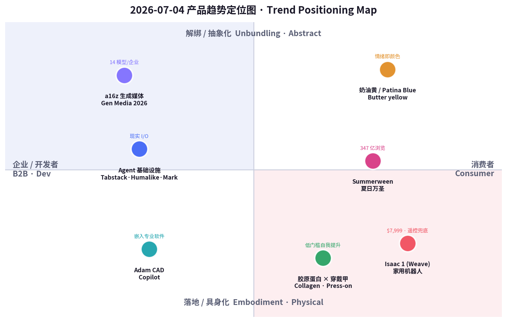
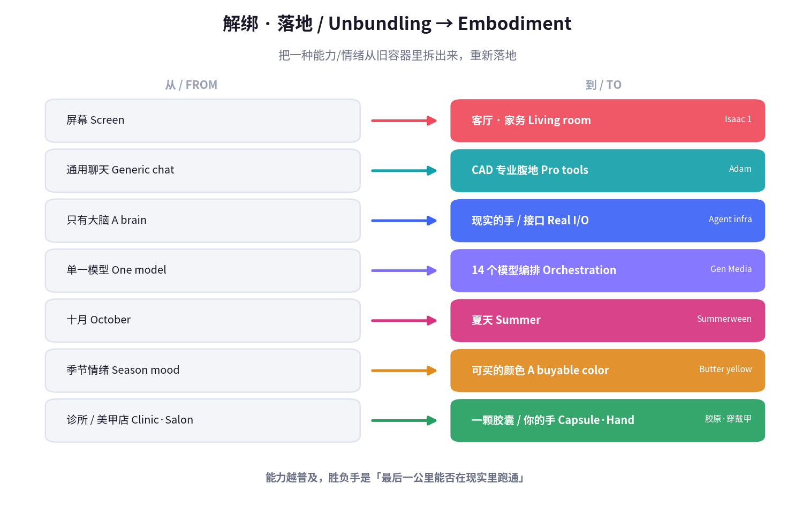

# 每日产品趋势报告 · Daily Product Trends Report
### 2026 年 7 月 4 日 · July 4, 2026（美国独立日 / US Independence Day）

> **数据来源 / Sources:** Hacker News（Weave Robotics **Isaac 1** 家用机器人、Infini-News、Frond）、Product Hunt 7 月榜（**Tabstack**（Mozilla 出品）、**Humalike**、**Mark by Airtop**、**Adam CAD Copilot**）、a16z《**State of Generative Media 2026**》、Google《Summergeist 2026》夏日趋势（butter yellow 指甲、summerween）、Etsy 2026 夏季卖家报告（年度色 Patina Blue）、Collagen 市场报告（Grand View / FMI）、小红书（胶原蛋白、穿戴甲「指尖经济」）。
> **方法 / Method:** WebSearch（US-only）+ 公开检索摘要。Product Hunt / X / LinkedIn / 小红书 / Sensor Tower 多为登录或客户端渲染，采用公开新闻、榜单与新闻稿替代。**Product Hunt 返回的票数（十万级）明显异常，已判定不可信，仅保留相对排名。** 为保证每日新意，已**排除 6/12–7/03 已深度分析过的产品**（Cursor for iOS、Z-Jail、Claude 助手之战、fibermaxxing、Owala、Hugo spritz、黑芝麻、果醋、观鸟、BrowserAct、Acti 等）。
> **免责声明 / Disclaimer:** 本报告为趋势研究，非投资建议。融资/估值/市场规模/份额为第三方公开披露或估算，可能随时变化。

---

## ① 当日概览 · Overview

**一句话 / In one line：** 7 月 3 日 agent 长出「手」和「笼子」；**今天，AI 干脆走出屏幕、住进你家客厅**——Weave 的 Isaac 1 用一台 $7,999 的「有胳膊的扫地机器人」帮你叠衣服（但它的自主性靠**远程遥控**兜底），Adam 把 AI 塞进 CAD 专业软件，Tabstack / Humalike / Mark 则忙着给 agent 造「上网的手、社交的脑、打工的老板」；而消费端上演同一出戏的另一面——**万圣节从十月里被拆出来（Summerween）、美甲从美甲店里被拆出来（穿戴甲）、抗老从医美里被拆出来（胶原蛋白）、乐观从季节里被拆出来（butter yellow 奶油黄）。**

> **In one line:** Where July 3 was *"agents grow hands and a cage,"* **today AI walks off the screen and moves into your living room** — Weave's **Isaac 1** is a $7,999 "Roomba with arms" that folds your laundry (with **teleoperation** propping up its autonomy), **Adam** pushes AI into professional CAD, and **Tabstack / Humalike / Mark** race to build agents "a hand to browse, a brain to socialize, a boss to report to." The consumer side runs the same play in reverse: **Halloween unbundled from October (Summerween), the manicure unbundled from the salon (press-on nails), anti-aging unbundled from the clinic (collagen), and optimism unbundled from the season (butter yellow).**

两条线其实是**同一件事：解绑 + 落地。** 当能力（智能、美、专业技能、节日情绪）变得便宜又泛滥，它就会**从原本的容器里被拆出来**，重新封装成「随时随地、人人可得」的新形态；而真正的胜负手，从「能不能做到」变成了**「最后一公里能不能在现实里跑通」**——在真实的家、真实的手、真实的专业工作流里，它到底靠不靠谱。

> These two lines are the same thing: **unbundling + embodiment.** When a capability — intelligence, beauty, professional skill, holiday mood — gets cheap and abundant, it **gets pried out of its original container** and re-packaged as "anytime, anywhere, anyone." And the real contest shifts from *"can it be done"* to **"can it survive the last mile in the real world"** — in an actual home, on an actual hand, inside an actual professional workflow.

这也是为什么今天最锋利的信号自带**「诚实的裂缝」**：Isaac 1 号称帮你「再也不做家务」，但它的自主性由**人类远程操作员**兜底——这暴露了具身 AI 的真实边界（demo 与家务之间还隔着一个遥控器）；a16z 则量化了另一种诚实——企业一次生产平均要用 **14 个不同模型**，「没有一个模型赢家」，可定制/微调才是护城河。**能力越普及，越没有银弹；价值回到「谁把最后一公里做扎实」。**

> That's why today's sharpest signals carry an **honest crack**: Isaac 1 promises "never do chores again," yet its autonomy is backstopped by **human teleoperators** — exposing the real boundary of embodied AI (there's still a remote control between the demo and your laundry). a16z quantifies a second honesty: enterprises run a **median of 14 different models** per production pipeline — *no single model winner* — and customization/finetuning is the moat. **The more abundant capability gets, the less there's a silver bullet; value returns to whoever nails the last mile.**

**五条最强信号 / Five strongest signals**

1. **AI 走进客厅，但自主性还靠遥控 / AI enters the home — autonomy still on a leash.** Weave **Isaac 1**（$7,999 / $449 月）能叠衣服、收拾杂物，却由**远程遥控**兜底完成率。业界评价两极：「离再也不做家务更近了」vs「一台有胳膊的扫地机」。Embodied AI's honest limit: teleoperation behind the demo.
2. **AI 攻入硬核专业软件 / AI moves into hard professional tools.** **Adam CAD Copilot**（YC W25、$4.1M 种子、viral text-to-3D）把 agent 塞进 Onshape / Fusion，直接读懂特征树、参数化改模型——「CAD 的 v0」。Vertical depth beats generic chat.
3. **Agent 的「铲子」成群出现 / Agents' picks-and-shovels arrive in a cluster.** **Tabstack（Mozilla）** 给 agent 一双上网的手、**Humalike** 给它社交脑、**Mark by Airtop** 给单人营销者一个 agent 打工仔——基础设施层正在成型。The plumbing layer for agents is forming.
4. **生成媒体「碎成 14 块」/ Generative media fragments into 14 pieces.** a16z：企业一次生产用**中位数 14 个模型**；AI 图像市场 $151.8 亿、日产 3,400 万张——**没有模型赢家，微调即护城河**。No model winner; finetuning is the moat.
5. **消费端集体「解绑」/ The consumer world unbundles.** 万圣节→夏天（#summerween 347 亿浏览）、美甲→穿戴甲（中国 ~¥1000 亿、小红书 1,146 亿浏览）、抗老→胶原蛋白（$130 亿→$304 亿）、乐观→奶油黄。Holidays, salons, clinics, seasons — all unbundled.

---

## ② 逐个产品深度分析 · Product Deep-Dives

### 1. Weave Robotics — Isaac 1｜AI 搬进客厅，遥控兜底 / AI moves into the living room, teleop as backstop

当日最重的一枪：**Isaac 1** 是旧金山 Weave Robotics（2024 年由前 Apple / CMU 工程师 Kaan Doğrusöz、Evan Wineland 创立）推出的家用机器人——**$7,999 一次买断或 $449/月订阅**，$250 可退定金，加州**2026 秋季**首发、2027 铺开全美。它没有腿，靠**轮式底盘**移动，身体可折叠收纳、工作时升到 5 英尺 9 寸，配两条机械臂，主打两个「流程」：**Laundry Flow（叠洗衣物）**与 **Daily Reset（日常归位、收拾杂物）**。关键的诚实之处：**它默认自主，但由人类远程操作员（teleoperation）兜底完成率**——这既是「保证能干完活」的产品承诺，也暴露了 2026 年具身 AI 的真实边界。业界反应两极：Agility 的 Chris Paxton 说「离再也不做家务更近了」，投资人 Calacanis 说「要变得很奇怪了」，而 Simon Taylor 一句「一台有胳膊的扫地机器人」精准地扎破了泡沫。

> The day's heaviest shot: **Isaac 1**, from SF's Weave Robotics (founded 2024 by ex-Apple/CMU engineers Kaan Doğrusöz & Evan Wineland), is a home robot at **$7,999 outright or $449/mo** ($250 refundable deposit), California deliveries **Fall 2026**, broader US through 2027. No legs — it rides a **wheeled base**, collapses to tuck away, rises to 5'9" to work, and uses two arms for two flagship "flows": **Laundry Flow** (fold laundry) and **Daily Reset** (tidy clutter). The honest catch: **it's autonomous by default but backstopped by human teleoperators** to guarantee task completion — both a promise ("it'll actually finish") and an admission of embodied AI's 2026 ceiling. Reactions split: Agility's Chris Paxton — "closer to never doing chores again"; investor Calacanis — "about to get very strange"; Simon Taylor — "a Roomba with arms," neatly puncturing the hype.

| 维度 Dimension | 分析 Analysis |
|---|---|
| 商业模式 Business model | 硬件买断（$7,999）或**订阅（$449/月）**，$250 可退定金锁需求。订阅暗含「远程操作 + 软件更新」的持续服务成本。Hardware or subscription; deposit locks demand; subscription bakes in teleop + software as a service. |
| 核心功能 Core value | 家用自主 + 遥控兜底，专注叠衣/收拾两个高频痛点。Autonomy-with-teleop, focused on laundry + tidying. |
| 成功因素 Success factors | 聚焦（不追「万能人形」，先做两件事）、可负担叙事（$449/月 ≈ 一次深度保洁的月费）、前 Apple 团队的设计与量产感。Focus, an affordable framing, ex-Apple polish. |
| 细分市场 Niche | 家用服务机器人 / 家务自动化（非工业、非通用人形）。Consumer home-service robotics. |
| 目标受众 Audience | 高收入双职工家庭、早期科技尝鲜者、时间稀缺的城市专业人士。Affluent dual-income households, tech early adopters. |
| 品牌设计 Brand | 「Isaac」= 科幻友好命名（致敬 Asimov）；不追「拟人美型」，反而以「不完美但能干活」为诚实定位。Friendly sci-fi naming; "not pretty but useful." |
| 产品数据 Data | $7,999 / $449 月；种子仅 $500K（2024/9，投资含 YC、Nexus、Pioneer、Collide）；秋季首发。Seed $500K; Fall 2026 ship. |
| 链接 Link | [weaverobotics.com/isaac-1](https://www.weaverobotics.com/isaac-1) · [HN 讨论](https://news.ycombinator.com/item?id=48750989) · [TechRadar](https://www.techradar.com/computing/maybe-robots-dont-need-legs-or-fingers-to-do-laundry-weave-robotics-isaac-1-isnt-pretty-or-super-humanoid-but-it-might-be-ready-to-handle-basic-chores) |
| 评论摘要 Reviews | 正面：「聚焦叠衣是对的」「离免家务更近」；质疑：「本质是遥控 + 扫地机」「$500K 种子撑得起量产吗」「隐私：家里有会动的摄像头」。Praise for focus; skepticism on teleop-reliance, thin funding, in-home cameras. |

### 2. Adam CAD Copilot — AI 攻入 CAD 专业腹地 / AI storms the CAD professional core

如果 Isaac 1 是「AI 进客厅」，**Adam** 就是「AI 进专业软件的深水区」。它是一个直接嵌进 **Onshape 与 Autodesk Fusion** 的 AI copilot：读懂你的零件、理解现有**特征树（feature tree）**，然后用**自然语言提示 + 选中的几何 + 特征树上下文**替你**agent 式地改模型**，而且**保持参数化、可编辑**——这正是 CAD 与「一次性生成 3D 图」的根本区别。团队来头不小：YC W25 批次最出圈的创业公司之一，靠一个 text-to-3D 小程序拿下 **1000 万+ 社媒曝光**，随后融到 **$4.1M 种子**。它自称「CAD 的 v0」，也因此招来工程师的怀疑——CAD 的容错率远低于网页，「能生成」不等于「能装配、能加工、能承重」。但方向清晰：**通用聊天已经商品化，下一波价值在能读懂专业约束的垂直 agent。**

> If Isaac 1 is "AI in the living room," **Adam** is "AI in the deep end of professional software." It's an AI copilot embedded directly in **Onshape and Autodesk Fusion**: it reads your parts, understands the existing **feature tree**, then **agentically edits the model** from **natural-language prompts + selected geometry + feature-tree context**, keeping everything **parametric and editable** — the very thing that separates CAD from one-shot "text-to-3D." Pedigree is strong: one of YC W25's most viral startups, **10M+ social impressions** from a text-to-3D app, then a **$4.1M seed**. It bills itself "the v0 of CAD," which invites engineer skepticism — CAD tolerances are far less forgiving than a webpage; "can generate" ≠ "can assemble, machine, or bear load." But the direction is clear: **generic chat is commoditized; the next value is vertical agents that understand domain constraints.**

| 维度 Dimension | 分析 Analysis |
|---|---|
| 商业模式 Business model | 大概率 SaaS 订阅（按席位/用量），嵌入现有 CAD 生态分发。Likely seat/usage SaaS, distributed inside existing CAD. |
| 核心功能 Core value | 特征树感知的参数化 agent 改模；提示 + 选区 + 上下文编辑，保持可编辑。Feature-tree-aware parametric editing that stays editable. |
| 成功因素 Success factors | 从 viral text-to-3D 起量 → 转 copilot；嵌进 Onshape/Fusion 借力现有工作流。Viral top-of-funnel → embed in incumbent workflow. |
| 细分市场 Niche | 硬件 / 机械设计的垂直 AI copilot（不是通用绘图）。Vertical AI copilot for hardware/mechanical design. |
| 目标受众 Audience | 硬件工程师、机械设计师、产品团队、硬件创业公司。Hardware & mechanical engineers, product teams. |
| 品牌设计 Brand | 极简「adam.new」域名 + 「CAD 的 v0」类比，蹭 v0/Cursor 的心智。Minimal "adam.new," "v0 of CAD" analogy. |
| 产品数据 Data | YC W25；$4.1M 种子（2025/10）；text-to-3D 10M+ 曝光；PH 7/1 日榜第 5。$4.1M seed; PH #5 on 7/1. |
| 链接 Link | [adam.new/copilot](https://adam.new/copilot) · [Product Hunt](https://www.producthunt.com/products/adam-cad-copilot) · [TechCrunch](https://techcrunch.com/2025/10/31/yc-alum-adam-raises-4-1m-to-turn-viral-text-to-3d-tool-into-ai-copilot/) |
| 评论摘要 Reviews | 正面：「终于有人做特征树感知，不是玩具生成」；质疑：「CAD 容错极低，参数化清理才是硬骨头」「v0 类比过度承诺」。Praise for feature-tree awareness; doubt on tolerances + overclaim. |

### 3. Agent 基础设施三件套：Tabstack · Humalike · Mark by Airtop — 给 agent 造「手 / 脑 / 老板」/ Picks-and-shovels for agents: a hand, a brain, a boss

当日 Product Hunt 榜单最清晰的**结构信号**不是某一个产品，而是**一整簇「agent 基础设施」**同时冒头，正好补齐 agent 的三块短板：**① 上网的手**——**Tabstack（Mozilla 出品）**用一次 API 调用给 agent「从活网页拿到成品」：按你定义的 schema 抽结构化数据、把页面转 Markdown、做带引用的多源检索、执行浏览器任务，且**临时处理、不拿你的数据训练、默认遵守 robots.txt**（Mozilla 的隐私姿态成为差异点）；**② 社交的脑**——**Humalike** 主打「给 agent 补上它缺的社交智能」，让 agent 在沟通里更像人、懂分寸；**③ 打工的老板/员工**——**Mark by Airtop** 是「给单人营销者的 vibe 自动化」，把 agent 变成一个能听懂大白话、自己去干活的营销执行。三者合起来说明：**2026 下半年，agent 的战争从『模型多聪明』转向『它能不能在真实世界里拿到数据、好好说话、把活干完』。**

> The clearest **structural signal** on today's Product Hunt isn't one product but a whole **cluster of "agent infrastructure"** surfacing at once, filling agents' three gaps: **① a hand to browse** — **Tabstack (by Mozilla)** gives an agent "finished output from the live web" in one API call: extract structured data to your schema, convert pages to Markdown, run cited multi-source research, automate browser tasks — with **ephemeral processing, no training on your data, robots.txt by default** (Mozilla's privacy posture as the differentiator); **② a brain to socialize** — **Humalike** "gives agents the social intelligence they're missing," so they read tone and act human; **③ a boss/worker** — **Mark by Airtop**, "vibe automation for solo marketers," turns an agent into a plain-English marketing operator that goes and does the work. Together: **in H2 2026 the agent war shifts from "how smart is the model" to "can it get real-world data, communicate well, and finish the job."**

| 维度 Dimension | 分析 Analysis |
|---|---|
| 商业模式 Business model | API / 用量计费（Tabstack）、agent 能力订阅（Humalike）、SaaS 席位（Mark）。Usage-API, capability subscription, seat SaaS. |
| 核心功能 Core value | 分别补齐 agent 的 web 数据获取、社交智能、营销自动执行。Web-data, social intelligence, marketing execution. |
| 成功因素 Success factors | 卡在「agent 已能规划、缺真实世界接口」的缺口；Mozilla 用隐私姿态做信任壁垒。Fills the "agent can plan but lacks real-world I/O" gap. |
| 细分市场 Niche | Agent 中间件 / infra（web、社交层、垂直自动化）。Agent middleware & infra. |
| 目标受众 Audience | Agent 开发者、自动化团队、单人营销/增长、SaaS 团队。Agent devs, automation teams, solo marketers. |
| 品牌设计 Brand | Tabstack 借 Mozilla 品牌信任；Humalike 名字直指「像人」；Mark 拟人成「你的营销员工」。Mozilla trust; "human-like"; "Mark, your marketer." |
| 产品数据 Data | 均在 PH 2026 年 7 月榜前列（票数不可信，仅排名）；「Agents go postal」为当期主题。Top of PH July 2026 (rank only). |
| 链接 Link | [Tabstack](https://www.producthunt.com/products/tabstack) · [Airtop](https://www.producthunt.com/products/airtop) · [PH 浏览器自动化榜](https://www.producthunt.com/categories/browser-automation) |
| 评论摘要 Reviews | 正面：「终于有人做 agent 的脏活/接口」「Mozilla 做隐私优先的 web API 很对」；质疑：「social intelligence 难量化」「又一堆 agent 套壳」。Praise for real-world I/O + Mozilla privacy; doubt on hype/wrappers. |

### 4. a16z《State of Generative Media 2026》— 生成媒体「碎成 14 块」/ Generative media fragments into 14 pieces

当日最大的**市场结构报告**：a16z《State of Generative Media 2026》给出一个反直觉但极重要的结论——**生成媒体没有「一个模型赢家」，而且是「故意」的**。据其引用的 fal 报告，**企业级生产部署一次平均要用 14 个不同模型（中位数）**；企业越来越倒向**开源模型**，因为要在数百万张生成资产上保证**品牌一致性、角色/产品持续性**，「拿自己的数据微调」才是全部游戏。能力侧同样炸裂：ByteDance 的 **Seedance 2.0** 强到招来 Disney/Paramount 的停止侵权函，OpenAI 的 **Sora 2** 已在跑真实广告，Google 的 **Veo 3.1** 生成的镜头连专业调色师都难辨真伪。规模上，**每天生成约 3,400 万张 AI 图**、2022 年至今超 150 亿张；AI 图像市场 **$151.8 亿**、视频 $9.46 亿、音乐 $19.8 亿。对创业者的含义很直接：**当模型能力商品化且碎片化，价值从「训一个更强的模型」转移到「编排 14 个模型 + 用你的数据微调 + 把它塞进某个具体工作流」。**

> The day's biggest **market-structure report**: a16z's *State of Generative Media 2026* lands a counterintuitive but crucial conclusion — **there is no single model winner in generative media, and that's by design.** Per the fal report it cites, **enterprise production deployments use a median of 14 different models**; enterprises increasingly favor **open-source** because guaranteeing **brand consistency and character/product persistence** across millions of assets makes "finetune on your own data" the whole game. Capability is exploding too: ByteDance's **Seedance 2.0** is strong enough to draw Disney/Paramount cease-and-desists, OpenAI's **Sora 2** powers real ad campaigns, Google's **Veo 3.1** produces footage colorists struggle to distinguish from location shoots. Scale: **~34M AI images/day**, 15B+ since 2022; AI image market **$15.18B**, video $946M, music $1.98B. The founder takeaway: **when model capability is commoditized and fragmented, value moves from "train a stronger model" to "orchestrate 14 of them + finetune on your data + embed in a specific workflow."**

| 维度 Dimension | 分析 Analysis |
|---|---|
| 商业模式 Business model | 平台/编排层（fal 类）+ 开源微调服务 + 按生成量计费。Orchestration + finetuning services + per-generation billing. |
| 核心功能 Core value | 多模型编排、品牌/角色一致性、规模化广告变体（数百变体/小时）。Multi-model orchestration, consistency, ad-variant scale. |
| 成功因素 Success factors | 拥抱碎片化而非押单一模型；把「定制」当护城河。Embrace fragmentation; make customization the moat. |
| 细分市场 Niche | 企业级生成媒体基础设施 / 编排。Enterprise generative-media infra. |
| 目标受众 Audience | 品牌/广告主、内容工作室、生成媒体创业者、投资人。Brands, studios, gen-media founders, investors. |
| 品牌设计 Brand | a16z 报告本身即「行业坐标」品牌资产，定义议题。The report as agenda-setting brand asset. |
| 产品数据 Data | 14 模型中位数/企业；3,400 万图/天；图像 $151.8 亿。14 models median; 34M imgs/day; $15.18B. |
| 链接 Link | [a16z: State of Generative Media 2026](https://a16z.com/the-state-of-generative-media-2026/) |
| 评论摘要 Reviews | 正面：「终于承认没有银弹模型」「编排 + 微调是真商机」；质疑：「14 个模型是运维噩梦」「版权（C&D）风险被低估」。Praise for "no silver bullet"; concern on ops burden + copyright. |

### 5. Summerween — 万圣节从「十月」里被解绑 / Halloween, unbundled from October

消费端第一枪打在**时间**上。**Summerween**（夏日万圣节）把恐怖/万圣文化从十月里整个拆出来，搬到七、八月：概念源自动画《Gravity Falls》（2012，把南瓜灯换成「西瓜灯 jack-o'-melons」），近两年被粉丝与零售商放大——**#summerween 话题浏览量约 347 亿**，Spirit Halloween 推出「Terrifier」泳池派对联名系列，Kirklands、Pottery Barn、Home Depot 提前铺万圣商品，还有一部叫《Summerween》的杀人小丑恐怖片、Kings of Horror 的整月直播活动。Google《Summergeist 2026》也确认「summerween movies」搜索一个月内翻倍、slasher（砍杀片）是最热子类。它的商业逻辑很典型：**当一个高情绪、高变现的节日 IP 只在一年一度出现，把它「解绑」成可全年复现的消费场景，就凭空多出一个销售旺季**——对零售、影视、装饰、服装都是增量。

> The consumer side's first shot lands on **time**. **Summerween** pries horror/Halloween culture out of October and moves it to July–August. The concept comes from *Gravity Falls* (2012, "jack-o'-melons" instead of pumpkins) and has been amplified by fans and retailers: **#summerween has ~34.7B views**, Spirit Halloween dropped a "Terrifier" pool-party collection, Kirklands/Pottery Barn/Home Depot stock early Halloween, there's a killer-clown film literally titled *Summerween*, and Kings of Horror runs a month-long livestream event. Google's *Summergeist 2026* confirms "summerween movies" searches doubled in a month, with slasher the top sub-genre. The business logic is textbook: **when a high-emotion, high-monetization holiday IP only fires once a year, "unbundling" it into an all-year-repeatable occasion conjures a whole extra selling season** — incremental upside for retail, film, décor, and apparel.

| 维度 Dimension | 分析 Analysis |
|---|---|
| 商业模式 Business model | 零售联名 + 影视/流媒体内容 + 装饰/服装商品化；创造「第二个万圣旺季」。Retail collabs + content + merch; a second Halloween peak. |
| 核心功能 Core value | 把稀缺的节日情绪「全年化」，制造复现消费场景。Year-round-ify a scarce holiday emotion. |
| 成功因素 Success factors | 强 IP 情绪（恐怖粉「不冬眠」）、社媒可视化（347 亿浏览）、零售顺势造节。Strong fandom + social virality + retail nudging. |
| 细分市场 Niche | 反季节节日消费 / 恐怖生活方式。Off-season holiday & horror lifestyle. |
| 目标受众 Audience | Z 世代/千禧恐怖粉、收藏党、家居装饰爱好者。Gen-Z/millennial horror fans, collectors, décor lovers. |
| 品牌设计 Brand | 「西瓜灯」等热带化万圣视觉；Terrifier 泳池派对等混搭符号。Tropical-ized Halloween motifs, mashup iconography. |
| 产品数据 Data | #summerween ~347 亿浏览；「summerween movies」搜索一月翻倍。~34.7B views; searches 2× MoM. |
| 链接 Link | [Salon: Is Summerween real?](https://www.salon.com/2026/06/30/is-summerween-really-a-thing/) · [Wikipedia](https://en.wikipedia.org/wiki/Summerween) |
| 评论摘要 Reviews | 正面：「一年两次万圣太爽了」「夏日恐怖美学很出片」；质疑：「零售造节/消费主义」「稀释了十月的仪式感」。Praise for twice-a-year fun; critique of manufactured consumerism. |

### 6. 奶油黄 & Patina Blue — 夏日「情绪色」的解绑与商品化 / Butter yellow & Patina Blue: the summer mood, unbundled

第二枪打在**情绪/审美**。**Butter yellow（奶油黄）** 成为 2026 春夏的「must-have」色——从 Chanel、Valentino 秀场到 Jennifer Lawrence、Alexa Chung 街拍，再到 Google 确认的「**butter yellow 指甲搜索创历史新高**」「黄色镜片墨镜成最热镜片色」。与此并行，**Etsy 把 2026 年度色定为 Patina Blue（铜绿蓝）**，夏季卖家报告主打「表达性细节、手作质感、欢快色彩、海岸/浪漫户外、个性化纪念物」——珠宝定制、婚礼季周边、沿海主题是增量品类。审美趋势的商业含义在于**「情绪被解绑成可购买的颜色」**：奶油黄不卖布料，卖的是「柔软、乐观、松弛」的夏日人设；Patina Blue 不卖颜料，卖的是「海边、手作、专属感」。（也有声音提示奶油黄已在**主流化/见顶**，提醒品牌抓「早期红利 → 快速商品化」的窗口。）

> The second shot lands on **mood/aesthetics**. **Butter yellow** is spring/summer 2026's must-have color — from Chanel and Valentino runways to Jennifer Lawrence and Alexa Chung street style, to Google confirming "**butter-yellow nail searches at an all-time high**" and "yellow-lens sunglasses" as the top lens color. In parallel, **Etsy named Patina Blue its 2026 Color of the Year**, its summer seller report leaning into "expressive detail, handcrafted texture, joyful color, coastal/romantic outdoors, personalized keepsakes" — custom jewelry, wedding-season goods, and coastal themes as the growth categories. The commercial meaning: **a mood, unbundled into a buyable color.** Butter yellow sells not fabric but a "soft, optimistic, relaxed" summer persona; Patina Blue sells not pigment but "seaside, handmade, made-for-me." (Some outlets flag butter yellow is **mainstreaming/peaking** — a reminder to catch the "early-signal → fast-commoditize" window.)

| 维度 Dimension | 分析 Analysis |
|---|---|
| 商业模式 Business model | 服饰/美妆/家居/手作电商顺色上新；Etsy 长尾个性化定制。Color-led drops across fashion/beauty/home + Etsy long-tail. |
| 核心功能 Core value | 把「柔软乐观」的情绪封装成可穿戴/可购买的颜色符号。A mood packaged as a buyable color. |
| 成功因素 Success factors | 名人/秀场背书 + 搜索数据实锤 + 平台定调（Etsy 年度色）。Celebrity + search data + platform agenda-setting. |
| 细分市场 Niche | 季节色彩趋势 / 情绪化消费。Seasonal color trends, mood-driven commerce. |
| 目标受众 Audience | 时尚/美妆消费者、手作买家、婚礼/送礼场景。Fashion/beauty shoppers, makers, gifting. |
| 品牌设计 Brand | 奶油黄=柔和高级；Patina Blue=海岸手作；均走「治愈/松弛」审美。Soft-luxe vs coastal-handmade, both "calm." |
| 产品数据 Data | 奶油黄指甲搜索历史新高；Etsy 年度色 Patina Blue。All-time-high nail search; Etsy CotY. |
| 链接 Link | [WhoWhatWear: Butter Yellow 2026](https://www.whowhatwear.com/fashion/celebrity-style/butter-yellow-colour-trend-spring-2026-jennifer-lawrence-alexa-chung) · [Etsy 夏季趋势](https://help.erank.com/blog/summer-2026-trends-etsy-sellers/) |
| 评论摘要 Reviews | 正面：「奶油黄谁穿都显贵」「Patina Blue 很治愈」；质疑：「奶油黄快烂大街了」「趋势色迭代太快，库存风险」。Praise for flattering/calm; concern on peaking + inventory risk. |

### 7. 胶原蛋白 × 穿戴甲 — 美与抗老从「专业场所」被解绑 / Collagen × press-on nails: beauty & anti-aging, unbundled from the clinic and salon

中国消费侧最清晰的信号，是**「低门槛的自我提升」**同时在两条线爆发。**胶原蛋白**已从一个成分名，变成「用户听得懂、愿意相信」的**抗老信任符号**，自带流量——全球胶原蛋白市场预计从 **2026 年 $130.2 亿增长到 2034 年 $304.3 亿（CAGR 11.19%）**，补剂占约 45%，中国/印度增长最快；它把「抗老」从医美诊所解绑成一颗可口服、可日常的胶囊。**穿戴甲**则把「美甲」从美甲店解绑成一副**即贴即美、可反复用**的手工艺品：2024 年中国穿戴甲市场规模已近 **¥1000 亿**，小红书相关笔记 **6.82 亿篇、话题浏览 1,146 亿**，一个仅 3.4 万粉的博主 @Gaga穿戴甲 单人年销 **超 700 万元**——「指尖经济」成为素人也能起量的低门槛赛道。两者共享同一条商业逻辑：**把原本依赖专业场所、专业时间的「变美/抗老」，压缩成随时随地、人人可得、还很出片的即时消费。**

> China's clearest consumer signal is **"low-barrier self-upgrade"** erupting on two lines at once. **Collagen (胶原蛋白)** has gone from an ingredient name to an **anti-aging trust symbol** that "users understand and believe," carrying its own traffic — the global collagen market is projected to grow from **$13.02B (2026) to $30.43B (2034), CAGR 11.19%**, supplements ~45% share, China/India fastest-growing; it unbundles "anti-aging" out of the clinic into a daily oral capsule. **Press-on / wearable nails (穿戴甲)** unbundle the manicure out of the salon into a **stick-on, reusable** craft object: China's 2024 market already neared **¥100B**, Xiaohongshu shows **682M notes / 114.6B topic views**, and a creator with just 34k followers (@Gaga穿戴甲) hit **>¥7M in solo annual sales** — a "fingertip economy" open even to no-name sellers. Both share one logic: **compress "getting beautiful / staying young" — once bound to a professional place and time — into instant, anytime, anyone, and photogenic consumption.**

| 维度 Dimension | 分析 Analysis |
|---|---|
| 商业模式 Business model | 胶原蛋白：DTC 补剂/食饮复购；穿戴甲：小红书+电商手作、素人可起量。Supplement repeat-buy; XHS/e-com handmade, no-name-friendly. |
| 核心功能 Core value | 把抗老/美甲从专业场所解绑成即时、可日常、可复用的自我提升。Unbundle beauty from the clinic/salon into instant self-upgrade. |
| 成功因素 Success factors | 低门槛 + 强信任符号（成分科学感）+ 小红书精准圈层 + 出片属性。Low barrier + trust symbol + XHS niche targeting + photogenic. |
| 细分市场 Niche | 口服美容 / 「指尖经济」手作美甲。Ingestible beauty; DIY nail "fingertip economy." |
| 目标受众 Audience | 关注抗老的女性、Z 世代、下沉市场「时髦小姨」、预算敏感的爱美人群。Anti-aging women, Gen-Z, value-seeking beauty buyers. |
| 品牌设计 Brand | 胶原蛋白走「科学 + 信任」；穿戴甲走「设计款 + 可换 + 出片」。Science-trust vs designer-swappable-photogenic. |
| 产品数据 Data | 胶原蛋白 $130.2 亿→$304.3 亿；穿戴甲 ~¥1000 亿、XHS 1,146 亿浏览。$13.02B→$30.43B; ¥100B; 114.6B views. |
| 链接 Link | [Grand View: Collagen Market](https://www.grandviewresearch.com/industry-analysis/collagen-market) · [小红书穿戴甲商家案例](https://zhuanlan.zhihu.com/p/27043451646) |
| 评论摘要 Reviews | 正面：「胶原蛋白喝出来的安心感」「穿戴甲十分钟出门显贵」；质疑：「口服胶原吸收存争议」「穿戴甲同质化、贴合度参差」。Praise for ease; doubt on collagen absorption + fit/sameness. |

---

## ③ 横向对比表 · Cross-Product Comparison

| 产品 Product | 品类 Category | 商业模式 Model | 核心数据 Key data | 目标受众 Audience | 「解绑/落地」定位 Unbundling angle | 链接 Link |
|---|---|---|---|---|---|---|
| **Isaac 1 (Weave)** | 家用机器人 Home robot | 买断 $7,999 / 订阅 $449 月 | 种子 $500K；秋季首发；遥控兜底 | 高收入双职工家庭 | AI 从屏幕→客厅（家务落地） | [link](https://www.weaverobotics.com/isaac-1) |
| **Adam CAD Copilot** | 垂直 AI / CAD | SaaS 订阅（席位/用量） | YC W25；$4.1M 种子；10M+ 曝光 | 硬件/机械工程师 | AI 从聊天→专业软件深水区 | [link](https://adam.new/copilot) |
| **Tabstack/Humalike/Mark** | Agent 基础设施 | API / 订阅 / 席位 | PH 7 月榜前列（排名）；Mozilla 出品 | Agent 开发者/单人营销 | 给 agent 造手/脑/老板（现实 I/O） | [link](https://www.producthunt.com/products/tabstack) |
| **Gen Media 2026 (a16z)** | 生成媒体市场 | 编排 + 微调服务 | 14 模型/企业；图像 $151.8 亿；3,400 万图/天 | 品牌/工作室/投资人 | 能力碎片化，微调即护城河 | [link](https://a16z.com/the-state-of-generative-media-2026/) |
| **Summerween** | 反季节节日消费 | 零售联名+内容+商品 | #summerween ~347 亿浏览；搜索 2× | Z 世代恐怖粉/收藏党 | 万圣节从十月解绑（全年化） | [link](https://en.wikipedia.org/wiki/Summerween) |
| **Butter yellow / Patina Blue** | 季节色彩趋势 | 顺色上新+长尾定制 | 奶油黄指甲搜索历史新高；Etsy 年度色 | 时尚/美妆/手作买家 | 情绪从季节解绑成可买的颜色 | [link](https://help.erank.com/blog/summer-2026-trends-etsy-sellers/) |
| **胶原蛋白 × 穿戴甲** | 口服美容 / 美甲 | DTC 复购 / 手作电商 | 胶原 $130→$304 亿；穿戴甲 ~¥1000 亿 | 抗老女性/Z 世代/下沉市场 | 美与抗老从专业场所解绑 | [link](https://www.grandviewresearch.com/industry-analysis/collagen-market) |

---

## ④ 关键洞察与共性总结 · Key Insights & Common Patterns

**主题：解绑 + 落地（Unbundling + Embodiment）。** 今天七个信号横跨机器人、专业软件、agent 基础设施、生成媒体、节日、色彩、美妆，却指向同一个动作：**把一种能力/情绪从它原来的容器里拆出来，重新落到「随时随地、人人可得」的新形态里**——而成败取决于最后一公里在现实里到底跑不跑得通。

> **Theme: Unbundling + Embodiment.** Today's seven signals span robots, professional software, agent infra, generative media, holidays, color, and beauty — yet point to one move: **pry a capability or emotion out of its original container and re-land it as "anytime, anywhere, anyone"** — with success decided by whether the last mile actually holds up in the real world.

**四条共性规律 / Four common patterns**

1. **AI 正在「离屏具身」——但要诚实标注自主性 / AI is leaving the screen — but be honest about autonomy.** Isaac 1（进客厅）、Adam（进 CAD）都在把 AI 从对话框推向物理世界与专业腹地；而 Isaac 1 的**遥控兜底**、a16z 的**14 模型中位数**共同提醒：**2026 年最值钱也最诚实的表述是「它还不完全自主／没有银弹」。** 谁把「人机协作的边界」讲清楚，谁就赢得信任。
   > Isaac 1 (into the home) and Adam (into CAD) push AI off the chat box into the physical and professional world; Isaac 1's **teleop backstop** and a16z's **median-14-models** both warn: **in 2026 the most valuable — and most honest — claim is "not fully autonomous / no silver bullet."** Whoever draws the human-in-the-loop boundary clearly wins trust.

2. **价值从「模型」转到「编排 + 接口 + 工作流」/ Value moves from the model to orchestration, interfaces, and workflow.** 通用模型已商品化，于是钱流向：**给 agent 造现实接口**（Tabstack/Humalike/Mark）、**编排一堆模型 + 用你的数据微调**（a16z 生成媒体）、**嵌进具体专业流程**（Adam 进 CAD）。**「最后一公里的集成」就是新护城河。**
   > Generic models are commoditized, so money flows to **real-world interfaces for agents** (Tabstack/Humalike/Mark), **orchestrating many models + finetuning on your data** (a16z gen-media), and **embedding into a specific professional flow** (Adam-in-CAD). **Last-mile integration is the new moat.**

3. **消费端的增长来自「解绑容器」/ Consumer growth comes from unbundling the container.** 万圣节从十月、美甲从美甲店、抗老从诊所、乐观从季节——**把稀缺/专业/一年一度的东西，变成随时随地可复现的消费**，就凭空造出新旺季与新入口。低门槛 + 强信任符号 + 出片属性，是引爆三件套。
   > Halloween from October, the manicure from the salon, anti-aging from the clinic, optimism from the season — **turning the scarce / professional / once-a-year into anytime-repeatable consumption** conjures new peaks and new entry points. Low barrier + a strong trust symbol + photogenic = the ignition trio.

4. **信任与隐私成为差异化卖点 / Trust and privacy become the differentiator.** Mozilla 用「不拿你数据训练、默认遵守 robots.txt」给 Tabstack 立信任壁垒；Isaac 1 要面对「家里有会动的摄像头」的隐私质疑；胶原蛋白靠「科学感信任符号」起量。**当能力过剩，信任成为稀缺资源与定价权。**
   > Mozilla makes "no training on your data, robots.txt by default" Tabstack's trust wall; Isaac 1 must answer "a moving camera in my home"; collagen scales on a "science-flavored trust symbol." **When capability is abundant, trust becomes the scarce asset — and the pricing power.**

**给创业者的一句话 / One line for builders：** 别再问「我的模型/产品够不够强」，改问**「我把哪一种能力或情绪，从哪个旧容器里解绑了出来，又能不能在现实的最后一公里真正跑通、并让人信任」**——2026 下半年的赢家，都在这句话里。
> Stop asking "is my model/product strong enough." Ask instead: **"which capability or emotion did I unbundle from which old container — and can I make the real-world last mile actually work, and be trusted?"** The H2-2026 winners all live inside that sentence.

---

*生成 / Generated: 2026-07-04 · 趋势研究，非投资建议 / Trend research, not investment advice.*
