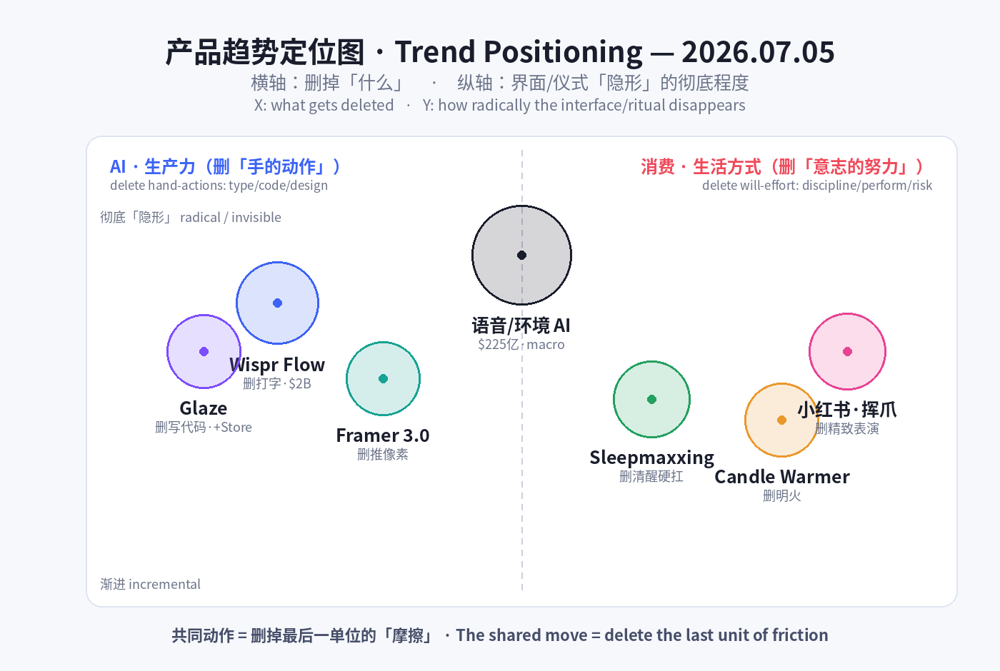
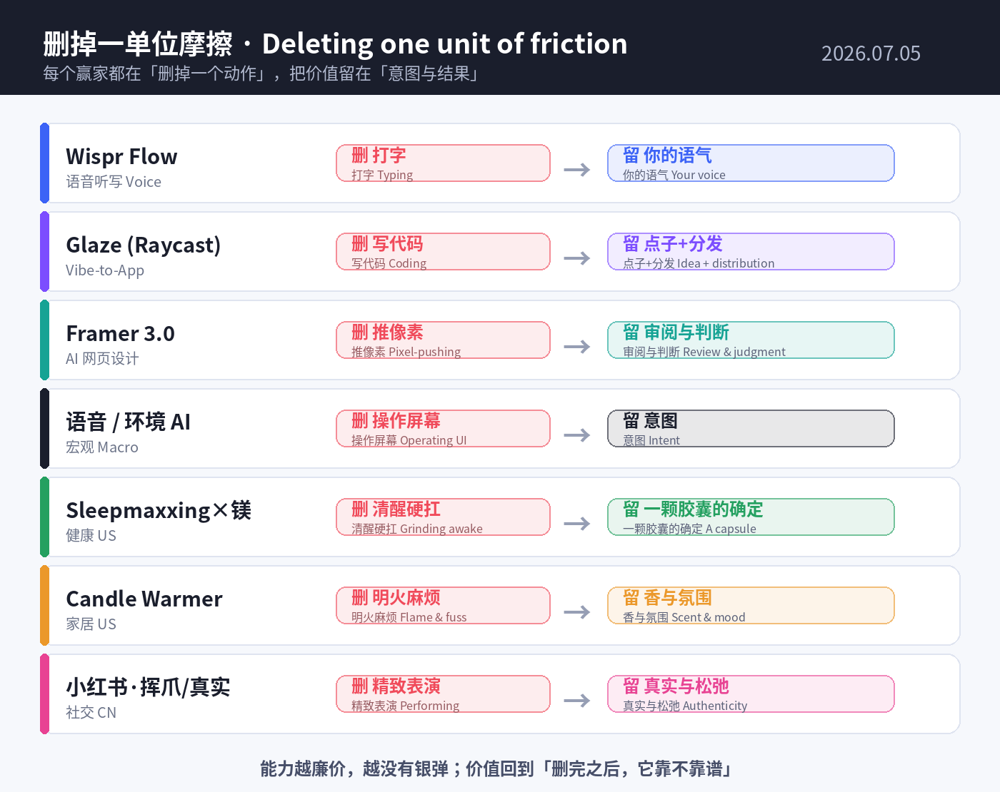

# 每日产品趋势报告 · Daily Product Trends Report
### 2026 年 7 月 5 日 · July 5, 2026（周日 / Sunday）

> **数据来源 / Sources:** Wispr Flow（Bloomberg 融资报道、G2/Trustpilot/App Store 评价、PitchBook/Tracxn）、Glaze by Raycast（Raycast Blog、Product Hunt、AlternativeTo）、Framer 3.0（Framer Blog/Help、多篇 2026 评测）、Sensor Tower《State of AI 2026》、a16z《Big Ideas 2026》、语音 AI 市场报告（Ringly / Fortune Business Insights / Mordor）、Sleepmaxxing × 镁（Future Market Insights、SleepyDeepy、Slumber）、蜡烛暖灯 / 香薰蜡（GMInsights、Grand View、Taste of Home、TikTok #CandleWarmer）、小红书（知乎、TopMarketing、新榜、人人都是产品经理）。
> **方法 / Method:** WebSearch（US-only）+ 公开检索摘要。Product Hunt / X / LinkedIn / 小红书 / Sensor Tower 多为登录墙或客户端渲染，采用公开新闻、榜单、市场报告与新闻稿替代；无法获取的页面已跳过。为保证每日新意，已**排除 6/29–7/04 已深度分析过的产品**（Isaac 1、Adam CAD、Tabstack、Humalike、Cursor for iOS、Z-Jail、BrowserAct、Sibyl、fibermaxxing、胶原蛋白、穿戴甲、奶油黄、Summerween、Owala、果醋、黑芝麻、blokecore 等）。
> **免责声明 / Disclaimer:** 本报告为趋势研究，非投资建议。融资 / 估值 / 市场规模 / 份额为第三方公开披露或估算，可能随时变化；量化「浏览量 / 帖子数」为平台口径，仅供参考。

---

## ① 当日概览 · Overview

**一句话 / In one line：** 如果说这一周 AI 忙着长出「手、脑、老板、身体」，那么**今天的信号收敛成同一个更狠的动作——把「操作」本身删掉。** Wispr Flow 靠「不用打字，说就行」冲到 **~$20 亿估值**；Raycast 的 Glaze 靠「不用写代码，说一句就生出一个 Mac 原生 App」；Framer 3.0 把网页设计交给画布上的 agent，你只需要「审阅、合并」。而消费端在做同一件事的镜像——**把「努力」从体验里删掉**：抗衰卷不动了就去卷睡觉（sleepmaxxing + 镁），点蜡烛嫌麻烦嫌危险就换成暖灯烤香（candle warmer），连社交都从「精致表演」退回到「一只黄猫爪 + 放飞真实」。

> **In one line:** If this week AI grew *hands, a brain, a boss, and a body,* **today's signals converge on one sharper move: deleting the act of "operating" itself.** Wispr Flow rides *"don't type, just talk"* to a **~$2B valuation**; Raycast's **Glaze** turns *"don't code, just describe"* into a real native Mac app; **Framer 3.0** hands web design to agents on the canvas and leaves you only *"review & merge."* The consumer side mirrors the exact same move — **deleting effort from the experience**: anti-aging is saturated, so optimization migrates to *sleep* (sleepmaxxing + magnesium); lighting a candle is fussy and risky, so it becomes a *flameless warmer*; and even socializing retreats from *polished performance* to *a yellow cat paw + "authentic and unbothered."*

两条线其实是**同一件事：删掉最后一单位的「摩擦」。** 过去十年产品竞争的是「能不能做到」，接着是「做得好不好」；到 2026 年，能力已经廉价泛滥，胜负手移到了**「你还要用户付出多少动作」**——一次键入、一行代码、一根火柴、一份「必须体面」的压力。谁把这最后一步删得最干净、又能在现实里跑得稳，谁就赢。

> These two lines are the same thing: **deleting the last unit of friction.** For a decade products competed on *"can it be done,"* then *"is it done well."* By 2026 capability is cheap and everywhere, so the contest shifts to **"how much action do you still demand from the user"** — one keystroke, one line of code, one lit match, one ounce of *"must look put-together."* Whoever deletes that last step most cleanly — and still holds up in the real world — wins.

也正因此，今天最锋利的信号都自带**「诚实的裂缝」**：Wispr 一边冲 $2B、一边扛着 Trustpilot **2.7 分**和「付费后就变差」的信任落差；镁助眠是「S 级网红补剂」，可 2026 年一篇《European Journal of Nutrition》研究直接说「对睡眠无显著作用」。**删掉摩擦很性感，但删不掉的是「最后一公里的可信度」——这恰恰是这一天所有赢家真正的护城河与软肋。**

> That's why today's sharpest signals all carry an **honest crack**: Wispr chases $2B while carrying a Trustpilot **2.7/5** and a *"degrades after you pay"* trust gap; magnesium is the *"S-tier"* sleep supplement, yet a 2026 *European Journal of Nutrition* study flatly reports *"no notable effect on sleep."* **Deleting friction is sexy; what you can't delete is last-mile credibility — which is precisely the moat, and the soft spot, of every winner today.**

**五条最强信号 / Five strongest signals**

1. **「不用打字」值 20 亿 / "Don't type" is worth $2B.** Wispr Flow 以语音听写谈到 **~$2B 估值**（Menlo 领投 ~$260M），进 **270 家世界 500 强**（英伟达、亚马逊），但 Trustpilot **2.7/5**——增长与信任的鲜明张力。Voice replaces the keyboard; trust is the catch.
2. **「氛围编程」长出应用商店 / Vibe-coding grows an app store.** Raycast **Glaze** 把一句 prompt 变成本地原生 Mac App，并配了 **Glaze Store** 一键分发——「vibe code」正在被产品化、被渠道化。Prompt-to-app, with distribution built in.
3. **设计交给画布上的 agent / Design handed to agents on the canvas.** **Framer 3.0**（6/16）上线 Agents + Branching，编辑席位 **$40→$20** 腰斩、每天送 500 积分——把「AI 会免费白嫖你」变成增长引擎。Agents + branching + credits as a growth flywheel.
4. **睡眠成了新的「卷」/ Sleep is the new grind.** Sleepmaxxing **1.25 亿+** 帖，助眠补剂市场 **$99 亿(2026)→$264 亿(2035)**，镁做「S 级」符号——但循证是分裂的。Optimization migrates to the hours you're unconscious.
5. **火焰被删掉，只留香 / Delete the flame, keep the scent.** #CandleWarmer **1 亿+** 播放，蜡烛暖灯市场 **$44 亿(2026)→$83 亿**——「无明火 + 香薰疗愈」把点蜡烛这件事去风险化。Flameless, fuss-free, wellness-coded.

> **Five signals (EN):** (1) **Wispr Flow** — voice dictation in talks at **~$2B** (Menlo ~$260M), 270 Fortune 500 users, yet Trustpilot **2.7/5**. (2) **Glaze by Raycast** — prompt-to-native-Mac-app + a **Glaze Store** for one-click distribution. (3) **Framer 3.0** — Agents on the canvas + Branching, editor seat halved **$40→$20**, 500 free credits/day. (4) **Sleepmaxxing × magnesium** — 125M+ posts, sleep-supplement market **$9.94B→$26.36B**, evidence split. (5) **Candle warmers** — #CandleWarmer 100M+ views, market **$4.4B→$8.3B**; flame deleted, scent + wellness kept.

---

## ② 逐个产品深度分析 · Product Deep-Dives

### 1. Wispr Flow — 「不用打字，说就行」冲到 $20 亿 / "Don't type, just talk" hits $2B

当日最重的一枪来自一个看起来「不起眼」的品类：**语音听写**。Wispr Flow 让你对着任何应用**自然地说话**，它替你**按你的写作风格**转成文字，自带轻度润色（auto-edits）、命令模式（command mode）、100+ 语言，覆盖 Mac / Windows / iOS。2026 年 5 月，Wispr **谈到约 $2B 估值、Menlo Ventures 领投约 $260M**——比半年前的 $700M 估值几乎翻了近三倍，累计融资约 $290M。它的增长故事很硬：**进了 270 家世界 500 强**（含英伟达、亚马逊），估算年收入约 $1000 万。但它也带着 2026 年最典型的「诚实裂缝」：**iOS 4.8 分（8500+ 评价）与 Trustpilot 2.7 分**并存，用户最集中的抱怨是「免费试用很好、**付费后就变差**」（有人说「只有 60% 的时候能用」）、内存 / CPU 占用偏高、以及早期隐私措辞引发的担忧。它精准踩中了 2026 的主线：**当打字成为「多余的动作」，删掉它就是价值——但语音的护城河不是识别率，而是信任。**

> The day's heaviest shot comes from an unglamorous category: **voice dictation.** Wispr Flow lets you **speak naturally** into any app and writes it back **in your own style** — with light auto-edits, a command mode, 100+ languages, across Mac/Windows/iOS. In **May 2026 Wispr was in talks at ~$2B, led by Menlo Ventures (~$260M)** — nearly 3x the $700M valuation set six months earlier, ~$290M raised in total. The growth story is real: **270 Fortune 500 customers** (incl. Nvidia, Amazon), ~$10M estimated ARR. But it carries the era's signature **honest crack**: an **iOS 4.8/5 (8,500+) alongside a Trustpilot 2.7/5**, with the loudest complaint being *"great on trial, **degrades after you pay**"* (some report *"works 60% of the time"*), heavy RAM/CPU, and early privacy wording. It nails the 2026 throughline: **when typing becomes a redundant action, deleting it is the value — but voice's moat isn't accuracy, it's trust.**

| 维度 Dimension | 分析 Analysis |
|---|---|
| 商业模式 Business model | 订阅 SaaS，Pro ~$15/月 + 免费层；靠企业侧「说话即写作」的效率叙事做 land-and-expand（270 家 F500）。Subscription SaaS + free tier; enterprise efficiency land-and-expand. |
| 核心功能 Core value | 全应用语音听写 + 按你风格润色、命令模式、100+ 语言——把「打字」从工作流里删掉。Voice-to-text everywhere, style-aware, 100+ languages. |
| 成功因素 Success factors | 品类时机（语音 AI 成熟）+ 企业留存 + 「隐形嵌入所有 App」的分发；估值靠采用速度而非收入。Timing + enterprise retention + ubiquity of insertion. |
| 细分市场 Niche | 生产力 / 输入层 AI（不是通用聊天，也不是客服语音 agent）。Productivity / input-layer voice AI. |
| 目标受众 Audience | 知识工作者、开发者、多语写作者、重度信息输出者、企业团队。Knowledge workers, devs, multilingual writers, enterprise teams. |
| 品牌设计 Brand | 「Flow」= 心流 / 顺滑无摩擦；极简菜单栏体验，主打「隐形、不打断」。"Flow" = frictionless; invisible, non-interrupting menu-bar UX. |
| 产品数据 Data | ~$2B 估值谈判中（2026/5，Menlo ~$260M）；累计 ~$290M；270 家 F500；iOS 4.8（8500+）vs Trustpilot 2.7；~$15/月。 |
| 链接 Link | [wisprflow.ai](https://wisprflow.ai) · [Bloomberg 报道](https://www.bloomberg.com/news/articles/2026-05-12/ai-dictation-startup-wispr-in-funding-talks-at-2-billion-value) · [G2 评价](https://www.g2.com/products/wispr-flow/reviews) |
| 评论摘要 Reviews | 正面：「润色克制、保留我的语气」「多语处理好」；质疑：「付费后变差、只有 60% 能用」「内存占用大、卡 VS Code」「隐私措辞吓人」。Praise for subtle cleanup & multilingual; skepticism on post-paywall reliability, resource use, privacy. |

### 2. Glaze by Raycast — 「氛围编程」长出了应用商店 / Vibe-coding grows an app store

如果 Wispr 删掉的是「打字」，**Glaze 删掉的是「写代码」这件事本身。** 这是效率工具明星 Raycast 推出的新平台：你**用一句话描述想要什么**，Glaze 就给你生成一个**真正的本地原生 Mac App**——即点即开、离线可用、拥有完整的系统权限（文件系统、菜单栏、键盘快捷键、后台进程），而不是一个跑在浏览器标签里的网页。更关键的是它配了**Glaze Store**：你把自己「氛围编程（vibe code）」出来的小工具**一键发布**，别人**一键安装**。这一步把 2025 年那股「人人都能 vibe code」的热潮，从「玩具 demo」推进到了「有分发、有生态、能留存」的产品形态。Glaze 于 **2026 年 3 月 4 日**首发，**7 月 1 日更新**并**直接嵌进 Raycast 启动器**，付费版约 **$20/月**。它精准延续主线：**当写代码变成「多余的动作」，价值就从「会不会写」转移到「谁把生成→分发→安装这条链路做得最顺」。**

> If Wispr deletes *typing*, **Glaze deletes *coding* itself.** From productivity darling Raycast, Glaze lets you **describe what you want in a sentence** and generates a **real, local, native Mac app** — instant-launch, offline-capable, with full OS access (file system, menu bar, keyboard shortcuts, background processes), not a browser tab. Crucially, it ships with a **Glaze Store**: publish your **vibe-coded** tools with one click, and others install them with one click. That step pushes 2025's *"anyone can vibe-code"* energy from *toy demos* into a product shape with **distribution, an ecosystem, and retention.** Glaze debuted **March 4, 2026**, updated **July 1, 2026** and **baked into the Raycast launcher**, ~**$20/mo**. It extends the throughline precisely: **when writing code becomes a redundant action, value moves from "can you code" to "who makes generate → distribute → install the smoothest."**

| 维度 Dimension | 分析 Analysis |
|---|---|
| 商业模式 Business model | 订阅（~$20/月），嫁接 Raycast 既有装机量分发；Glaze Store 埋下平台 / 抽成想象空间。Subscription atop Raycast's installed base; a store hints at platform economics. |
| 核心功能 Core value | 自然语言 → 本地原生 Mac App（离线、全系统权限）+ 一键发布 / 安装的应用商店。Prompt-to-native-app + one-click store. |
| 成功因素 Success factors | 「vibe code」情绪红利 + Raycast 的分发与信任 + 「本地优先」差异化（非网页壳）。Vibe-code moment + Raycast distribution + local-first differentiation. |
| 细分市场 Niche | 个人软件 / 长尾工具的「AI 生成 + 分发」层（介于 no-code 与 IDE 之间）。The generate-and-distribute layer for personal software. |
| 目标受众 Audience | Raycast 重度用户、开发者、power user、想「自己造工具」的非工程师。Raycast power users, devs, tool-tinkerers. |
| 品牌设计 Brand | 「Glaze」= 给 vibe code 上一层「釉」（打磨成品）；延续 Raycast 极客克制的设计语言。"Glaze" = a finished coat over raw vibe code. |
| 产品数据 Data | 首发 2026/3/4；2026/7/1 更新并嵌入启动器；付费 ~$20/月；本周登上 Product Hunt。 |
| 链接 Link | [raycast.com/blog/introducing-glaze](https://www.raycast.com/blog/introducing-glaze) · [Product Hunt](https://www.producthunt.com/products/glaze-4) · [AlternativeTo](https://alternativeto.net/news/2026/7/raycast-launches-glaze-a-new-ai-tool-for-creating-custom-desktop-apps-from-prompts/) |
| 评论摘要 Reviews | 正面：「终于把 vibe code 变成能用、能分享的东西」「本地优先、离线、有系统权限」；质疑：「生成质量 / 安全审核如何保证」「会不会又是一堆一次性小玩具」。Praise for turning vibe-code shareable & local-first; questions on quality/security review and disposable-app glut. |

### 3. Framer 3.0 — 把网页设计交给画布上的 agent / Web design, handed to agents on the canvas

**Framer 3.0（2026 年 6 月 16 日上线）**是「删掉操作」在创作工具里的样板。它把 **AI Agents 直接放到设计画布上**：从零或从一张截图生成页面、搭建版式与分区、处理响应式断点、加效果与交互；还能写文案、生成 SEO 元数据。配套的 **Branching（分支）** 让你和 agent 在**副本**上自由试，满意了再**合并回主站**——这解决了「AI 直接改线上站」的最大恐惧。商业设计极其锋利：**编辑席位从 $40 腰斩到 $20**、内容编辑席 $10，同时推出 **AI 积分**制——免费用户每天送 500 积分（约 2 个落地页），Basic 1000/月、Pro 3000/月，一个完整落地页约 300 积分。**「让 AI 免费白嫖」不再是成本黑洞，而是被设计成拉新与转化的增长飞轮。** 它对应主线的方式最直白：**设计师从「推像素」升级为「审阅与合并」——操作被删掉，判断被保留。**

> **Framer 3.0 (launched June 16, 2026)** is the template for *"delete the operation"* inside a creative tool. It puts **AI Agents directly on the design canvas**: generate pages from scratch or a screenshot, build layouts and sections, handle responsive breakpoints, add effects and interactions — plus draft copy and SEO metadata. The paired **Branching** lets you and your agents experiment on a **copy**, then **merge to the live site** only when satisfied — defusing the biggest fear of *"AI editing production."* The business design is razor-sharp: **editor seats halved from $40 to $20**, content-editor seats $10, and a new **AI-credits** model — Free users get 500 credits/day (~2 landing pages), Basic 1,000/mo, Pro 3,000/mo, a full landing page ~300 credits. **"Let AI run for free" becomes not a cost sink but a growth flywheel for acquisition and conversion.** Its throughline is the bluntest of all: **designers move from "pushing pixels" to "review & merge" — the operation is deleted, the judgment is kept.**

| 维度 Dimension | 分析 Analysis |
|---|---|
| 商业模式 Business model | 订阅 + **AI 积分**（免费 500/天，Basic ~$10 / Pro ~$30 / Scale ~$100）；席位降价换取更大装机与用量。Subscription + AI credits; cut seat price to expand usage. |
| 核心功能 Core value | 画布上的设计 agent（生成 / 改版 / 响应式 / 文案 / SEO）+ Branching 安全试验后合并。Agents-on-canvas + safe branching/merge. |
| 成功因素 Success factors | 把「AI 免费额度」变成增长引擎 + Branching 解决信任 + 既有创作者生态。Free-credits-as-growth + trust via branching + existing base. |
| 细分市场 Niche | 无代码 / 可视化网页设计的 AI-native 化（对标 Webflow、v0、Wix AI）。AI-native visual web design. |
| 目标受众 Audience | 设计师、独立创作者、营销 / 增长团队、中小企业建站。Designers, solo creators, marketing/growth teams, SMBs. |
| 品牌设计 Brand | 「画布优先（bet on the canvas）」的定位；克制的产品美学 + 「先分支后合并」的安全叙事。Canvas-first positioning; safety-first narrative. |
| 产品数据 Data | 2026/6/16 上线；席位 $40→$20；免费 500 积分/天；落地页 ~300 积分；Basic ~$10 / Pro ~$30。 |
| 链接 Link | [framer.com/agents](https://www.framer.com/agents/) · [Framer Blog](https://www.framer.com/blog/ai-credits-simpler-plans-and-lower-prices/) · [积分说明](https://www.framer.com/help/articles/how-ai-credits-and-agents-pricing-work/) |
| 评论摘要 Reviews | 正面：「Branching 终于让 AI 改站不吓人」「席位腰斩很香」；质疑：「积分制换算复杂、大项目烧得快」「生成页仍需人工精修」。Praise for branching & cheaper seats; gripes on credit math and polish. |

### 4.【趋势 / 数据】语音优先 + 环境智能：$225 亿的「无界面」市场 / Voice-first & ambient AI: the $22.5B "no-interface" market

Wispr 的 $2B 不是孤例，而是一个**结构性拐点的水花**。把镜头拉远：**2026 年语音 AI 市场约 $225 亿**（语音识别 $225 亿、语音生成 $77 亿），各细分 CAGR 普遍 **20–35%**（语音 agent 34.8%、语音生成 30.7%），语音识别 2034 年将破 $1000 亿。与此同时 **Sensor Tower《State of AI 2026》**给出需求侧证据：生成式 AI 应用的**全球使用时长从 17.2 亿小时（H1'25）翻倍到 36 亿小时（H1'26）**，AI 应用上半年下载破百亿、内购收入超 $40 亿；ChatGPT 用 3 年成为**史上最快破 10 亿月活**的 App。而 a16z《Big Ideas 2026》把这股力量命名为**「the year of me」——产品从「大规模生产」转向「为你而造」**。**共同结论：交互正在从「你去操作屏幕」滑向「你直接表达意图」——键盘、代码、点按都在被语音、prompt、agent 一层层抽走。**

> Wispr's $2B isn't a one-off — it's the splash of a **structural inflection.** Zoom out: the **2026 voice-AI market is ~$22.5B** (voice recognition $22.5B, voice generation $7.7B), with segment CAGRs mostly **20–35%** (voice agents 34.8%, voice generation 30.7%) and speech/voice recognition crossing **$100B by 2034.** On the demand side, **Sensor Tower's State of AI 2026** shows generative-AI app **time spent doubling from 17.2B hours (H1'25) to 36B hours (H1'26)**, AI apps past 10B downloads and $4B in-app revenue in H1, and ChatGPT becoming the **fastest app ever to 1B MAU** (3 years). a16z's *Big Ideas 2026* names the force **"the year of me" — products shifting from mass-production to "made for you."** **The shared conclusion: interaction is sliding from "you operate the screen" to "you express intent" — keyboard, code, and taps are being peeled away by voice, prompts, and agents.**

| 维度 Dimension | 分析 Analysis |
|---|---|
| 趋势本质 Essence | 界面「隐形化」：输入从「手操作」转向「意图表达」（说 / 描述 / 委派）。The interface goes invisible; input shifts from action to intent. |
| 量化信号 Data | 语音 AI ~$225 亿(2026)、CAGR 20–35%；GenAI 时长 17.2 亿→36 亿小时；AI 应用 10B 下载 / $4B 内购（H1'26）。 |
| 谁受益 Who wins | 输入 / 分发层（Wispr、Raycast、Framer）、语音 agent、个性化引擎；「为你而造」的 AI-native 商业模式。Input/distribution layers & personalization. |
| 风险 Risks | 信任与隐私（语音随时在听）、可靠性、以及「无界面」下的可发现性与可控性。Trust, privacy, reliability, discoverability. |
| 链接 Link | [Sensor Tower State of AI 2026](https://www.prnewswire.com/news-releases/sensor-tower-state-of-ai-2026-report-global-time-spent-on-generative-ai-apps-projected-to-more-than-double-year-over-year-302800844.html) · [a16z Big Ideas 2026](https://a16z.com/newsletter/big-ideas-2026-part-1/) · [Voice AI 统计](https://www.ringly.io/blog/voice-ai-statistics-2026) |

### 5.【消费趋势 · 欧美】Sleepmaxxing × 镁：卷完清醒卷睡觉 / Sleepmaxxing × magnesium: optimizing the hours you're unconscious

消费端的第一个镜像：**当「清醒时的自律」已经卷到头（补纤维、喝水、抗衰），下一个战场是你睡着的 8 小时。** Sleepmaxxing（睡眠最大化）成为 **2026 最大睡眠趋势，社媒帖子 1.25 亿+**——把睡眠的每个可控变量（环境、时间、补剂、工具、作息）都优化到极致。其中**镁（尤其甘氨酸镁）被封为「S 级助眠补剂」**：生物利用度是氧化镁的 4 倍，睡前 30–60 分钟 200–400mg。市场随之膨胀：**助眠补剂 $99.4 亿(2026)→$263.6 亿(2035)，CAGR 10.2%**，褪黑素占 36.7%。但这里的「诚实裂缝」尤其大——**循证是分裂的**：2025 年 Lopresti RCT 说有效，2026 年《European Journal of Nutrition》却说「对睡眠无显著作用」。**这正是「删掉努力」叙事的悖论：把优化外包给一颗胶囊很爽，但疗效的最后一公里，科学还没兜住。**

> The consumer side's first mirror: **once "waking-hours discipline" is maxed out (fiber, hydration, anti-aging), the next battlefield is the 8 hours you're asleep.** Sleepmaxxing is **2026's biggest sleep trend with 125M+ social posts** — optimizing every controllable variable (environment, timing, supplements, tools, routine). At its center, **magnesium (especially glycinate) is crowned the "S-tier" sleep supplement**: up to 4x the bioavailability of oxide, 200–400mg 30–60 min before bed. The market balloons: **sleep supplements $9.94B (2026) → $26.36B (2035), 10.2% CAGR**, melatonin at 36.7% share. But the honest crack is wide — **the evidence is split**: a 2025 Lopresti RCT says it works; a 2026 *European Journal of Nutrition* study says *"no notable effect on sleep."* **That's the paradox of the "delete the effort" narrative: outsourcing optimization to a capsule feels great, but the efficacy last-mile isn't scientifically nailed down.**

| 维度 Dimension | 分析 Analysis |
|---|---|
| 商业模式 Business model | DTC 补剂 + 订阅复购 + 达人种草；「符号化补剂」（镁 = 会睡觉的人设）驱动溢价。DTC supplements + subscription + influencer; symbol-driven premium. |
| 核心功能 Core value | 「一颗胶囊换更好睡眠」的低门槛优化；甘氨酸镁的高生物利用度叙事。Low-effort sleep optimization in a capsule. |
| 成功因素 Success factors | 蹭「自律 / 优化」文化 + 睡眠焦虑刚需 + 社媒可视化（作息、补剂堆叠）。Discipline culture + sleep anxiety + shareable routines. |
| 细分市场 Niche | 功能性睡眠健康（补剂 / 工具 / 环境），从「治疗失眠」转向「优化正常睡眠」。Functional sleep-wellness for the already-healthy. |
| 目标受众 Audience | 追求表现力的年轻专业人士、健身 / 生物黑客人群、焦虑失眠者。Performance-seekers, biohackers, the sleep-anxious. |
| 品牌设计 Brand | 「S 级 / tier list」游戏化话术 + 冷静高级的「临床感」包装。Gamified tier-lists + clinical-calm packaging. |
| 产品数据 Data | Sleepmaxxing 1.25 亿+ 帖；市场 $99.4 亿→$263.6 亿（10.2% CAGR）；褪黑素 36.7% 份额；循证分裂。 |
| 链接 Link | [Sleepmaxxing 指南](https://sleepydeepy.com/blogs/sleep-help/sleepmaxxing-2026-realistic-guide) · [镁与睡眠](https://slumbercbn.com/pages/magnesium-glycinate-for-sleep-the-complete-2026-guide) · [市场报告 FMI](https://www.futuremarketinsights.com/reports/sleep-supplement-market) |
| 评论摘要 Reviews | 正面：「入睡更快、半夜不醒」「比褪黑素不上头」；质疑：「安慰剂？」「不同研究结论打架」「剂量 / 形态营销噱头多」。Praise for faster onset; skepticism on placebo & conflicting studies. |

### 6.【消费趋势 · 欧美】Candle Warmer / 香薰蜡：删掉火焰，只留香 / Candle warmers: delete the flame, keep the scent

第二个镜像更直白——**把「点蜡烛」这件事里的摩擦（明火、危险、烟、麻烦）全删掉，只保留「香」与「氛围」。** 蜡烛暖灯（candle warmer lamp）用灯泡的热**从上方烤化蜡烛**，无需明火即可释放香氛，被当成「更安全、更持久、更好看」的替代品在 TikTok 爆红——**#CandleWarmer 播放量破 1 亿**。市场随之走强：**蜡烛暖灯及配件 $44 亿(2026)→$83 亿(2035)，CAGR 7.4%**；香薰蜡烛 $41.3 亿(2026)、香薰蜡（wax melt）市场 $43.5 亿(2026)。增长引擎是三件套：**「无明火」的安全去风险化 + 「香薰疗愈 / 减压」的健康叙事 + 极简家居美学的可拍性。** 它和 sleepmaxxing 是同一枚硬币——**都在把「疗愈 / 优化」做成低门槛、可视觉化、可日常化的仪式，且刻意删掉了原本的「努力」与「风险」。**

> The second mirror is even blunter — **delete the friction of "lighting a candle" (open flame, danger, smoke, fuss) and keep only the scent and the mood.** A candle warmer lamp uses a bulb's heat to **melt the candle from above**, releasing fragrance with no flame — marketed as *"safer, longer-lasting, better-looking,"* and going viral on TikTok with **#CandleWarmer past 100M views.** The market strengthens: **wax warmers & accessories $4.4B (2026) → $8.3B (2035), 7.4% CAGR**; scented candles $4.13B (2026), the wax-melt market $4.35B (2026). Three engines: **flameless safety (de-risking) + aromatherapy/stress-relief wellness + photogenic minimalist décor.** It's the same coin as sleepmaxxing — **both turn "wellness/optimization" into a low-effort, visual, everyday ritual, deliberately deleting the original effort and risk.**

| 维度 Dimension | 分析 Analysis |
|---|---|
| 商业模式 Business model | 硬件（暖灯）+ 高复购耗材（蜡 / 香薰蜡）的「刀架 + 刀片」模型；DTC + 达人 + 礼品季。Razor-and-blade: lamp + repeat wax refills. |
| 核心功能 Core value | 无明火释放香氛：更安全、更持久、更省蜡；兼当装饰灯。Flameless fragrance: safer, longer, decorative. |
| 成功因素 Success factors | 安全痛点（明火 / 宠物 / 儿童）+ 香薰疗愈叙事 + TikTok 可拍性 + 低客单冲动购买。Safety + wellness + shoppable aesthetics. |
| 细分市场 Niche | 家居香氛 / 氛围健康（介于蜡烛与电子扩香之间的「去风险」形态）。De-risked home-fragrance/ambiance. |
| 目标受众 Audience | 租房 / 有宠物有小孩家庭、家居美学人群、送礼买家、Z 世代与千禧一代。Renters, pet/kid households, décor lovers, gifters. |
| 品牌设计 Brand | 「暖」「治愈」「极简」视觉；复古蘑菇灯 / 磨砂玻璃等可拍造型驱动传播。Warm, cozy, minimalist, photogenic forms. |
| 产品数据 Data | #CandleWarmer 1 亿+ 播放；暖灯及配件 $44 亿→$83 亿（7.4% CAGR）；香薰蜡烛 $41.3 亿；蜡melt $43.5 亿(2026)。 |
| 链接 Link | [Taste of Home 评测](https://www.tasteofhome.com/article/candle-warmer-lamp/) · [暖灯市场 GMInsights](https://www.gminsights.com/industry-analysis/wax-warmers-and-accessories-market) · [香薰蜡 Grand View](https://www.grandviewresearch.com/industry-analysis/wax-melts-market) |
| 评论摘要 Reviews | 正面：「香得更均匀更久、没有黑烟」「安全、好看、能当夜灯」；质疑：「顶灯烤化不如烧得香」「灯泡 / 蜡配件绑定」。Praise for even/lasting scent & safety; gripes on throw & proprietary refills. |

### 7.【消费趋势 · 中国】小红书：一只「黄猫爪」+ 放飞真实 / Xiaohongshu: a yellow cat paw + "authentic and unbothered"

中国消费端的镜像发生在**社交表达**本身——**从「精致表演」退回到「零努力的真实」。** 近期小红书上，用户用**黄色猫爪贴纸 + 一个简单的挥手动作**创造了新的社交 meme，**#meme 话题热度破 7 亿**，品牌纷纷下场「挥爪」，用萌系动作完成「零压力」的品牌—用户互动。与此同时，**「独居」话题从强调「精致 vlog、仪式感」转向分享「真实、放飞」**的生活场景，评论区弥漫「放下体面，享受放飞」的态度。购买决策上，用户**先看「肤感 / 质地」等上身体验，成分只是信任背书**——「一千句文字不如一张上脸对比图」。品牌打法也随之转变：**2026 不再追「爆款破圈」，而是把人群 / 场景 / 需求做到极致精细，越细分、越有价值的赛道越容易拿到精准流量。** 这与欧美的 sleepmaxxing / 暖灯是同一逻辑的东方版本——**删掉「表演的努力」，把价值落在「真实、低门槛、精准可感」。**

> China's consumer mirror lands on **social expression itself — retreating from polished performance to zero-effort authenticity.** On Xiaohongshu, users turned a **yellow cat-paw sticker + a simple wave** into a social meme (**#meme past 700M in heat**), and brands rushed to "wave a paw" for pressure-free, cutesy brand-user interaction. Meanwhile the **"solo living" topic shifted from "polished vlogs & ritual" to sharing "real, unbothered" life**, comments radiating *"drop the composure, enjoy living unfiltered."* On purchases, users **judge "felt experience — texture/skin-feel" first, with ingredients as mere trust-backing** — *"a single on-skin before/after beats a thousand words."* Brand playbooks follow: **2026 stops chasing "viral breakout" and instead maxes out audience/scenario/need granularity — the more niche and valuable the vertical, the more precise the traffic.** It's the Eastern version of sleepmaxxing/candle-warmers — **delete the effort of performing; put value on the real, the low-friction, the precisely felt.**

| 维度 Dimension | 分析 Analysis |
|---|---|
| 商业模式 Business model | 种草 → 转化的内容电商；品牌靠「精细化人群 / 场景」投放，KOC + meme 互动做低成本触达。Content-commerce; hyper-segmented targeting + KOC/meme reach. |
| 核心功能 Core value | 「真实、可感、零压力」的内容与互动；上身对比图 > 成分表。Authentic, felt, pressure-free content; demos over specs. |
| 成功因素 Success factors | 反「精致疲劳」的情绪红利 + 萌系 meme 的病毒性 + 细分赛道的精准流量。Anti-polish fatigue + meme virality + niche precision. |
| 细分市场 Niche | 独居 / 萌系 / 肤感优先等微观人群与场景（弃「大而全」求「小而准」）。Micro-audiences: solo-living, cute-core, feel-first. |
| 目标受众 Audience | 一二线年轻女性、独居人群、Z 世代、反表演的「真实生活」派。Young urban women, solo-dwellers, Gen Z authenticity-seekers. |
| 品牌设计 Brand | 「挥爪」萌系符号 + 放飞 / 松弛感视觉；去滤镜、去仪式、强调「活人感」。Cutesy paw-wave symbol + relaxed, de-filtered "alive" aesthetic. |
| 产品数据 Data | #meme 热度 7 亿+；独居话题从「精致」转「真实」；决策「肤感优先」；策略主打精细化而非破圈。 |
| 链接 Link | [小红书八大趋势（知乎）](https://zhuanlan.zhihu.com/p/1991105890716247188) · [热点解读 TopMarketing](https://www.itopmarketing.com/info22232) · [2026 经营趋势（人人）](https://www.woshipm.com/operate/6336917.html) |
| 评论摘要 Reviews | 正面：「终于不用装精致了」「挥爪太可爱、品牌也接地气」；讨论：「真实也会变成新的表演吗」「精细化 = 流量更卷」。Praise for relief from performing; debate on whether "authenticity" becomes the new performance. |

---

## ③ 横向对比 · Cross-Product Comparison

| 产品 / 趋势 Product | 类型 Type | 商业模式 Model | 核心「删掉了什么」Deleted friction | 目标受众 Audience | 关键数据 Key data | 「诚实的裂缝」Honest crack |
|---|---|---|---|---|---|---|
| **Wispr Flow** | 语音听写 Voice AI | 订阅 ~$15/月 + 企业 | 打字 Typing | 知识工作者 / 企业 | ~$2B 估值谈判 · 270 家 F500 · iOS 4.8 | 付费后可靠性↓ · Trustpilot 2.7 |
| **Glaze (Raycast)** | Vibe-to-App 平台 | 订阅 ~$20/月 + 应用店 | 写代码 Coding | Raycast 用户 / 开发者 | 3/4 首发 · 7/1 嵌入启动器 | 生成质量 / 安全审核存疑 |
| **Framer 3.0** | AI 网页设计 | 订阅 + AI 积分 | 推像素 Manual design | 设计师 / 营销团队 | 6/16 上线 · 席位 $40→$20 · 500 积分/天 | 积分换算复杂 · 仍需精修 |
| **语音 / 环境 AI Voice/ambient** | 宏观趋势 Macro | —（基础设施层） | 「操作屏幕」Operating screens | 全体 AI 用户 | ~$225 亿市场 · GenAI 时长 17.2 亿→36 亿 h | 信任 / 隐私 / 可发现性 |
| **Sleepmaxxing × 镁** | 消费·健康 US | DTC 补剂 + 订阅 | 「清醒时努力」的边界 | 表现力人群 / 生物黑客 | 1.25 亿+ 帖 · 市场 $99 亿→$264 亿 | 循证分裂（EJN：无显著作用） |
| **Candle Warmer** | 消费·家居 US | 刀架 + 刀片（灯 + 蜡） | 明火 / 危险 / 麻烦 | 租房 / 有宠有娃 / 送礼 | #CandleWarmer 1 亿+ · 市场 $44 亿→$83 亿 | 香气「投射」不如燃烧 · 配件绑定 |
| **小红书·挥爪 / 真实** | 消费·社交 CN | 内容电商 / 精细化投放 | 「精致表演」的压力 | 年轻女性 / 独居 / Z 世代 | #meme 7 亿+ · 肤感优先决策 | 「真实」会否变成新表演 |

---

## ④ 关键洞察与共性 · Key Insights & Common Patterns

**共性一：2026 的赢家都在「删掉最后一单位的动作」。**
Wispr 删打字、Glaze 删写代码、Framer 删推像素；sleepmaxxing 把优化搬进「不用努力的睡眠」、暖灯删掉火焰的麻烦、小红书删掉「必须精致」的表演压力。能力已经廉价，胜负手从「能不能做」变成「你还要用户付出多少动作」。**产品的终极形态，是让自己「消失」，只留下用户的意图与结果。**
> **Pattern 1 — 2026's winners delete the last unit of action.** Wispr deletes typing, Glaze deletes coding, Framer deletes pixel-pushing; sleepmaxxing moves optimization into effortless sleep, warmers delete the flame's fuss, Xiaohongshu deletes the pressure to perform. Capability is cheap; the contest is *"how much action do you still demand?"* The end state of a product is to **disappear, leaving only intent and outcome.**

**共性二：删掉摩擦的同时，护城河与软肋都变成了「最后一公里的可信度」。**
Wispr 扛着「付费后变差」的信任落差；镁助眠被一篇 2026 研究直接反驳；暖灯被质疑「香气投射不如燃烧」。**当所有人都能删掉操作，差异化就回到「删完之后，它到底靠不靠谱」——可靠性、疗效、隐私、真实性，才是真正稀缺的。**
> **Pattern 2 — deleting friction makes "last-mile credibility" both the moat and the soft spot.** Wispr carries a *"degrades after you pay"* trust gap; magnesium is contradicted by a 2026 study; warmers are knocked for weak scent throw. **When everyone can delete the operation, differentiation returns to "is it actually trustworthy afterward" — reliability, efficacy, privacy, authenticity are the scarce goods.**

**共性三：AI 侧「删操作」，消费侧「删努力」，是同一股文化电流的两极。**
生产力工具在删「手的动作」（打字 / 代码 / 设计），生活方式在删「意志的动作」（自律 / 表演 / 冒险）。两者共享同一个时代情绪：**在一个「什么都能优化」的世界里，人们真正想买的，是「不必亲自费力」的确定感。** 谁能把「省力」做得既真诚又可信，谁就同时握住了 B 端与 C 端。
> **Pattern 3 — "delete the operation" (AI) and "delete the effort" (consumer) are two poles of one cultural current.** Productivity tools remove *hand-actions* (typing/coding/designing); lifestyle removes *will-actions* (discipline/performance/risk). Both share one mood: **in a world where everything is optimizable, what people actually buy is the certainty of "not having to try so hard myself."** Make effortlessness both genuine and credible, and you win B2B and B2C at once.

**给创业者的一句话 / One line for builders:** 不要再问「我的产品能多做一件事」，要问「我能替用户少做哪一个动作，并且让他们相信少做也没问题」。
> Stop asking *"what more can my product do"*; ask *"which single action can I remove for the user — and how do I make them trust that removing it is safe."*

---

*报告完 · End of report — 2026-07-05 · 自动化每日产品趋势挖掘 / Automated daily product-trend mining.*

