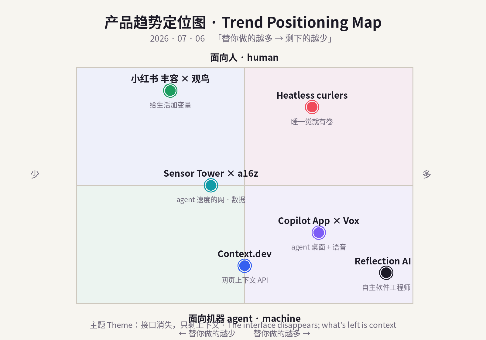
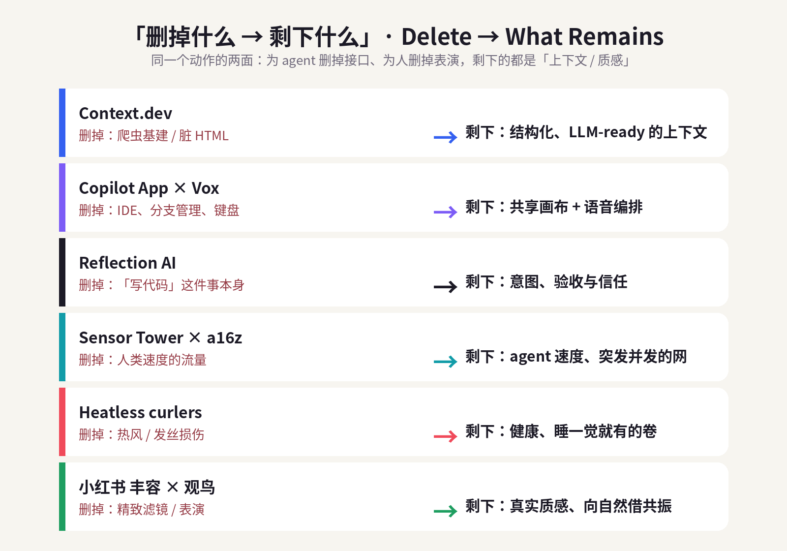
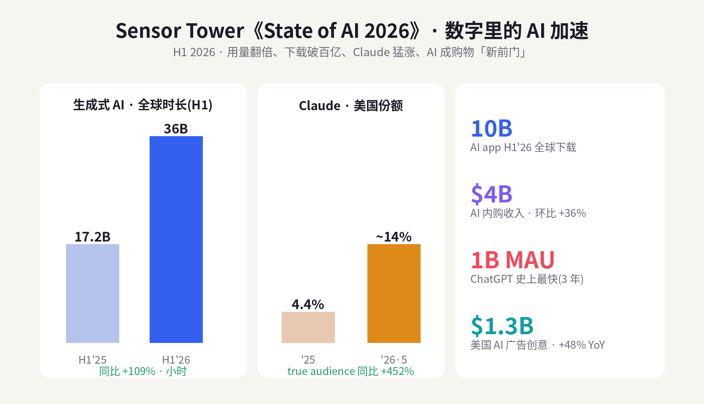

# 每日产品趋势报告 · Daily Product Trends Report
### 2026 年 7 月 6 日 · July 6, 2026（周一 / Monday）

> **数据来源 / Sources:** Product Hunt（July 2026 月榜/日榜、Context.dev、Vox）、Hacker News（Show HN 讨论摘要）、GitHub Blog / Help Net Security（Copilot App，2026-06-08）、Reflection AI 融资报道（PitchBook / Sacra / TechFundingNews / TradingKey / pulse2）、Sensor Tower《State of AI 2026》（2026-06-16，PRNewswire / The Neuron）、a16z《Big Ideas 2026》、Market Research Future / Accio（heatless curler 市场）、小红书趋势（东方财富·财富号 / Sohu / TopMarketing / 人人都是产品经理 / 知乎）。
> **方法 / Method:** WebSearch（US-only）公开检索摘要。**web_fetch 对外站被 egress 拦截**（allowlist 仅含 npm/pypi/github/anthropic 等），Product Hunt / Hacker News / Sensor Tower / X / LinkedIn / 小红书均为登录墙或客户端渲染，无法直接抓取；统一以新闻、榜单、市场报告摘要替代，无法获取的原始页面已跳过、未做绕过。为保证每日新意，已**排除 6/29–7/05 已深度分析过的产品**（BrowserAct、Skybridge、AgentX、Sibyl、mixfox、HackerNows、Cursor for iOS、Z-Jail、Weave Isaac 1、Adam CAD、Tabstack、Humalike、Mark by Airtop、Wispr Flow、Glaze、Framer 3.0；消费：胶原/穿戴甲/blokecore/fibermaxxing/Owala/果醋/黑芝麻/奶油黄/Summerween/sleepmaxxing/candle warmer/黄猫爪 等）。
> **免责声明 / Disclaimer:** 本报告为趋势研究，非投资建议。融资 / 估值 / 市场规模 / 份额为第三方公开披露或估算，随时可能变化；量化「浏览量 / 下载量 / 时长 / 份额」为平台或第三方口径，仅供参考。

---

## ① 当日概览 · Overview

**一句话 / In one line：** 昨天的信号是「删掉操作本身」，今天它收敛得更硬——**当接口一层层被删掉，产品竞争的终点只剩一样东西：上下文（context）。** 对 agent，是把乱糟糟的网页、脏 HTML、键盘和 IDE 全删掉，只留「结构化、可喂给模型的上下文」——Product Hunt 月榜第一 **Context.dev**（一个 API 把整张网变成 LLM-ready 上下文）、**GitHub Copilot App**（把 IDE 溶成人机共享画布）、以及一年内估值冲到 **$250 亿**的 **Reflection AI**（干脆把「写代码」这件事删掉，只留意图和验收）都在做同一件事。对人，是把「精致表演」删掉，只留真实的**质感 / 环境 / 自然**——欧美的 **heatless curler**（删掉热，睡一觉就有卷）、中国小红书的 **「丰容」与「观鸟」**（删掉滤镜，给生活加变量、向自然借共振）。

> **In one line:** Yesterday's signal was *"delete the act of operating."* Today it sharpens: **as interface layers get stripped away, the endgame of product competition is one thing — context.** For agents, it means deleting the messy web, dirty HTML, the keyboard and the IDE, and keeping only *structured, model-ready context*: Product Hunt's #1 of July, **Context.dev** (one API that turns the whole web into LLM-ready context); the **GitHub Copilot App** (the IDE dissolved into a shared human-agent canvas); and **Reflection AI**, whose valuation rocketed to **$25B** in a year by deleting *"writing code"* altogether and keeping only intent and acceptance. For humans, it means deleting the *polished performance* and keeping real *texture / environment / nature*: the West's **heatless curlers** (delete the heat, wake up with curls) and China's Xiaohongshu waves of **"enrichment (丰容)" and "birding (观鸟)"** (delete the filter, add variables to life, borrow resonance from nature).

两条线是同一句话：**接口消失，只剩上下文。** 过去十年，产品先比「能不能做到」，再比「做得好不好」；到 2026 年，能力已经廉价泛滥，连「操作」都被删干净了，胜负手落到**「删掉接口之后，你还能不能给出对的上下文」**——对机器是数据的上下文，对人是生活的质感。谁把接口删得最狠、又能把「剩下的那一样」做得可信，谁赢。

> The two lines are one sentence: **the interface disappears; what's left is context.** For a decade products competed on *"can it be done,"* then *"is it done well."* By 2026 capability is cheap, and even *operating* has been deleted — so the contest becomes **"once you remove the interface, can you still supply the right context?"** — the context of data for machines, the texture of life for humans. Whoever strips the interface most aggressively *and* makes *"the one thing that remains"* credible, wins.

**五条最强信号 / Five strongest signals**

1. **一个 API 把「整张网」变成上下文 / One API turns the whole web into context.** **Context.dev**（YC 背景）登上 Product Hunt **7 月月榜第一**：scrape / crawl / 提取结构化数据 / 抓 logo 配色字体 / 交易描述富化，全在一个接口里，**5,000+ 企业**在用（Mintlify、Daily.dev）。The picks-and-shovels for the agent web.
2. **IDE 溶成「agent 编排台」/ The IDE dissolves into an agent desktop.** **GitHub Copilot App**（Build 2026，6/8 桌面预览）给每个 agent session 一个隔离 **git worktree**、人机共享 **Canvas**、**Agent Merge** 自动过 CI 与合并、**100 万 token** 上下文——外加指路的 **Vox**（Copilot 的「语音进、语音出」）。The keyboard is optional; orchestration is the product.
3. **「自主软件工程师」值 $250 亿 / An "autonomous software engineer" is worth $25B.** **Reflection AI**（DeepMind / AlphaGo 班底）一年内估值 **$545M → $25B**，寻求 **$2.5B** 新融资，并与 **SpaceX** 签下每月 **$1.5 亿**算力大单——押注 agent 直接替你把代码写完。The boldest bet: delete coding, keep intent.
4. **AI 用量翻倍、成购物「新前门」/ AI usage doubles and becomes the front door to shopping.** Sensor Tower：生成式 AI 时长 **17.2B→36B** 小时，AI app H1 下载 **100 亿**、内购 **$40 亿(+36%)**；ChatGPT **3 年破 10 亿月活**（史上最快），**Claude** true audience 同比 **+452%**、美国份额 **4.4%→14%**。The numbers behind the agent shift.
5. **删掉「热」与「滤镜」，留住真实 / Delete the heat and the filter, keep the real.** 欧美 **heatless curler** 市场 2026 预计 **+15%**（无热=护发、睡一觉成卷）；中国小红书 **#家的丰容计划 10 亿+** 浏览、**#观鸟 1.2 亿+**（笔记 +70%），「**质感 > 性价比**」。Consumers strip performance and keep texture.

> **Five signals (EN):** (1) **Context.dev** — YC-backed #1 on Product Hunt's July board; one API to scrape/crawl/extract/enrich the web; 5,000+ businesses. (2) **GitHub Copilot App × Vox** — agent-native desktop with per-session git worktrees, shared canvases, Agent Merge, 1M-token context; Vox adds voice-in/voice-out. (3) **Reflection AI** — DeepMind/AlphaGo founders; **$545M→$25B** in a year, seeking **$2.5B**, **$150M/mo** SpaceX compute deal; autonomous SWE. (4) **Sensor Tower State of AI 2026** — GenAI time **17.2B→36B** hrs, **10B** downloads & **$4B** IAP (+36%) in H1; ChatGPT **1B MAU** in 3 yrs; **Claude +452% YoY**, US share **4.4%→14%**. (5) **Heatless curlers** (+15% in 2026) and Xiaohongshu **"丰容"** (1B+ views) **× "观鸟"** (120M+, notes +70%); texture beats price.

---

## ② 逐个产品深度分析 · Product Deep-Dives

### 1. Context.dev — 给 agent 的「网页上下文 API」/ The web-context API for agents

今天最锋利的一枪来自一个「基建」品类：**网页上下文（web context）**。**Context.dev** 用一句话概括自己——*"One API to scrape, enrich, and understand the web."* 它把过去每个团队都要自己搭、还老是坏掉的爬虫基建，收进一个接口：**scrape** 任意 URL 变干净的 Markdown / HTML、**crawl** 整站与 sitemap、把网页 **extract** 成你自定义 schema 的结构化数据、截图、抓取任意域名的 **logo / 配色 / 字体 / styleguide / 公司信息**，甚至做**交易描述符富化**（把银行流水里那串鬼画符翻译成商户）。它提供 TypeScript / Python / Ruby 的 typed SDK，YC 背景，无需信用卡，「几分钟接入」，而且**coding agent 也能直接调用**。结果是它冲上了 Product Hunt **7 月月榜第一**，官网称 **5,000+ 企业**在用（Mintlify、Daily.dev、Ferndesk）。它精准踩中 a16z 的判断：当流量从「人类速度」转向「agent 速度」，agent 最缺的不是模型，而是**能被信任地喂进模型的、干净的上下文**——Context.dev 卖的就是这一口「上下文」。

> The day's sharpest shot is infrastructure: **web context.** **Context.dev** sums itself up as *"one API to scrape, enrich, and understand the web."* It collapses the brittle scraping stack every team used to rebuild into a single interface: **scrape** any URL into clean Markdown/HTML, **crawl** sites and sitemaps, **extract** pages into your own schema, capture screenshots, pull **logos / colors / fonts / styleguides / company data** from any domain, and even resolve **transaction descriptors**. It ships typed SDKs (TS/Python/Ruby), is YC-backed, needs no card, installs in minutes, and **coding agents can call it directly.** That took it to **#1 on Product Hunt's July board**, with **5,000+ businesses** (Mintlify, Daily.dev, Ferndesk). It nails a16z's thesis: as traffic shifts from *human-speed* to *agent-speed*, what agents lack isn't the model — it's **clean, trustworthy context to feed it.** Context.dev sells exactly that.

| 维度 Dimension | 分析 Analysis |
|---|---|
| 商业模式 Business model | 用量计费的 API / 开发者 SaaS（免费额度 + 按 scrape/extract 用量付费），典型 usage-based land-and-expand。Usage-based API + free tier. |
| 核心价值 Core value | 一个接口把「乱网」变成 LLM-ready 的结构化上下文（scrape/crawl/extract/enrich/截图/品牌数据）。The web → structured context in one call. |
| 成功因素 Success | 时机（agent 需要读网）+ 收敛脆弱基建 + 开发者体验（typed SDK、免卡、几分钟接入）+ agent 可直接调用。Timing + DX + agent-callable. |
| 细分市场 Niche | Agent / AI 应用的数据接入层（不是通用爬虫，也不是搜索）。Data-access layer for AI apps & agents. |
| 目标受众 Audience | 构建 AI 产品 / agent 的开发者与团队、做 enrichment / RAG / 自动化的公司。Devs building AI products & agents. |
| 品牌设计 Brand | 名字直给（"Context"=上下文），定位克制专业，主打「一个 API」的简洁叙事。Literal naming; "one API" simplicity. |
| 产品数据 Data | Product Hunt 7 月**月榜第一**；**5,000+ 企业**（Mintlify、Daily.dev、Ferndesk）；TS/Python/Ruby SDK；YC。 |
| 链接 Link | [producthunt.com/products/context-dev](https://www.producthunt.com/products/context-dev) |
| 评论摘要 Reviews | 正面：「省掉自建爬虫、markdown 干净、品牌数据（logo/配色）很实用」；关注点：反爬 / 速率限制稳定性、结构化抽取在复杂站点的准确率、成本随规模上升。Praise for DX & brand-data; watch anti-bot reliability & extraction accuracy at scale. |

### 2. GitHub Copilot App × Vox — IDE 溶解成「agent 编排台」+ 语音 / The IDE dissolves into an agent desktop

如果 Context.dev 删掉的是「读网的接口」，那 **GitHub Copilot App** 删掉的是**「IDE」这个接口本身**。在 Microsoft Build 2026 上发布、6/8 向付费用户开放桌面预览的这款独立 App（Win/macOS/Linux），把开发从「你在编辑器里敲」变成「你在一块画布上指挥一群 agent」：**My Work** 视图跨仓库看所有进行中的 session / issue / PR / 后台自动化；每个 session 跑在自己的 **git worktree**（隔离分支副本，App 自动建、自动清，不用你 juggling 分支）；**Canvases** 是人和 agent 共享的工作面，可以显示计划、PR、浏览器会话、终端、部署、dashboard，agent 实时更新、你随时编辑 / 重排 / 批准 / 改道；**Agent Merge** 会跟着 PR 过 review 与 CI、盯着必需 reviewer、修失败检查，满足条件才合并；再叠加 **100 万 token** 上下文窗口与可调 reasoning。而 Product Hunt 上一个小而妙的指路人 **Vox**（"voice in, voice out — with GitHub Copilot"）把最后一层键盘也删了：`/vox` 打开一个会呼吸的听觉 orb，你说话、听 agent 回、可以语音打断纠正，纯 JS、一行安装。**Copilot App 把「操作 IDE」删成「编排 agent」，Vox 把「打字」删成「对话」——接口一层层退场，剩下的是意图与画布。**

> If Context.dev deletes the *interface to read the web,* the **GitHub Copilot App** deletes **the IDE itself.** Unveiled at Build 2026 and opened to paid users on June 8, this standalone desktop app (Win/macOS/Linux) turns coding from *"you type in an editor"* into *"you direct a swarm of agents on a canvas."* **My Work** shows every in-flight session/issue/PR/automation across repos; each session runs in its own **git worktree** (isolated branch copy, auto-created and auto-cleaned); **Canvases** are shared human-agent surfaces showing a plan, PR, browser session, terminal, deployment or dashboard that agents update live and you can edit/reorder/approve/redirect; **Agent Merge** shepherds a PR through review and CI; plus a **1M-token** context window. And a neat indie pointer, **Vox** (*"voice in, voice out — with GitHub Copilot"*), deletes the last keyboard layer: `/vox` opens a breathing audio orb — you speak, hear the agent reply, barge in by voice; pure JS, one-line install. **Copilot App deletes "operating an IDE" into "orchestrating agents"; Vox deletes "typing" into "talking" — interface layers exit, intent and canvas remain.**

| 维度 Dimension | 分析 Analysis |
|---|---|
| 商业模式 Business model | Copilot 订阅升级（Pro/Pro+/Business/Enterprise）——用 agent 桌面提高 ARPU 与留存；Vox 免费开源、引流。Subscription upsell (Copilot); Vox free/OSS. |
| 核心价值 Core value | 把 IDE 变成人机共享的 agent 编排台（worktree 隔离、Canvas、Agent Merge、1M ctx）+ 语音接口。IDE → agent orchestration surface + voice. |
| 成功因素 Success | GitHub / 微软分发、与现有 Copilot 装机量咬合、并行 agent 的工程化（worktree/CI）解决真实痛点。Distribution + real parallel-agent plumbing. |
| 细分市场 Niche | Agentic 开发环境 / 多 agent 编排（区别于单窗口的补全式 IDE）。Agentic dev environment / multi-agent orchestration. |
| 目标受众 Audience | 专业开发者、平台 / DevEx 团队、跑并行 agent 的工程组织；Vox 面向想「离键盘」的开发者。Pro devs & platform teams. |
| 品牌设计 Brand | Copilot 沿用「副驾」隐喻但升级为「工作台」；Canvas / worktree / Merge 的语言把 agent「可管控化」。"Copilot" → workbench; controllable-agent language. |
| 产品数据 Data | Build 2026（6/2 发布）；桌面预览 6/8 开放付费用户；1M-token ctx（VS Code/CLI/App）；Vox 上 Product Hunt（7/3）。 |
| 链接 Link | [github.blog · Copilot app](https://github.blog/news-insights/product-news/github-copilot-app-the-agent-native-desktop-experience/) · [Vox](https://www.producthunt.com/products/vox-5) |
| 评论摘要 Reviews | 正面：「worktree 隔离让并行 agent 不打架」「Canvas 让 agent 工作可见可控」「Agent Merge 省心」；质疑：技术预览的稳定性、agent 自动合并的信任边界、成本。Praise for isolation/visibility; concerns on preview stability & auto-merge trust. |

### 3. Reflection AI — 押注「自主软件工程师」的 $250 亿 / The $25B bet on the autonomous software engineer

前两个删的是「接口」，**Reflection AI** 干脆想删掉**「写代码」这件事本身**。它的产品 **Asimov** 不是补全（明确区别于 Copilot），而是去理解**整个代码库 + 文档 + 设计规格 + 团队沟通**，自主完成规划 → 写 → 测 → 优化的全流程——目标是「AI 软件工程师」。班底极硬：2024 年 3 月成立于纽约，两位创始人都是 Google DeepMind 老兵——**Misha Laskin**（Gemini reward modeling 负责人）、**Ioannis Antonoglou**（AlphaGo / AlphaZero / MuZero 共同创造者）。资本给出的定价堪称 2026 最猛的曲线之一：A 轮（2025/03）**$130M @ ~$5.45 亿**；B 轮（2025/10）Nvidia 领投 **$20 亿**、估值跳到 **$80 亿**；2026 年寻求 **$25 亿**新融资 @ **$250 亿** pre-money——**一年 45 倍**。它还在 6 月与 **SpaceX** 签下算力大单：2026/7/1 起至 2029，每月付 SpaceX **$1.5 亿**用 Nvidia GB300（孟菲斯 Colossus 2 数据中心）。这既是「删掉接口，只剩意图」这条线的最激进版本，也是它最诚实的裂缝——**$250 亿几乎全押在「自主 SWE 真能跑通」这个尚未被大规模验证的假设上，且月烧 $1.5 亿算力，容错窗口极窄。**

> The first two delete *the interface;* **Reflection AI** wants to delete **writing code itself.** Its product **Asimov** isn't completion (explicitly unlike Copilot) — it ingests the **entire codebase + docs + design specs + team comms** and autonomously plans, writes, tests and optimizes: an *AI software engineer.* The pedigree is heavy: founded March 2024 in NY by two Google DeepMind veterans — **Misha Laskin** (Gemini reward-modeling lead) and **Ioannis Antonoglou** (co-creator of AlphaGo/AlphaZero/MuZero). The capital curve is one of 2026's steepest: Series A (Mar 2025) **$130M @ ~$545M**; Series B (Oct 2025) Nvidia-led **$2B**, valuation to **$8B**; and a 2026 raise of **$2.5B @ $25B** pre-money — **~45x in a year.** In June it signed a compute deal with **SpaceX**: from July 1, 2026 through 2029, **$150M/month** for Nvidia GB300 at the Memphis Colossus 2 datacenter. It's the most radical version of *"delete the interface, keep the intent,"* and its most honest crack: **$25B rests almost entirely on the still-unproven bet that autonomous SWE actually ships — while burning $150M/mo, the margin for error is thin.**

| 维度 Dimension | 分析 Analysis |
|---|---|
| 商业模式 Business model | 前沿模型 + 「自主软件工程师」产品（Asimov）；企业席位 / 用量变现，重资本、重算力。Frontier model + autonomous-SWE product; enterprise seats/usage. |
| 核心价值 Core value | 理解全库 + 文档 + 规格 + 沟通，自主完成规划→写→测→优化，而非补全。Whole-context autonomous SWE, not autocomplete. |
| 成功因素 Success | DeepMind/AlphaGo 班底 + Nvidia/SpaceX 资本与算力背书 + 开源前沿模型叙事。Team + Nvidia/SpaceX backing + open-frontier thesis. |
| 细分市场 Niche | 自主编码 agent / 前沿模型（与 Copilot 式补全、与通用聊天区隔）。Autonomous coding agents / frontier models. |
| 目标受众 Audience | 大型工程组织、平台团队、想要「AI 队友」而非「AI 补全」的公司。Large eng orgs wanting an AI teammate. |
| 品牌设计 Brand | "Reflection"（反思 / 自我改进）+ 产品名 "Asimov"（科幻·机器人）——强化「会思考的工程师」定位。Reflective, sci-fi-coded. |
| 产品数据 Data | 估值 **$545M→$8B→$25B**（一年）；寻求 **$2.5B**；SpaceX **$150M/月**算力（'26/7–'29）；纽约，2024 成立。 |
| 链接 Link | [Sacra · Reflection AI](https://sacra.com/c/reflection-ai/) · [TechFundingNews](https://techfundingnews.com/reflection-ai-25-billion-valuation-nvidia-deepseek/) |
| 评论摘要 Reviews | 看多：「班底 + 算力 + 开源前沿，是少数能挑战闭源的团队」；看空：「$25B 领先于收入验证，月烧 $1.5 亿，自主 SWE 尚未规模化，估值透支」。Bull: elite team+compute; Bear: valuation ahead of proof, heavy burn. |

### 4.【趋势 / 数据】Sensor Tower《State of AI 2026》× a16z「agent 速度的网」/ Usage doubles, Claude surges, AI becomes the front door to shopping

上面三个产品为什么都在「删接口、留上下文」？因为底层的数字在逼它们。Sensor Tower《State of AI 2026》（6/16）给出一组硬数据：生成式 AI app 的**全球时长从 H1'25 的 172 亿小时翻倍到 H1'26 的 360 亿小时**；**AI app H1 全球下载破 100 亿、内购收入破 $40 亿（环比 +36%）**；**ChatGPT 用 3 年成为史上最快突破 10 亿月活**的移动 App（快过 TikTok / YouTube / Instagram）。但格局在裂开：ChatGPT 的 true audience 份额 2026 年 3 月**首次跌破 50%**，而 **Claude 成为 2026 最快的挑战者**——5 月 true audience 同比 **+452%**、美国份额从 **4.4% 冲到近 14%**。更关键的结构变化是：**AI 正在成为购物的「新前门」**（AI shopping + 广告双爆发，美国 AI 主题广告创意支出 1–5 月 $13 亿、+48% YoY）。把这些拼起来，正好是 a16z 的判断：流量从「人类速度」（可预测、低并发）转向 **「agent 速度」**（递归、突发、海量并发），下一代**「agent-native」基建**要把 thundering herd 当默认态，瓶颈从算力变成**协调**（routing / locking / 状态 / 策略）。**换句话说，Context.dev / Copilot App / Reflection 不是孤立的产品，而是「agent 速度的网」在应用层长出来的三颗牙。**

> Why are all three products *deleting interface, keeping context*? Because the underlying numbers force it. Sensor Tower's **State of AI 2026** (Jun 16): GenAI app **time spent doubled from 17.2B hrs (H1'25) to 36B hrs (H1'26)**; **10B+ downloads and $4B+ IAP (+36% HoH)** in H1; **ChatGPT hit 1B MAU in 3 years** — the fastest mobile app ever. But the field is splintering: ChatGPT's true-audience share **fell below 50% for the first time in March 2026**, while **Claude is the fastest challenger** — **+452% YoY** true audience in May, US share **4.4% → ~14%.** The deeper shift: **AI is becoming the new front door to shopping** (AI shopping + ads booming; US AI-themed ad creative spend **$1.3B in Jan–May, +48% YoY**). Stitched together, this is a16z's thesis: traffic moves from *human-speed* (predictable, low-concurrency) to **agent-speed** (recursive, bursty, massively parallel); next-gen **agent-native infra** must treat thundering herds as default, and the bottleneck becomes **coordination** (routing/locking/state/policy). **In short, Context.dev / Copilot App / Reflection aren't isolated launches — they're three teeth the "agent-speed web" is growing at the app layer.**

| 维度 Dimension | 分析 Analysis |
|---|---|
| 商业模式 Business model | 平台侧多点变现：订阅（ChatGPT/Claude）、内购（$4B）、广告（AI 创意 +48%）、AI 电商抽佣。Subscriptions + IAP + ads + AI commerce. |
| 核心价值 Core value | AI 从「工具」变「入口 / 环境」：搜索、购物、开发都从 AI 前门进。AI as the front door / environment. |
| 成功因素 Success | 用量复利（时长翻倍）+ 竞争多极化（Claude 猛涨）+ 商业闭环（购物 + 广告）。Usage compounding + multipolar + commerce loop. |
| 细分市场 Niche | 「agent 速度」基建与 AI 前门流量（区别于 human-speed 的老 web）。Agent-speed infra & AI-front-door traffic. |
| 目标受众 Audience | 基建 / 平台团队、AI 应用开发者、电商与广告主、投资人。Infra/platform teams, AI devs, retailers, investors. |
| 品牌设计 Brand | 「State of AI」年度报告 = 行业坐标系；a16z「Big Ideas」= 议程设置。Annual-report & agenda-setting brands. |
| 产品数据 Data | 时长 **17.2B→36B** 小时；下载 **10B**；内购 **$4B(+36%)**；ChatGPT **1B MAU/3yr**；Claude **+452%**、**4.4%→14%**；AI 广告 **$1.3B(+48%)**。 |
| 链接 Link | [Sensor Tower · State of AI 2026](https://sensortower.com/blog/state-of-ai-2026) · [a16z · Big Ideas 2026](https://a16z.com/newsletter/big-ideas-2026-part-1/) |
| 评论摘要 Reviews | 共识：「AI 用量与商业化拐点已过，竞争进入多极」；分歧：「口径（true audience / 时长）与真实付费的关系」「AI 购物前门的转化仍待验证」。Consensus on inflection; debate on metrics & commerce conversion. |

### 5.【消费趋势 · 欧美】Heatless curlers — 删掉「热」，留住卷 / Delete the heat, keep the curl

消费端在做和 agent 侧一模一样的动作：**删掉一层接口（热），只留结果（卷）。** **Heatless curler（无热卷发器）**——那种睡前把软棒 / 缎带绕进头发、第二天早上「揭晓」出蓬松卷的产品——正沿着一条稳的曲线上行：全球市场从 **2024 年 $1.75 亿、2025 年 $1.85 亿，到 2035 年 $3.19 亿**（CAGR 5.6%），**2026 单年预计同比 +15%**，主要由 Gen Z 的「无热造型」偏好驱动。它的叙事完美贴合 2026：**头发健康 / wellness**（删掉热损伤）、**睡眠即造型**（删掉早晨的动作，「睡一觉就有卷」）、以及 **~80% 消费者经社媒发现美妆新品**（TikTok / IG / Pinterest 的「晨间揭晓」内容天然适合短视频）。品类里 **Flexi Rods（软棒）** 因多用途、易用而主导，**Ribbon Curls（缎带卷）** 快速上升；北美是最大市场、亚太增速最快。它当然也有「诚实的裂缝」：**出卷效果不稳定**（发质 / 手法 / 湿度差异大），这也是复购与口碑的真正门槛——和 agent 侧「删掉接口容易、最后一公里可信度难」如出一辙。

> The consumer side runs the exact same move: **delete one interface layer (heat), keep the result (curls).** **Heatless curlers** — the soft rods/ribbons you wrap in before bed and *"reveal"* into bouncy curls next morning — are climbing a steady curve: the global market goes from **$175M (2024) → $185M (2025) → $319M (2035)** (5.6% CAGR), with **~+15% in 2026 alone,** driven by Gen Z's non-heat preference. The narrative fits 2026 perfectly: **hair health/wellness** (delete heat damage), **sleep-as-styling** (delete the morning routine — *wake up with curls*), and **~80% discover beauty via social** (the *morning reveal* is native to short video). **Flexi Rods** dominate (versatile, easy), **Ribbon Curls** rise fast; North America leads, APAC grows fastest. Its honest crack: **results are inconsistent** (hair type/technique/humidity), which is the real bar for repeat purchase and word-of-mouth — exactly like the agent side, where *deleting the interface is easy, but last-mile credibility is hard.*

| 维度 Dimension | 分析 Analysis |
|---|---|
| 商业模式 Business model | 低价高频美妆配件（DTC + Amazon + TikTok Shop），靠社媒内容 → 冲动购买 → 复购。Low-cost accessory, social-driven impulse + repeat. |
| 核心价值 Core value | 无热、护发、「睡一觉就有卷」——删掉热损伤与早晨造型动作。Damage-free, sleep-in curls. |
| 成功因素 Success | wellness / 护发叙事 + 「晨间揭晓」适配短视频 + 低价试错门槛 + Gen Z 偏好。Wellness + reveal-content + low price + Gen Z. |
| 细分市场 Niche | 无热造型（heat-free hairstyling）配件（区别于电卷棒 / 直发器）。Heat-free styling accessory. |
| 目标受众 Audience | Gen Z / 千禧一代女性、注重发质健康、爱短视频「教程 + 揭晓」。Gen Z/millennial women, hair-health minded. |
| 品牌设计 Brand | 缎带 / 丝绒质感、柔和莫兰迪色、「overnight / no-heat」卖点前置。Soft, satin, "overnight/no-heat" forward. |
| 产品数据 Data | 市场 **$175M('24)→$185M('25)→$319M('35)**，CAGR 5.6%；**2026 +15%**；~80% 经社媒发现；Flexi Rods 主导、Ribbon Curls 上升。 |
| 链接 Link | [Heatless Hair Curler Market · MRFuture](https://www.marketresearchfuture.com/reports/heatless-hair-curler-market-12201) |
| 评论摘要 Reviews | 正面：「护发、真的睡一觉就有卷、便宜好带」；抱怨：「效果不稳、粗 / 直发出不了卷、需要练手法、隔夜不舒服」。Praise for damage-free & value; complaints on inconsistency & comfort. |

### 6.【消费趋势 · 中国】小红书「丰容」×「观鸟」— 给生活加变量、向自然借共振 / "Enrich" life, borrow resonance from nature

中国小红书上，同一个「删掉表演、只留真实」的动作，长成了两个词：**丰容**与**观鸟**。**「丰容」** 借用动物园「行为丰容」（给圈养动物增加环境变量以改善福利）的概念，被年轻人拿来形容**主动改变环境、打破日常惯性，给自己的生活「加变量」**：**#家的丰容计划** 浏览量破 **10 亿**，"人你该丰容了" 上线 90 天破亿，并衍生出旅行丰容 / 兴趣丰容 / 认知丰容，辐射家居、美食、穿搭、个护——2026 年它正从短时热点变成一种**主流生活方式**。**「观鸟」** 则是「鸟门」——年轻人追捧的新潮户外：**#观鸟** 近 90 天浏览量 **1.2 亿+**、笔记数 **+70%+**，卖点是「极高沉浸的自然入口」和「逃离都市」的获得感（同期上升的还有拼豆、轻运动）。两者背后是同一套决策逻辑：**质感 > 性价比**（"性价比"互动极低，"高级 / 氛围感"高互动；护肤讨论里「肤感 / 质地」压过「成分」），**真实、有瑕疵、生活化的内容更被信任**，平台把 **50%+ 流量倾斜给千粉以下素人**、扶持 3000+ 兴趣圈层。**丰容和观鸟卖的从来不是某件商品，而是「给被算法磨平的生活，重新加回变量与质感」——这正是消费侧版本的「删掉接口，只剩上下文」。**

> On China's Xiaohongshu, the same *"delete performance, keep the real"* move grows into two words: **enrichment (丰容)** and **birding (观鸟).** **"丰容"** borrows the zoology term *behavioral enrichment* (adding environmental variety to improve captive-animal welfare) to describe young people **actively changing their environment to break routine and add "variables" back into life:** **#家的丰容计划** has **1B+ views,** *"you should enrich yourself"* passed 100M in 90 days, spawning travel/interest/cognition variants across home, food, fashion and personal care — in 2026 it's shifting from a fad to a **mainstream lifestyle.** **"观鸟" (birding)** is the trendy new outdoor *"bird gate"*: **#观鸟** has **120M+ views** and **+70% notes** in 90 days, selling *"a deeply immersive doorway to nature"* and the *"escape the city"* payoff (rising alongside perler beads and light exercise). Both rest on one decision logic: **texture beats price** (*"value-for-money"* gets little engagement while *"premium/ambiance"* wins; in skincare, *"skin-feel/texture"* outweighs *"ingredients"*), **authentic, imperfect, everyday content earns more trust,** and the platform **tilts 50%+ of traffic to sub-1k-follower creators** across 3,000+ interest circles. **丰容 and 观鸟 never sell a product — they sell *"adding variables and texture back into a life flattened by the algorithm"* — the consumer-side version of "delete the interface, keep the context."**

| 维度 Dimension | 分析 Analysis |
|---|---|
| 商业模式 Business model | 内容种草 → 兴趣圈层 → 家居 / 户外 / 个护商品与体验转化；平台靠精细化流量分发。Content-to-commerce across niche circles. |
| 核心价值 Core value | 给「被算法磨平」的生活重新加变量与质感（丰容）、向自然借沉浸与逃离（观鸟）。Add variables & texture; immersive nature. |
| 成功因素 Success | 概念挪用（行为丰容）有记忆点 + 真实内容红利 + 平台向素人 / 小众圈层倾斜流量。Sticky concept + authenticity + niche-traffic tilt. |
| 细分市场 Niche | 生活方式 / 情绪价值消费与新潮户外（区别于纯性价比种草）。Lifestyle/emotional-value & new outdoors. |
| 目标受众 Audience | 一二线年轻人、独居 / 都市白领、追求「高级感 / 氛围感」与真实感的用户。Young urban, solo-living, texture-seeking. |
| 品牌设计 Brand | 「丰容 / 鸟门」造词好传播；视觉走清新高级、信息卡片风；反滤镜、重真实。Coined terms; fresh, anti-filter aesthetic. |
| 产品数据 Data | **#家的丰容计划 10 亿+** 浏览、"人你该丰容了" 90 天破亿；**#观鸟 1.2 亿+**、笔记 **+70%+**；「质感 > 性价比」；50%+ 流量给千粉以下素人。 |
| 链接 Link | [小红书 2026 兴趣趋势（Sohu）](https://www.sohu.com/a/986948513_121988268) · [Q1 热点解读 · TopMarketing](https://www.itopmarketing.com/info22232) |
| 评论摘要 Reviews | 正面：「丰容让我重新对生活有掌控感」「观鸟让我从工位里逃出来」；质疑：「丰容=消费主义换皮」「观鸟被网红化、装备内卷」。Praise for agency/escape; critique of consumerism & gear-creep. |

---

## ③ 横向对比 · Comparison Matrix

| 产品 Product | 类别 Category | 商业模式 Model | 核心价值 Core value | 目标受众 Audience | 关键数据 Key data | 删掉 → 剩下 Delete → Remains |
|---|---|---|---|---|---|---|
| **Context.dev** | Agent 基建 / API | 用量计费 API | 一个 API 把乱网变结构化上下文 | AI/agent 开发者 | PH 7 月**月榜第一**；5,000+ 企业 | 爬虫基建 → 结构化上下文 |
| **GitHub Copilot App × Vox** | Agentic IDE / 语音 | Copilot 订阅升级 + OSS 引流 | IDE 溶成 agent 编排台 + 语音 | 专业开发者 / 平台团队 | Build 2026；1M-token ctx；6/8 预览 | IDE / 键盘 → 共享画布 + 对话 |
| **Reflection AI** | 自主编码 / 前沿模型 | 模型 + 企业席位 | 自主软件工程师（全库理解） | 大型工程组织 | 估值 **$545M→$25B**；SpaceX **$150M/月** | 「写代码」→ 意图与验收 |
| **Sensor Tower × a16z** | 趋势 / 数据 | 平台多点变现 | AI 成购物「新前门」/ agent 速度的网 | 基建 / 投资 / 电商 | 时长 **17.2B→36B**；Claude **+452%** | 人类速度 → agent 速度的网 |
| **Heatless curlers** | 美妆配件（欧美） | DTC / 社媒电商 | 无热护发、睡一觉就有卷 | Gen Z / 千禧女性 | 市场 **+15%（2026）**；$319M('35) | 热 / 伤害 → 健康的卷 |
| **小红书 丰容 × 观鸟** | 生活方式（中国） | 内容种草 → 圈层转化 | 给生活加变量、向自然借共振 | 都市年轻人 / 独居 | **丰容 10 亿+**、**观鸟 1.2 亿+**（+70%） | 精致表演 → 真实质感 / 自然 |

> **EN comparison (condensed):** *Context.dev* — usage-based API, web→context, #1 on PH July, 5,000+ businesses. *Copilot App × Vox* — subscription upsell, IDE→agent desktop + voice, Build 2026, 1M-token. *Reflection AI* — frontier model + autonomous SWE, **$545M→$25B**, $150M/mo SpaceX. *Sensor Tower × a16z* — the data: GenAI time **17.2B→36B** hrs, Claude **+452%**, AI as shopping's front door. *Heatless curlers* — social-driven accessory, **+15%** in 2026, delete heat keep curl. *Xiaohongshu 丰容 × 观鸟* — content-to-commerce, **1B+ / 120M+** views, texture over price.

---

## ④ 关键洞察与共性 · Key Insights & Common Patterns

**1) 主线：接口消失，只剩上下文 / The interface disappears; context remains.** 六个信号是同一句话的两面。对机器：Context.dev 删掉爬虫基建、Copilot App 删掉 IDE、Reflection 删掉「写代码」——剩下的都是**可信的上下文与意图**。对人：heatless 删掉热、丰容删掉惯性、观鸟删掉都市噪音——剩下的都是**真实的质感与环境**。2026 的产品竞争，不再是「加功能」，而是「减接口」，然后看谁能守住「剩下的那一样」。

> The six signals are two faces of one sentence. For machines, Context.dev deletes scraping infra, Copilot App deletes the IDE, Reflection deletes *"writing code"* — leaving **trustworthy context and intent.** For humans, heatless deletes heat, 丰容 deletes routine, 观鸟 deletes urban noise — leaving **real texture and environment.** In 2026, competition isn't *adding features* but *subtracting interface* — then defending *"the one thing that remains."*

**2) 每个赢家都带「诚实的裂缝」/ Every winner carries an honest crack.** Reflection 用 **$250 亿**押注尚未大规模验证的自主 SWE、月烧 $1.5 亿；heatless 的「效果不稳定」是复购真门槛；丰容 / 观鸟 被批评是「消费主义换皮 / 装备内卷」。**删掉接口很性感，删不掉的是「最后一公里的可信度」——这既是护城河，也是软肋。**

> Reflection stakes **$25B** on unproven autonomy while burning $150M/mo; heatless curlers' inconsistency is the real repeat-purchase bar; 丰容/观鸟 draw *"consumerism-in-disguise / gear-creep"* critiques. **Deleting the interface is sexy; last-mile credibility is what you can't delete — the moat and the soft spot at once.**

**3) 基建先行，「上下文层」正在被商品化 / Infra first: the "context layer" is being productized.** Context.dev（读网的上下文）、Copilot App 的 worktree / Canvas（协作的上下文）、Reflection 的全库理解（工程的上下文）——都在把「喂给 agent 的上下文」做成**可买、可计费、可分发的产品**。呼应 a16z：瓶颈从算力转向**协调**。对创业者，机会在「某个垂直领域的干净上下文供给」；对投资人，留意 usage-based、与 agent 分发咬合的基建。

> Context.dev (web context), Copilot's worktrees/Canvas (collaboration context), Reflection's whole-repo understanding (engineering context) all turn *"context for agents"* into **buyable, meterable, distributable products.** Per a16z, the bottleneck shifts from compute to **coordination.** For founders: *clean context supply for a vertical.* For investors: usage-based infra that snaps into agent distribution.

**4) 消费母题：从「表演」退回「质感 / 自然」/ Consumer motif: from performance back to texture/nature.** 无论欧美的 heatless（健康 > 造型）还是中国的丰容 / 观鸟（质感 > 性价比、真实 > 滤镜），Z 世代都在为「删掉努力与表演、留住真实体验」买单。**品牌打法：把「省下的那层」显性化**（no-heat、睡一觉就有、给生活加变量、逃离都市），用**真实、有瑕疵的 UGC**，而不是精致大片。

> Whether Western heatless (health > styling) or Chinese 丰容/观鸟 (texture > price, real > filter), Gen Z pays to *delete effort and performance, keep real experience.* Brand play: **make the deleted layer explicit** (no-heat, wake-up curls, add variables, escape the city) with **authentic, imperfect UGC,** not polished campaigns.

**5) 今日一句话结论 / Bottom line.** **当能力免费、操作被删，唯一稀缺的是「对的上下文」——机器要的是干净的数据上下文，人要的是真实的生活质感。** 谁把接口删得最狠、又能可信地交付「剩下的那一样」，谁就拿到 2026 下半年的入口。

> **When capability is free and operating is deleted, the only scarce thing is *the right context* — clean data-context for machines, real life-texture for humans.** Whoever strips the interface hardest *and* credibly delivers *"the one thing that remains"* owns the doorway into H2 2026.

---

*报告结束 · End of report　|　生成于 2026-07-06　|　仅供研究参考，非投资建议 / Research only, not investment advice.*
