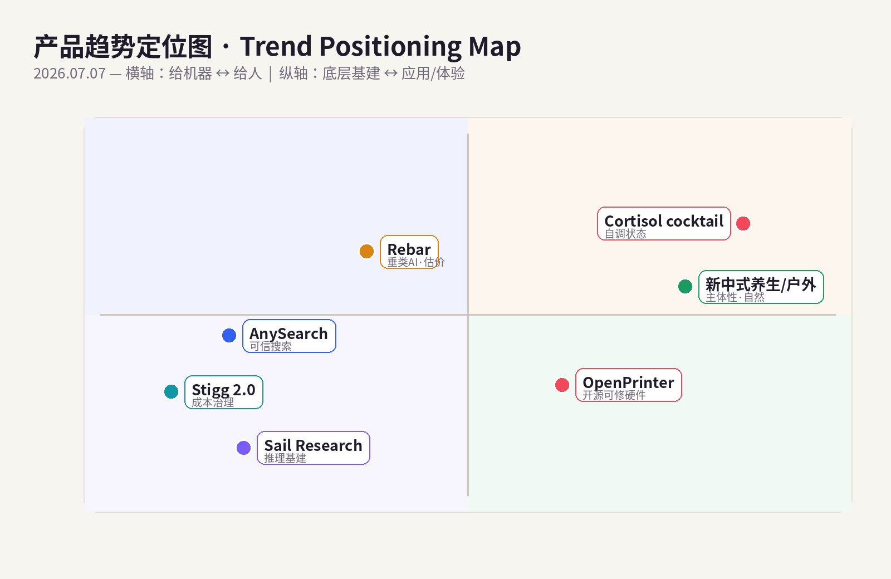
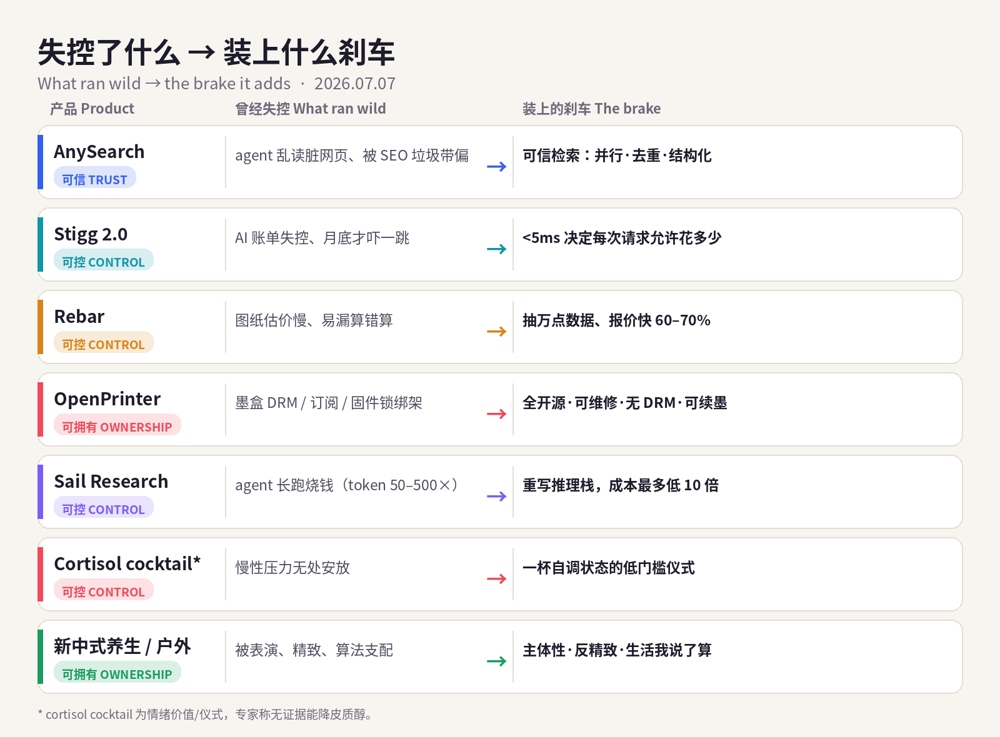
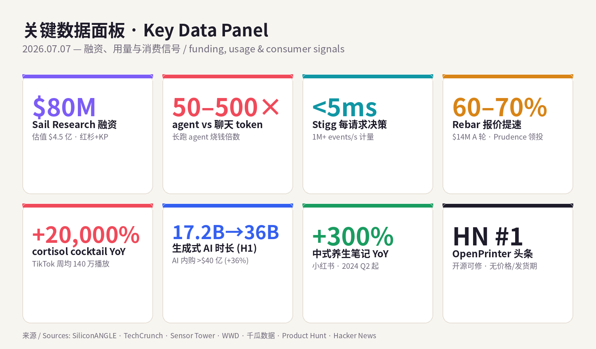

# 每日产品趋势报告 · Daily Product Trends Report
### 2026 年 7 月 7 日 · July 7, 2026（周二 / Tuesday）

> **数据来源 / Sources:** Product Hunt（AnySearch、Stigg 2.0 榜单页）、Hacker News（OpenPrinter，front page #1，2026-07-06）、PR Newswire / Morningstar / Yahoo Finance（Stigg 2.0，2026-06-30）、Crunchbase News / BusinessWire / VentureBeat（Rebar $14M Series A）、SiliconANGLE / TheNextWeb / finsmes（Sail Research $80M@$450M）、TechCrunch（Microsoft Frontier Company）、a16z《Big Ideas 2026》、Sensor Tower《State of AI 2026》（2026-06-16）、WWD / Healthline / Cleveland Clinic / CBS / blog.google Summergeist（cortisol cocktail & 夏季搜索）、知乎 / 千瓜数据 / CBNData / 环球旅讯（小红书 新中式养生 & 户外趋势）。
> **方法 / Method:** WebSearch（US-only）公开检索摘要。**web_fetch 对外站被 egress 拦截**（allowlist 仅 npm/pypi/github/anthropic 等），Product Hunt / Hacker News / Sensor Tower / X / LinkedIn / 小红书均为登录墙或客户端渲染，无法直接抓取；统一以新闻、PR、榜单、报告摘要替代，无法获取的原始页面已跳过、未做绕过。为保每日新意，已**排除 6/29–7/06 已深度分析过的产品**（Context.dev、Copilot App、Vox、Reflection AI、BrowserAct、Skybridge、AgentX、Sibyl、mixfox、HackerNows、Cursor for iOS、Z-Jail、Weave、Adam CAD、Tabstack、Humalike、Mark by Airtop、Wispr Flow、Glaze、Framer 3.0；消费：fibermaxxing、胶原、穿戴甲、blokecore、Owala、果醋、黑芝麻、奶油黄、Summerween、sleepmaxxing、香薰蜡、黄猫爪、heatless curler、观鸟 / 丰容 等）。
> **免责声明 / Disclaimer:** 本报告为趋势研究，非投资建议。融资 / 估值 / 市场规模 / 份额为第三方公开披露或估算，随时可能变化；量化指标为平台或第三方口径，仅供参考。健康类趋势（cortisol cocktail、养生）仅作消费现象记录，**不构成任何医疗或营养建议**，文中并列附上专家质疑。

---

## ① 当日概览 · Overview

**一句话 / In one line：** 这几天的信号一路收敛——先是「删掉操作」，再是「接口消失、只剩上下文」；今天它落到了地面：**当能力像自来水一样廉价、agent 什么都能做，真正稀缺、真正卖钱的，是给失控的东西装上刹车——可信（trust）、可控（control）、可拥有（ownership）。** 对机器，是给 agent 装上「读得对的搜索」（AnySearch）、「花得起的账单」（Stigg 2.0）、「在脏乱真实行业里也能结构化」（Rebar）；对硬件，是把被 DRM 和订阅绑架的打印机夺回来自己修（OpenPrinter）；对身体，是自己动手调节压力与状态——欧美的 **cortisol cocktail** 和中国小红书的 **新中式养生**，本质是同一个动作：**在一个失控的世界里，重新拿回一点控制权。**

> **In one line:** The signal has been converging all week — first *"delete the operation,"* then *"the interface disappears; what remains is context."* Today it hits the ground: **when capability is as cheap as tap water and agents can do anything, the scarce, sellable thing is a brake on things that run wild — trust, control, and ownership.** For machines: give the agent *search it can trust* (AnySearch), *a bill it can afford* (Stigg 2.0), and *structure inside a messy real-world trade* (Rebar). For hardware: take the DRM-and-subscription-hostage printer back and repair it yourself (OpenPrinter). For the body: self-regulate your own stress and state — the West's **cortisol cocktail** and China's Xiaohongshu **new-Chinese-style wellness** are the same gesture: **in a world that feels out of control, take a little control back.**

两条线是同一句话：**能力过剩，控制稀缺。** 过去比「能不能做到」，后来比「做得好不好」，再后来连「操作」和「接口」都被删干净了；到 2026 年年中，胜负手退到最后一格——**「你敢不敢信它、管不管得住它、能不能拥有它」。** 谁能把「可信 / 可控 / 可拥有」做成产品，谁就握住了这轮的定价权。

> The two lines are one sentence: **capability is in surplus; control is scarce.** We competed on *"can it be done,"* then *"is it done well,"* then even *operating* and the *interface* got deleted. By mid-2026 the contest retreats to the last square — **"do you dare trust it, can you keep it in check, can you actually own it."** Whoever turns *trust / control / ownership* into a product holds the pricing power this round.

**五条最强信号 / Five strongest signals**

1. **给 agent 装「读得对」的搜索 / Give agents search they can trust.** **AnySearch**（Product Hunt）把自己定义成 *"给 agent 的搜索工具，不是搜索框"*：跨金融 / 法律 / 学术 / 网络安全 / 能源 / 公司情报的垂类数据，并行检索、去重、结构化，一个 API 交给 agent；原生支持 **Skill / MCP / API**，每天 **1,000 次**免费；内部基准（Frames / FreshQA / WebWalkerQA）称胜过公网 AI 搜索。Trust rails for what agents read.
2. **给每一次 AI 请求装「花得起」的刹车 / A brake on what every AI request may cost.** **Stigg 2.0**（6/30 于 AI Engineer World's Fair 发布）在 **5 毫秒内**决定「这次请求允许花多少」：重写的零透支额度引擎、跨任意维度的治理层、**每秒 100 万+事件**计量、可跑进你自己的云。Pro **$399/月**起，BYOC **$4 万/年**起。The cost-governance layer for AI.
3. **把 AI 塞进「脏乱差」的真实行业 / Push AI into the messiest real-world trades.** **Rebar**（$14M A 轮，Prudence 领投）给暖通 / 电气 / 管道供应商做「垂类 AI 操作系统」：从图纸和规格书里抽取上万数据点，把报价做快 **60–70%**。a16z「fat / 垂类创业公司赢」的活样本。Vertical AI, fat-startup style.
4. **把被 DRM 绑架的打印机夺回来 / Take the DRM-hostage printer back.** **OpenPrinter**（Hacker News 7/6 **头条第一**）：树莓派 Zero W 驱动、可续墨 HP 墨盒、**无专有驱动、无墨盒 DRM**、全套文件 CC BY-NC-SA 4.0 开源、「设计成永不过时」。仍是原型，**尚无价格 / 发货期**。Right-to-repair as a product.
5. **人也在「自己动手拿回控制」/ Humans are taking control back, too.** 欧美 **cortisol cocktail**（TikTok 周均 **140 万**播放，同比 **+20,000%**）——维C+钠+钾自调状态；中国小红书 **新中式养生**（中式养生笔记同比 **+300%**）+ 户外升级（溯溪 / 攀岩 / 路亚 / 水翼）。**主体性 / 反精致 / 活人感**。Self-regulation, East and West.（专家提醒：cortisol cocktail 无证据能降皮质醇，「基本就是运动饮料」。）

> **Five signals (EN):** (1) **AnySearch** — "a search tool for agents, not a search box"; parallel, de-duped, structured vertical data (finance/legal/academic/cybersecurity/energy/corporate) via one API; native Skill/MCP/API; 1,000 free calls/day; beats public-web AI search on Frames/FreshQA/WebWalkerQA (internal). (2) **Stigg 2.0** — decides what every AI request may cost in <5ms; zero-overdraft credits engine, any-dimension governance, 1M+ events/s metering, run-in-your-cloud; Pro $399/mo, BYOC from $40K/yr. (3) **Rebar** — $14M Series A (Prudence); vertical "AI OS" for HVAC/electrical/plumbing; extracts tens of thousands of data points from blueprints/spec books; quotes 60–70% faster. (4) **OpenPrinter** — HN #1 (7/6); Raspberry Pi Zero W, refillable HP cartridges, no drivers/no DRM, CC BY-NC-SA 4.0, "never obsolete"; still prototype, no price/ship date. (5) **Cortisol cocktail** (1.4M weekly TikTok views, +20,000% YoY) & Xiaohongshu **new-Chinese wellness** (+300% YoY) + outdoor upgrade — self-regulation as culture. (Experts: no evidence it lowers cortisol — "basically a sports drink.")

---

## ② 逐个产品深度分析 · Product Deep-Dives

### 1. AnySearch — 给 agent 的「可信搜索」/ Trusted search for agents

昨天 Context.dev 卖的是「把网页抓成上下文」，今天 **AnySearch** 卖的是**「把搜索本身变得可信」**——两者是同一片基建的两块砖：抓取 vs 检索。它的一句话锋利得刚好戳中痛点：*"a search tool for agents, not a search box"*（给 agent 的搜索工具，不是搜索框）。区别在哪？普通搜索把一堆蓝色链接丢给你，让 agent 自己去啃脏 HTML、被 SEO 垃圾和重复内容带偏；AnySearch 则在**可信来源**里**并行检索、去重、结构化**，直接把「干净、可喂给模型」的结果交出来，并覆盖 **金融 / 法律 / 学术 / 网络安全 / 能源 / 公司情报** 等垂类——过去每个都要单独接一个数据源，现在收进一个 API。它原生支持 **Skill / MCP / API** 三种接法，铺在 GitHub、skills.sh、ClawHub、SkillHub、Glama 等开发者生态里，**每天 1,000 次免费调用**，内部基准（Frames / FreshQA / WebWalkerQA）宣称在答案准确率与执行效率上都胜过「基于公网的 AI 搜索」。当 a16z 反复强调「流量正从人类速度转向 agent 速度」，AnySearch 押的是：**agent 时代，最贵的不是『搜到』，而是『搜到的能信』。**

> Yesterday Context.dev sold *"turn pages into context"*; today **AnySearch** sells *"make the search itself trustworthy"* — two bricks in one wall: scraping vs retrieval. Its one-liner nails the pain: *"a search tool for agents, not a search box."* Ordinary search dumps blue links and lets the agent chew dirty HTML, misled by SEO spam and duplicates. AnySearch runs **parallel, de-duplicated, structured** retrieval over **trusted sources**, handing back clean, model-ready results, and spans verticals — **finance, legal, academic, cybersecurity, energy, corporate intelligence** — each of which used to need its own integration, now folded into one API. It supports **Skill / MCP / API** natively, is distributed across GitHub, skills.sh, ClawHub, SkillHub, and Glama, offers **1,000 free calls/day**, and claims (internal benchmarks: Frames / FreshQA / WebWalkerQA) to beat public-web AI search on both accuracy and efficiency. As a16z keeps repeating that *"traffic is shifting from human-speed to agent-speed,"* AnySearch's bet is simple: **in the agent era, the expensive thing isn't finding — it's being able to trust what you found.**

| 维度 Dimension | 分析 Analysis |
|---|---|
| 商业模式 Business model | 用量计费的搜索 API（免费额度 1,000 次/天 + 超量付费），面向 agent/开发者的 usage-based land-and-expand。Usage-based search API + free tier. |
| 核心价值 Core value | 可信来源 + 并行检索 + 去重 + 结构化，一个 API 覆盖多垂类，直接产出「可喂模型」的结果。Trusted, structured, model-ready retrieval in one API. |
| 成功因素 Success | 精准卡位（agent 需要「可信」而非「更多」结果）+ 三通道接入（Skill/MCP/API）+ 垂类深度 + 免费额度降门槛。Right cut + omni-integration + verticals. |
| 核心功能 Core features | 并行多源检索、去重、结构化输出；金融/法律/学术/安全/能源/公司情报垂类；Skill/MCP/API。Parallel multi-source, structured, vertical. |
| 细分市场 Niche | Agent 的「检索层 / retrieval layer」（区别于通用搜索与单纯 scrape）。Retrieval layer for agents. |
| 目标受众 Audience | 构建 agent / AI 应用、做 RAG / 研究 / 合规 / 尽调自动化的开发者与团队。Devs building agents & research/compliance automation. |
| 品牌设计 Brand | 名字直给（"Any" + "Search"），文案克制、以 agent 为主语（"trusted by agents"）。Literal, agent-first positioning. |
| 产品数据 Data | Product Hunt 榜单在榜；每天 1,000 次免费；铺 GitHub/skills.sh/ClawHub/SkillHub/Glama；内部基准胜公网 AI 搜索（Frames/FreshQA/WebWalkerQA）。 |
| 链接 Link | [producthunt.com/products/anysearch](https://www.producthunt.com/products/anysearch) |
| 评论摘要 Reviews | 正面：「结构化 + 去重省掉一堆清洗、垂类覆盖实用、MCP 接入快」；关注点：来源覆盖与时效、垂类数据版权与合规、规模化后的成本与限速。Praise for structure & MCP; watch source coverage, licensing, cost at scale. |

### 2. Stigg 2.0 — 每次 AI 请求「花多少」的实时刹车 / The real-time brake on AI cost

如果说 AnySearch 管「读得对」，**Stigg 2.0** 管的是**「花得起」**。它给自己的定位是 *"the usage runtime for AI products"*（AI 产品的用量运行时），6 月 30 日在 AI Engineer World's Fair 发布，标题就是杀气腾腾的一句：*"决定每一次 AI 请求允许花多少，在 5 毫秒内。"* 它坐在应用和账单系统之间，实时判定**每个客户 / 用户 / 团队 / agent** 此刻「能不能做、还剩多少额度」——重写的**零透支额度引擎**（余额实时、不会先花后超）、可在任意维度（客户 / 团队 / 用户 / agent / 功能）评估预算与限额的**治理层**（<5ms）、以及能跑进客户自己云里的**计量流水线**，**每秒 100 万+事件**、每一个 token / 推理调用 / agent 动作都在请求内被捕获聚合。为什么此刻重要？因为 agent 把成本模型彻底打乱了：token 单价在崩，可企业 AI 账单反而翻了几倍——agentic 工作流吃 token 的速度是普通聊天的 **50–500 倍**（见下节 Sail 数据）。当「一次调用」可能悄悄烧掉几十美元，**「先干后算账」变成「每一步都先问一句能不能花」**。定价上，Pro **$399/月**（含 1 万实体 + 2500 万事件，超量阶梯降价），BYOC（跑进你自己 VPC、可气隙部署）**$4 万/年**起——本质是把「FinOps for AI」做成一层可编程的中间件。

> If AnySearch governs *"read the right thing,"* **Stigg 2.0** governs *"afford it."* It calls itself *"the usage runtime for AI products,"* launched June 30 at the AI Engineer World's Fair under a blunt headline: *"decides what every AI request is allowed to cost, in under five milliseconds."* It sits between the app and the billing stack and decides, in real time, what **each customer / user / team / agent** may do right now — a rebuilt **zero-overdraft credits engine** (balances are real-time, no spend-then-overshoot), a **governance layer** that evaluates budgets and limits across any dimension in **<5ms**, and a **metering pipeline** that can run inside the customer's own cloud at **1M+ events/second**, capturing every token, inference call, and agent action in-request. Why now? Agents broke the cost model: token prices are collapsing yet enterprise AI bills tripled — agentic workflows burn tokens **50–500×** vs chat (see Sail, next section). When a single call can quietly torch tens of dollars, *"do first, reconcile later"* becomes *"ask permission at every step."* Pricing: Pro **$399/mo** (10K entities + 25M events, graduated overage); BYOC (own VPC, air-gap option) from **$40K/yr** — essentially *FinOps-for-AI* as programmable middleware.

| 维度 Dimension | 分析 Analysis |
|---|---|
| 商业模式 Business model | B2B SaaS + BYOC：Pro $399/月（阶梯超量），企业自有云 $4 万/年起；卖「用量治理」中间件。SaaS + BYOC middleware. |
| 核心价值 Core value | <5ms 实时决定每次请求能花多少；零透支额度 + 任意维度限额 + 高吞吐计量。Real-time per-request cost governance. |
| 成功因素 Success | 精准踩中 agent 成本失控的痛点 + 与现有账单系统共存（不替换）+ 可跑进自有云（合规友好）。Rides token-cost chaos; complements billing. |
| 核心功能 Core features | 额度引擎（零透支）、治理层（预算/限额）、计量流水线（1M+ events/s，token/推理/agent 动作）。Credits + governance + metering. |
| 细分市场 Niche | AI 产品的「计量与授权运行时」（FinOps for AI / entitlements）。Metering & entitlements runtime for AI. |
| 目标受众 Audience | 做 AI/agent 产品、要按用量收费与控成本的公司；平台与 infra 团队、FinOps。AI product & platform teams. |
| 品牌设计 Brand | "usage runtime" 一词把自己定义成基础层；技术叙事硬核（毫秒、每秒百万事件）。Infra-grade, latency-led narrative. |
| 产品数据 Data | 6/30 发布；<5ms 决策；1M+ events/s；Pro $399/月（1 万实体+2500 万事件）；BYOC $4 万/年起。 |
| 链接 Link | [stigg.io](https://www.stigg.io/) |
| 评论摘要 Reviews | 正面：「终于能按 agent/团队卡预算、不再月底被账单吓到、BYOC 满足合规」；关注点：接入改造成本、与现有计费/权限系统职责边界、极端高频下的延迟一致性。Praise for budget control & BYOC; watch integration effort & latency. |

### 3. Rebar — 把 AI 塞进暖通/电气/管道的「垂类操作系统」/ Vertical AI OS for the trades

前两个都是「给 agent 的横向基建」，**Rebar** 反着来：它把 AI 一头扎进**最不性感、最脏乱、却最赚钱**的实体行业——暖通（HVAC）、电气、管道供应链。痛点极其具体：一个商业项目的图纸和规格书里，藏着**上万个数据点**，供应商的估价员要人肉一页页读、一件件查、再手敲报价，慢且易错。Rebar 的垂类 AI 平台把这套流程自动化：**自动解析施工文件、抽取上万数据点、生成报价**，平均把出价做快 **60–70%**。首个产品服务暖通供应商，接下来用「加 agent」的方式扩展到管道与电气。$14M A 轮由专投垂类 AI 的 **Prudence** 领投（Zero Infinity、Founder Collective、Villain Capital、Optimist Ventures 跟投）。创始人 Evan Brown 的履历本身就是护城河——小时候暑假跟舅舅干暖通，后来在 Johnson Barrow / DMG 做估价员，最懂这行的「脏活」。这正是 a16z 反复押注的**「fat / 垂类创业公司赢」**：不做通用工具，而是把软件 + 数据 + 工作流 + 行业 know-how 打包成一个行业专属的「操作系统」，用别人抄不动的领域深度筑墙。

> The first two are *horizontal* agent infra; **Rebar** goes the other way — driving AI headfirst into the least sexy, messiest, but most lucrative physical industries: HVAC, electrical, plumbing supply. The pain is concrete: a commercial project's blueprints and spec books hide **tens of thousands of data points**, and a supplier's estimator reads them page by page, looks up each part, and hand-types a quote — slow and error-prone. Rebar's vertical AI platform automates it: **parse construction docs, extract tens of thousands of data points, generate the quote**, on average **60–70% faster**. The first product serves HVAC suppliers; plumbing and electrical follow by *"adding agents."* The **$14M Series A** was led by **Prudence** (a vertical-AI specialist), with Zero Infinity, Founder Collective, Villain Capital, and Optimist Ventures. Founder Evan Brown's résumé is itself a moat — HVAC summers with his uncle, later an estimator at Johnson Barrow / DMG — he knows the grunt work. This is exactly a16z's recurring bet that **"fat / vertical startups win"**: not a general tool, but software + data + workflow + domain know-how bundled into an industry-specific *operating system*, walled by depth rivals can't copy.

| 维度 Dimension | 分析 Analysis |
|---|---|
| 商业模式 Business model | 垂类 B2B SaaS（暖通/电气/管道供应商与承包商的报价/估价工作流），随品类扩展加 agent。Vertical B2B SaaS for the trades. |
| 核心价值 Core value | 从图纸/规格书自动抽取上万数据点、把报价做快 60–70%，减错提速。Auto-extract + 60–70% faster quotes. |
| 成功因素 Success | 极窄极深的行业痛点 + 创始人行业出身（know-how 护城河）+ 全栈打包（fat startup）。Narrow-deep pain + founder-market fit. |
| 核心功能 Core features | 施工文档解析、数据点抽取、自动报价/估价；多 agent 扩展到管道/电气。Doc parsing, extraction, quoting. |
| 细分市场 Niche | 建筑机电（MEP）供应链的估价/报价自动化。Estimating/quoting for MEP supply. |
| 目标受众 Audience | 商业暖通/电气/管道的供应商、分销商、承包商、估价员。HVAC/electrical/plumbing suppliers & estimators. |
| 品牌设计 Brand | 名字取自建筑「钢筋（rebar）」——扎进实体行业的硬核意象；定位「行业操作系统」。Construction-metaphor naming; "OS for the trade." |
| 产品数据 Data | $14M A 轮（Prudence 领投）；报价快 60–70%；2024 年 10 月成立；从暖通起步扩管道/电气。 |
| 链接 Link | [businesswire.com — Rebar Series A](https://www.businesswire.com/news/home/20260310158768/en/) |
| 评论摘要 Reviews | 正面（行业向）：「估价从几天到几小时、少算漏算变少、投标更快」；关注点：抽取准确率与责任边界（报错谁负责）、老派行业的采纳阻力、非标图纸的泛化。Praise for speed; watch extraction accuracy & adoption friction. |

### 4. OpenPrinter — 把被 DRM 绑架的打印机夺回来自己修 / Take the DRM-hostage printer back

如果说前三个是「给机器装刹车」，**OpenPrinter** 是**「把控制权从厂商手里夺回给人」**——而它昨天冲上了 Hacker News **头条第一**，说明这根神经有多痛。它是 Open Tools（Léonard Hartmann、Nicolas Schurando、Laurent Berthuel）做的一台**完全开源、可维修、无 DRM 的喷墨打印机**：树莓派 **Zero W** 驱动，用**可续墨的 HP 墨盒**（美 HP 63 / 欧 HP 302 / 亚 HP 803），黑白 600 dpi、彩色 1200 dpi，能打单页也能打纸卷。最狠的是它的「反面设计」：**没有专有驱动、没有墨盒 DRM、不锁厂商**，全套文件——电子、机械、固件、物料清单（BOM）——以 **CC BY-NC-SA 4.0** 开源，「设计成永不过时」，坏了自己修、想改自己改。它精准踩在消费电子最被恨的一块——打印机行业靠墨盒订阅、芯片锁、固件降级把用户当「耗材订户」。当 a16z 和整个行业都在往「更 AI、更自动」冲，OpenPrinter 反向证明了 2026 的另一条主线：**在软件越来越黑箱、订阅越来越多的世界里，「我能拥有、能看懂、能修」本身就是一种奢侈的产品力。** 需要冷静的是：它目前仍是**最终原型**，**尚未公布价格、发货期与打印速度**（在 Crowd Supply 亮相约 9 个月），近期刚拿到一项法国设计奖提名——理念极强，落地待验证。

> If the first three *put brakes on machines*, **OpenPrinter** *takes control back from the vendor and hands it to the person* — and it hit **#1 on Hacker News** yesterday, which tells you how raw this nerve is. Built by Open Tools (Léonard Hartmann, Nicolas Schurando, Laurent Berthuel), it's a **fully open-source, repairable, DRM-free inkjet**: **Raspberry Pi Zero W** brain, **refillable HP cartridges** (HP 63 US / 302 EU / 803 Asia), 600 dpi black and 1200 dpi color, sheets or paper rolls. The radical part is its *negative* design: **no proprietary drivers, no cartridge DRM, no vendor lock**, with every file — electronics, mechanics, firmware, BOM — released under **CC BY-NC-SA 4.0**, "designed never to become obsolete," repair-it-yourself, mod-it-yourself. It targets the single most hated corner of consumer electronics — the printer industry's cartridge subscriptions, chip locks, and firmware downgrades that turn owners into *consumable subscribers.* While a16z and the whole industry sprint toward *more AI, more autonomy*, OpenPrinter proves 2026's other throughline: **in a world of blacker software boxes and more subscriptions, "I can own it, understand it, and fix it" is itself a luxury-grade product.** The sober caveat: it's still a **final prototype** with **no announced price, ship date, or print speed** (~9 months after its Crowd Supply reveal), recently nominated for a French design award — strong idea, execution unproven.

| 维度 Dimension | 分析 Analysis |
|---|---|
| 商业模式 Business model | 开源硬件（拟经 Crowd Supply 众筹/整机 + 开放 BOM 自制），非订阅、非墨盒锁定。Open-hardware, anti-subscription. |
| 核心价值 Core value | 可维修 + 无 DRM + 可续墨 + 全开源，「拥有并掌控自己的硬件」。Repairable, DRM-free, you own it. |
| 成功因素 Success | 踩中打印机全民公愤 + 右到维修（right-to-repair）叙事 + 开源社区共创 + HN 头条曝光。Anti-enshittification narrative + community. |
| 核心功能 Core features | 树莓派 Zero W；HP 63/302/803 续墨；黑 600 / 彩 1200 dpi；单页或纸卷；模块化易修。Pi Zero W, refillable, modular. |
| 细分市场 Niche | 创客 / 艺术家 / 右到维修与开源硬件爱好者。Makers, artists, right-to-repair crowd. |
| 目标受众 Audience | 厌倦一次性硬件、墨盒订阅、固件锁的用户与 DIY 社区。Anti-throwaway, DIY, privacy-minded users. |
| 品牌设计 Brand | 名字直给（Open + Printer），价值观即品牌（开放/永不过时/反 DRM）。Values-as-brand; radical openness. |
| 产品数据 Data | Hacker News 7/6 **头条第一**；CC BY-NC-SA 4.0；**尚无价格/发货期/打印速度**；法国设计奖提名（6/29 更新）。 |
| 链接 Link | [opentools.studio](https://www.opentools.studio/) · [Crowd Supply](https://www.crowdsupply.com/open-tools/open-printer) · [HN 讨论](https://news.ycombinator.com/item?id=48797916) |
| 评论摘要 Reviews | 正面：「早就受够 HP 了、续墨+可修是刚需、理念满分」；质疑（HN）：开源喷墨的工程难度（喷头寿命/对齐）、迟迟不定价与发货、打印速度未知、量产良率。Cheers for the mission; skeptics flag engineering & no ship date. |

### 5.【趋势 / 数据】Agent 的「信任与控制」栈，正在被资本重注 / Capital is pouring into the agent trust-&-control stack

把今天四个产品串起来，会看到一条被资本高速加注的暗线：**当 agent 能自主跑几小时、几天，「让它跑得起、管得住、信得过」本身成了最贵的生意。** 最硬的一枪是 **Sail Research**——**$80M**（种子 + A 轮）估值 **$4.5 亿**，红杉领投种子、Kleiner Perkins 领投 A 轮，站台的有 **John Hennessy（Alphabet 董事长）、Lip-Bu Tan（Intel CEO）、Tri Dao（Together AI 首席科学家）**。它要解的问题一句话说透：**token 单价在崩，企业 AI 账单却翻了三倍**——因为 agentic 工作流吃 token 是聊天的 **50–500 倍**。Sail 从底层重写推理栈，再加「**Sailboxes**」——能连续跑几天的有状态沙箱，宣称 **90.72% 准确率、成本最多低 10 倍**。这解释了为什么 **Stigg** 要卡成本、**AnySearch** 要卡质量：agent 一旦「长跑」，成本与可信就是生死线。宏观上，**微软 7/2 成立「Frontier Company」，$25 亿**押注把企业 AI「真正落地」；a16z《Big Ideas 2026》则把话挑明——**「把混乱结构化」是一代人的机会、「prompt 框会死」（应用主动观察并介入）、「fat / 全栈创业公司赢」、「属于我的一年」（超个性化）**；叠加 Sensor Tower：生成式 AI 时长 **17.2B→36B 小时**、AI app 上半年内购 **>$40 亿（+36%）**。需求真实、增长真实，但账单、质量、可控性同样真实——**这一轮的钱，正从「模型」流向「让 agent 可信可控」的中间层。**

> String today's four together and one capital-backed throughline appears: **once an agent runs autonomously for hours or days, making it affordable, controllable, and trustworthy becomes the most valuable business of all.** The hardest shot is **Sail Research** — **$80M** (seed + Series A) at a **$450M** valuation, Sequoia leading the seed and Kleiner Perkins the A, with **John Hennessy (Alphabet chair), Lip-Bu Tan (Intel CEO), and Tri Dao (Together AI chief scientist)** backing it. Its problem statement is razor-clean: **token prices are collapsing, yet enterprise AI bills tripled** — because agentic workflows burn tokens **50–500×** vs chat. Sail rebuilt the inference stack from scratch and added **Sailboxes**, stateful sandboxes that run for days, claiming **90.72% accuracy at up to 10× lower cost**. That's *why* **Stigg** polices cost and **AnySearch** polices quality: once agents *go long-haul*, cost and trust are life-or-death. Macro: **Microsoft launched "Frontier Company" (7/2) with $2.5B** to make enterprise AI actually land; a16z's **Big Ideas 2026** says the quiet part loud — **"structuring the chaos" is a generational opportunity, "the prompt box will die" (apps observe and intervene), "fat / full-stack startups win," and "the year of me" (hyper-personalization)**; layered on Sensor Tower's **17.2B→36B hours** of GenAI time and **>$4B (+36%)** in H1 AI IAP. Demand is real, growth is real — and so are the bills, the quality risk, and the control problem. **This round, money is flowing from "the model" to the middle layer that makes agents trustworthy and controllable.**

| 数据点 Data point | 数值 Figure | 来源 Source |
|---|---|---|
| Sail Research 融资 / 估值 | $80M（种子+A）/ $4.5 亿估值 | SiliconANGLE / finsmes |
| Agent vs 聊天的 token 消耗 | **50–500×** | Sail / TheNextWeb |
| Sail 性能宣称 | 90.72% 准确率 / 成本最多低 10× | SiliconANGLE |
| 微软 Frontier Company | $25 亿承诺（7/2 成立） | TechCrunch |
| 生成式 AI 时长（H1 YoY） | 17.2B → 36B 小时 | Sensor Tower |
| AI app 内购（H1 2026） | >$40 亿（+36% vs H2'25） | Sensor Tower |
| a16z 2026 募资 | $150 亿（多垂类） | a16z / startuphub |

### 6.【消费趋势 · 欧美】Cortisol cocktail：自己动手，把「压力」调回来 / DIY-ing your stress back under control

机器那侧在给 agent 装刹车，人这侧也在**「自己动手拿回身体的控制权」**——最典型的就是横扫 TikTok 的 **cortisol cocktail（皮质醇/肾上腺鸡尾酒）**：TikTok 上周均 **140 万**播放、同比暴涨 **+20,000%**。配方简单到像小学化学：橙汁或柠檬汁 + 椰子水 + 一撮海盐（即 **维C + 钠 + 钾**），讲究点的再加**胶原蛋白粉**（蛋白）和**椰浆**（脂肪）压血糖。宣称能「治下午疲、赶走『肾上腺疲劳』、降压力」。它踩中的是真实的时代情绪：**慢性压力普遍、又便宜又有掌控感的「自我调节仪式」大受欢迎。** 它还和 Google **Summergeist 2026** 的一串「喝」趋势同频——「在家做 Hugo spritz」**+2,200%**、「frozen yogurt nyc」**+120%**、「aperol spritz 配方」breakout：夏天的关键词是**低度 / 无酒精 / 功能性 / 复古**的「小酌」。

> While the machine side puts brakes on agents, the human side is **DIY-ing bodily control back** — nowhere clearer than the **cortisol cocktail (adrenal cocktail)** sweeping TikTok: **1.4M** average weekly views, up **+20,000% YoY**. The recipe is grade-school chemistry: orange or lemon juice + coconut water + a pinch of sea salt (i.e. **vitamin C + sodium + potassium**), with optional **collagen powder** (protein) and **coconut cream** (fat) to blunt the sugar spike. It claims to cure the midday slump, banish "adrenal fatigue," and lower stress. What it really taps is a real mood: **chronic stress is everywhere, and a cheap, in-your-control self-regulation ritual sells.** It rhymes with Google **Summergeist 2026**'s cluster of *drink* trends — *"hugo spritz at home"* **+2,200%**, *"frozen yogurt nyc"* **+120%**, *"aperol spritz"* a breakout: summer's keyword is the **low/no-alcohol, functional, nostalgic sip.**

> **⚠️ 平衡视角 / Balance:** 专家普遍泼冷水——**没有证据表明它能真的降低皮质醇**（Cleveland Clinic / CBS / BSW Health）。营养师 Christine Byrne：「毫无科学支撑。」多位专家指出其配料「基本就是一杯运动饮料」（果汁 + 钠 + 钾 + 糖 + 电解质），任何「有效」大概率只是**补水 + 血糖小升**；一般无害，但改善生活方式更有用。**本段仅记录消费现象，不构成健康建议。** Experts push back: **no evidence it lowers cortisol**; dietitian Christine Byrne calls it *"no backing behind it"*; the mix is *"basically a sports drink,"* any benefit likely rehydration + a blood-sugar bump. Generally harmless, but lifestyle change works better. *This is trend documentation, not health advice.*

| 维度 Dimension | 分析 Analysis |
|---|---|
| 商业模式 Business model | 内容带货 + 品牌（电解质粉 / 胶原 / 补剂 / 预调饮）；DTC 与超市货架。Content-to-commerce; supplements & premix. |
| 核心价值 Core value | 便宜、可 DIY、有「掌控感」的自我调节仪式（情绪价值 > 生理证据）。Cheap, DIY, control-giving ritual. |
| 成功因素 Success | 慢性压力焦虑 + 视觉化橙色饮品易传播 + 无酒精/功能性大势 + 极低门槛。Stress zeitgeist + shareable + zero friction. |
| 核心功能 Core features | 维C + 钠 + 钾（橙/柠檬汁+椰子水+海盐），可加胶原/椰浆。VitC + sodium + potassium base. |
| 细分市场 Niche | 无酒精「功能性小酌」/ 自我调节 wellness 饮品。Functional non-alcoholic self-care drink. |
| 目标受众 Audience | 关注压力/皮质醇/血糖、爱 DIY 仪式的年轻女性为主的 wellness 人群。Stress-aware, DIY wellness crowd. |
| 产品数据 Data | TikTok 周均 140 万播放、同比 +20,000%；Summergeist：Hugo spritz +2,200% / froyo nyc +120%。 |
| 链接 Link | [WWD — cortisol mocktail trend](https://wwd.com/beauty-industry-news/wellness/cortisol-face-mocktail-supplement-tiktok-trend-1236774663/) · [Google Summergeist](https://blog.google/products-and-platforms/products/search/summergeist-google-trends/) |
| 评论摘要 Reviews | 正面（用户）：「下午来一杯有精神、好喝、像给自己一个仪式」；专家：「无证据降皮质醇、基本是运动饮料、别替代看医生」。Fans love the ritual; experts warn it's placebo-adjacent. |

### 7.【消费趋势 · 中国】小红书：新中式养生 + 户外升级——把生活「自己说了算」/ Xiaohongshu: new-Chinese wellness & outdoor upgrade — authoring your own life

同一个「自我调节 / 拿回控制」的动作，在中国小红书上长成了另一副样子：**新中式养生**与**户外升级**。「中式养生」相关笔记自 2024 Q2 起同比**大增超 300%**，把「中式」血脉刻进美学、工艺、**节气、民俗**，用**朋克养生**（熬夜也要泡枸杞、蹦迪也带护膝）这种既真实又自嘲的方式，在传统与现代之间找一种**长期主义**的自我照顾。与此同时，户外从「露营 / 徒步 / 登山」的全民化，向**溯溪、攀岩、路亚、水翼、探洞**等更硬核细分蔓延——本质都是**「离开屏幕、向自然借掌控感」**。这些正好落在小红书 2026 的十大趋势词里：**主体性**（年轻人主角意识觉醒）、**反精致**（拥抱真实个性）、**活人感**（气血感 / 高能量）、**边界感**（独处与家庭场景）。平台叙事也变了——2026 是**「效果化」**时代，用户打开 App 是**带着具体问题来的**，20+ 细分人群（职业妈妈 / 学生党 / 户外新手…）各有各的痛点。一句话：**欧美用一杯 cortisol cocktail 自我调节，中国用「新中式养生 + 硬核户外」自我调节——都是在一个失控的世界里，把『我的生活我说了算』重新握回手里。**

> The same *self-regulation / take-control* gesture grows a different shape on China's Xiaohongshu: **new-Chinese-style wellness** and an **outdoor upgrade.** "Chinese wellness" notes are up **300%+ YoY** since Q2 2024, carving the *Chinese* lineage into aesthetics, craft, **solar terms, and folk custom**, expressed through **"punk wellness"** (goji tea after an all-nighter, knee braces to the club) — a real, self-mocking way to find *long-termist* self-care between tradition and modernity. Meanwhile outdoors spreads from mass **camping/hiking/climbing** into harder niches — **canyoneering, rock climbing, lure fishing, hydrofoil, caving** — all essentially *"leave the screen, borrow a sense of control from nature."* These map onto Xiaohongshu's 2026 top-ten trend words: **主体性 (protagonist consciousness), 反精致 (anti-polish authenticity), 活人感 (vital energy), 边界感 (solitude & home).** The platform narrative shifted too — 2026 is the **"outcome era,"** where users open the app *with a specific problem*, across 20+ granular personas (working moms / students / outdoor newbies…). In one line: **the West self-regulates with a cortisol cocktail; China self-regulates with new-Chinese wellness + hardcore outdoors — both are hands taking back "my life, on my terms" in a world that feels out of control.**

| 维度 Dimension | 分析 Analysis |
|---|---|
| 商业模式 Business model | 内容种草 → 电商/线下转化（养生食饮、节气礼盒、户外装备、课程/体验）。Content-to-commerce; goods + experiences. |
| 核心价值 Core value | 「自己说了算」的长期主义自我照顾 + 向自然借掌控感。Self-authored long-termist self-care. |
| 成功因素 Success | 主体性/反精致/活人感情绪 + 文化自信（新中式）+ 效果化精准人群 + 细分赛道红利。Zeitgeist + cultural pride + niche. |
| 核心功能 Core features | 节气/民俗/朋克养生内容；硬核户外（溯溪/攀岩/路亚/水翼/探洞）种草与攻略。Wellness + hardcore outdoor. |
| 细分市场 Niche | 新中式养生食饮 & 细分户外（超越大众露营）。New-Chinese wellness & niche outdoors. |
| 目标受众 Audience | 追求真实、文化认同、掌控感的年轻人；20+ 细分生活方式人群。Authenticity-seeking young lifestyle segments. |
| 产品数据 Data | 中式养生笔记同比 +300%（2024 Q2 起）；观鸟 1.2 亿+ 浏览 / 笔记 +70%；独居 2 亿+ 浏览（风向转真实）。 |
| 链接 Link | [知乎：2026 小红书八大趋势](https://zhuanlan.zhihu.com/p/1991105890716247188) · [千瓜：2026 十大热词](https://www.qian-gua.com/information/detail/3318) |
| 评论摘要 Reviews | 正面：「泡枸杞也能很潮、节气仪式治愈、户外把人激活」；关注点：概念先行易空心化、伪科学养生风险、户外安全与门槛。Authentic & healing; watch pseudo-science & safety. |

---

## ③ 横向对比 · Cross-Comparison

| 产品 Product | 类别 Category | 商业模式 Model | 细分 Niche | 目标受众 Audience | 关键数据 Key data | 「装上什么刹车」The brake |
|---|---|---|---|---|---|---|
| **AnySearch** | Agent 检索 Retrieval | 用量 API（1,000 免费/天）Usage API | Agent 的可信搜索层 | Agent/AI 开发者 | 多垂类 + 胜公网 AI 搜索（内部基准） | 可信 Trust（读得对） |
| **Stigg 2.0** | AI 用量运行时 Runtime | SaaS $399/月 + BYOC $4 万/年 | 计量/授权/成本治理 | AI 产品/平台团队 | <5ms 决策；1M+ events/s | 可控 Control（花得起） |
| **Rebar** | 垂类 AI Vertical AI | 垂类 B2B SaaS | 暖通/电气/管道估价 | 供应商/承包商/估价员 | $14M A 轮；报价快 60–70% | 可控 Control（脏活也准） |
| **OpenPrinter** | 开源硬件 OSS HW | 开源硬件（拟众筹）Anti-sub | 可维修/无 DRM 打印 | 创客/右到维修人群 | HN #1；CC BY-NC-SA；**无价格/发货期** | 可拥有 Ownership（能修能改） |
| **Sail Research** *(趋势 Trend)* | Agent 推理基建 Infra | 平台/基建 | 长跑 agent 推理+沙箱 | 跑长任务 agent 的企业 | $80M@$4.5 亿；成本低至 1/10 | 可控 Control（跑得起） |
| **Cortisol cocktail** | 消费/健康 Consumer | 内容带货+补剂+预调饮 | 无酒精功能性小酌 | 压力焦虑 wellness 人群 | TikTok 周均 140 万；+20,000% YoY | 可控 Control（自调状态）* |
| **新中式养生 + 户外** | 消费/生活 Consumer | 种草→电商/线下 | 新中式养生 & 细分户外 | 求真实/掌控的年轻人 | 中式养生笔记 +300% YoY | 可拥有 Ownership（生活我说了算） |

\* 专家提醒：cortisol cocktail 无证据能降皮质醇，属情绪价值/仪式感，非医疗手段。Experts: no evidence it lowers cortisol; ritual value, not medicine.

---

## ④ 关键洞察与共性 · Key Insights & Common Patterns

**1. 主题词从「接口」升级到「刹车」：能力过剩，控制稀缺。 / From "interface" to "brakes": capability is in surplus, control is scarce.**
这几天的弧线一路走到今天：删掉操作 → 接口消失只剩上下文 → **现在，当 agent 什么都能做、成本却失控，产品竞争的终点变成「你敢不敢信它、管不管得住、能不能拥有」。** 今天在榜的四个基建产品（AnySearch 可信、Stigg 可控、Rebar 在脏活里也准、OpenPrinter 可拥有）就是四种「刹车」。

> The week's arc lands here: delete the operation → the interface vanishes, leaving context → **now, when agents can do anything but cost runs wild, the endgame becomes "dare you trust it, can you contain it, can you own it."** Today's four infra products are four kinds of *brake*: AnySearch (trust), Stigg (control), Rebar (accuracy in the mess), OpenPrinter (ownership).

**2. 钱正从「模型」流向「让 agent 可信可控」的中间层。 / Money is moving from "the model" to the trust-&-control middle layer.**
Sail Research **$80M@$4.5 亿**、微软 Frontier **$25 亿**、Stigg 的成本治理、AnySearch 的质量治理——都在同一句话上下注：**token 单价崩了，但 agent 长跑让账单翻三倍（吃 token 是聊天的 50–500 倍）。** 谁能让「长跑 agent」跑得起、管得住、信得过，谁就是这轮卖铲子的人。

> Sail's **$80M@$450M**, Microsoft Frontier's **$2.5B**, Stigg's cost governance, AnySearch's quality governance — all bet on one line: **token prices collapsed, but long-haul agents tripled the bill (50–500× the tokens of chat).** Whoever makes long-running agents affordable, controllable, and trustworthy sells the picks and shovels this round.

**3. 「反精致 / 反黑箱 / 反订阅」是消费与硬件的共同暗流。 / Anti-polish, anti-black-box, anti-subscription is the shared undercurrent.**
OpenPrinter 反 DRM/订阅、cortisol cocktail 反「贵解决方案」（自己一杯搞定）、小红书反精致 + 新中式——都是**用户对「被厂商/算法/表演支配」的反弹**，用「我能拥有、能看懂、能自己调」夺回控制感。硬件叫右到维修，身体叫自我调节，生活叫主体性——同一个动作。

> OpenPrinter rebels against DRM/subscriptions, the cortisol cocktail against expensive fixes (make it yourself), Xiaohongshu against polish (and toward new-Chinese roots) — all a **backlash against being ruled by vendors, algorithms, and performance,** reclaiming control through "I can own it, understand it, tune it myself." Call it right-to-repair for hardware, self-regulation for the body, protagonist-consciousness for life — same gesture.

**4. 「Fat / 垂类」在两端同时赢：越窄越深，越难被抄。 / "Fat / vertical" wins on both ends: narrower and deeper is harder to copy.**
Rebar 扎进暖通/电气/管道（创始人行业出身）、AnySearch 做垂类可信搜索、Stigg 专注 AI 计量——通用工具泛滥时，**领域深度 + 全栈打包**才是护城河。a16z 说得直白：2026「fat startups win」。

> Rebar drills into HVAC/electrical/plumbing (founder-market fit), AnySearch does vertical trusted search, Stigg specializes in AI metering — when general tools flood, **domain depth + full-stack bundling** is the moat. a16z is blunt: in 2026, *fat startups win.*

**5. 情绪价值可以先于证据，但报表要并列「证据」。 / Emotional value can precede evidence — but the ledger must show the evidence too.**
cortisol cocktail 靠「掌控感」爆红，却无证据能降皮质醇（专家：「基本是运动饮料」）；新中式养生也有伪科学风险。**对做产品/投资的人，信号是：情绪需求真实且可变现，但真正长青的是能兑现承诺的那一批。** 本报告并列记录专家质疑，不做健康背书。

> The cortisol cocktail exploded on *a sense of control* despite no evidence it lowers cortisol (experts: *"basically a sports drink"*); new-Chinese wellness carries pseudo-science risk too. **For builders/investors the signal is: the emotional demand is real and monetizable, but the durable winners are the ones who can actually deliver.** This report lists the expert skepticism alongside — no health endorsement.

---

> **免责声明 / Disclaimer：** 本报告由自动化每日任务生成，仅作趋势研究与信息汇总，**非投资建议，亦非医疗 / 营养建议**。所有融资、估值、市场规模、增长与份额数据均来自第三方公开披露或估算，可能不准确或已过时；产品信息（尤其未上市 / 原型阶段如 OpenPrinter，及无临床证据的健康趋势如 cortisol cocktail）以官方为准，请自行独立核实。*This report is an automated daily research digest — not investment, medical, or nutritional advice. Figures are third-party estimates and may change; verify independently.*
