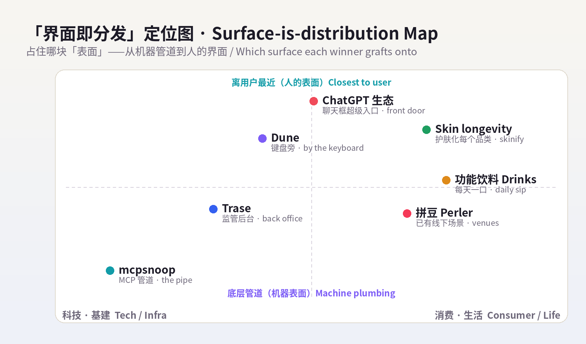
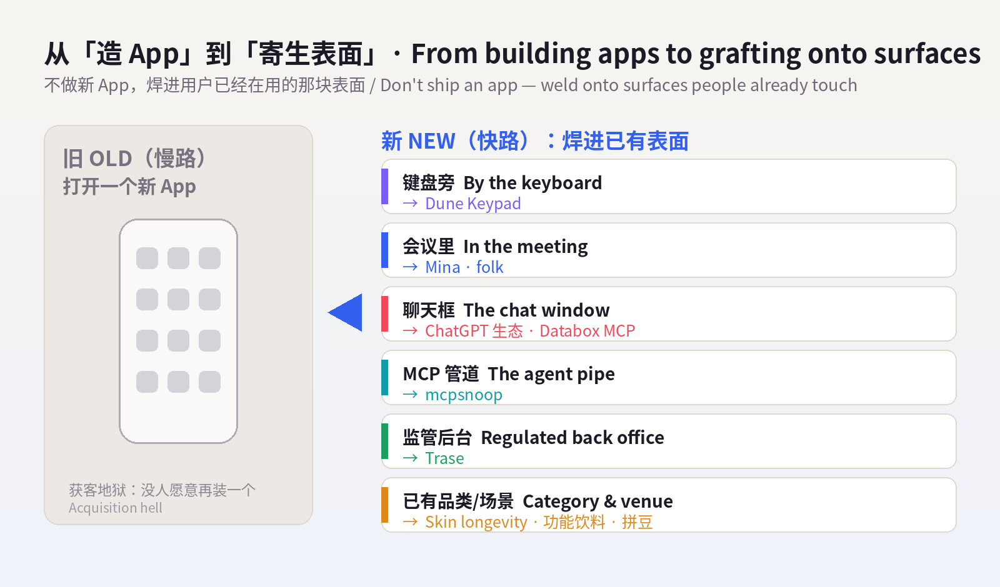
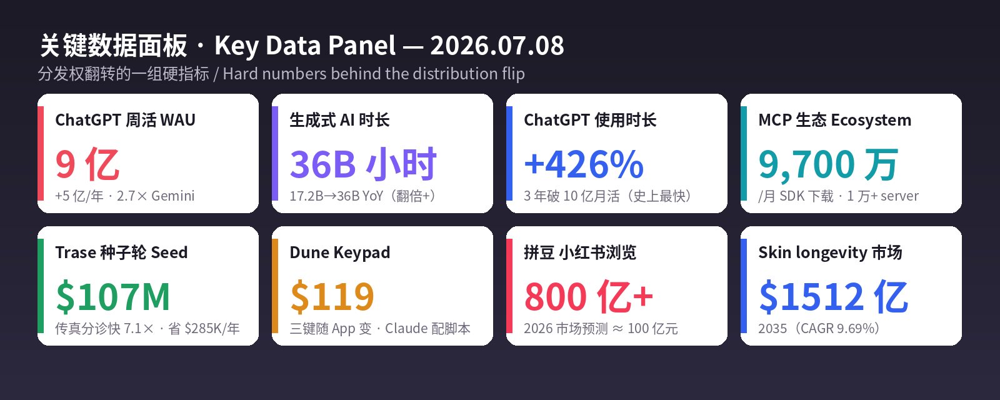

# 每日产品趋势报告 · Daily Product Trends Report
### 2026 年 7 月 8 日 · July 8, 2026（周三 / Wednesday）

> **数据来源 / Sources:** Product Hunt（本周 6 款「不做新 App」的产品、Dune Keypad 榜单页）、TechCrunch / Forbes / Notebookcheck（Dune Keypad，2026-07-03）、Hacker News / TechTimes（mcpsnoop「Wireshark for MCP」，Show HN 2026-07-04）、BusinessWire / MobiHealthNews / Fierce Healthcare（Trase $107M 种子轮，2026-06-25）、a16z《Notes on AI Apps in 2026》与《Top 100 Gen AI Consumer Apps 6th Ed.》、Sensor Tower《State of AI / State of Mobile 2026》、TechCrunch / CNBC / PitchBook（ElevenLabs $500M@$110 亿，2026-02-04，作背景数据）、Forbes / WhoWhatWear / Beauty Independent（skin longevity）、Keurig Dr Pepper《2026 State of Beverages》/ Forbes Summer Fancy Food Show（功能饮料）、知乎 / 中新网 / 搜狐 / AMZ123（小红书 拼豆 & 兴趣圈层）。
> **方法 / Method:** WebSearch（US-only）公开检索摘要。**web_fetch 对外站被 egress 拦截**（allowlist 仅 npm/pypi/github/anthropic 等），Product Hunt / Hacker News / Sensor Tower / X / LinkedIn / 小红书均为登录墙或客户端渲染，无法直接抓取；统一以新闻、PR、榜单、报告摘要替代，无法获取的原始页面已跳过、未做绕过。为保每日新意，已**排除 6/29–7/07 已深度分析过的产品**（见 raw/2026-07-08/sources.md 完整名单）。
> **免责声明 / Disclaimer:** 本报告为趋势研究，非投资建议。融资 / 估值 / 市场规模 / 份额为第三方公开披露或估算，随时可能变化；量化指标为平台或第三方口径，仅供参考。健康与美妆类趋势（skin longevity、功能饮料）仅作消费现象记录，**不构成任何医疗、营养或美容建议**，文中并列附上专家提醒。

---

## ① 当日概览 · Overview

**一句话 / In one line：** 昨天的信号是「能力过剩、控制稀缺」；今天它往前走了一步——**当能力像自来水一样廉价，真正稀缺、真正卖钱的，是『用户已经在用的那块界面』。** 于是今天所有赢家都在做同一个动作：**不做新 App，把 AI「寄生 / 焊接」到人们已经天天在碰的表面上。** 对开发者，是键盘旁边那三颗会「读懂你在用哪个 App」的键（Dune）；对基建，是钻进 MCP 管道里「看每一个字节」的探针（mcpsnoop）；对行业，是塞进医院「最脏最重」的监管后台、连传真机都替你分类（Trase）；对消费者，是 **ChatGPT 变成 9 亿人的「超级入口」**、AI 应用不再是图标而是聊天框里的一句话。分发权，正在从「你能不能被下载」翻转成「你在不在用户已经打开的那块屏幕上」。

> **In one line:** Yesterday's signal was *"capability is in surplus, control is scarce."* Today it takes one step further: **when capability is as cheap as tap water, the scarce, sellable thing is the surface the user is already on.** So every winner today makes the same move — **stop shipping a new app; graft / weld AI onto a surface people already touch every day.** For developers, it's the three keys beside your keyboard that *know which app you're in* (Dune); for infra, a probe that sits *inside the MCP pipe* and sees every byte (mcpsnoop); for verticals, agents pushed into a hospital's heaviest, most-regulated back office — sorting even the fax machine (Trase); for consumers, **ChatGPT becoming a 900M-person front door**, where an AI "app" is no longer an icon but a sentence in a chat window. Distribution is flipping from *"can you get downloaded"* to *"are you on the screen the user already has open."*

两条线是同一句话：**界面即分发。** 过去比「能不能做到」、再比「做得好不好」、再比「敢不敢信 / 管不管得住」（昨天）；今天退到更靠前的一格——**「你在不在用户已经在用的表面上」。** 在一个人人都能造出能力的世界里，**唯一抄不动的护城河，是你已经占住的那块表面。** 谁占住了表面，谁就握住了这轮的分发权与定价权。

> The two lines are one sentence: **surface is distribution.** We competed on *"can it be done,"* then *"is it done well,"* then *"dare you trust it / can you contain it"* (yesterday). Today the contest moves one square earlier — **"are you on the surface the user already uses."** In a world where anyone can manufacture capability, **the one moat rivals can't copy is the surface you already occupy.** Own the surface, and you own the distribution — and the pricing power — this round.

**五条最强信号 / Five strongest signals**

1. **AI 不再是 App，而是「你已经在碰的表面」的附件 / AI is no longer an app — it's an attachment to a surface you already touch.** Product Hunt 本周 6 款上榜 AI 产品，**没有一款让你打开新 App**：Dune（键盘旁）、Mina（视频会议里）、folk（短信线程里）、Databox MCP（Claude 聊天框里）、Typeahead（Mac 自动补全里）。一句话点破：**「把 AI 做成新 App 是慢路；焊到用户已经在用的表面上才是快路。」**
2. **一块 $119 的三键小铁块，把 Claude 焊在键盘旁 / A $119 three-key slab welds Claude to your keyboard.** **Dune**（Project Mirage）：CNC 铝合金、机械键、插 USB-C，三颗键**随前台 App 实时变功能**；**用大白话对 Claude 说一句，它就替你写好脚本、绑到键上**，还带社区脚本 Marketplace。硬件成了 agent 的「实体触点」。
3. **给 MCP 管道装一台 Wireshark / A Wireshark for the MCP pipe.** **mcpsnoop**（7/4 Show HN）：零配置、单文件的透明代理，坐进「coding agent ↔ MCP server」之间，把每一帧 JSON-RPC 实时打到终端。MCP 已达 **9,700 万/月 SDK 下载、1 万+公开 server**——管子铺满了，卖「看管子的探针」的时候到了。
4. **把 agent 塞进「监管最重」的后台，连传真机都替你分 / Push agents into the heaviest-regulated back office — even the fax machine.** **Trase**（**$107M 种子轮**，ARCH 领投）做「监管行业的 agentic 操作系统」；在 **Duke** 心内科把每月 **5,000+ 传真**的分诊做到**比人工快 7.1 倍**、释放 **$285,450** 年度人力。垂类 agent 的战场，是别人嫌脏、监管最重的地方。
5. **分发权翻转：ChatGPT 变 9 亿人的「超级入口」/ The distribution flip: ChatGPT becomes a 900M front door.** a16z《Notes on AI Apps in 2026》：Apps SDK + 迷你应用 + 群聊，让开发者直接吃 ChatGPT 的 **9 亿周活**（+5 亿/年，是 Gemini 的 2.7×）；ChatGPT 已挂 **85+ 应用**（订机票 / 买菜 / 看房）。Sensor Tower：生成式 AI 时长 **17.2B→36B 小时**、ChatGPT 时长 **+426%**。**「消费 AI 十年一遇的淘金潮」的入口，是别人已经打开的那个聊天框。**

> **Five signals (EN):** (1) **PH's 6 launches, zero new apps** — Dune (by the keyboard), Mina (in the call), folk (in the text thread), Databox MCP (in Claude's chat), Typeahead (in Mac autocomplete): *"shipping AI as a new app is the slow path; welding onto a surface the user already touches is the fast path."* (2) **Dune** — a $119 CNC-aluminum, mechanical, USB-C **3-key** pad whose keys **change per foreground app**; *tell Claude in plain English and it writes + binds the shortcut*, plus a community-script Marketplace. Hardware as the agent's physical touchpoint. (3) **mcpsnoop** — a zero-config, single-binary **transparent proxy** between coding agent and MCP servers, streaming every JSON-RPC frame to your terminal; MCP is now **97M monthly SDK downloads, 10K+ public servers** — the pipe is laid, time to sell the probe. (4) **Trase** — **$107M seed** (ARCH-led), an *agentic OS for regulated industries*; at **Duke** cardiology it triages **5,000+ faxes/month 7.1× faster than manual**, unlocking **$285,450** of annual capacity. Vertical agents win where it's messiest and most regulated. (5) **ChatGPT as a 900M front door** — a16z: Apps SDK + mini-apps + group chat let devs tap ChatGPT's **900M WAU** (+500M/yr, 2.7× Gemini); **85+ apps** already (flights/groceries/homes); Sensor Tower GenAI time **17.2B→36B hours**, ChatGPT time **+426%**. The door to *"a once-in-a-decade consumer-AI gold rush"* is the chat window the user already opened.

---

## ② 逐个产品深度分析 · Product Deep-Dives

### 1. Dune Keypad — 键盘旁的三颗键：把 Claude「焊」在你已经在用的界面上 / Three keys by your keyboard, welding Claude onto the surface you already use

昨天 OpenPrinter 卖「把硬件的控制权夺回来」，今天 **Dune** 反着用硬件——**它不是让你多打开一个 App，而是把一小块铁焊在你已经在用的键盘旁边，让 AI「贴身待命」。** Project Mirage 做的这只 Dune，是一块 **CNC 铝合金、机械剪刀脚**、大约「一条口香糖」大小、插进 MacBook USB-C 口的**三键小键盘**，售价 **$119**。它最狠的一点是**「上下文感知」**：三颗键的功能**随最前台的 App 实时改变**——你在 VS Code / GitHub 里是一套，在 Claude / Openclaw 里是另一套，切到 Zoom / Teams / Google Meet 开会又变成会议控制器（静音 / 举手 / 录制）。而真正把门槛砸到地板的是它的 **Claude Desktop 集成**：你**用大白话说一句「我想要一个 XX 快捷动作」，Claude 就替你把脚本写好、绑到某个 App 的某颗键上**，不用碰任何配置；再配上一个**社区脚本 Marketplace**，可以直接安装别人做好的 agentic workflow。它精准踩中今天的主线——**在「什么都能做」的 AI 世界里，最稀缺的是『离用户最近的那块表面』**：键盘旁边这 3 平方厘米，就是 agent 的实体触点。TechCrunch（7/3）把它总结成「会议控制器 + 更多」，本质是把「打开某个 AI 工具」这一步彻底删掉——**AI 不在某个窗口里，而在你伸手就够到的那颗键上。**

> Yesterday OpenPrinter sold *"take hardware control back"*; today **Dune** uses hardware the other way — **not one more app to open, but a small slab welded beside the keyboard you already use, keeping AI on standby at arm's length.** Project Mirage's Dune is a **CNC-aluminum, scissor-switch, gum-stick-sized 3-key pad** that plugs into a MacBook's USB-C port for **$119**. Its sharpest trick is being **context-aware**: the three keys **change function in real time with the foreground app** — one set in VS Code / GitHub, another in Claude / Openclaw, and a meeting controller (mute / raise-hand / record) the moment you're in Zoom / Teams / Google Meet. What drops the barrier to the floor is the **Claude Desktop integration**: **say what you want in plain English and Claude writes the script and binds it to a key for that app** — no config — backed by a **community-script Marketplace** of installable agentic workflows. It nails today's throughline — **in an AI world where anything can be done, the scarce thing is the surface closest to the user**: the 3 cm² beside your keyboard is the agent's physical touchpoint. TechCrunch (7/3) framed it as *"meeting controller + more,"* but the real move is deleting the *"open the AI tool"* step entirely — **AI isn't in a window; it's on the key you can already reach.**

| 维度 Dimension | 分析 Analysis |
|---|---|
| 商业模式 Business model | 硬件一次性销售（$119）+ 脚本 Marketplace 生态（未来可抽成/订阅）。Hardware sale + script marketplace. |
| 核心价值 Core value | 上下文感知的物理触点：三键随 App 变，Claude 用自然语言即配即用。Context-aware physical keys, Claude-authored shortcuts. |
| 成功因素 Success | 精准卡「离用户最近的表面」+ 自然语言配置（零门槛）+ 社区脚本网络效应 + 手感/工业设计。Nearest-surface + NL setup + community. |
| 核心功能 Core features | 3 颗上下文感知键、USB-C 即插、Claude Desktop 生成脚本、MCP 直连、社区 Marketplace。3 keys, MCP, marketplace. |
| 细分市场 Niche | 开发者 / 重会议人群的「AI 快捷硬件」（macros-for-AI hardware）。AI-macro hardware. |
| 目标受众 Audience | 泡在 GitHub/VS Code/Claude 的开发者、跑 agent 的人、连轴开会的专业人士。Devs, agent-runners, meeting-heavy pros. |
| 品牌设计 Brand | 名字「Dune / Project Mirage」带极简科技感；工业设计（铝 + 机械键）主打「高级触点」。Minimal, tactile, premium. |
| 产品数据 Data | $119；PH 第 2 次发布、本周上榜（约 46 票）；TechCrunch 7/3、Forbes 6/8 报道。 |
| 链接 Link | [producthunt.com/products/dune-4](https://www.producthunt.com/products/dune-4) · [projectmirage.ai](https://www.projectmirage.ai/) · [TechCrunch 7/3](https://techcrunch.com/2026/07/03/the-dune-keypad-device-can-be-your-meeting-controller-and-more/) |
| 评论摘要 Reviews | 正面：「随 App 变键很聪明、用 Claude 一句话配脚本太省事、手感好」；关注点：仅 3 键+仅 Mac 的适用面、$119 溢价、Marketplace 生态能否养起来。Praise for context-switching & NL config; watch 3-key/Mac-only scope. |

### 2. mcpsnoop — 给 MCP 管道装一台「Wireshark」/ A Wireshark for the MCP pipe

如果 Dune 把 AI 焊到「人」的表面，**mcpsnoop** 把探针插进「机器与机器之间」的表面——**agent 和 MCP server 之间那根管子。** 它 7 月 4 日发到 GitHub、以 Show HN 亮相，一句话自我介绍就是**「MCP 界的 Wireshark」**：一个**零配置、单文件**的透明代理，坐进「coding agent ↔ MCP server」的数据通路正中间，**把流过的每一个字节原样转发给真实客户端，同时把每一帧 JSON-RPC 复制到一个实时终端界面**。它解决的痛点极其具体、又极其普遍：当一个 agent「行为诡异」——悄悄跳过一次工具调用、卡在某个响应上、或者协商出了和你预期不一样的能力集——**唯一能在真实流量里看清这次故障的办法，就是站在管子里。** 过去你只能靠猜；mcpsnoop 是**第一个把这件事做成零配置、单文件**的工具。它为什么此刻出现？因为管子已经铺满了：MCP 到 2026 年 3 月已达 **9,700 万/月 SDK 下载、1 万+活跃公开 server**，OpenAI、Google DeepMind、微软、AWS 全部原生接入。**当一个协议成了 agent 世界的「TCP/IP」，卖「看管子的工具」就成了确定性的生意**——这正是昨天「可信 / 可控」主线的延伸：你要控制 agent，先得**看得见** agent 在管子里说了什么。

> If Dune welds AI onto a *human* surface, **mcpsnoop** inserts a probe into a *machine-to-machine* surface — the pipe between an agent and its MCP servers. Shipped to GitHub on July 4 and posted as a Show HN, it introduces itself as **"Wireshark for MCP"**: a **zero-config, single-binary transparent proxy** that sits in the data path between a coding agent and its MCP servers, **forwarding every byte to the real client while copying each JSON-RPC frame to a live terminal.** The pain is concrete and universal: when an agent *misbehaves* — silently skipping a tool call, hanging on a response, or negotiating a different capability set than expected — **the only way to see that failure in real client traffic is to be inside the pipe.** You used to guess; mcpsnoop is the **first to make this zero-config and single-binary.** Why now? The pipe is laid: MCP hit **97M monthly SDK downloads and 10,000+ active public servers** by March 2026, with native adoption by OpenAI, Google DeepMind, Microsoft, and AWS. **Once a protocol becomes the agent world's TCP/IP, selling the tool that watches the wire is a sure-thing business** — the direct extension of yesterday's *trust/control* line: to control an agent, you must first *see* what it says on the wire.

| 维度 Dimension | 分析 Analysis |
|---|---|
| 商业模式 Business model | 开源工具起步（社区/心智占位），可向团队版 / 云端捕获 / 企业可观测性延伸。OSS now; team/cloud later. |
| 核心价值 Core value | 零配置、单文件，实时「透视」MCP 真实流量，定位 agent 诡异行为。Live, in-pipe MCP visibility. |
| 成功因素 Success | 踩中 MCP 爆发后的「可观测性空白」+ 极低使用门槛（单二进制）+ 类比强（Wireshark）。Timing + zero-config + strong analogy. |
| 核心功能 Core features | 透明代理、逐帧 JSON-RPC 抓取、实时终端界面、原样转发不影响生产。Transparent proxy, frame capture. |
| 细分市场 Niche | MCP / agent 的调试与可观测层（observability for agent tooling）。Agent-tooling observability. |
| 目标受众 Audience | 构建 / 调试 MCP server 与 coding agent 的开发者、平台与 infra 团队。MCP & agent builders. |
| 品牌设计 Brand | 名字「snoop」直给「窥探/嗅探」，Wireshark 类比一秒建立认知。Literal, analogy-led. |
| 产品数据 Data | 2026-07-04 GitHub + Show HN；单二进制、零配置；MCP 背景：97M/月下载、10K+ server。 |
| 链接 Link | [TechTimes 报道](https://www.techtimes.com/articles/319699/20260704/mcp-debugging-goes-transparent-new-open-source-tool-sees-what-inspector-misses.htm) · [Hacker News / Show HN](https://news.ycombinator.com/shownew) |
| 评论摘要 Reviews | 正面（HN 向）：「终于能看真实流量、单文件太香、比官方 Inspector 更透明」；关注点：敏感数据/密钥在代理里的安全、性能开销、长期维护与商业化路径。Praise for transparency; watch security & upkeep. |

### 3. Trase — 把 agent 塞进「监管最重的后台」，连传真机都替你分类 / Agents in the heaviest-regulated back office — even the fax machine

前两个是横向的「表面」，**Trase** 走垂直——而且专挑**别人嫌脏、监管最重**的表面下手：医疗与国防的合规后台。它 6 月 25 日宣布 **$107M 种子轮**（**ARCH Venture Partners** 领投，Red Cell Partners 等跟投）——一个「种子轮」就融到一亿美元，本身就是「2026 巨型种子轮」的活样本。产品 **Trase Origin** 是一套「**监管行业的 agentic 操作系统**」：用它搭出面向患者接入 / 导航、临床研究、资源调度、医生支持、诊疗路径自动化、护理管理、收入周期（RCM）的专用 agent。最能说明问题的是它在 **Duke University** 心内科的落地——**把每月 5,000+ 张传真的分诊自动化**：这些传真过去要医助 / 护士**一张张人肉分拣**，Trase 的路由 agent 做到**比人工快 7.1 倍**，一年**释放 $285,450 的人力产能**，而且明确说这些小时是「**回投到病人照护、不是砍人头**」。这三点——**一亿种子轮、监管腹地、连传真机都不放过**——正好把今天的主线钉死：**表面越难、监管越重、越没人愿意碰，一旦被 agent 占住，护城河就越深。** 昨天 Rebar 扎进暖通/管道的「脏活」，今天 Trase 扎进医院合规的「重活」——同一套打法：**软件 + 数据 + 工作流 + 行业 know-how 打包成一层行业专属 OS，用别人抄不动的深度筑墙。**

> The first two are *horizontal* surfaces; **Trase** goes *vertical* — and deliberately picks the surface others find dirtiest and most regulated: the compliance back office of healthcare and defense. On June 25 it announced a **$107M seed** (led by **ARCH Venture Partners**, with Red Cell Partners and others) — a hundred-million-dollar *seed* is itself a specimen of the "2026 mega-seed." Its product, **Trase Origin**, is an **agentic operating system for regulated industries**: build purpose-made agents for patient access / navigation, clinical research, resource optimization, clinician support, care-pathway automation, care management, and revenue-cycle management. The clearest proof is its deployment at **Duke University** cardiology — **automating triage of 5,000+ faxes a month** that medical assistants and nurses used to **hand-sort one by one**: Trase's routing agent runs **7.1× faster than manual** and unlocks **$285,450 of annual capacity**, explicitly *"reinvested in patient care, not headcount reduction."* Those three facts — a hundred-million seed, the regulated core, and *even the fax machine* — pin today's throughline: **the harder, more regulated, more untouchable the surface, the deeper the moat once an agent occupies it.** Yesterday Rebar drilled into the *dirty work* of HVAC/plumbing; today Trase drills into the *heavy work* of hospital compliance — same playbook: **software + data + workflow + domain know-how bundled into an industry-specific OS, walled by depth rivals can't copy.**

| 维度 Dimension | 分析 Analysis |
|---|---|
| 商业模式 Business model | 垂类 B2B / 企业平台：按 agent / 工作量 / 席位向医院与监管机构收费。Vertical enterprise platform. |
| 核心价值 Core value | 在监管最重的后台跑得住的 agent OS：把人肉合规流程自动化、可审计。Auditable agents for regulated ops. |
| 成功因素 Success | 选「最难最重」的表面（高门槛=高护城河）+ 旗舰客户背书（Duke）+ 顶级基金（ARCH）+ 硬 ROI 数据。Hard surface + marquee proof + hard ROI. |
| 核心功能 Core features | Trase Origin：患者接入/导航、临床研究、RCM、诊疗路径、传真分诊等专用 agent。Purpose-built regulated agents. |
| 细分市场 Niche | 监管 / 高风险行业（医疗、国防）的 agentic 操作系统。Agentic OS for regulated industries. |
| 目标受众 Audience | 医院 / 医疗系统、临床研究、国防等合规密集机构的运营与 IT。Health systems, clinical research, defense ops. |
| 品牌设计 Brand | 名字「Trase」（trace/轨迹感）+「Origin」暗示「一切从这里搭起」；叙事强调可审计与安全。Trust-and-trace narrative. |
| 产品数据 Data | $107M 种子（ARCH 领投，2026-06-25）；Duke 传真分诊快 7.1×、年释放 $285,450；覆盖医疗+国防。 |
| 链接 Link | [BusinessWire — Trase $107M](https://www.businesswire.com/news/home/20260625167565/en/) · [MobiHealthNews](https://www.mobihealthnews.com/news/trase-lands-107m-scale-ai-agents-healthcare-and-high-stakes-industries) |
| 评论摘要 Reviews | 正面（行业向）：「传真分诊这种苦活最该自动化、ROI 实打实、不砍人而是提产能」；关注点：临床/合规场景的错误代价与责任边界、HIPAA/审计、老系统集成难度。Praise for hard ROI; watch clinical liability & integration. |

### 4.【趋势 / 数据】分发权翻转：ChatGPT 变「超级入口」，AI 不再是一个 App / The distribution flip: ChatGPT becomes the front door, AI stops being an app

把前三个串起来，会看到一条被 a16z 和数据同时确认的暗线：**分发权正在翻转——从「你能不能被下载」变成「你在不在用户已经打开的那块表面上」。** a16z 在《Notes on AI Apps in 2026》里说得直白：随着 **OpenAI Apps SDK**、苹果对迷你应用的支持、以及 ChatGPT 群聊的推出，消费开发者现在能**直接吃到 ChatGPT 的 9 亿周活**——这会点燃「**消费科技十年一遇的淘金潮**」。ChatGPT 自己已经挂上 **85+ 应用**（在里面订 Expedia 机票、用 Instacart 买菜、刷 Zillow 房源），是「任何 AI 公司做过的、最激进的一次『超级 App』尝试」；它比第二名 Gemini **网页大 2.7×、移动大 2.5×**，周活一年 **+5 亿到 9 亿**（全球 >10% 的人每周在用）。这解释了为什么今天在 Product Hunt 上，6 款产品**没有一款让你打开新 App**——Dune 焊在键盘旁、Mina 长在会议里、folk 活在短信线程里、Databox MCP 住在 Claude 聊天框里、Typeahead 藏在 Mac 自动补全里。Sensor Tower 的数据给这条线加了砝码：**生成式 AI 时长 17.2B→36B 小时**、ChatGPT **下载 +148% / 时长 +426%**、**3 年成为史上最快破 10 亿月活的 App**；连底层协议都在膨胀——**MCP 9,700 万/月下载、1 万+ server**。就连语音也在变成一层「表面」：**ElevenLabs $500M D 轮、估值 $110 亿**（2026-02 作背景）、$3.3 亿 ARR、押注 ElevenAgents，本质是把「会说话」焊进每一个客服 / 应用。**结论一句话：当能力免费、模型趋同，钱不再流向『又一个 App』，而流向『占住用户已经在用的那块表面』的人。**

> String the first three together and one throughline appears, confirmed by both a16z and the data: **distribution is flipping — from "can you get downloaded" to "are you on the surface the user already has open."** a16z's *Notes on AI Apps in 2026* says it plainly: with the **OpenAI Apps SDK**, Apple's mini-app support, and ChatGPT group chat, consumer developers can now tap **ChatGPT's 900M weekly users** directly — igniting *"a once-in-a-decade gold rush in consumer tech."* ChatGPT already hosts **85+ apps** (book Expedia flights, order Instacart groceries, browse Zillow) — *"the most aggressive super-app play any AI company has made"* — and is **2.7× larger than #2 Gemini on web, 2.5× on mobile**, with WAU **+500M in a year to 900M** (>10% of humanity weekly). That's *why* today's six Product Hunt launches **ask you to open no new app** — Dune by the keyboard, Mina in the meeting, folk in the text thread, Databox MCP in Claude's chat, Typeahead in Mac autocomplete. Sensor Tower adds weight: **GenAI time 17.2B→36B hours**, ChatGPT **downloads +148% / time +426%**, **fastest app ever to 1B MAU (3 years)**; even the base protocol is swelling — **MCP 97M monthly downloads, 10K+ servers**. Voice is becoming a surface too: **ElevenLabs' $500M Series D at $11B** (Feb 2026, as context), $330M ARR, betting on ElevenAgents — welding *"can speak"* into every support flow and app. **In one line: when capability is free and models converge, money no longer flows to "yet another app" — it flows to whoever occupies the surface the user already uses.**

| 数据点 Data point | 数值 Figure | 来源 Source |
|---|---|---|
| ChatGPT 周活 / 年增 | **9 亿** WAU（一年 +5 亿） | a16z Notes on AI Apps |
| ChatGPT vs Gemini | 网页 2.7× / 移动 2.5× | a16z |
| ChatGPT 内挂应用 | **85+**（机票/买菜/看房） | a16z |
| 生成式 AI 时长（YoY） | 17.2B → **36B 小时** | Sensor Tower |
| ChatGPT 增长 | 下载 +148% / 时长 **+426%** / 3 年破 10 亿月活 | Sensor Tower |
| MCP 生态 | 9,700 万/月下载、**1 万+** server | TechTimes / Anthropic |
| ElevenLabs（背景） | $500M D 轮 / **$110 亿**估值 / $3.3 亿 ARR | TechCrunch / CNBC |
| PH 本周 AI 产品 | 6 款「不做新 App」 | Product Hunt |

### 5.【消费趋势 · 欧美】Skin longevity：从「抗老」到「养寿」，护肤「寄生」进每个品类 / From anti-aging to skin longevity — skincare skinifies into every category

机器那侧在抢「表面」，消费这侧也在上演同一个动作。最典型的是护肤圈的范式切换——**从「抗老（anti-aging）」转向「皮肤长寿（skin longevity）」**。过去卖的是「把已经出现的皱纹擦掉」，现在卖的是「在**细胞层面**保住皮肤的结构、韧性与功能，让它几十年少出问题」——**预防 + 再生**，而不是事后补救。WhoWhatWear 直接下判词：「2026，skin longevity 上位，这 3 个旧趋势出局。」资本也跟着调头：**资生堂、兰蔻、Dior、Vichy**（Vichy 今年 2 月开了「长寿门诊 Longevity Clinic」）都在投「护肤即大健康」。而它和今天主线的接口，是一个词——**「skinification（护肤化）」**：把护肤级的活性成分（胜肽、烟酰胺、神经酰胺、抗氧化剂、生长因子、再生成分）**寄生进彩妆、身体护理、护发的每一个品类**，让「护肤」不再是一个单独的步骤，而是**长在你已经在用的每一件产品里**——这正是消费版的「界面即分发」：不新增一个瓶子，而是把功效焊进你已经在涂的那一层。市场给的数字也够硬：抗老赛道 **2026 约 $657.8 亿 → 2035 约 $1512.3 亿**、年化 **9.69%**。

> While machines grab surfaces, consumers stage the same move. Nowhere clearer than skincare's paradigm shift — **from "anti-aging" to "skin longevity."** The old pitch was *"erase wrinkles once they appear"*; the new one is *"preserve skin's structure, resilience, and function at the cellular level so it fails less over decades"* — **prevention + regeneration, not repair after the fact.** WhoWhatWear is blunt: *"In 2026, skin longevity is in — these 3 trends are out."* Capital is turning with it: **Shiseido, Lancôme, Dior, and Vichy** (which opened a **Longevity Clinic** in February) are all investing in *skincare-as-wellness.* Its interface with today's throughline is one word — **"skinification"**: pushing skincare-grade actives (peptides, niacinamide, ceramides, antioxidants, growth factors, regenerative actives) **into makeup, body care, and hair care**, so *"skincare"* is no longer a separate step but **lives inside every product you already use** — the consumer version of *surface is distribution*: don't add a bottle, weld the benefit into the layer you're already applying. The numbers are hard too: the anti-aging category runs **~$65.78B (2026) → ~$151.23B (2035), 9.69% CAGR.**

> **⚠️ 平衡视角 / Balance:** 「细胞层面抗老 / 长寿」概念性强、营销先行，多数宣称仍缺乏长期人体证据；胜肽 / 烟酰胺 / 神经酰胺等有一定研究支持，但「逆转衰老」属夸张表述。**本段仅记录消费趋势，不构成任何医疗或美容建议。** The *"cellular longevity"* framing is concept-forward and marketing-led; most claims still lack long-term human evidence (peptides/niacinamide/ceramides have some support, but *"reverse aging"* is overreach). *Trend documentation, not medical or cosmetic advice.*

| 维度 Dimension | 分析 Analysis |
|---|---|
| 商业模式 Business model | 高端护肤 + 诊所 + 补剂的「大健康」组合；DTC 与百货 / 医美渠道。Prestige skincare + clinic + supplements. |
| 核心价值 Core value | 从「遮盖衰老」转「维护皮肤长期功能」：预防、再生、屏障健康。Preserve skin function over decades. |
| 成功因素 Success | 抗衰焦虑 + 长寿/健康大叙事 + 成分科学背书 + skinification 跨品类渗透。Longevity zeitgeist + science + skinification. |
| 核心功能 Core features | 胜肽/烟酰胺/神经酰胺/生长因子/再生成分；屏障与微生态；护肤化彩妆/身体/护发。Regenerative actives, barrier. |
| 细分市场 Niche | 「皮肤长寿 / 养寿护肤」——预防再生型，而非事后抗皱。Preventative-regenerative skin longevity. |
| 目标受众 Audience | 关注长期健康、愿为「预防 + 科学」买单的中高端消费者（跨年龄，非仅熟龄）。Prevention-minded, science-led buyers. |
| 品牌设计 Brand | 语汇从「anti-aging」改为「longevity / pro-aging / skin health」；诊所化、医研感、克制高级。Wellness-clinical, restrained. |
| 产品数据 Data | 市场 $657.8 亿（2026）→ $1512.3 亿（2035），CAGR 9.69%；资生堂/兰蔻/Dior/Vichy 入局；Vichy 2 月开长寿门诊。 |
| 链接 Link | [Forbes — Longevity Beauty 2026](https://www.forbes.com/sites/laiafarrangraves/2026/04/13/longevity-beauty-how-2026-is-redefining-skincare/) · [WhoWhatWear](https://www.whowhatwear.com/beauty/skin/2026-skincare-trends) |
| 评论摘要 Reviews | 正面：「从『抗老焦虑』转『长期养护』更健康、成分更实在、跨品类方便」；专家/关注点：概念营销易夸大、缺长期证据、价格虚高。Healthier framing; watch hype & thin evidence. |

### 6.【消费趋势 · 欧美】一口饮料就是一次「表达」：蛋白 shot、swicy 与功能化 / A sip is a statement — protein shots, swicy & function

同样的「寄生进已有表面」，在饮料里长成另一副样子：**把身份、情绪、功能，焊进你每天都在喝的那一口。** Keurig Dr Pepper 的《2026 State of Beverages》给出定调——**Gen Z 的饮料选择已经成为一种「自我表达」**：喝什么，signals 你的身份、情绪与价值观；**63% 的 Gen A/Z** 说朋友 / 博主 / 社交流里在喝什么会影响自己的选择。在「表达」这层壳下面，是硬核的功能化：**蛋白 shot（protein shot）** 成了下一个爆点——Gen Z **每周喝蛋白饮料的概率高 50%、喝运动饮料高 75%**（对比千禧+），小瓶即饮正好卡「随身、即时」；「2024–25 是蛋白年，2026 是纤维年」，一整批功能饮料主打肠道 / 专注 / 放松，用 adaptogen、植物活性和「成人感」包装。口味上，**「swicy（甜辣）」**继续进化成水果向——**芒果哈瓦那、番石榴墨西哥椒**；无酒精功能汽水（Poppi、Olipop）持续扩张。一句话：**饮料不再只是解渴，它是最低门槛的「表达界面」——把「我是谁 / 我此刻想要什么」焊进一口能随手买到的液体里。**

> The same *graft-onto-an-existing-surface* move grows differently in drinks: **weld identity, mood, and function into the sip you already take every day.** Keurig Dr Pepper's *2026 State of Beverages* sets the tone — **Gen Z's drink choice is now a form of self-expression**: what you drink signals identity, mood, and values, and **63% of Gen A/Z** say what friends / creators / feeds are drinking shapes their choice. Under the *expression* shell sits hard function: **protein shots** are the next breakout — Gen Z is **50% more likely to drink protein beverages weekly and 75% more likely for sports drinks** (vs Millennials+), and the small ready-to-drink format nails *portable + instant.* *"2024–25 was protein; 2026 is fiber"* — a wave of functional drinks for gut / focus / relaxation, dressed in adaptogens, botanicals, and *"adult"* branding. On flavor, **"swicy" (sweet-heat)** evolves fruit-forward — **mango habanero, guava jalapeño** — while zero-alcohol functional sodas (Poppi, Olipop) keep expanding. In one line: **a drink is no longer just thirst — it's the lowest-friction expression surface**, welding *"who I am / what I want right now"* into a liquid you can grab on the go.

> **⚠️ 平衡视角 / Balance:** 功能饮料的「肠道 / 专注 / 放松」等宣称多为营销话术，adaptogen 等成分证据有限；蛋白 / 纤维摄入因人而异，过量或含糖版本未必更健康。**仅作消费趋势记录，非营养建议。** Functional claims (gut/focus/relaxation) are largely marketing; adaptogen evidence is limited; protein/fiber needs vary and sugary versions aren't automatically healthier. *Trend documentation, not nutrition advice.*

| 维度 Dimension | 分析 Analysis |
|---|---|
| 商业模式 Business model | 快消品牌 + DTC + 社媒带货；小瓶即饮 / 功能配方溢价。CPG + DTC + social commerce. |
| 核心价值 Core value | 把身份/情绪/功能焊进「每天一口」：低门槛的自我表达 + 功能补给。Identity + function in a daily sip. |
| 成功因素 Success | 饮料=表达的社媒放大（63% 受同伴影响）+ 蛋白/纤维健康大势 + swicy 口味钩子 + 无酒精功能化。Expression + function + flavor hook. |
| 核心功能 Core features | 蛋白 shot、纤维/肠道/放松功能饮、adaptogen、swicy 水果辣、无酒精功能汽水。Protein shots, fiber, swicy. |
| 细分市场 Niche | 「表达型 + 功能型」即饮饮料（超越单纯解渴 / 提神）。Expressive-functional RTD drinks. |
| 目标受众 Audience | Gen Z / Gen A 为主，重社媒、重健康标签、爱尝鲜的年轻消费者。Social-native, health-tagged young drinkers. |
| 品牌设计 Brand | 「成人感」高级包装 + 鲜明色彩/态度文案；口味命名戏剧化（mango habanero）。Grown-up, bold, dramatic flavors. |
| 产品数据 Data | 63% Gen A/Z 受同伴影响；Gen Z 蛋白饮 +50%/运动饮 +75%（周频）；swicy→水果辣；Poppi/Olipop 扩张。 |
| 链接 Link | [Keurig Dr Pepper 2026 State of Beverages](https://www.keurigdrpepper.com/keurig-dr-peppers-2026-state-of-beverages-trend-report-reveals-gen-zs-drink-choice-is-now-a-form-of-self-expression/) · [Forbes — Summer Fancy Food 2026](https://www.forbes.com/sites/forbes-personal-shopper/article/summer-fancy-food-show-2026/) |
| 评论摘要 Reviews | 正面：「小瓶蛋白很方便、口味有新鲜感、无酒精也能有仪式感」；关注点：功能宣称虚、含糖/添加、价格偏贵、跟风易过气。Convenient & fun; watch hype, sugar, price. |

### 7.【消费趋势 · 中国】小红书 拼豆：一颗塑料珠，寄生进温泉 / 密室 / 自习室 / Xiaohongshu perler beads — one plastic bead, grafted into every offline venue

同一个「寄生进已有表面」的动作，在中国小红书上长成了**一颗塑料珠**——**拼豆（用微小塑料颗粒拼像素画的手工）** 在 2026 上半年彻底爆了。小红书上话题浏览 **800 亿+（部分口径近千亿）**、近 30 天新增互动 **4,000 万+**，热度一度**盖过美妆、时尚、家居**；官方「我染上了拼豆」活动已办 **3 季**。商业数据更凶：淘宝相关搜索**同比约 +500%**、抖音 Z 世代团购订单**春节同比 +9018%**、2025 主流电商销售额 **29.1 亿元**、机构预测 2026 市场**冲 100 亿**、毛利传高达 **90%**（被叫「新口红经济」）、出海还能做 **7 倍溢价**。但它和今天主线真正的接口是**「寄生进已有线下场景」**：北上广每城 **200+ 拼豆体验店**，而且不止 DIY 店——**温泉、密室、桌游馆、自习室**都在加拼豆体验。它不新开一个业态，而是**把自己焊进你已经会去的那些空间**——这正是消费版「界面即分发」。平台侧的叙事也在变：2026 是**「效果化 / 精准价值」**时代，打法从追「破圈爆款」转向**极致精细化的人群 / 场景 / 兴趣圈层**（「农村包围城市」），拼豆、谷子、手账、胶片正是被「小众兴趣圈层化」抬进大众视野的样本；连出游都被兴趣重写——**「为一场演出赴一座城、为一门手艺去一个村」**。

> The same *graft-onto-an-existing-surface* move grows in China as **a single plastic bead** — **perler / fuse beads (拼豆), pixel art built from tiny plastic beads**, went fully viral on Xiaohongshu in H1 2026. Topic views hit **80B+ (some counts near 100B)**, with **40M+ new interactions in 30 days**, briefly **outpacing cosmetics, fashion, and home**; the official *"I got hooked on perler beads"* campaign has run **three seasons.** The commerce is fiercer: Taobao searches **~+500% YoY**, Douyin Gen-Z group-buys **+9018% at Spring Festival**, 2025 mainstream e-commerce sales **¥2.91B**, 2026 projected **~¥10B**, margins reportedly up to **90%** (dubbed the *"new lipstick economy"*), with **7× markups** overseas. But its real interface with today's throughline is **grafting into existing offline venues**: **200+ perler experience shops** in each of Beijing/Shanghai/Guangzhou — and not just DIY stores; **hot springs, escape rooms, board-game cafes, and self-study rooms** are all adding perler experiences. It doesn't open a new format; it **welds itself into the spaces you already go** — the consumer *surface is distribution.* The platform narrative is shifting too: 2026 is the **"outcome / precise-value era,"** moving from chasing viral hits to **hyper-granular persona / scene / interest-circle** targeting (*"surround the city from the countryside"*); perler beads, anime goods (谷子), hand-journaling, and film photography are all niches carried into the mainstream — and even travel is rewritten by interest: *"chase a gig to a city, chase a craft to a village."*

| 维度 Dimension | 分析 Analysis |
|---|---|
| 商业模式 Business model | 手工 DIY 材料/成品电商 + 线下体验店/场景嵌入 + 内容种草。Craft goods + offline experience + content. |
| 核心价值 Core value | 低门槛、可晒、能进流（心流感）的手作仪式；寄生进已有线下场景。Flow-state craft, grafted offline. |
| 成功因素 Success | 兴趣圈层化红利 + 高毛利 + 强社媒可晒性 + 场景嵌入（温泉/密室/自习室）+ 官方活动助推。Niche + margin + shareable + venues. |
| 核心功能 Core features | 拼像素画（图纸/配色/熨烫定型）；周边化（谷子/手账联动）；线下体验课。Pixel craft + experience classes. |
| 细分市场 Niche | 小众手作 / 兴趣圈层消费（「新口红经济」型悦己小额高频）。Niche craft & interest-circle spend. |
| 目标受众 Audience | Gen Z + 千禧一代（合计 90%+），求「活人感 / 心流 / 悦己」的年轻人。Gen Z/Millennials seeking flow & self-treat. |
| 品牌设计 Brand | 「像素 / 童趣 / 治愈」视觉 + 可高度个性化；平台官方 IP 活动加持。Pixel-cute, healing, personalizable. |
| 产品数据 Data | 小红书 800 亿+浏览、30 天 +4000 万互动；淘宝搜索 +500%；2025 销售 29.1 亿→2026 预测 100 亿；毛利≈90%。 |
| 链接 Link | [知乎：小红书 80 亿浏览拼豆爆火](https://zhuanlan.zhihu.com/p/2020104108586063375) · [中新网：疯狂的拼豆](https://www.chinanews.com.cn/sh/2026/02-11/10570283.shtml) |
| 评论摘要 Reviews | 正面：「解压、有心流、成品能晒、约朋友一起拼」；关注点：同质化与过气风险、盗版图纸/版权、材料环保与安全、热度可持续性。Relaxing & shareable; watch fads & IP. |

---

## ③ 横向对比 · Cross-Comparison

| 产品 Product | 类别 Category | 商业模式 Model | 细分 Niche | 目标受众 Audience | 关键数据 Key data | 占住哪块「表面」The surface it grafts onto |
|---|---|---|---|---|---|---|
| **Dune Keypad** | AI 硬件 HW | 硬件 $119 + 脚本 Marketplace | AI 快捷硬件 | 开发者/重会议人群 | $119；三键随 App 变；Claude 一句配脚本 | 键盘旁的物理触点 The keyboard's edge |
| **mcpsnoop** | 开发者工具 Dev tool | 开源起步（可企业化） | MCP/agent 可观测层 | MCP/agent 开发者 | Show HN 7/4；单文件；MCP 97M/月下载 | agent↔MCP 的管道 The MCP pipe |
| **Trase** | 垂类 agent Vertical AI | 垂类企业平台 | 监管行业 agentic OS | 医院/临床/国防运营 | $107M 种子；传真分诊快 7.1×；省 $285K/年 | 监管最重的后台 The regulated back office |
| **ChatGPT 生态** *(趋势 Trend)* | 消费 AI 分发 | 平台 + Apps SDK + 迷你应用 | 消费 AI 超级入口 | 9 亿周活消费者 | 9 亿 WAU；85+ 应用；时长 +426% | 用户已打开的聊天框 The open chat window |
| **Skin longevity** | 消费/美妆 Consumer | 高端护肤+诊所+补剂 | 皮肤长寿/养寿护肤 | 求预防的中高端 | 市场 $657.8 亿→$1512.3 亿；CAGR 9.69% | 你已在涂的每个品类 Every layer you apply* |
| **功能饮料 Beverages** | 消费/食饮 Consumer | 快消+DTC+社媒 | 表达型+功能型即饮 | Gen Z/Gen A | 63% 受同伴影响；蛋白饮 +50% 周频 | 每天喝的那一口 The daily sip |
| **拼豆 Perler beads** | 消费/手作 Consumer | 材料电商+线下体验 | 小众手作/兴趣圈层 | Gen Z/千禧（90%+） | 800 亿+浏览；2026 预测 100 亿 | 已有线下场景 Venues you already go* |

\* 美妆与健康类趋势的功效宣称多为营销口径、证据有限，见各节「平衡视角」。Efficacy claims for beauty/health trends are marketing-led with limited evidence; see each "Balance" note.

---

## ④ 关键洞察与共性 · Key Insights & Common Patterns

**1. 主题词从「刹车」升级到「表面」：分发权翻转。 / From "brakes" to "surface": the distribution flip.**
昨天的终点是「可信 / 可控 / 可拥有」；今天再往前退一格——**当能力免费、模型趋同，胜负手是『你在不在用户已经在用的那块表面上』。** 今天四个科技样本（Dune 焊键盘、mcpsnoop 钻管道、Trase 占监管后台、ChatGPT 变超级入口）是四种「占表面」的姿势。

> Yesterday's endpoint was *trust / control / ownership*; today retreats one square earlier — **when capability is free and models converge, the deciding move is "are you on the surface the user already uses."** Today's four tech specimens (Dune on the keyboard, mcpsnoop in the pipe, Trase in the regulated back office, ChatGPT as the front door) are four postures for *occupying a surface.*

**2. 「不做新 App」正在成为默认打法。 / "Don't ship a new app" is becoming the default.**
Product Hunt 本周 6 款 AI 产品**没有一款让你打开新 App**；a16z 把它抬到战略高度：**ChatGPT 9 亿周活 + Apps SDK = 消费 AI 十年一遇淘金潮的入口**。新 App 是慢路、是获客地狱；焊到已有表面（键盘 / 会议 / 聊天框 / 传真机）才是快路。**获客的重心，从「让人下载你」变成「出现在人已经打开的地方」。**

> This week's six PH launches **ask you to open no new app**; a16z elevates it to strategy: **ChatGPT's 900M WAU + Apps SDK = the door to a once-a-decade consumer-AI gold rush.** A new app is the slow path and an acquisition hell; welding onto an existing surface (keyboard / meeting / chat window / fax machine) is the fast path. **Acquisition shifts from "get them to download you" to "appear where they already are."**

**3. 垂类赢在「最难最重的表面」：越脏、越受监管，护城河越深。 / Verticals win on the hardest surface: dirtier and more regulated means a deeper moat.**
Trase 专挑医院合规后台、连传真机都做（$107M 种子、快 7.1×），延续昨天 Rebar 扎暖通/管道的打法——**通用工具泛滥时，别人嫌脏、监管最重、集成最烦的表面，一旦占住就最难被抄。** a16z 也把「行业 / 物理 AI」列为 2026 主线。

> Trase targets the hospital compliance back office and even the fax machine ($107M seed, 7.1× faster), extending yesterday's Rebar-in-the-trades playbook — **when general tools flood, the surface others find dirtiest, most regulated, and most annoying to integrate is the hardest to copy once occupied.** a16z lists industrial / physical AI as a 2026 throughline too.

**4. 消费端也是「界面即分发」：把功效/身份焊进已有品类与场景。 / Consumers do it too: weld benefit/identity into existing categories and venues.**
Skin longevity 用 **skinification** 把护肤寄生进彩妆 / 护发 / 身体（不新增一个瓶子）；功能饮料把身份 / 功能焊进「每天一口」；拼豆寄生进温泉 / 密室 / 自习室（不新开业态）。**三者都不新增一个入口，而是长进你已经在用的那层。**

> Skin longevity uses **skinification** to graft skincare into makeup / hair / body (no new bottle); functional drinks weld identity / function into *the daily sip*; perler beads graft into hot springs / escape rooms / self-study rooms (no new format). **None add a new entry point — they grow into the layer you already use.**

**5. 情绪与功效可以先行，但报表要并列「证据」。 / Emotion and efficacy can lead — but the ledger must show the evidence.**
skin longevity 的「细胞抗老」、功能饮料的「肠道 / 放松」多为营销话术，长期证据有限；拼豆的高毛利也伴随同质化与过气风险。**对做产品 / 投资的人，信号是：占表面能拿分发，但长青的是能兑现承诺（功效 / 复购 / 留存）的那一批。** 本报告并列记录专家提醒，不做健康或美容背书。

> *"Cellular anti-aging"* (skin longevity) and *"gut/relaxation"* (functional drinks) are largely marketing with thin long-term evidence; perler beads' fat margins come with sameness and fad risk. **For builders/investors: occupying a surface buys distribution, but the durable winners are those who actually deliver (efficacy / repeat / retention).** This report lists the expert caveats alongside — no health or beauty endorsement.

---

> **免责声明 / Disclaimer：** 本报告由自动化每日任务生成，仅作趋势研究与信息汇总，**非投资建议，亦非医疗 / 营养 / 美容建议**。所有融资、估值、市场规模、增长与份额数据均来自第三方公开披露或估算，可能不准确或已过时；产品信息（尤其早期 / 原型阶段，及无长期证据的健康 / 美妆趋势）以官方为准，请自行独立核实。*This report is an automated daily research digest — not investment, medical, or beauty advice. Figures are third-party estimates and may change; verify independently.*
