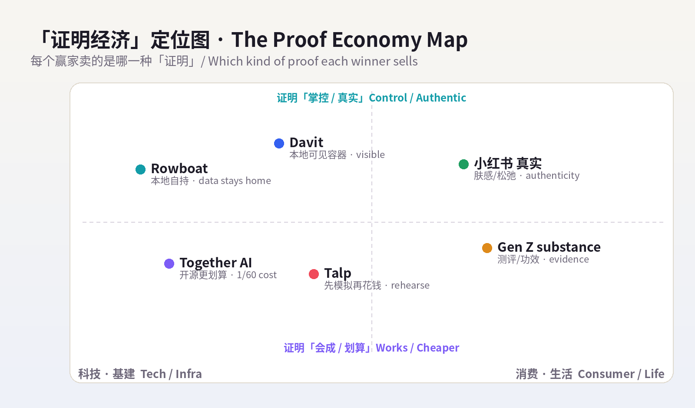
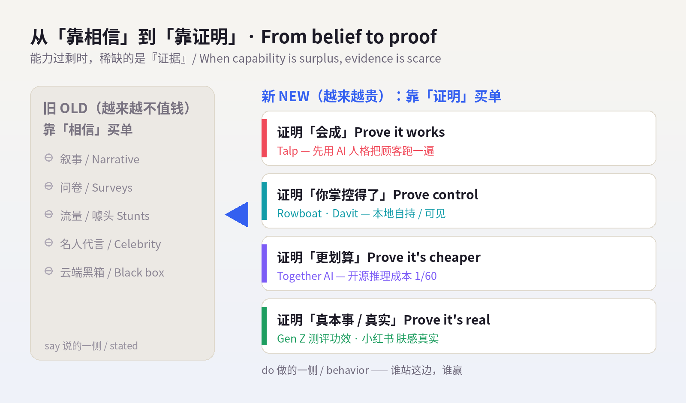
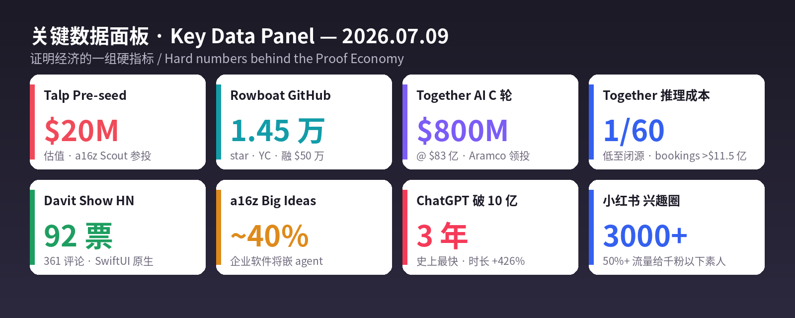

# 每日产品趋势报告 · Daily Product Trends Report
### 2026 年 7 月 9 日 · July 9, 2026（周四 / Thursday）

> **数据来源 / Sources:** Hacker News / Show HN（Rowboat「本地版 Claude Cowork」item 48819808；Davit「Apple Containers UI」item 48821848，92 票/361 评论）、TechFundingNews / Dealroom / TheSaaSNews（Talp「模拟人心」pre-seed @ $20M，a16z Scout 参投，2026-07）、TechCrunch / BusinessWire / TheNextWeb（Together AI $800M Series C @ $8.3B，Aramco 领投，2026-07-01）、a16z《Big Ideas 2026》、Sensor Tower《State of AI / State of Mobile 2026》、ContentGrip / House of Marketers（Gen Z「substance over stunt」/ CeraVe）、New Engen（July TikTok「hot dog summer」）、知乎 / TopMarketing / 人人都是产品经理（小红书 2026 趋势：真实松弛、保健品人设、肤感压成分、兴趣圈精细化）。
> **方法 / Method:** WebSearch（US-only）公开检索摘要。**web_fetch 对外站被 egress 拦截**（allowlist 仅 npm/pypi/github/anthropic 等），Product Hunt / Hacker News / Sensor Tower / X / LinkedIn / 小红书 均为登录墙或客户端渲染，无法直接抓取；统一以新闻、PR、榜单、报告摘要替代，无法获取的原始页面已跳过、未做绕过。为保每日新意，已**排除 6/29–7/08 已深度分析过的产品**（完整名单见 `raw/2026-07-09/sources.md`）。
> **免责声明 / Disclaimer:** 本报告为趋势研究，非投资建议。融资 / 估值 / 市场规模 / 份额为第三方公开披露或估算，随时可能变化；量化指标为平台或第三方口径，仅供参考。健康与消费类趋势（保健品、护肤、功能食品）仅作消费现象记录，**不构成任何医疗、营养或美容建议**。

---

## ① 当日概览 · Overview

**一句话 / In one line：** 昨天的信号是「界面即分发」——占住用户已经在用的那块表面。今天它退到更靠前的一格：**当造东西几乎免费、人人都能做出能力，唯一稀缺、真正卖钱的，是『证明』。** 证明它会成（先模拟一遍）、证明你能掌控（数据留在自己机器上）、证明它有真本事（开源打赢闭源、消费者要证据而不是噱头）。今天所有赢家都在卖同一样东西——**「证据」**：Talp 卖「先用 AI 人格把你的顾客跑一遍，证明这波广告/定价会成，再花钱」；Rowboat 卖「AI 同事可以完全跑在你自己机器上，证明你不必把工作大脑交给云端」；Together AI 用 **$800M / $83 亿估值** 证明「开源推理能把成本砍到闭源的 1/60」；而在消费端，Gen Z 和小红书用户异口同声：**「别跟我吹，拿证据来。」**

> **In one line:** Yesterday's signal was *"surface is distribution."* Today it moves one square earlier: **when making things is nearly free and anyone can manufacture capability, the scarce, sellable thing is proof.** Proof it will work (simulate it first), proof you can control it (keep the data on your own machine), proof it has real substance (open beats closed; consumers want evidence, not stunts). Every winner today sells the same thing — **evidence**: Talp sells *"run your customers through AI personas and prove the campaign works before you spend";* Rowboat sells *"an AI coworker that runs entirely on your machine — proof you don't have to hand your work-brain to the cloud";* Together AI's **$800M at an $8.3B valuation** is proof that *"open-source inference can cut cost to 1/60th of closed";* and on the consumer side, Gen Z and Xiaohongshu users say it in one voice: **"Don't tell me — show me."**

贯穿今天的透镜，是 **say-do gap（嘴上说的 vs 真正会做的）**。Talp 的整份卖点就是「survey 会骗你、行为不会」——用模拟把两者的差距量出来；而 Gen Z 的「substance over stunt」、小红书的「从表演精致到证明真实」，是同一条鸿沟在消费世界里的镜像：**流量噱头买不动货（viral fame isn't enough to win carts），能买动货的，是测评、UGC、临床功效、上身肤感——一句话，是证据。** 在一个能力过剩的世界里，**竞争从「你能不能做到」「你在不在用户的表面上」，退到了最根上的一格——「你证明得了吗」。谁能把『证明』做成产品，谁就握住了这轮的定价权。**

> The lens running through today is the **say-do gap** — what people *say* versus what they'll actually *do.* Talp's entire pitch is *"surveys lie, behavior doesn't"* — using simulation to measure the gap. Gen Z's *"substance over stunt"* and Xiaohongshu's shift *"from performing perfection to proving authenticity"* are the same chasm mirrored in the consumer world: **viral fame isn't enough to win carts; what wins carts is reviews, UGC, clinical efficacy, the feel on your skin — in a word, evidence.** In a world of surplus capability, competition retreats to the most fundamental square of all — *"can you prove it?"* Whoever turns **proof** into a product owns the pricing power this round.

**五条最强信号 / Five strongest signals**

1. **把「顾客」做成可运行的模拟，先跑一遍再花钱 / Turn customers into a runnable simulation — rehearse before you spend.** **Talp**（pre-seed @ **$20M**、a16z Scout 参投）自我介绍就四个字「**We Simulate Human Intent**」：用带行为模式/认知倾向的 AI 人格，在你的网站/广告/定价里跑上千遍，**在钱花出去之前**标出弃购点、价格敏感区。它卖的是「先证明会成」。
2. **AI 同事可以完全跑在你自己机器上 / An AI coworker that runs entirely on your machine.** **Rowboat**（Show HN 本周热门、GitHub **1.45 万 star**、YC 背书）把邮件/会议/Slack 织成本地知识图谱，用 Ollama/LM Studio 在本机行动，**数据默认不出机器**——一个「你能掌控」的可证明版本，对标 Claude Cowork。
3. **$800M 砸向「开源打赢闭源」的证据 / $800M poured into proof that open beats closed.** **Together AI** 融 **$800M @ $83 亿**（Aramco 领投、Nvidia 参投），从不做自研模型，只让企业廉价跑 DeepSeek/Kimi，**推理成本最高砍到闭源的 1/60**、bookings 破 **$11.5 亿**。企业「弃闭投开」有了最硬的价格证据。
4. **资本只给「可掌控 + 可量化 + 自有数据」买单 / Capital only pays for controllable, measurable, proprietary-data.** a16z《Big Ideas 2026》：约 **40% 企业软件**将嵌 agent，赢家「走窄、占一条 workflow、给出立刻可量化的 ROI」，护城河是**自有数据**；Show HN 92 票的 **Davit** 把云端黑箱换成本地可见的 Apple 容器——都是「证明我掌控得了」。
5. **消费端异口同声：「别吹，拿证据来」/ Consumers in one voice: "Show me, don't tell me."** Gen Z **substance over stunt**——信测评/UGC/临床功效、不信噱头，「流量买不动货」；小红书从「表演精致」转「证明真实」——**肤感/质地讨论压过成分**、保健品做「自律」人设、**50%+ 流量给千粉以下素人**做极致精细化。say-do gap 的消费镜像。

> **Five signals (EN):** (1) **Talp** (pre-seed @ **$20M**, a16z Scout) — *"We Simulate Human Intent"*: run thousands of behavioral AI personas through your site / ad / pricing to flag drop-off and price-sensitivity **before the money is spent.** Selling *proof-it-works-first.* (2) **Rowboat** (top Show HN, **14.5K** GitHub stars, YC) — weaves email/meetings/Slack into a **local** knowledge graph, acts via Ollama/LM Studio, **data stays on your machine by default** — a *provably-controllable* answer to Claude Cowork. (3) **Together AI** — **$800M @ $8.3B** (Aramco-led, Nvidia in), never builds its own model, just runs DeepSeek/Kimi cheaply — inference **up to 60× cheaper than closed**, bookings past **$1.15B.** The hardest price-proof yet for *"ditch closed, adopt open."* (4) **Capital only pays for controllable + measurable + proprietary data** — a16z: ~**40%** of enterprise software will embed agents; winners *go narrow, own a workflow, show immediate ROI,* moat = **proprietary data;** the 92-point Show HN **Davit** swaps the cloud black box for a locally-visible Apple-container UI. (5) **Consumers: "show me, don't tell me"** — Gen Z **substance over stunt** (trust reviews/UGC/clinical efficacy, not stunts; *viral fame won't win carts*); Xiaohongshu shifts from *performing perfection to proving authenticity* — **feel/texture out-talks ingredients,** supplements as a *self-discipline* persona prop, **50%+ of traffic to sub-1K-follower** creators for hyper-niche depth.

---

## ② 逐个产品深度分析 · Product Deep-Dives

### 1. Talp — 先把顾客跑一遍，再花钱：把「人心」做成可运行的模拟 / Rehearse your customers before you spend — human intent as a runnable simulation

昨天大家还在抢「用户已经在用的那块表面」，今天 **Talp** 把问题往前推了一整步：**在你花一分钱之前，先把顾客「跑一遍」。** 它 7 月宣布 pre-seed、估值 **$20M**（Formus Capital、Sunshine Lake Ventures、Aito Capital 和 **a16z Scout Fund** 参投），主页只有一句话——**「We Simulate Human Intent（我们模拟人的意图）」**。产品做的事很具体：给 AI 人格灌进**行为模式、决策特质、认知倾向**，然后把上千个这样的「合成顾客」放进你的网站、广告或定价场景里**真的跑一遍**，预测他们会怎么做、以及为什么。它精准打的是市场研究几十年的老痛——**say-do gap（说—做鸿沟）**：人们在问卷里说的，和真掏钱时做的，往往是两回事。Talp 的逻辑是「survey 会骗你，模拟出来的行为不会」：一个 persona 可以在广告上线前，把 checkout flow 从头走一遍，**标出到底在哪个价位、哪一步，购物车被弃掉。** 这就是「证明经济」最纯粹的样子——**把「证明它会成」本身做成一个可以按次运行的产品。** 需要提醒的是，这条赛道「投资胃口跑在营收前面」（同类 Aaru 顶着十亿美元估值、ARR 却只有个位数百万），合成人格能多大程度替代真实用户，仍需时间证明——但方向已经足够清楚：**在能力过剩的时代，能把「预演现实」卖出去，就是最稀缺的生意。**

> Yesterday everyone fought for *"the surface the user already uses";* today **Talp** pushes the question a full step earlier: **rehearse your customers before you spend a cent.** Announced in July at a **$20M** pre-seed valuation (Formus Capital, Sunshine Lake Ventures, Aito Capital, and the **a16z Scout Fund**), its homepage is one line — **"We Simulate Human Intent."** The product is concrete: it loads AI personas with **behavioral patterns, decision traits, and cognitive tendencies,** then runs thousands of these *synthetic customers* through your site, ad, or pricing scenario to predict what they'll do and why. It targets a decades-old pain in market research — the **say-do gap:** what people say in a survey and what they do when real money is on the line are often two different things. Talp's logic is *"surveys lie, simulated behavior doesn't":* a persona can walk the entire checkout flow before an ad goes live and **flag exactly which price point and which step makes the cart get abandoned.** This is the Proof Economy in its purest form — **turning "prove it will work" itself into a product you can run on demand.** A caveat: here investor appetite has outpaced revenue (peer Aaru carries a billion-dollar headline against single-digit-million ARR), and how far synthetic personas can stand in for real users still needs proving — but the direction is clear enough: **in an age of surplus capability, selling "a rehearsal of reality" is the scarce business.**

| 维度 Dimension | 分析 Analysis |
|---|---|
| 商业模式 Business model | 合成用户研究平台，按 persona/场景/次数计费，替代问卷与小样本调研。Synthetic-research SaaS; replaces surveys. |
| 核心价值 Core value | 在花钱之前「预演现实」：用 AI 人格量出 say-do gap，标出弃购/价格敏感点。Rehearse reality; measure the say-do gap. |
| 成功因素 Success | 打到市场研究的老痛点 + LLM 让「行为模拟」第一次便宜可跑 + a16z Scout 背书 + 一句话定位极清晰。Old pain × cheap simulation × sharp positioning. |
| 核心功能 Core features | 行为化 AI 人格、批量跑 checkout/落地页/定价、反应/原因预测、A/B 前置模拟。Behavioral personas, bulk flow-simulation. |
| 细分市场 Niche | 合成客户研究 / 上线前测试（synthetic customer research）。Pre-launch synthetic research. |
| 目标受众 Audience | 增长/产品/营销团队、电商与 DTC、需在投放前做决策的人。Growth/product/marketing, e-commerce. |
| 品牌设计 Brand | 名「Talp」极简；主张「We Simulate Human Intent」一句话立心智，冷静科技调性。Minimal, thesis-led. |
| 产品数据 Data | pre-seed @ **$20M** 估值；a16z Scout 等参投；2026-07 宣布；主打「replace surveys」。 |
| 链接 Link | [talp.ai](https://talp.ai/) · [TechFundingNews](https://techfundingnews.com/meet-talp-ai-startup-with-turkish-roots-raising-20m-pre-seed-valuation-to-simulate-customers-with-ai-personas/) · [Dealroom](https://app.dealroom.co/news/note/talp-raises-pre-seed-at-20m-valuation-to-replace-surveys-with-ai-customer-personas) |
| 评论摘要 Reviews | 正面：「上线前就能看到弃购点、比问卷靠谱、省预算」；关注点：合成人格的效度/偏差、能否真替代真实用户、估值跑在营收前面。Praise for pre-launch signal; watch validity vs. real users. |

### 2. Rowboat — 本地自持的 AI 同事：数据不出机器，就是最好的「证明」/ The local-first coworker you own — data that never leaves your machine is the proof

如果 Talp 证明「它会成」，**Rowboat** 证明「你掌控得了」。它本周以 Show HN 亮相、迅速冲上热门（GitHub 已 **1.45 万 star、1.5k fork**，YC 背书、已融 **$50 万**），一句话定位是**「开源、本地优先的 Claude Cowork 平替」**。做法是：把你的 **Gmail、日历、会议记录、Slack、助手对话**抽取成人物/项目/决策/承诺，写成 Obsidian 式**反链知识图谱**；再用你自己选的引擎——**Ollama、LM Studio 或托管 LLM**——在这张图谱上行动：起草、排程、生成 PDF deck、出语音简报。它还能挂**后台 agent**（新邮件触发、或每天早八点定时跑），连工具、搜网、开浏览器、用 Claude Code/Codex 写代码；本地会议记录器直接吃麦克风和扬声器，实时转写、总结、回写图谱。**它最锋利的一点不是功能，而是立场——「data sovereignty / 本地优先」：所有数据默认留在你自己机器上。** 这正是「证明经济」的另一面：在一个把工作大脑往云端搬的时代，**Rowboat 把「你不必把命脉交出去也能用上 AI」这件事，做成了可安装、可审计、开源可验的证明。** 它对标的不是某个功能点，而是「云端黑箱」本身——**当别人让你相信，Rowboat 让你自己看得见。**

> If Talp proves *"it will work,"* **Rowboat** proves *"you can control it."* Launched this week as a Show HN and quickly trending (**14.5K** GitHub stars, **1.5K** forks, YC-backed, **$500K** raised), it pitches itself as **"the open-source, local-first alternative to Claude Cowork."** The mechanism: it extracts people / projects / decisions / commitments from your **Gmail, calendar, meeting notes, Slack, and assistant chats** into an Obsidian-style **backlinked knowledge graph,** then acts on that graph with an engine *you* choose — **Ollama, LM Studio, or a hosted LLM** — drafting, scheduling, generating PDF decks, producing voice briefs. It runs **background agents** (triggered by a new email, or on a schedule like 8 a.m. daily) that call tools, search the web, drive a browser, and write code via Claude Code / Codex; a local note-taker taps mic and speaker to transcribe, summarize, and write back to the graph live. **Its sharpest edge isn't a feature — it's a stance: data sovereignty / local-first, with all data staying on your machine by default.** That's the other face of the Proof Economy: in an era of shipping your work-brain to the cloud, **Rowboat turns "you don't have to surrender the crown jewels to use AI" into an installable, auditable, open-source-verifiable proof.** It competes not with a feature but with the *cloud black box itself* — **where others ask you to trust, Rowboat lets you see.**

| 维度 Dimension | 分析 Analysis |
|---|---|
| 商业模式 Business model | 开源起步（心智+社区），可向团队版/托管/企业支持延伸。OSS now; team/hosted/enterprise later. |
| 核心价值 Core value | 本地自持的 AI 同事：知识图谱 + 自选引擎，数据默认不出机器。Local-first coworker; your data stays home. |
| 成功因素 Success | 踩中「data sovereignty」焦虑 + 反链图谱(Obsidian 心智) + 引擎自选(不锁定) + 开源可验 + YC/star 势能。Sovereignty × open × momentum. |
| 核心功能 Core features | 邮件/会议/Slack→反链图谱、后台事件/定时 agent、本地会议记录器、PDF/语音输出、Claude Code/Codex 写码。Graph + agents + local notetaker. |
| 细分市场 Niche | 本地优先的个人/团队 AI 操作系统（local-first AI coworker）。Local-first AI OS. |
| 目标受众 Audience | 重隐私的开发者/知识工作者、不想被云端锁定的团队、Obsidian/自托管人群。Privacy-first devs & teams. |
| 品牌设计 Brand | 名「Rowboat（划艇）」隐喻「自己划、自己掌舵」；开源、极客、反黑箱调性。Self-steer metaphor; anti-black-box. |
| 产品数据 Data | GitHub **14.5k star / 1.5k fork**；YC 背书、融 **$50 万**；SF、2024 成立、5 人；本周 Show HN 热门。 |
| 链接 Link | [github.com/rowboatlabs/rowboat](https://github.com/rowboatlabs/rowboat) · [rowboatlabs.com](https://www.rowboatlabs.com/) · [Show HN](https://news.ycombinator.com/item?id=48819808) |
| 评论摘要 Reviews | 正面：「终于能本地跑、数据不出机器、图谱能在 Obsidian 里打开太安心」；关注点：本地模型效果/算力门槛、图谱维护成本、商业化路径。Praise for local + graph; watch local-model quality. |

### 3. Together AI — $800M 押注「开源打赢闭源」：把「便宜」证明成一门 $11.5 亿的生意 / The $800M bet that open beats closed — proving "cheap" into a $1.15B business

前两个证明「会成」「可控」，**Together AI** 证明的是「**开源真的更划算**」——而且用一张 **$800M / $83 亿估值**的支票把它钉死。7 月 1 日，它宣布 **$800M C 轮**，**Aramco Ventures 领投**，Vista、General Catalyst、Emergence、**Nvidia**、March Capital、Pegatron、S Ventures 跟投；估值 16 个月从 $33 亿翻到 **$83 亿**。它的模式反直觉却极清晰：**从不自研基座模型**，只做一层云基建，让企业**廉价、大规模地跑别人的开源模型**——DeepSeek、MiniMax、Kimi。它给出的「证据」是价格：宣称推理成本能比 OpenAI/Anthropic 这类闭源方案**低到 1/60**，而年度 bookings 已越过 **$11.5 亿**。这正是「证明经济」在基建层的样子——**企业不再为「谁的模型最强」这种叙事买单，而为一张能对齐财务的账单买单：同样的活，开源方案便宜数十倍。** 它计划用这笔钱把推理平台、算力在五年内扩约 **50×**。放在今天的主线里：Talp 证明需求侧、Rowboat 证明掌控侧、**Together 证明成本侧——三条腿都指向同一句话：这轮不再靠「相信」赢，靠「证明」赢。**

> The first two prove *"it works"* and *"you control it";* **Together AI** proves *"open is genuinely cheaper"* — and nails it down with an **$800M / $8.3B** check. On July 1 it announced an **$800M Series C** led by **Aramco Ventures** (with Vista, General Catalyst, Emergence, **Nvidia,** March Capital, Pegatron, S Ventures), its valuation more than doubling from $3.3B to **$8.3B** in 16 months. The model is counterintuitive but crisp: **it never builds a foundation model,** just the cloud layer that lets enterprises **run other people's open-source models cheaply and at scale** — DeepSeek, MiniMax, Kimi. Its *evidence* is price: it claims inference **up to 60× cheaper** than closed options from OpenAI/Anthropic, with annual bookings past **$1.15B.** This is the Proof Economy at the infrastructure layer — **enterprises no longer pay for the narrative of "whose model is strongest," but for a bill that reconciles on the P&L: same job, dozens of times cheaper on open.** It plans to scale inference and compute roughly **50×** over five years. In today's throughline: Talp proves the demand side, Rowboat the control side, **Together the cost side — three legs pointing at one sentence: this round is won not by belief, but by proof.**

| 维度 Dimension | 分析 Analysis |
|---|---|
| 商业模式 Business model | 开源模型推理/训练云（neocloud）：按算力/token 计费，走量。Open-model inference cloud; usage-priced. |
| 核心价值 Core value | 让企业廉价跑开源模型，推理成本称最高低至闭源 1/60。Run open models cheaply; up to 60× cheaper. |
| 成功因素 Success | 押中「弃闭投开」大势 + 不做模型只做基建（中立） + 价格可量化证据 + Aramco/Nvidia 背书。Open wave × neutral infra × price-proof. |
| 核心功能 Core features | DeepSeek/MiniMax/Kimi 等开源模型的训练与推理、成本优化、规模化部署。Train/serve open models at scale. |
| 细分市场 Niche | 开源模型的推理基建层（open-model neocloud）。Open-model neocloud. |
| 目标受众 Audience | 想降本、避免闭源锁定的企业与开发者、AI 原生公司。Cost-cutting, lock-in-averse enterprises. |
| 品牌设计 Brand | 名「Together」呼应开源协作；定位「让前沿 AI 人人可及」。Collaborative, access-for-all. |
| 产品数据 Data | **$800M** C 轮 @ **$83 亿**（Aramco 领投、Nvidia 参投）；bookings **>$11.5 亿**；成本低至 1/60；拟扩算力 ~50×/5 年；2026-07-01。 |
| 链接 Link | [TechCrunch](https://techcrunch.com/2026/07/01/neocloud-together-ai-raises-800m-leaps-to-8-3b-valuation/) · [BusinessWire](https://www.businesswire.com/news/home/20260701243402/en/) · [TheNextWeb](https://thenextweb.com/news/together-ai-800m-series-c-aramco-ventures) |
| 评论摘要 Reviews | 正面：「开源推理终于能对齐财务、中立不锁定、省得夸张」；关注点：neocloud 价格战/毛利、对开源模型质量的依赖、算力扩张的资本消耗。Praise for cost & neutrality; watch margins & capex. |

### 4.【趋势 / 数据】证明经济：资本只为「可掌控 + 可量化 + 自有数据」买单 / The Proof Economy — capital only pays for controllable, measurable, proprietary-data

把今天的产品拉远看，会看到同一条资金与注意力的流向：**凡是能「证明」的，就有人买单；只会「叙事」的，正在被跳过。** a16z《Big Ideas 2026》给出方向——2026 是 agentic systems 之年，约 **40% 企业软件**将嵌入任务专用 agent，但真正有 traction 的赢家「**走窄、占住一条 workflow、给出立刻可量化的 ROI**」，从「价值一眼可见、买家能立刻justify花钱」的受限问题切入；而能立住的护城河，是**自有的高质量专有数据**（它点名 VLex、OpenEvidence 作样本）。同一天的 Show HN，**Davit**（92 票 / 361 评论）用另一种方式讲同一件事：它是给 Apple 容器写的**原生 macOS UI**（Apple silicon 上跑 Linux 容器、Docker Desktop 平替），直连 container-apiserver、无 Electron、MIT 开源——**把「云端黑箱」换成「本地可见、每个容器的 CPU/内存/IP 都摆在眼前」的可掌控界面。** 再叠上 Sensor Tower 的量：ChatGPT **史上最快破 10 亿月活**（3 年）、时长 +426%、20 万+ App 描述含 AI、AI App 上半年约 **100 亿下载**。**需求是真的、钱是真的，但钱越来越挑——它只流向能证明「我掌控得了、我能量化、我有别人没有的数据」的地方。** Together 的 $800M、Talp 的 a16z Scout、Rowboat 的 star，都是同一张选票。

> Zoom out from today's products and the same flow of money and attention appears: **whatever can be proven gets funded; whatever only narrates is being skipped.** a16z's *Big Ideas 2026* sets the direction — 2026 is the year of agentic systems, with ~**40%** of enterprise software expected to embed task-specific agents, but the winners with real traction *go narrow, own one workflow, and show immediately measurable ROI,* starting from constrained problems where *"value is obvious and the buyer can justify spend fast";* the durable moat is **proprietary, high-quality data** (it names VLex and OpenEvidence). The same week's Show HN, **Davit** (92 points / 361 comments), tells the same story another way: a **native macOS UI** for Apple's containers (Linux-on-Apple-silicon, a Docker Desktop alternative), talking straight to container-apiserver, no Electron, MIT-licensed — **swapping the cloud black box for a controllable surface where every container's CPU/memory/IP is right in front of you.** Layer on Sensor Tower's numbers: ChatGPT the **fastest app ever to 1B MAU** (3 years), time spent +426%, 200K+ apps mentioning AI, ~**10B** AI-app downloads in H1. **Demand is real and money is real — but the money is increasingly picky: it flows only to what can prove "I'm controllable, I'm measurable, I own data others don't."** Together's $800M, Talp's a16z Scout, Rowboat's stars — all the same ballot.

| 信号 Signal | 数据 Data | 证明了什么 What it proves |
|---|---|---|
| a16z《Big Ideas 2026》| ~40% 企业软件将嵌 agent；赢家走窄+可量化 ROI+自有数据 | 资本只买「可量化 + 专有数据」/ Pays for measurable ROI & proprietary data |
| Davit（Show HN）| 92 票 / 361 评论；SwiftUI 原生、直连 XPC、MIT | 开发者要「本地可见、可掌控」/ Devs want local visibility & control |
| Sensor Tower | ChatGPT 3 年破 10 亿 MAU、时长 +426%；AI App H1 ~100 亿下载 | 需求是真的、且在加速 / Demand is real and accelerating |
| Together AI | $800M @ $83 亿、成本 1/60、bookings >$11.5 亿 | 「开源更划算」的价格证据 / Price-proof that open is cheaper |

### 5.【消费趋势 · 欧美】Substance over stunt：Gen Z 只认证据，不认噱头 / Consumers want evidence, not stunts — the say-do gap goes retail

「证明经济」不只在科技圈——它同样在改写消费。2026 年欧美消费最清晰的一句话是：**「viral fame isn't enough to win carts（爆红也带不动购物车）」。** Gen Z 对品牌的要求，从「slogan / 噱头 / 名人代言」退到「**substance（真本事）**」：一致性、真诚、真实价值。他们买单前要的是**证据链**——信 **peer review、UGC、creator-led 实测演示**，胜过任何品牌自吹；**micro/nano 创作者**因为「更像真人、更可信」，参与度反而压过头部 KOL。最典型的样本是 **CeraVe**：不靠明星、靠**临床功效 + 皮肤科背书 + functionality over form**，成了 Gen Z 心智里的「稳」。有意思的是，这一层和噱头并不互斥——今年 7 月 TikTok 的「**hot dog summer**」（热狗美甲/蛋糕/周边）照样刷屏，但它只负责「带流量」，**真正把流量变成复购的，仍是产品得能被证明。** 这正是 say-do gap 的消费镜像：**用户嘴上跟着梗玩，手上只给「证明过自己」的东西掏钱。** 对品牌的含义很直接——**别再投「让人看见」，去投「让人信服」：把测评、成分对照、真实前后、第三方数据摆到台面上，才是这一代的「货架」。**

> The Proof Economy isn't only in tech — it's rewriting consumption too. The clearest line in 2026 Western consumer behavior is: **"viral fame isn't enough to win carts."** Gen Z's demand on brands has retreated from *slogan / stunt / celebrity endorsement* to **substance** — consistency, sincerity, real values. Before they buy, they want an **evidence chain** — trusting **peer reviews, UGC, and creator-led demos** over any brand's self-praise; **micro / nano creators,** read as *more human and more credible,* out-engage mega-influencers. The archetype is **CeraVe:** no celebrities, just **clinical efficacy + dermatologist backing + functionality over form,** now the *"safe choice"* in Gen Z's mind. Tellingly, this doesn't kill stunts — July 2026's TikTok **"hot dog summer"** (hot-dog nails / cakes / merch) still flooded feeds — but the stunt only *drives traffic;* **what converts traffic to repeat purchase is a product that can be proven.** That's the retail mirror of the say-do gap: **users play along with the meme with their mouths, but spend only on what has proven itself.** The implication for brands is blunt — **stop buying "get seen," start buying "get believed": put reviews, ingredient comparisons, real before-and-afters, and third-party data on the table — that's this generation's shelf.**

| 维度 Dimension | 分析 Analysis |
|---|---|
| 趋势 Trend | Substance over stunt：证据链（测评/UGC/临床功效）取代噱头。Evidence chain beats stunts. |
| 驱动 Drivers | 广告疲劳 + 对 KOL 祛魅 + 信息透明；「爆红≠转化」。Ad fatigue, influencer disillusion, transparency. |
| 受众 Audience | Gen Z / 年轻消费者；重成分/功效/口碑的理性买家。Gen Z, efficacy-minded buyers. |
| 打法 Playbook | 押 micro/nano 创作者、真实 demo、可核验数据；梗只带流量、货靠证明。Creators + verifiable proof. |
| 样本 Case | CeraVe（临床/皮肤科背书）；July TikTok「hot dog summer」（只带流量）。CeraVe; hot-dog-summer meme. |
| 链接 Link | [ContentGrip](https://www.contentgrip.com/brands-thriving-with-gen-z/) · [House of Marketers · CeraVe](https://houseofmarketers.com/how-cerave-transformed-gen-z-skincare-brand/) · [New Engen · July TikTok](https://newengen.com/insights/july-tiktok-trends/) |

### 6.【消费趋势 · 中国】小红书：从「表演精致」到「证明真实」/ Xiaohongshu — from performing perfection to proving authenticity

同一条鸿沟，在中国以另一种口音出现。小红书 2026 最明显的风向，是从「**表演精致**」退向「**证明真实**」。曾经统治平台的「独居」内容，从「精致 vlog、一个人也要仪式感」转向「**失控 / 松弛**」——端着锅吃饭、在家放飞的真实场景反而更受追捧，**「真实」本身成了新的可信符号。** 在消费决策上，这条鸿沟表现得极其具体：**「肤感 / 质地」的讨论度，压过了「成分」**——成分表写得再漂亮，不如一句「上脸的感觉」来得算数，**上身体验＝用户真正认的那份「证据」**。与此同时，保健品完成了从「功能品」到「**人设道具**」的跃迁：吃什么、怎么吃，成了构建「健康、精致、自律」形象的一部分——**用可展示的行为去「证明」一种生活方式。** 结构层面，小红书把打法从「爆款破圈」换成「**农村包围城市**」式的极致精细化：平台上已有 **3000+ 兴趣圈**，**50% 以上流量倾斜给千粉以下素人**，鼓励用足够多、足够细的内容去打透微观场景与小众圈层。**不再追一次性的破圈声量，而是在一个个小圈层里反复「被验证」。** 一句话：**欧美用「测评和功效」证明，中国用「肤感、人设和圈层」证明——两边都在为同一件事付费：可被看见的真实。**

> The same chasm shows up in China with a different accent. Xiaohongshu's clearest 2026 shift is a retreat from **performing perfection** to **proving authenticity.** The *"living alone"* content that once ruled the platform has swung from *"exquisite vlogs, ritual-for-one"* to **"out of control / unbothered"** — eating straight from the pot, letting loose at home, now *more* celebrated, with **authenticity itself becoming the new trust-symbol.** In purchase decisions the gap gets concrete: **"feel / texture" out-talks "ingredients"** — however pretty the ingredient list, *"how it feels on your face"* counts for more; **the on-body experience is the evidence users actually trust.** Meanwhile supplements have leapt from *function* to **persona prop:** what and how you take becomes part of a *"healthy, refined, self-disciplined"* image — **using displayable behavior to "prove" a lifestyle.** Structurally, Xiaohongshu swaps *"chase a breakout hit"* for **hyper-granular "surround the city from the countryside":** 3,000+ interest circles, **50%+ of traffic tilted to sub-1,000-follower** creators, rewarding enough fine-grained content to saturate micro-scenes and niche circles. **Not one-shot viral reach, but being repeatedly *validated* inside small circles.** In one line: **the West proves with reviews and efficacy; China proves with feel, persona, and circles — both are paying for the same thing: authenticity you can see.**

| 维度 Dimension | 分析 Analysis |
|---|---|
| 趋势 Trend | 从「表演精致」到「证明真实」：真实/松弛成信任符号。Authenticity as the new trust-symbol. |
| 驱动 Drivers | 对精致人设疲劳 + 平台扶素人 + 「上身体验」优先。Perfection fatigue; feel-first. |
| 受众 Audience | 小红书年轻用户、健康/美妆/生活方式圈层。Young XHS users; wellness/beauty niches. |
| 打法 Playbook | 精细化人群×场景×圈层（农村包围城市）；肤感/质地>成分；保健品做人设。Hyper-niche; feel>ingredient. |
| 数据 Data | 3000+ 兴趣圈；50%+ 流量给千粉以下素人；决策第一关＝上身体验。3K+ circles; 50%+ traffic to <1K creators. |
| 链接 Link | [知乎·八大趋势](https://zhuanlan.zhihu.com/p/1991105890716247188) · [TopMarketing](https://www.itopmarketing.com/info22232) · [人人都是产品经理](https://www.woshipm.com/operate/6336917.html) |

---

## ③ 横向对比 · Cross-Product Comparison

| 产品 Product | 商业模式 Model | 核心价值 Value | 细分 Niche | 受众 Audience | 关键数据 Key data | 「证明」了什么 The proof |
|---|---|---|---|---|---|---|
| **Talp** | 合成用户研究 SaaS | 先模拟顾客再花钱 | 上线前测试 | 增长/产品/营销 | pre-seed @ $20M；a16z Scout | 它会成（需求侧）Demand |
| **Rowboat** | 开源→团队/托管 | 本地自持 AI 同事 | local-first AI OS | 隐私敏感开发者/团队 | 14.5k star；YC；融 $50 万 | 你掌控得了（掌控侧）Control |
| **Together AI** | 开源模型推理云 | 开源跑得更便宜 | open-model neocloud | 降本企业/AI 公司 | $800M @ $83 亿；成本 1/60 | 开源更划算（成本侧）Cost |
| **Davit** | 开源工具 | 本地可见的容器 UI | Apple 容器工具 | Mac 开发者 | Show HN 92 票/361 评论 | 我掌控得了（可见）Visibility |
| **Gen Z 消费** | — | 证据链取代噱头 | 理性消费 | 年轻消费者 | 「爆红≠转化」；CeraVe | 有真本事（功效）Efficacy |
| **小红书** | — | 表演退场，真实登场 | 精细化圈层 | XHS 年轻用户 | 3000+ 圈；50%+ 流量给素人 | 我是真的（真实）Authenticity |

---

## ④ 关键洞察与共性 · Key Insights & Common Patterns

**一、「证明」正在从一句话变成一个产品品类。** 过去「证明它会成」是花钱前脑子里的一次赌，如今 Talp 把它做成**可按次运行的模拟**、Together 把它做成**能对齐财务的一张账单**、Rowboat 把它做成**开源可审计的本地部署**。当能力过剩、叙事廉价，**「可验证性」本身第一次成了能标价、能融资、能卖钱的东西。**

> **1. "Proof" is turning from a sentence into a product category.** *"Prove it will work"* used to be a bet in your head before spending; now Talp makes it a **runnable simulation,** Together a **bill that reconciles on the P&L,** Rowboat an **open-source, auditable local deployment.** When capability is in surplus and narrative is cheap, **verifiability itself becomes, for the first time, something you can price, fund, and sell.**

**二、say-do gap 是贯穿科技与消费的同一条鸿沟。** Talp 直接把「说—做鸿沟」量化成产品；Gen Z 的「substance over stunt」、小红书的「肤感压成分 / 真实压表演」，是同一条鸿沟在货架上的样子。**共同结论：嘴上的声量（survey、流量、噱头）越来越不值钱，能被验证的行为（模拟、测评、上身体验）越来越贵。** 谁站在「行为一侧」，谁赢。

> **2. The say-do gap is one chasm running through both tech and retail.** Talp productizes the gap directly; Gen Z's *substance over stunt* and Xiaohongshu's *feel-over-ingredient / real-over-performed* are the same gap on the shelf. **The shared conclusion: stated signal (surveys, reach, stunts) is worth less and less; verifiable behavior (simulation, reviews, on-body experience) is worth more and more.** Stand on the *behavior* side, and you win.

**三、「本地 / 自有 / 中立」成了新护城河。** Rowboat 的「数据不出机器」、Davit 的「本地可见的容器」、Together 的「不做模型、只做中立基建」、a16z 点名的「自有专有数据」——都在说同一件事：**在一个把一切往云端黑箱搬的时代，「你自己看得见、掌控得了、拥有得了」反而成了最稀缺、最能证明的价值。** 反黑箱，是这轮最被低估的护城河。

> **3. "Local / owned / neutral" is the new moat.** Rowboat's *data-never-leaves-the-machine,* Davit's *locally-visible containers,* Together's *build-no-model, run-neutral-infra,* and a16z's *proprietary data* all say one thing: **in an era of shipping everything into a cloud black box, "you can see it, control it, own it" becomes the scarcest, most provable value.** Anti-black-box is the round's most underrated moat.

**四、给不同角色的一句话行动 / One-line action per role：**
- **创业者 Founders：** 别再卖「我们能做到」，卖「我们已经证明」——把 demo 换成可运行的证据（模拟、审计、可量化 ROI）。Sell *proof,* not *capability.*
- **投资人 Investors：** 今天的选票投给「可掌控 + 可量化 + 自有数据」；对「叙事强、证据弱、估值跑在营收前」的合成/AI 项目多问一句效度。Fund the provable; interrogate say-do.
- **品牌 / 消费 Brands：** 把预算从「让人看见」挪到「让人信服」——测评、真实前后、第三方数据就是这代人的货架。Buy *believed,* not *seen.*
- **开发者 Builders：** 「本地优先 / 可见 / 中立」不是情怀，是差异化；反黑箱现在能换来 star、信任和付费。Local-first is a moat, not a hobby.

> *本报告由每日自动化任务生成，仅作趋势研究与创意参考，不构成投资、医疗或消费建议。数据来源见文首与 `raw/2026-07-09/sources.md`。*
> *Auto-generated daily trend brief — for research and creative reference only; not investment, medical, or purchase advice. Sources listed above and in `raw/2026-07-09/sources.md`.*
